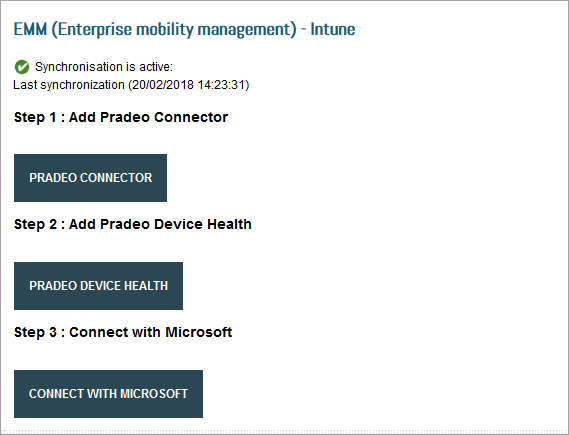

---
# required metadata

title: Set up Pradeo Mobile Threat Defense to integrate with Intune
titleSuffix: Intune on Azure
description: How to set up the Pradeo Mobile Threat Protection solution with Microsoft Intune to control mobile device access to your corporate resources.
keywords:
author: brenduns
ms.author: brenduns
manager: dougeby
ms.date: 08/27/2024
ms.topic: how-to
ms.service: microsoft-intune
ms.subservice: protect
ms.localizationpriority: high
ms.assetid: 82872ba6-80f8-4cc9-adf4-0ccd8ff26dd2

# optional metadata

#ROBOTS:
#audience:

ms.reviewer: aanavath
#ms.suite: ems
search.appverid: MET150
#ms.tgt_pltfrm:
#ms.custom:
ms.collection:
- tier3
- M365-identity-device-management
- sub-mtd-apps
---

# Integrate Pradeo Mobile Threat Defense with Intune

Complete the following steps to integrate the Pradeo Mobile Threat Defense solution with Intune.

> [!NOTE]  
> This Mobile Threat Defense vendor is not supported for unenrolled devices.

## Before you begin

> [!NOTE]
> The following steps are to be completed in the [Pradeo Security console](https://pradeo-security.com/).

The process of integrating Pradeo with Intune requires the following subscriptions and account permissions:

- Microsoft Intune Plan 1 subscription
- Microsoft Entra credentials to grant the following permissions:
  - Sign in and read user profile
  - Access the directory as the signed-in user
  - Read directory data
  - Send device information to Intune
- Admin credentials to access Pradeo Security console.

### Pradeo app authorization

The Pradeo app authorization process follows:

- Allow the Pradeo service to communicate information related to device health state back to Intune.
- Pradeo syncs with Microsoft Entra Enrollment Group membership to populate its device's database.
- Allow Pradeo admin console to use Microsoft Entra single sign-on (SSO).
- Allow the Pradeo app to sign in using Microsoft Entra SSO.

## To set up Pradeo integration

1. Go to [Pradeo Security console](https://pradeo-security.com/) and sign in with your credentials.

2. Choose **Administration - Enterprise Mobility Management** from the menu.

3. Choose the **Intune logo**.

4. In the **EMM (Enterprise mobility management) - Intune** window, under **Step 1**, choose the **Pradeo Connector** button.

   

5. In the Microsoft Intune connection window, enter your Intune credentials.

6. The Pradeo web page reopens. Under **Step 2**, choose the **Pradeo Device Health** button.

7. In the Pradeo-Intune Connector window, select **Accept**.

8. In the Pradeo device API connector window, select **Accept**.

9. The Pradeo web page reopens. Under **Step 3**, choose the **Connect to Microsoft** button.

10. In the Microsoft Intune authentication window, enter your Intune credentials.

11. When the message **Successful Integration** appears, integration is complete.

## Next steps

- [Set up Pradeo apps for enrolled devices](mtd-apps-ios-app-configuration-policy-add-assign.md)
