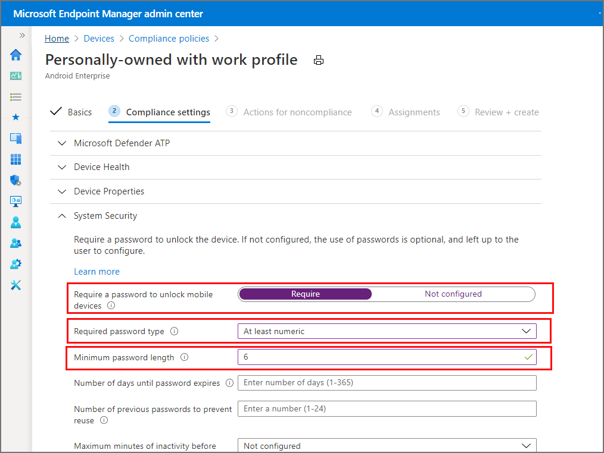

---
# required metadata

title: Password compliance policy for Android Enterprise devices
titleSuffix: Microsoft Intune
description: In this topic, you will use Microsoft Intune to set the length of the password required for Android Enterprise devices.
keywords:
author: Erikre
ms.author: erikre
manager: dougeby
ms.date: 02/11/2022
ms.topic: conceptual
ms.service: microsoft-intune
ms.subservice: protect
ms.localizationpriority: medium
ms.technology:
ms.assetid: 81b4fa08-5333-4c54-9f49-8db5f6984ed2

# optional metadata

#ROBOTS:
#audience:

ms.reviewer: andreibiswas
ms.suite: ems
search.appverid: MET150
#ms.tgt_pltfrm:
ms.collection:
- tier2
- M365-identity-device-management
- Android
ms.custom: intune-azure
---

# Step 6: Create a password compliance policy for Android Enterprise devices

In this topic, you'll use Microsoft Intune to require your workforce's Android users to enter a password of a specific length before access is granted to information on their Android Enterprise devices.

[!INCLUDE [intune-evaluate](../includes/intune-evaluate.md)]

An Intune device compliance policy specifies the rules and settings that devices must meet to be considered compliant. You can use compliance policies with Conditional Access to allow or block access to company resources. You can also get device reports and take actions for non-compliance.

> [!IMPORTANT]
> In addition to password settings, you should also consider other system security settings to protect your workforce. For more information, see [System security settings](compliance-policy-create-android-for-work.md).

If you don't have an Intune subscription, [sign up for a free trial account](../fundamentals/free-trial-sign-up.md).

## Sign in to Intune

Sign in to the [Microsoft Intune admin center](https://go.microsoft.com/fwlink/?linkid=2109431) as a [Global administrator](../fundamentals/users-add.md#types-of-administrators) or an Intune [Service administrator](../fundamentals/users-add.md#types-of-administrators).

## Create a device compliance policy

Create a device compliance policy to require your workforce's Android users to enter a password of a specific length before access is granted to information on their Android Enterprise devices.

1. Sign in to [Microsoft Intune admin center](https://go.microsoft.com/fwlink/?linkid=2109431), select **Devices** > **Compliance Policies** > **Create Policy**.

2.  For **Platform**, select **Android Enterprise**.

3. For **Profile type**, select either **Fully managed, dedicated, and corporate-owned work profile** or **Personally-owned work profile**, and then click **Create**.

4. On **Basics** step, enter **Android compliance** as the *Name*. Adding a *Description* is optional. Click **Next**.

5. On **Compliance settings** step, expand **System Security** and configure the following:

   - For **Require a password to unlock mobile devices**, select **Require**.
   - For **Required password type**, select **At least numeric**.
   - For **Minimum password length**, enter **6**.

    

6. When done, select **Next** until you reach the **Review + create** step. Then, click **Create** to create the policy.

When you've successfully created the policy, it appears in your list of device complice policies.

## Clean up resources

When no longer needed, delete the policy. To do so, select the compliance policy and click **Delete**.

## Next steps

In this topic, you used Intune to create a compliance policy for your workforce's Android Enterprise devices to require a password of at least six characters in length. For more information about creating compliance policies, see [Get started with device compliance policies in Intune](device-compliance-get-started.md).

To continue to evaluate Microsoft Intune, go to the next step:

> [!div class="nextstepaction"]
> [Step 7: Send notifications to noncompliant devices](quickstart-send-notification.md)
