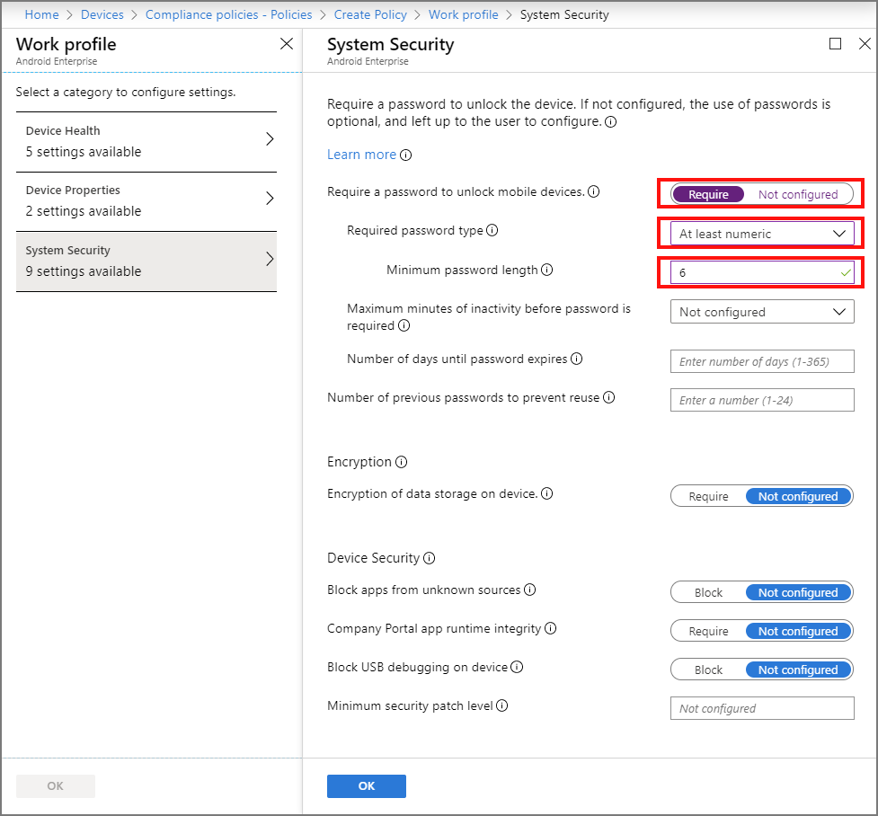

---
# required metadata

title: Quickstart - Password compliance policy for Android devices
titleSuffix: Microsoft Intune
description: In this quickstart, you will use Microsoft Intune to set the length of the password required for Android devices.
keywords:
author: Erikre
ms.author: erikre
manager: dougeby
ms.date: 11/21/2019
ms.topic: quickstart
ms.service: microsoft-intune
ms.subservice: protect
ms.localizationpriority: high
ms.technology:
ms.assetid: 81b4fa08-5333-4c54-9f49-8db5f6984ed2

# optional metadata

#ROBOTS:
#audience:
#ms.devlang:
ms.reviewer:
ms.suite: ems
search.appverid: MET150
#ms.tgt_pltfrm:
ms.custom: intune-azure
ms.collection: M365-identity-device-management
---

# Quickstart: Create a password compliance policy for Android devices

In this quickstart, you'll use Microsoft Intune to require your workforce's Android users to enter a password of a specific length before access is granted to information on their Android devices.

An Intune device compliance policy specifies the rules and settings that devices must meet to be considered compliant. You can use compliance policies with Conditional Access to allow or block access to company resources. You can also get device reports and take actions for non-compliance.

> [!IMPORTANT]
> In addition to password settings, you should also consider other system security settings to protect your workforce. For more information, see [System security settings](compliance-policy-create-android-for-work.md).

If you don’t have an Intune subscription, [sign up for a free trial account](../intune/fundamentals/free-trial-sign-up.md).

## Sign in to Intune

Sign in to the [Microsoft Endpoint Manager Admin Center](https://go.microsoft.com/fwlink/?linkid=2109431) as a [Global administrator](../intune/fundamentals/users-add.md#types-of-administrators) or an Intune [Service administrator](../intune/fundamentals/users-add.md#types-of-administrators).

## Create a device compliance policy

Create a device compliance policy to require your workforce's Android users to enter a password of a specific length before access is granted to information on their Android devices.

1. In Intune, select **Devices** > **Compliance Policies** > **Create Policy**.

2. Add **Android compliance** as the  **Name**. Also, add a **Description**.

3. For **Platform**, select **Android Enterprise**.

4. For **Profile type**, select **Work profile**.

5. Select **Settings** > **System Security** to display the Android **System Security** blade.

6. For **Require a password to unlock mobile devices**, select **Require**.

7. For **Required password type**, select **At least numeric**.

8. For **Minimum password length**, enter **6**.

    

9. When done, select **OK** > **OK** > **Create** to create the policy.

When you've successfully created the policy, it appears in your list of device complice policies.

## Clean up resources

When no longer needed, delete the policy. To do so, select the compliance policy and click **Delete**.

## Next steps

In this quickstart, you used Intune to create a compliance policy for your workforce's Android devices to require a password of at least six characters in length. For more information about creating compliance policies, see [Get started with device compliance policies in Intune](device-compliance-get-started.md).

To follow this series of Intune quickstarts, continue to the next quickstart.

> [!div class="nextstepaction"]
> [Quickstart: Send notifications to noncompliant devices](../quickstart-send-notification.md)
