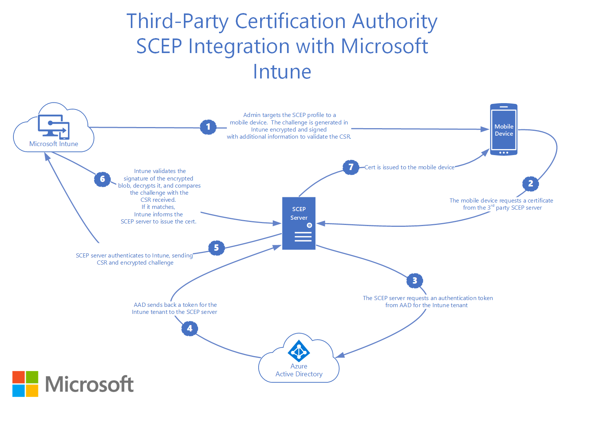

# Use APIs to add third-party CAs for SCEP to Intune

In Microsoft Intune, you can add third-party certificate authorities (CA), and have these CAs issue and validate certificates using the Simple Certificate Enrollment Protocol (SCEP). [Add third-party certification authority](certificate-authority-add-scep-overview.md) provides an overview of this feature, and describes the Administrator tasks in Intune.

There are also some developer tasks that use an open-source library that Microsoft published in GitHub.com. The library includes an API that:

- Validates the SCEP password dynamically generated by Intune
- Notifies Intune of the certificates created on devices submitting SCEP requests

Using this API, your third-party SCEP server integrates with the Intune SCEP management solution for MDM devices. The library abstracts aspects such as authentication, service location, and the ODATA Intune Service API from its users.

## SCEP management solution



Using Intune, administrators create SCEP profiles, and then assign these profiles to MDM devices. The SCEP profiles include parameters, such as:

- The URL of the SCEP server
- The Trusted Root Certificate of the Certificate Authority
- Certificate attributes, and more

Devices that check-in with Intune are assigned the SCEP profile, and are configured with these parameters. A dynamically-generated SCEP challenge password is created by Intune, and then assigned to the device.

This challenge contains:

- The dynamically-generated challenge password
- The details on the parameters expected in the certificate signing request (CSR) that the device issues to the SCEP server
- The challenge expiration time

Intune encrypts this information, signs the encrypted blob, and then packages these details into the SCEP challenge password.

Devices contacting the SCEP server to request a certificate then give this SCEP challenge password. The SCEP server sends the CSR and encrypted SCEP challenge password to Intune for validation.  This challenge password and CSR must pass validation for the SCEP server to issue a certificate to the device. When an SCEP challenge is validated, the following checks happen:


- Validates the signature of the encrypted blob
- Validates that the challenge hasn't expired
- Validates that the profile is still targeted to the device
- Validates that the certificate properties requested by the device in the CSR match the expected values

The SCEP management solution also includes reporting. An administrator can get information on the deployment status of the SCEP profile, and about the certificates issued to the devices.

## Integrate with Intune

The code for the library to integrate with the Intune SCEP is available for download in the [Microsoft/Intune-Resource-Access GitHub repository](https://github.com/Microsoft/Intune-Resource-Access/tree/develop/src/CsrValidation).

Integrating the library into your products includes the following steps. These steps require knowledge on working with GitHub repositories, and creating solutions and projects in Visual Studio.

1. Register to receive notifications from the repository
2. Clone or download the repository
3. Go to the library implementation you need under the `\src\CsrValidation` folder (https://github.com/Microsoft/Intune-Resource-Access/tree/develop/src/CsrValidation)
4. Build the library using the instructions in the README file
5. Include the library in the project that builds your SCEP server
6. Complete the following tasks on the SCEP Server:

   - Allow the admin to configure the [Azure Application Identifier, Azure Application Key, and Tenant ID](#onboard-scep-server-in-azure) (in this article) that the library uses for authentication. Administrators should be allowed to update the Azure Application Key.
   - Identify SCEP requests that include an Intune-generated SCEP password
   - Use the **Validate Request API** library to validate Intune-generated SCEP passwords
   - Use the library notification APIs to notify Intune about certificates issued for SCEP requests that have the Intune-generated SCEP passwords. Also notify Intune about errors that can occur when processing these SCEP requests.
   - Confirm that the server logs enough information to help admins troubleshoot issues

7. Complete [integration testing](#integration-testing) (in this article), and address any issues
8. Give written guidance to the customer that explains:

   - How the SCEP Server needs to be onboarded in the Microsoft Intune admin center
   - How to get the Azure Application Identifier and Azure Application Key needed to configure the library

### Onboard SCEP server in Azure

To authenticate to Intune, the SCEP server requires an Azure Application ID, an Azure Application Key, and a Tenant ID. The SCEP Server also needs authorized to access the Intune API.

To get this data, the SCEP server administrator signs in to the Azure portal, registers the application, gives the application both the **Microsoft Intune API\SCEP challenge validation** permission and the **Application.Read.All** permission, creates a key for the application, and then downloads the application ID, its key, and the tenant ID.

For guidance on registering an application, and getting the IDs and keys, see [Use portal to create an AAD application and service principal to access resources](/azure/azure-resource-manager/resource-group-create-service-principal-portal).

### Java Library API

The Java library is implemented as a Maven project that pulls in its dependencies when it's built. The API is implemented under the `com.microsoft.intune.scepvalidation` namespace by the `IntuneScepServiceClient` class.

#### IntuneScepServiceClient class

The `IntuneScepServiceClient` class includes the methods used by the SCEP service to validate SCEP passwords, to notify Intune about certificates that are created, and to list any errors.

##### IntuneScepServiceClient constructor

**Signature**:

```java
IntuneScepServiceClient(
    Properties configProperties)
```

**Description**:

Instantiates and configures an `IntuneScepServiceClient` object.

**Parameters**:

- **configProperties** - Properties object containing client configuration information

The configuration must include following properties:

- AAD_APP_ID="The Azure Application Id obtained during the onboarding process"
- AAD_APP_KEY="The Azure Application Key obtained during the onboarding process"
- TENANT="The Tenant Id obtained during the onboarding process"
- PROVIDER_NAME_AND_VERSION="Information used to identify your product and its version"

If your solution requires a proxy either with authentication or without authentication, then you can add the following properties:

- PROXY_HOST="The host the proxy is hosted on."
- PROXY_PORT="The port the proxy is listening on."
- PROXY_USER="The username to use if proxy uses basic authentication."
- PROXY_PASS="The password to use if proxy uses basic authentication."

**Throws**:

- **IllegalArgumentException** - Thrown if the constructor is executed without a proper property object.

> [!IMPORTANT]
> It's best to instantiate an instance of this class, and use it to process multiple SCEP requests. Doing so reduces overhead, as it caches authentication tokens and service location information.

**Security notes**  
The SCEP server implementer must protect the data entered in the configuration properties persisted to storage against tampering and disclosure. It's recommended to use proper ACLs and encryption to secure the information.

##### ValidateRequest method

**Signature**:

```java
void ValidateRequest(
    String transactionId,
    String certificateRequest)
```

**Description**:

Validates a SCEP certificate request.

**Parameters**:

- **transactionId** - The SCEP Transaction ID
- **certificateRequest** - DER-encoded PKCS #10 Certificate Request Base64 encoded as a string

**Throws**:

- **IllegalArgumentException** - Thrown if called with a parameter that is not valid
- **IntuneScepServiceException** - Thrown if it is found that the certificate request is not valid
- **Exception** - Thrown if an un-expected error is encountered

> [!IMPORTANT]
> Exceptions thrown by this method should be logged by the server. Note that the `IntuneScepServiceException` properties have detailed information on why the certificate request validation failed.

**Security notes**:

- If this method throws an exception, the SCEP server **must not** issue a certificate to the client.
- SCEP certificate request validation failures may indicate a problem in the Intune infrastructure. Or, they could indicate that an attacker is trying to get a certificate.

##### SendSuccessNotification method

**Signature**:

```java
void SendSuccessNotification(
    String transactionId,
    String certificateRequest,
    String certThumbprint,
    String certSerialNumber,
    String certExpirationDate,
    String certIssuingAuthority)
```

**Description**:

Notifies Intune that a certificate is created as part of processing a SCEP request.

**Parameters**:

- **transactionId** - The SCEP Transaction ID
- **certificateRequest** - DER-encoded PKCS #10 Certificate Request Base64 encoded as a string
- **certThumprint** - SHA1 hash of the thumbprint of the provisioned certificate
- **certSerialNumber** - Serial number of the provisioned certificate
- **certExpirationDate** - Expiration date of the provisioned certificate. The date time string should be formatted as web UTC time (YYYY-MM-DDThh:mm:ss.sssTZD) ISO 8601.
- **certIssuingAuthority** - Name of the authority that issued the certificate

**Throws**:

- **IllegalArgumentException** - Thrown if called with a parameter that is not valid
- **IntuneScepServiceException** - Thrown if it is found that the certificate request is not valid
- **Exception** - Thrown if an un-expected error is encountered

> [!IMPORTANT]
> Exceptions thrown by this method should be logged by the server. Note that the `IntuneScepServiceException` properties have detailed information on why the certificate request validation failed.

**Security notes**:

- If this method throws an exception, the SCEP server **must not** issue a certificate to the client.
- SCEP certificate request validation failures may indicate a problem in the Intune infrastructure. Or, they could indicate that an attacker is trying to get a certificate.

##### SendFailureNotification method

**Signature**:

```java
void SendFailureNotification(
    String transactionId,
    String certificateRequest,
    long  hResult,
    String errorDescription)
```

**Description**:

Notifies Intune that an error occurred while processing a SCEP request. This method shouldn't be invoked for exceptions thrown by the methods of this class.

**Parameters**:

- **transactionId** - The SCEP Transaction ID
- **certificateRequest** - DER-encoded PKCS #10 Certificate Request Base64 encoded as a string
- **hResult** - Win32 error code that best describes the error that was encountered. See [Win32 Error Codes](/openspecs/windows_protocols/ms-erref/18d8fbe8-a967-4f1c-ae50-99ca8e491d2d)
- **errorDescription** - Description of the error encountered

**Throws**:

- **IllegalArgumentException** - Thrown if called with a parameter that is not valid
- **IntuneScepServiceException** - Thrown if it is found that the certificate request is not valid
- **Exception** - Thrown if an un-expected error is encountered

> [!IMPORTANT]
> Exceptions thrown by this method should be logged by the server. Note that the `IntuneScepServiceException` properties have detailed information on why the certificate request validation failed.

**Security notes**:

- If this method throws an exception, the SCEP server **must not** issue a certificate to the client.
- SCEP certificate request validation failures may indicate a problem in the Intune infrastructure. Or, they could indicate that an attacker is trying to get a certificate.

##### SetSslSocketFactory method

**Signature**:

```java
void SetSslSocketFactory(
    SSLSocketFactory factory)
```

**Description**:

Use this method to inform the client that it must use the specified SSL socket factory (instead of the default) when communicating with Intune.

**Parameters**:

- **factory** - The SSL socket factory that the client should use for HTTPS requests

**Throws**:

- **IllegalArgumentException** - Thrown if called with a parameter that is not valid

> [!NOTE]
> The SSL Socket factory must be set if required prior to executing the other methods of this class.

## Integration testing

Validating and testing that your solution is properly integrated with Intune is a must. The following lists an overview of the steps:

1. Set up an [Intune trial account](../fundamentals/account-sign-up.md).
2. Onboard the [SCEP Server in the Azure portal](#onboard-scep-server-in-azure) (in this article).
3. [Configure the SCEP Server](certificates-scep-configure.md) with the IDs and key created when onboarding your SCEP server.
4. [Enroll devices](../enrollment/device-enrollment.md) to test the scenarios in the [scenario testing matrix](https://github.com/Microsoft/Intune-Resource-Access/blob/develop/src/CsrValidation/doc/TestMatrix.csv).
5. [Create a Trusted Root Certificate profile](certificates-scep-configure.md) for your test Certificate Authority.
6. Create SCEP profiles to test the scenarios listed in the [scenario testing matrix](https://github.com/Microsoft/Intune-Resource-Access/blob/develop/src/CsrValidation/doc/TestMatrix.csv).
7. [Assign the profiles](../configuration/device-profile-assign.md) to users that enrolled their devices.
8. Wait for the devices to sync with Intune. Or, manually [sync the devices](../remote-actions/device-sync.md).
9. Confirm the Trusted Root Certificate and SCEP [profiles are deployed to the devices](../configuration/device-profile-monitor.md).
10. Confirm the Trusted Root Certificate are installed on all the devices.
11. Confirm the SCEP Certificates for the assigned profiles are installed on all the devices.
12. Confirm the properties of the installed certificates match the properties set in the SCEP profile.
13. Confirm the issued certificates are properly listed in the Intune admin center

## See also

- [Add 3rd party CA overview](certificate-authority-add-scep-overview.md)
- [Setup Intune](../fundamentals/deployment-plan-setup.md)
- [Device enrollment](../enrollment/device-enrollment.md)
- [Configure SCEP certificate profiles](certificates-profile-scep.md) (the Microsoft NDES Server\Connector setup isn't used for this scenario)