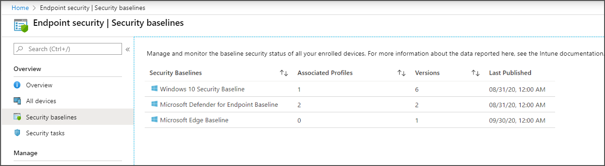

---
# required metadata

title: Create security baseline profiles in Microsoft Intune
description: Create default profiles and customized profiles to deploy security baselines to devices you manage with Intune. Security baselines manage settings on windows devices to help keep your users and devices secure. 
keywords:
author: brenduns 
ms.author: brenduns
manager: dougeby
ms.date: 05/24/2023
ms.topic: how-to
ms.service: microsoft-intune
ms.subservice: protect
ms.localizationpriority: high
ms.technology:
ms.assetid: 

# optional metadata

#ROBOTS:
#audience:

ms.reviewer: juidaewo
ms.suite: ems
#ms.tgt_pltfrm:
ms.custom: 
   - intune-azure
   - contperf-fy21q1
ms.collection:
- tier2
- M365-identity-device-management
---
 
# Manage security baseline profiles in Microsoft Intune

Create and deploy distinct instances of security baseline profiles to help secure and protect your users and devices. By default, security baselines are preconfigured groups of Windows settings that represent the relevant security teams' recommended security posture. You can deploy a default (unmodified) baseline or create a customized profile instance to configure devices with the settings that you require for your environment.

When you create a security baseline profile in Intune, you're creating a template that consists of multiple *device configuration* settings.

When multiple versions for a security baseline exist, only the most recent version can be used to create a new instance of that baseline. If you have profile instances of older versions, you can continue to use them, and change the groups they're assigned to. However, outdated versions don't support edits to their setting configurations. Instead, create new baselines that use the latest version, or update your older baselines to that version if you need to introduce new configurations for settings.

We recommend updating your older baseline versions to the latest version as soon as it's practical to do so. Each new version can include newer settings that aren't available in the older versions, retire old settings, and might include updates to the default configurations for some settings that align to new security recommendations for the applicable product.

This feature applies to:

- Windows 10 version 1809 and later
- Windows 11

See the list of [available security baselines](../protect/security-baselines.md#available-security-baselines).

Common tasks when working with security baselines include:

- [Create a profile](#create-a-profile-for-a-security-baseline) – Configure the settings you want to use and assign the baseline to groups.
- [Change the profile version](#update-a-profile-to-the-latest-version) – Change the baseline version in use by a profile.
- [Remove a baseline assignment](#remove-a-security-baseline-assignment) - Learn what happens when you stop managing settings with a security baseline.

## Prerequisites

- To manage baselines in Intune, your account must have the [Policy and Profile Manager](../fundamentals/role-based-access-control.md#built-in-roles) built-in role.

- Use of some baselines might require you to have an active subscription to the applicable services, like Microsoft Defender for Endpoint.

## Create a profile for a security baseline

1. Sign in to the [Microsoft Intune admin center](https://go.microsoft.com/fwlink/?linkid=2109431).

2. Select **Endpoint security** > **Security baselines** to view the list of available baselines.

   

3. Select the baseline you'd like to use, and then select **Create profile**.

4. On the **Basics** tab, specify the following properties:

   - **Name**: Enter a name for your security baselines profile. For example, enter *Standard profile for Defender for Endpoint*.

   - **Description**: Enter some text that describes what this baseline does. The description is for you to enter any text you want. It's optional, but recommended.

   Select **Next** to go to the next tab. After you advance to a new tab, you can select the tab name to return to a previously viewed tab.

5. On the Configuration settings tab, view the groups of **Settings** that are available in the baseline you selected. You can expand a group to view the settings in that group, and the default values for those settings in the baseline. To find specific settings:
   - Select a group to expand and review the available settings.
   - Use the *Search* bar and specify keywords that filter the view to display only those groups that contain your search criteria.

   Each setting in a baseline has a default configuration for that baseline version. Reconfigure the default settings to meet your business needs. Different baselines might contain the same setting, and use different default values for the setting, depending on the intent of the baseline.

   

6. On the **Scope tags** tab, select **Select scope tags** to open the *Select tags* pane to assign scope tags to the profile.

7. On the **Assignments** tab, select **Select groups to include** and then  assign the baseline to one or more groups. Use **Select groups to exclude** to fine-tune the assignment.

   > [!NOTE]
   > Security baselines must be assigned to either user groups or device groups based on scope of the settings being used. Because of this, multiple baselines may be needed when assigning both user and device-based settings.

   

8. When you're ready to deploy the baseline, advance to the **Review + create** tab and review the details for the baseline. Select **Create** to save and deploy the profile.

   As soon as you create the profile, it's pushed to the assigned group and might apply immediately.

   > [!TIP]
   > If you save a profile without first assigning it to groups, you can later edit the profile to do so.

   

9. After you create a profile, edit it by going to **Endpoint security** > **Security baselines**, select the baseline type that you configured, and then select **Profiles**. Select the profile from the list of available profiles, and then select **Properties**. You can edit settings from all the available configuration tabs, and select **Review + save** to commit your changes.

## Update a profile to the latest version

The information in this section applies to updating a baseline instance created before May 2023 to a version of that same baseline that was released in May 2023 or later.

> [!NOTE]  
> In May 2023, Intune began rollout of a new security baseline format for each new baseline release or update.  Intune also introduced a new update process for migrating an existing security baseline profile to a newly released security baseline. This new behavior replaces existing  behavior when moving to a baseline version released in May 2023 or later.
>
> The previous behavior remains available for use when updating baselines that have not yet received a new version that uses the new format. For guidance, see [Update baselines that use the previous format](#update-baselines-that-use-the-previous-format).

After May 2023, when a new version for a baseline is released, plan to update your existing profiles to the new version. When moving from an older format to the new baseline format (from a version released prior to May 2023 to one released in May 2023 or later):

- All new profiles for the baseline type, like Microsoft Edge, use the new format. Creating a new baseline that uses an older baseline version isn't supported.

- Baseline versions released before May 2023 don’t upgrade to the new format released in May 2023 and later. Instead, create a new profile that uses the new format and configure the settings from the old baseline in that new baseline format. This recreation of the profile is a one-time process that is required to move a baseline from the old format to the new baseline format.

  To assist you in this process Intune can export the old profile to a CSV format that identifies each setting based on the name of the setting as it appears in the new profile version, along with its configuration.

- After creating a new baseline that can replace your older baseline format and version, the older profile remains unchanged, and you can continue to use it. You can continue to deploy, reassign, and edit the settings in the older baseline format.

  > [!TIP]  
  > Support to edit settings in an older baseline version after updating to a new version is a change from past behavior. This behavior is possible only when moving from baselines versions created before May 2023 to versions created in May 2023 or later because the new baseline format exists side-by-side with the older baseline format instead of replacing it. Later, when updating a baseline instance that was created in May 2023 or later to a newer version, the original behavior where you cannot edit settings in the older version returns.

  We recommend planning to discontinue use of the older format and deploying a profile based on the latest version as soon as possible. The older profiles don't receive updates while the newer versions released in May 2023:

  - Use the new settings format in the Intune UI that directly aligns to the configuration service provider (CSP) source for each setting.
  - Include only settings found in the current CSP, which can include new settings that are added to the CSP since the last baseline version was created.
  - Are preconfigured with default configurations that the relevant security teams recommend.

### Update a baseline to the new format

To update a baseline that was created before May 2023 to the new format, you must create a new baseline instance. To assist you in recreating the original baselines configuration, you can have Intune export your current baselines configuration as a .CSV file. The export includes:

- Each setting from the older baseline is identified by using the name of the setting as it appears in the new baseline.
- How each setting in the older baseline was configured.
- If the configuration of a setting from the old baseline matches the default configuration from the new baseline.

With the information from the export, you can rapidly reconfigure the new baseline to use the same values as the older baseline instance.

1. Sign in the [Microsoft Intune admin center](https://go.microsoft.com/fwlink/?linkid=2109431), and go to **Endpoint security** > **Security baselines** > *select the baseline type*, and then select the checkbox for the baseline profile (instance) that you want to replicate in the new baseline format, and then select **Change Version**. Intune displays the *Change Version* pane.

   In the following screenshot, we’ve drilled into the *Security Baseline for Microsoft Edge*. We have two profiles at this time. One is a new profile for Microsoft Edge v112, and the other is an older profile from September 2020. The older profile also displays an arrow icon to indicate that there's a newer version to replace it.

   :::image type="content" source="./media/security-baselines-configure/select-a-baseline-profile-to-update.png" alt-text="Screen shot that shows the navigation path in the Intune admin center, to open the Change Version pane." lightbox="./media/security-baselines-configure/select-a-baseline-profile-to-update.png":::

2. On the *Change Version* pane, there are instructions for moving the configuration details from the older baseline to a profile that uses the new format. The pane also identifies the selected baselines name and version, and what the latest baseline version is.

   1. Select **Export Profile Settings** to create a .csv file that lists the settings in the selected baseline along with their current configurations if they aren't set to the baselines default. When you select the option to export the baseline details, Intune prepares the export, and then requires you to agree to continue. Select **Yes** to download the .CSV file export.

   2. After the file downloads, you can open it to view the older baselines current configuration.

   The *Change Version* pane also includes a button to **Create** a new profile for the selected baseline, which has the same function as the *Create profile* option that is more commonly used to create new baseline instances.

   The following screen capture shows an export for the Microsoft Edge profile version 85, as viewed in Microsoft Excel. Of the Microsoft Edge baselines 17 settings found in the older profile, only one has been changed the baselines default: **Enable site isolation for every site** was set to **Disabled**. The baseline default was **Enabled**:

   :::image type="content" source="./media/security-baselines-configure/csv-export-of-baseline-configuration.png" alt-text="Screen shot that shows an export of the Microsoft Edge baseline profile as a .csv file." lightbox="./media/security-baselines-configure/csv-export-of-baseline-configuration.png":::

   In the preceding image, there are three columns of information. The information identifies the settings in the new profile, and the configuration for each of them that you had in the old profile.

   - **DefinitionId** – This column displays the settings registry name. The information after the underscore ( _ ) identifies the settings name as it appears in the new baseline profile and format, but without spaces in the name. This value is also the name of the CSP setting that this baseline setting manages.  

   For example, our modified setting of *Enable site isolation for every site* appears in this export as *admx--microsoftedge_SitePerProcess*. The last portion, *SitePerProcess*, helps identify the setting.

   - **defaultJson** – This column identifies the default configuration for this setting as seen in the new baseline format. Our sample setting for the **SitePerProcess** CSP is set to **enabled** by default.

   - **customziedJson** – The final column displays the configuration of each setting from the older profile version. This information helps you understand which settings in the new profile require modification to match the older profiles’ configuration. Our sample setting was set to **disabled**. All other settings display “NotApplicable” as they weren't modified from the default configuration in the older baseline version we have been using.

   You might note that the updated Microsoft Edge baseline profile has more than the 17 settings found in the older profile. The baseline export doesn’t identify these new settings, as they weren't available in the older baseline version you're reviewing.

   Later, when you create and configure the new profile, you can use the list from the CSV export to ensure each setting from the previous profile is set in the new profile with the same configuration.

## Update baselines that use the previous format

The information in this section applies to updating an existing baseline created before May 2023 to a version of that same baseline that  was also released before May 2023.

> [!NOTE]  
> In May 2023, Intune began rollout of a new security baseline format for each new baseline release or update.  Intune also introduced a new update process for migrating an existing security baseline profile to a newly released security baseline. This new behavior replaces existing  behavior when moving to a baseline version released in May 2023 or later.
>
> The following guidance is for use when updating a baseline to a newer version that was released before May 2023. If you’re updating a baseline to a version that was released in May 2023 or later, see [Update a profile to the latest version](#update-a-profile-to-the-latest-version).

When a new version for a baseline becomes available, plan to update your existing profiles to the new version:

- Existing profiles don’t upgrade to new versions automatically.
- Settings in baseline profiles that don’t use the latest version become read-only. You can continue using those older profiles, including editing their name, description, and assignments, but you can't edit settings for them or create new profiles based on those older versions.

We recommend you [test the version](#test-the-conversion-and-updated-baseline) update on a copy of your existing profiles before you update your live profiles.

When you change the profile version:

- You select the latest instance of the same baseline. You can't change between two different baseline types, such as changing a profile from using a baseline for Defender for Endpoint to using the MDM security baseline.
- You can export and download a CSV file that lists the changes between the two baseline versions involved.
- You choose how to update the profile:
  - You can keep all your customizations from the original baseline version.
  - You can choose to use the default values for all settings in the new baseline version.

  You don't have the option to change only some settings in a profile during the update.

During conversion:

- New settings that weren't in the older version you were using are added. Any new settings from the new version use their default values.

- Settings that aren't in the new baseline version you select are removed and no longer enforced by this security baseline profile.

  When a setting is no longer managed by a baseline profile, that setting doesn't reset on the device. Instead, the setting on the device remains set to its last configuration until some other process manages the setting to change it. Examples of processes that can change a setting after you stop managing it include a different baseline profile, a group policy setting, or manual configuration that's made on the device.

After the conversion to the new baseline version is complete:

- The baseline immediately redeploys to assigned groups.
- You can edit the baseline to change individual settings.

### Test the conversion and updated baseline

Before you update a baseline profile to a new version, create a copy of it so you can test the new version of your profile on a group of devices. See [Duplicate a security baseline](#duplicate-a-security-baseline) later in this article.

- When you create a copy, group assignments aren't included, which means your baseline copy won't deploy to any devices at the time you make a copy or at the time you update it to a new version.
- After you update the profile to the latest version, you can edit its settings. You can assign the updated copy to a group of devices and edit it to introduce changes to individual settings in the profile.

### To change the baseline version for a profile

Before you update the version of a profile that's assigned to groups, [test the version update](#test-the-conversion-and-updated-baseline) on a copy of profile so you can then validate the new baselines settings on test group of devices.

1. Sign in to the [Microsoft Intune admin center](https://go.microsoft.com/fwlink/?linkid=2109431).

2. Select **Endpoint security** > **Security baselines**, and then select the tile for the baseline type that has the profile you want to change.

3. Next, select **Profiles**, and then select the check box for the profile you want to edit, and then select **Change Version**.

   

4. On the **Change Version** pane, use the **Select a security baseline to update to** dropdown, and select the version instance you want to use.

   

5. Select **Review update** to download a CSV file that displays the difference between the profiles current instance version and the new version you've selected. Review this file so that you understand which settings are new or removed, and what the default values for these settings are in the updated profile.

   When ready, continue to the next step.

6. Choose one of the two options for **Select a method to update the profile**:
   - **Accept baseline changes but keep my existing setting customizations** - This option keeps the customizations you made to the baseline profile and applies them to the new version you've selected to use.
   - **Accept baseline changes and discard existing setting customizations** - This option overwrites your original profile completely. The updated profile uses the default values for all settings.

7. Select **Submit**. The profile updates to the selected baseline version and after the conversion is complete, the baseline immediately redeploys to assigned groups.

## Remove a security baseline assignment

When a security baseline setting no longer applies to a device, or settings in a baseline are set to *Not configured*, those settings on a device might not revert to a premanaged configuration depending on the settings in the security baseline. The settings are based on CSPs, and each CSP can handle the change removal differently.

Other processes that might later change settings on the device include a different or new security baseline, device configuration profile, Group Policy configurations, or manual edit of the setting on the device.

## Duplicate a security baseline

You can create duplicates of your security baselines. Duplicating a baseline can be useful when you want to assign a similar but distinct baseline to a subset of devices. By creating a duplicate, you don't need to manually recreate the entire baseline. Instead, you can duplicate any of your current baselines and then introduce only the changes the new instance requires. You might only change a specific setting and the group the baseline is assigned to.

When you create a duplicate, give the copy a new name. The copy is made with the same setting configurations and scope tags as the original, but doesn't have any assignments. You must edit the new baseline to add assignments.

All security baselines support creating a duplicate.

After you duplicate a baseline, review and edit the new instance to make changes to its configuration.

### To duplicate a baseline

1. Sign in to the [Microsoft Intune admin center](https://go.microsoft.com/fwlink/?linkid=2109431).
2. Go to **Endpoint security** > **Security baselines**, select the type of baseline you want to duplicate, and then select **Profiles**.
3. Right-click on the profile you want to duplicate and select **Duplicate**, or select the ellipsis (**…**) to the right of the baseline and select **Duplicate**.
4. Provide a **New name** for the baseline, and then select **Save**.

After a *Refresh*, the new baseline profile appears in the admin center.

### To edit a baseline

1. Select the baseline, and then select **Properties**.
2. From this view you can select **Edit** for the following categories to modify the profile: 

   - Basics
   - Assignments
   - Scope tags
   - Configuration settings

   You can *Edit* a profiles *Configuration settings* only when that profile uses the latest version of that security baseline. For profiles that use older versions, you can expand **Settings** to view the configuration of settings in the profile, but you can't modify them. After a profile is updated to the most recent baseline version, you'll be able to edit the profiles settings.

3. After you’ve made changes, select **Save** to save your edits. You save edits to one category before you can introduce edits to additional categories.

## Older baseline versions

Microsoft Intune updates the versions of built-in Security Baselines depending on the changing needs of a typical organization. Each new release results in a version update to a particular baseline. The expectation is that customers will use the latest baseline version as a starting point to their Device Configuration profiles.

When there are no longer any profiles that use an older baseline listed in your tenant, Microsoft Intune lists the latest baseline version available.

If you have a profile associated with an older baseline, that older baseline continues to be listed.

## Co-managed devices

Security baselines on Intune-managed devices are similar to co-managed devices with Configuration Manager. Co-managed devices use Configuration Manager and Microsoft Intune to manage the Windows 10/11 devices simultaneously. It lets you cloud-attach your existing Configuration Manager investment to the benefits of Intune. [Co-management overview](/configmgr/comanage/overview) is a great resource if you use Configuration Manager, and also want the benefits of the cloud.

When using co-managed devices, you must switch the **Device configuration** workload (its settings) to Intune. [Device configuration workloads](/configmgr/comanage/workloads#device-configuration) provides more information.

## Next steps

- Check the status and monitor the [baseline and profile](security-baselines-monitor.md)

- View the settings in the latest versions of the available baselines:
  - [Windows 10 and later - MDM security baseline](security-baseline-settings-mdm-all.md)
  - [Microsoft Defender for Endpoint baseline](security-baseline-settings-defender-atp.md)
  - [Microsoft 365 Apps for Enterprise (Office baseline)](security-baseline-settings-office.md)
  - [Microsoft Edge (Version 107 and later)](security-baseline-settings-edge.md?pivots-edge-may-2023)
  - [Windows 365 Security Baseline](security-baseline-settings-windows-365.md)
