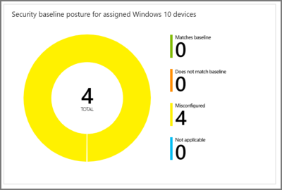
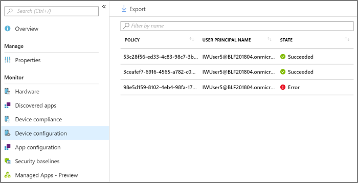
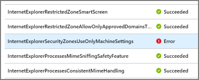
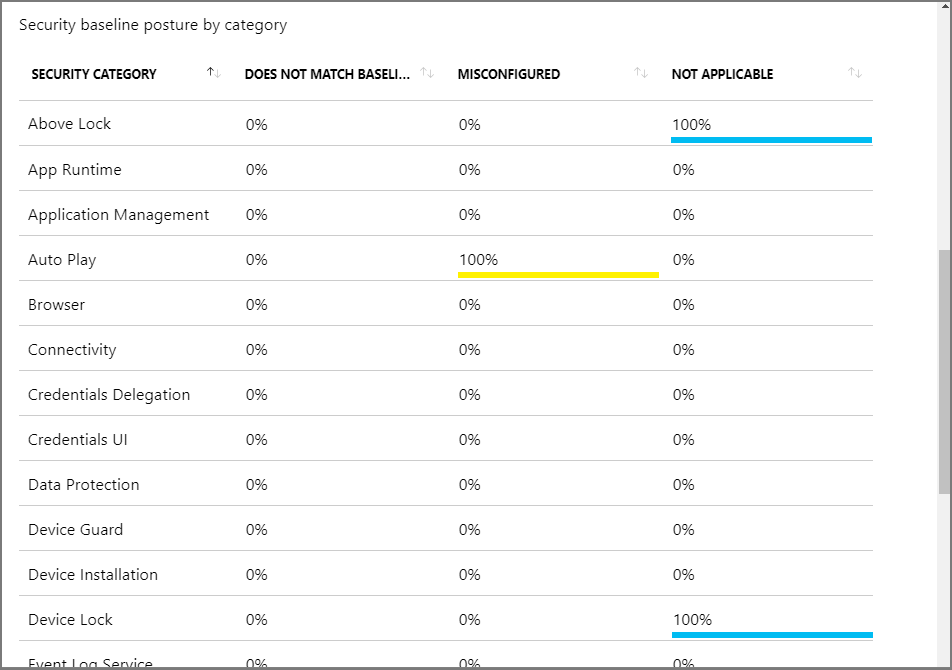
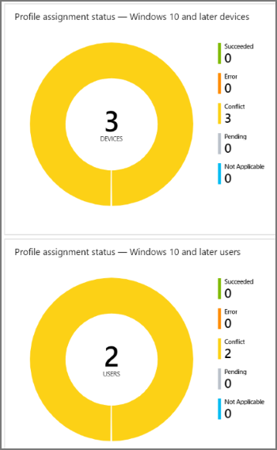

---
# required metadata

title: Check the success or failure of security baselines in Microsoft Intune - Azure | Microsoft Docs
description: Check the error, conflict, and success status when deploying security baselines to users and devices in Microsoft Intune MDM. See how to troubleshoot using client logs, and the report features in Intune.
keywords:
author: brenduns 
ms.author: brenduns
manager: dougeby
ms.date: 04/01/2020
ms.topic: conceptual
ms.service: microsoft-intune
ms.subservice: protect
ms.localizationpriority: high
ms.technology:
ms.assetid: 

# optional metadata

#ROBOTS:
#audience:

ms.reviewer: shpate
ms.suite: ems
#ms.tgt_pltfrm:
ms.custom: intune-azure
ms.collection: M365-identity-device-management
---

# Monitor security baseline and profiles in Microsoft Intune

Intune provides several options to monitor your security baselines. You can monitor the security baselines profile that applies to your users and devices. You can also monitor the actual baseline, and any devices that match (or don't match) the recommended values.

This article walks you through both monitoring options.

[Security baselines in Intune](security-baselines.md) provides more details on the security baselines feature in Microsoft Intune.

## Monitor the baseline and your devices

When you monitor a baseline, you get insight into the security state of your devices based on Microsoft's recommendations. You can view these insights from the Overview pane of the security baseline in the Intune console.  It takes up to 24 hours for data to appear after you first assign a baseline. Later changes take up to six hours to appear.

To view monitoring data for the baseline and devices, sign in to the [Microsoft Endpoint Manager admin center](https://go.microsoft.com/fwlink/?linkid=2109431). Next, select **Endpoint security** > **Security Baselines**, select a baseline, and view the **Overview** pane.

The **Overview** pane provides two methods to monitor status:

- **Device view** – A summary of how many devices are in each status category for the baseline.
- **Per-category** - A view that displays each category in the baseline and includes the percentage of devices for each status group for each baseline category.

Each device is represented by one of the following statuses (used in the *device* view and also the *per-category* views):

- **Matches baseline** - All the settings in the baseline match the recommended settings.
- **Does not match baseline** - One or more settings in the baseline were modified from their default values in the original baseline. The default values in each security baseline are the recommended values for that baseline.

  > [!NOTE]
  > When you create or edit a baseline profile, any change that is made to a default value or configuration setting causes a *Does not match baseline* status to occur. For help to determine the settings that were changed, contact Microsoft Support. 

- **Misconfigured** - At least one setting isn't correctly configured. This status means that the setting is in a conflict, error, or pending state.
- **Not applicable** - At least one setting isn't applicable and isn't applied.

### Device view

The Overview pane displays a chart-based summary of how many devices have a specific status for the baseline; **Security baseline posture for assigned Windows 10 devices**.

When a device has different status from different categories in the baseline, the device is represented by a single status. The status that represents the device is taken from the following order of precedence: **Misconfigured**, **Does not match baseline**, **Not applicable**, **Matches baseline**.

For example, if a device has a setting classified as *misconfigured* and one or more settings classified as *Does not match baseline*, the device is classified as *Misconfigured*.

You can click on the chart to drill through and view a list of devices with various statuses. You can then select individual devices from that list to view details about individual devices. For example:

- Select **Device configuration** > Select the profile with an Error state:

  

- Select the Error profile. A list of all settings in the profile, and their state is shown. Now, you can scroll to find the setting causing the error:

  

Use this reporting to see any settings in a profile that are causing an issue. Also get more details of policies and profiles deployed to devices.

> [!NOTE]
> When a property is set to **Not configured** in the baseline, the setting is ignored, and no restrictions are enforced. The property isn't shown in any reporting.

### Per category view

The Overview pane displays a per-category chart for the baseline; **Security baseline posture by category**.  This view displays each category from the baseline and identifies the percentage of devices that fall into a status classification for each of those categories.

Status for **Matches baseline** does not display until 100% of devices report that status for the category.

You can sort the by-category view by each column, by selecting up-down arrow icon at the top of the column.

## Monitor the profile

Monitoring the profile gives you insight into the deployment state of your devices, but not the security state based on the baseline recommendations.

1. In Intune, select **Security Baselines** > select a baseline > **Profiles created**.

2. Select a profile. In **Overview**, the image shows how many devices and users have this profile assigned:

   

3. Under **Manage** > **Properties**, a list of all the settings in the baseline are shown. You can also change any of these settings:

   

4. In **Monitor**, you can see the deployment status of the profile on individual devices, the status for each user, and the status for each setting in the baseline:

   

## View Endpoint security configurations per device

View details about the security configurations that apply to an individual device, which can help you isolate settings that  are misconfigured.

1. Sign in to the  sign in to the [Microsoft Endpoint Manager admin center](https://go.microsoft.com/fwlink/?linkid=2109431).

2. Go to  **Devices** > **All devices** and select the device you want to view.

3. In the *Monitor* category, select **Endpoint security configuration** to view the list of security configurations that apply to that device.

4. You can select an Endpoint security configuration to drill in and view additional details about the evaluation of that security configuration on the device.

## Troubleshoot using per-setting status

You deployed a security baseline, but the deployment status shows an error. The following steps give you some guidance on troubleshooting the error.

1. In Intune, select **Security Baselines** > select a baseline > **Profiles created**.

2. Select a profile > Under **Monitor** > **Per-setting status**.

3. The table shows all the settings, and the status of each setting. Select the **Error** column or the **Conflict** column to see the setting causing the error.

### MDM diagnostic information

Now you know the problematic setting. The next step is to find out why this setting is causing an error or conflict.

On Windows 10 devices, there's a built-in MDM diagnostic information report. This report includes default values, current values, lists the policy, shows if it's deployed to the device or the user, and more. Use this report to help determine why the setting is causing a conflict or error.

1. On the device, go to **Settings** > **Accounts** > **Access work or school**.

2. Select the account > **Info** > **Advanced Diagnostic Report** > **Create report**.

3. Choose **Export**, and open the generated file.

4. In the report, look for the error or conflict setting in the different sections of the report.

  For example, look in the **Enrolled configuration sources and target resources** section or the **Unmanaged policies** section. You may get an idea of why it's causing an error or conflict.

[Diagnose MDM failures in Windows 10](https://docs.microsoft.com/windows/client-management/mdm/diagnose-mdm-failures-in-windows-10) provides more information on this built-in report.

> [!TIP]
>
> - Some settings also list the GUID. You can search for this GUID in the local registry (regedit) for any set values.
> - The Event Viewer logs may also include some error information on the problematic setting (**Event viewer** > **Applications and Services Logs** > **Microsoft** > **Windows** > **DeviceManagement-Enterprise-Diagnostics-Provider** > **Admin**).

## Next steps

- [Learn about security baselines](security-baslines.md)
- [Avoid conflicts](security-baselines.md#avoid-conflicts)
- [Monitor device profiles](../configuration/device-profile-monitor.md) 
- [Common issues and resolutions](../configuration/device-profile-troubleshoot.md).
- [Troubleshoot policies and profiles in Intune](../configuration/troubleshoot-policies-in-microsoft-intune.md)