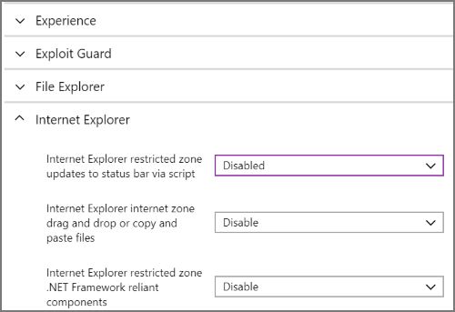
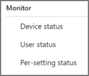

---
# required metadata

title: Check the success or failure of security baselines in Microsoft Intune
description: Check the error, conflict, and success status when deploying security baselines to users and devices in Microsoft Intune MDM. See how to troubleshoot using client logs, and the report features in Intune.
keywords:
author: brenduns 
ms.author: brenduns
manager: dougeby
ms.date: 04/29/2022
ms.topic: how-to
ms.service: microsoft-intune
ms.subservice: protect
ms.localizationpriority: high
ms.technology:
ms.assetid: 

# optional metadata

#ROBOTS:
#audience:

ms.reviewer: juidaewo
ms.suite: ems
#ms.tgt_pltfrm:
ms.custom: intune-azure
ms.collection:
- tier2
- M365-identity-device-management
---

# Monitor security baselines and profiles in Microsoft Intune

Intune provides several options to monitor security baselines. You can:

- Monitor a security baseline, and any devices that match (or don't match) the recommended values.
- Monitor the security baselines profile that applies to your users and devices.
- View how the settings from a selected profile are set on a selected device.

You can also view the [Device configuration report](../fundamentals/reports.md#device-configuration-report-operational) to see which device configuration based policies apply to individual devices, which include security baselines.

For more information about the feature, see [Security baselines in Intune](security-baselines.md).

## Monitor the baseline and your devices

When you monitor a baseline, you get insight into the security state of your devices based on Microsoft's recommendations. To view these insights, sign in to the [Microsoft Endpoint Manager admin center](https://go.microsoft.com/fwlink/?linkid=2109431), go to **Endpoint security** > **Security baselines** and select a security baseline type like the *MDM Security Baseline*. Then, from the *Versions* pane, select the profile instance for which you want to view details to open its *Overview* pane. 

The *Overview* pane displays two status views for the selected baseline:

- **Security baseline posture** chart - This chart displays high-level details about device status for the baseline version. The available details:
  - **Matches default baseline** – This status identifies when a devices configuration matches the default (unmodified) baseline configuration.
  - **Matches custom settings** – This status identifies when a devices configuration matches the customized version of the baseline that you've deployed. 
  - **Misconfigured** – This status is a roll-up that represents three status conditions from a device: *Error*, *Pending*, or *Conflict*. These separate states are available from other views, like the *Security baseline posture by category*, a list view that appears below this chart.
  - **Not applicable** - This status represents a device that can’t receive the policy. For example, the policy updates a setting specific to the latest version of Windows, but the device runs an older (earlier) version that doesn’t support that setting. 

- **Security baseline posture by category** - A list view that displays device status by category. In this list view, the same details as the *Security baseline posture* chart are available. However, in place of *Misconfigured* you’ll see three columns for the status states that make up Misconfigured:

  - **Error**: The policy failed to apply. The message typically displays with an error code that links to an explanation.
  - **Conflict**: Two settings are applied to the same device, and Intune can't sort out the conflict. An administrator should review.
  - **Pending**: The device hasn't checked in with Intune to receive the policy yet.
 
When you drill-in to the two preceding views, you can view the following details for the setting status and the device status list views:

- **Succeeded**: Policy is applied.
- **Error**: The policy failed to apply. The message typically displays with an error code that links to an explanation.
- **Conflict**: Two settings are applied to the same device, and Intune can't sort out the conflict. An administrator should review.
- **Pending**: The device hasn't checked in with Intune to receive the policy yet.
- **Not applicable**: The device can't receive the policy. For example, the policy updates a setting specific to the latest version of Windows, but the device runs an older (earlier) version that doesn’t support that setting.

From the *Version* view, you can select **Device Status**. The Device Status view displays a list of the devices that receive this baseline and includes the following details:
- *USER PRINCIPAL NAME* - The user profile associated with the baseline on the device. 
- *SECURITY BASELINE POSTURE* - This column displays the devices state:
  - **Succeeded**: Policy is applied.
  - **Error**: The policy failed to apply. The message typically displays with an error code that links to an explanation.
  - **Conflict**: Two settings are applied to the same device, and Intune can't sort out the conflict. An administrator should review.
  - **Pending**: The device hasn't checked in with Intune to receive the policy yet.
  - **Not applicable**: The device can't receive the policy. For example, the policy updates a setting specific to the latest version of Windows, but the device runs an older (earlier) version that doesn’t support that setting
- *Last CHECK-IN* - When status was last received from the device.

> [!TIP]  
> It takes up to 24 hours for data to appear after you first assign a baseline. Later changes take up to six hours to appear.

## Monitor the profile

Monitoring the profile gives insight into the deployment state of your devices, but not the security state based on the baseline recommendations.

1. In Intune, select **Endpoint security** > **Security baselines**, *select a security baseline type like the MDM Security Baseline* > *select an instance of that baseline* > **Properties**.

2. In the *Properties* of the baseline, expand **Settings** to drill-in and view all the settings categories and individual settings in the baseline, including  their configuration for this instance of the baseline.

   

3. Use the options for **Monitor** to view the deployment status of the profile on individual devices, the status for each user, and the status for the settings from the instance of the baseline:

   

## Resolve conflicts for security baselines

To help resolve a conflict or error for settings in your security baseline profiles or Endpoint security policies, view the [Device configuration report](../fundamentals/reports.md#device-configuration-report-operational) for a device.  This report view helps you identify where your profiles and policies contain settings that drive a status of Conflict or Error.

You can also reach information about settings in conflict or error through two paths from within Microsoft Endpoint Manager admin center:

- **Endpoint security** > **Security baselines** > *select a baseline type* > **Profiles** > *select a baseline instance* > **Device status**  
- **Devices** > **All devices** > *select a device* > **Device configuration** > *select a Policy* > *select a setting from the list of settings that shows a Conflict or Error*.

### Drill in to identify and resolve conflicts

1. While viewing the [Device configuration report](../fundamentals/reports.md#device-configuration-report-operational) for a device, select a policy to drill-in to learn more about the issue that results in a conflict or error status.

   When you drill-in, Intune displays a list of settings for that policy that includes each setting that wasn’t set as *Not configured*, and the status of that setting.

2. To view details about a specific setting, select it to open the **Settings details** pane. In this pane you’ll see:

   - Setting – The name of the setting.
   - State – The status of the setting on the device.
   - Source Profiles – A list of each conflicting profile that configures the same setting but with a different value.

3. To reconfigure conflicting profiles, select a record from the **Source Profile** list to open *Overview* for that profile. Select the profiles **Properties** and you can then review and edit settings in that profile to remove the conflict.

## View settings from profiles that apply to a device

You can select a profile for a Security Baseline, and drill-in to view a list of settings from that profile as they apply to an individual device. To  drill in:

- **Endpoint Security** > **All devices** > *select a device* > Device configuration > *select a baseline policy instance* 

After you drill in, the admin center displays a list of the settings from that profile and the settings status. Status states include:

- **Succeeded** – The setting on the device matches the value as configured in the profile. This is either the baselines default and recommended value, or a custom value specified by an administrator when the profile was configured.
- **Conflict** – The setting is in conflict with another policy, has an error, or is pending an update.
- **Error** - The settings failed to apply.

## Troubleshoot using per-setting status

You deployed a security baseline, but the deployment status shows an error. The following steps give you some guidance on troubleshooting the error.

1. In Intune, select **Endpoint security** > **Security Baselines** > select a baseline > **Profiles**.

2. Select a profile > Under **Monitor** > **Per-setting status**.

3. The table shows all the settings, and the status of each setting. Select the **Error** column or the **Conflict** column to see the setting causing the error.

### MDM diagnostic information

Now you know the problematic setting. The next step is to find out why this setting is causing an error or conflict.

On Windows 10/11 devices, there's a built-in MDM diagnostic information report. This report includes default values, current values, lists the policy, shows if it's deployed to the device or the user, and more. Use this report to help determine why the setting is causing a conflict or error.

1. On the device, go to **Settings** > **Accounts** > **Access work or school**.

2. Select the account > **Info** > **Advanced Diagnostic Report** > **Create report**.

3. Choose **Export**, and open the generated file.

4. In the report, look for the error or conflict setting in the different sections of the report.

  For example, look in the **Enrolled configuration sources and target resources** section or the **Unmanaged policies** section. You may get an idea of why it's causing an error or conflict.

[Diagnose MDM failures in Windows 10](/windows/client-management/mdm/diagnose-mdm-failures-in-windows-10) provides more information on this built-in report.

> [!TIP]
>
> - Some settings also list the GUID. You can search for this GUID in the local registry (regedit) for any set values.
> - The Event Viewer logs may also include some error information on the problematic setting (**Event viewer** > **Applications and Services Logs** > **Microsoft** > **Windows** > **DeviceManagement-Enterprise-Diagnostics-Provider** > **Admin**).

## Next steps

- [Learn about security baselines](security-baselines.md)

- [Avoid conflicts](security-baselines.md#avoid-conflicts)

- [Monitor device profiles](../configuration/device-profile-monitor.md) 

- [Common issues and resolutions](../configuration/device-profile-troubleshoot.md).

- [Troubleshoot policies and profiles in Intune](/troubleshoot/mem/intune/troubleshoot-policies-in-microsoft-intune)
