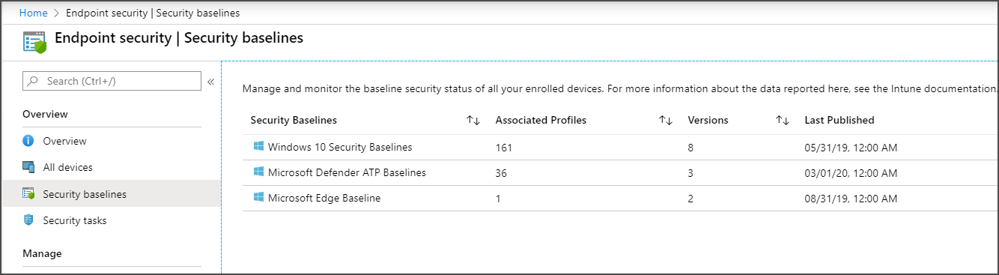

---
# required metadata

title: Use security baselines in Microsoft Intune - Azure | Microsoft Docs
description: Use the recommended windows security settings to protect user and data on devices with Microsoft Intune for mobile device management. Enable encryption, configure Microsoft Defender Advanced Threat Protection, control Internet Explorer, set local security policies, require a password, block internet downloads, and more.
keywords:
author: brenduns 
ms.author: brenduns
manager: dougeby
ms.date: 05/21/2020
ms.topic: conceptual
ms.service: microsoft-intune
ms.subservice: protect
ms.localizationpriority: high
ms.technology:
ms.assetid: 

# optional metadata

#ROBOTS:
#audience:

ms.reviewer: laarrizz
ms.suite: ems
#ms.tgt_pltfrm:
ms.custom: intune-azure
ms.collection: M365-identity-device-management
---

# Use security baselines to configure Windows 10 devices in Intune

Use Intune's security baselines to help you secure and protect your users and devices. Security baselines are pre-configured groups of Windows settings that help you apply a known group of settings and default values that are recommended by the relevant security teams. When you create a security baseline profile in Intune, you're creating a template that consists of multiple *device configuration* profiles.

This feature applies to:

- Windows 10 version 1809 and later

You deploy security baselines to groups of users or devices in Intune, and the settings apply to devices that run Windows 10 or later. For example, the *MDM Security Baseline* automatically enables BitLocker for removable drives, automatically requires a password to unlock a device, automatically disables basic authentication, and more. When a default value doesn't work for your environment, customize the baseline to apply the settings you need.

Separate baseline types can include the same settings but use different default values for those settings. It's important to understand the defaults in the baselines you choose to use, and to then modify each baseline to fit your organizational needs.

> [!NOTE]
> Microsoft doesn't recommend using preview versions of security baselines in a production environment. The settings in a preview baseline might change over the course of the preview.

Security baselines can help you to have an end-to-end secure workflow when working with Microsoft 365. Some of the benefits include:

- A security baseline includes the best practices and recommendations on settings that impact security. Intune partners with the same Windows security team that creates group policy security baselines. These recommendations are based on guidance and extensive experience.
- If you're new to Intune, and not sure where to start, then security baselines gives you an advantage. You can quickly create and deploy a secure profile, knowing that you're helping protect your organization's resources and data.
- If you currently use group policy, migrating to Intune for management is much easier with these baselines. These baselines are natively built in to Intune, and include a modern management experience.

[Windows security baselines](https://docs.microsoft.com/windows/security/threat-protection/windows-security-baselines) is a great resource to learn more about this feature. [Mobile device management](https://docs.microsoft.com/windows/client-management/mdm/) (MDM) is a great resource about MDM, and what you can do on Windows devices.

## Available security baselines

The following security baseline instances are available for use with Intune. Use the links to view the settings for the most recent instance of each baseline.

- **MDM Security Baseline**
  - [MDM Security Baseline for May 2019](security-baseline-settings-mdm-all.md?pivots=mdm-may-2019)
  - [Preview: MDM Security Baseline for October 2018](security-baseline-settings-mdm-all.md?pivots=mdm-preview)

- **Microsoft Defender ATP baseline**
  *(To use this baseline your environment must meet the prerequisites for using [Microsoft Defender Advanced Threat Protection](advanced-threat-protection.md#prerequisites))*.
  - [Microsoft Defender ATP baseline for April 2020 - version 4](security-baseline-settings-defender-atp.md?pivots=atp-april-2020)
  - [Microsoft Defender ATP baseline for March 2020 - version 3](security-baseline-settings-defender-atp.md?pivots=atp-march-2020)

  > [!NOTE]
  > The Microsoft Defender ATP security baseline has been optimized for physical devices and is currently not recommended for use on virtual machines (VMs) or VDI endpoints. Certain baseline settings can impact remote interactive sessions on virtualized environments.  For more information, see [Increase compliance to the Microsoft Defender ATP security baseline](https://docs.microsoft.com/windows/security/threat-protection/microsoft-defender-atp/configure-machines-security-baseline) in the Windows documentation.

- **Microsoft Edge Baseline**
  - [Microsoft Edge baseline for April 2020 (Edge version 80 and later)](security-baseline-settings-edge.md?pivots-edge-april-2020)
  - [Preview: Microsoft Edge baseline for October 2019 (Edge version 77 and later)](security-baseline-settings-edge.md?pivots=edge-october-2019)

You can continue to use and edit profiles that you previously created based on a preview template, even when that preview template is no longer available for creating new profiles.

When you're ready to move to a more recent version of a baseline you use, see [Change the baseline version for a profile](#change-the-baseline-version-for-a-profile) in this article. 

## About baseline versions and instances

Each new version instance of a baseline can add or remove settings or introduce other changes. For example, as new Windows 10 settings become available with new versions of Windows 10, the MDM Security Baseline might receive a new version instance that includes the newest settings.

In the [Microsoft Endpoint Manager admin center](https://go.microsoft.com/fwlink/?linkid=2109431), under **Endpoint security** > **Security baselines** you'll see a list of the available baselines. The list includes:
- the baseline template name
- how many profiles you have that use that baseline type
- how many separate instances (versions) of the baseline type are available
- a *Last Published* date that identifies when the latest version of the baseline template became available

To view more information about the baseline versions you use, select a baseline to open its *Overview* pane, and then select **Versions**. Intune displays details about the versions of that baseline that are in use by your profiles. The details include the most recent and current baseline version. You can select a single version to view deeper details about the profiles that use that version.

You can choose to [change of the version](#change-the-baseline-version-for-a-profile) of a baseline that's in use with a given profile. When you change the version, you don't have to create a new baseline profile to take advantage of updated versions. Instead you can select a baseline profile and use the built-in option to change the instance version for that profile to a new one.

### Compare baseline versions

On the **Versions** pane for a security baseline is a list of each version of this baseline that you've deployed. This list also includes the most recent and active version of the baseline. When you create a new security baseline *profile*, the profile uses that most recent version of the security baseline.  You can continue to use and edit profiles that you previously created that use an earlier baseline version, including baselines created using a Preview version.

To understand what's changed between versions, select the checkboxes for two different versions, and then select **Compare baselines**. You're then prompted to download a CSV file that details those differences.

The download identifies each setting in the two baseline versions, and notes if this setting has changed (*notEqual*) or has remained the same (*equal*). Details also include the default value for the setting by version, and if the setting was *added* to the more recent version, or *removed* from the more recent version.

## Avoid conflicts

You can use one or more of the available baselines in your Intune environment at the same time. You can also use multiple instances of the same security baselines that have different customizations.

When you use multiple security baselines, review the settings in each one to identify when your different baseline configurations introduce conflicting values for the same setting. Because you can deploy security baselines that are designed for different intents, and deploy multiple instances of the same baseline that includes customized settings, you might create configuration conflicts for devices that must be investigated and resolved.

In addition, security baselines often manage the same settings you might set with [device configuration profiles](../configuration/device-profiles.md) or other types of policy. Therefore, remain aware of and consider your additional policies and profiles for settings when seeking to avoid or resolve conflicts.

Use the information at the following links to help identify and resolve conflicts:

- [Troubleshoot policies and profiles in Intune](../configuration/troubleshoot-policies-in-microsoft-intune.md)
- [Monitor your security baselines](security-baselines-monitor.md#troubleshoot-using-per-setting-status)

## Manage baselines

Common tasks when you work with security baselines include:

- [Create a profile](#create-the-profile) – Configure the settings you want to use and assign the baseline to groups.
- [Change the version](#change-the-baseline-version-for-a-profile) – Change the baseline version in use by a profile.
- [Remove a baseline assignment](#remove-a-security-baseline-assignment) - Learn what happens when you stop managing settings with a security baseline.

### Prerequisites

- To manage baselines in Intune, your account must have the [Policy and Profile Manager](../fundamentals/role-based-access-control.md#built-in-roles) built-in role.

- Use of some baselines might require you to have an active subscription to additional services, like Microsoft Defender ATP.

### Create the profile

1. Sign in to the [Microsoft Endpoint Manager admin center](https://go.microsoft.com/fwlink/?linkid=2109431).

2. Select **Endpoint security** > **Security baselines** to view the list of available baselines.

   

3. Select the baseline you'd like to use, and then select **Create profile**.

4. On the **Basics** tab, specify the following properties:

   - **Name**: Enter a name for your security baselines profile. For example, enter *Standard profile for Defender ATP*.

   - **Description**: Enter some text that describes what this baseline does. The description is for you to enter any text you want. It's optional, but recommended.

   Select **Next** to go to the next tab. After you advanced to a new tab, you can select the tab name to return to a previously viewed tab.

5. On the Configuration settings tab, view the groups of **Settings** that are available in the baseline you selected. You can expand a group to view the settings in that group, and the default values for those settings in the baseline. To find specific settings:
   - Select a group to expand and review the available settings.
   - Use the *Search* bar and specify keywords that filter the view to display only those groups that contain your search criteria.

   Each setting in a baseline has a default configuration for that baseline version. Reconfigure the default settings to meet your business needs. Different baselines might contain the same setting, and use different default values for the setting, depending on the intent of the baseline.

   

6. On the **Scope tags** tab, select **Select scope tags** to open the *Select tags* pane to assign scope tags to the profile.

7. On the **Assignments** tab, select **Select groups to include** and then  assign the baseline to one or more groups. Use **Select groups to exclude** to fine-tune the assignment.

   

8. When you're ready to deploy the baseline, advance to the **Review + create** tab and review the details for the baseline. Select **Create** to save and deploy the profile.

   As soon as you create the profile, it's pushed to the assigned group and might apply immediately.

   > [!TIP]
   > If you save a profile without first assigning it to groups, you can later edit the profile to do so.

   

9. After you create a profile, edit it by going to **Endpoint security** > **Security baselines**, select the baseline type that you configured, and then select **Profiles**. Select the profile from the list of available profiles, and then select **Properties**. You can edit settings from all the available configuration tabs, and select **Review + save** to commit your changes.

### Change the baseline version for a profile

You can change the version of the baseline instance that in use with a profile.  When you change the version, you select an available instance of the same baseline. You can't change between two different baseline types, such as changing a profile from using a baseline for Defender ATP to using the MDM security baseline.

While configuring a change of the baseline version, you can download a CSV file that lists the changes between the two baseline versions involved. You also have the choice to keep all your customizations from the original baseline version, or implement the new version using all of its default values. You don't have the option to make changes to individual settings when you change the version of a baseline for a profile.

Upon saving, after the conversion is complete, the baseline is immediately redeployed to assigned groups.

**During conversion**:

- New settings that weren't in the original version you were using are added and set to use the default values.

- Settings that aren't in the new baseline version you select are removed and no longer enforced by this security baseline profile.

  When a setting is no longer managed by a baseline profile, that setting isn't reset on the device. Instead, the setting on the device remains set to its last configuration until some other process manages the setting to change it. Examples of processes that can change a setting after you stop managing it include a different baseline profile, a group policy setting, or manual configuration that's made on the device.

#### To change the baseline version for a profile

1. Sign in to the [Microsoft Endpoint Manager admin center](https://go.microsoft.com/fwlink/?linkid=2109431). 

2. Select **Endpoint security** > **Security baselines**, and then select the tile for the baseline type that has the profile you want to change.

3. Next, select **Profiles**, and then select the check box for the profile you want to edit, and then select **Change Version**.

   

4. On the **Change Version** pane, use the **Select a security baseline to update to** dropdown, and select the version instance you want to use.

   

5. Select **Review update** to download a CSV file that displays the difference between the profiles current instance version and the new version you've selected. Review this file so that you understand which settings are new or removed, and what the default values for these settings are in the updated profile.

   When ready, continue to the next step.

6. Choose one of the two options for **Select a method to update the profile**:
   - **Accept baseline changes but keep my existing setting customizations** - This option keeps the customizations you made to the baseline profile and applies them to the new version you've selected to use.
   - **Accept baseline changes and discard existing setting customizations** - This option overwrites your original profile completely. The updated profile will use the default values for all settings.

7. Select **Submit**. The profile updates to the selected baseline version and after the conversion is complete, the baseline immediately redeploys to assigned groups.

### Remove a security baseline assignment

When a security baseline setting no longer applies to a device, or settings in a baseline are set to *Not configured*, those settings on a device don't revert to a pre-managed configuration. Instead, the previously managed settings on the device keep their last configurations as received from the baseline until some other process updates those settings on the device.

Other processes that might later change settings on the device include a different or new security baseline, device configuration profile, Group Policy configurations, or manual edit of the setting on the device.

### Duplicate a security baseline

You can create a duplicate of a security baseline configuration. A scenario when duplicating a baseline is useful is when you want to assign a similar but distinct baseline to a subset of devices. By creating a duplicate, you won't need to manually recreate the entire baseline. Instead, you can duplicate any of your current baselines and then introduce only the changes the new instance requires. You might only change a specific setting and the group the baseline is assigned to.

When you create a duplicate, you'll give the copy a new name. The copy is made with the same setting configurations and scope tags as the original, but won't have any assignments. You'll need to edit the new baseline to add assignments.

All security baselines support creating a duplicate.

After you duplicate a baseline, review and edit the new instance to make changes to its configuration.

#### To duplicate a baseline

1. Sign in to the [Microsoft Endpoint Manager admin center](https://go.microsoft.com/fwlink/?linkid=2109431).
2. Go to **Endpoint security** > **Security baselines**, select the type of baseline you want to duplicate, and then select **Profiles**.
3. Right-click on the profile you want to duplicate and select **Duplicate**, or select the ellipsis (**…**) to the right of the baseline and select **Duplicate**.
4. Provide a **New name** for the baseline, and then select **Save**.

After a *Refresh*, the new baseline profile appears in the admin center.

#### To edit a baseline

1. Select the baseline, and then select **Properties**.
2. Select **Settings** to expand the list of settings categories in the baseline. You can’t modify the settings from this view, but you can review how they're configured.
3. To modify the settings, select **Edit** for each category where you want to make a change:
   - Basics
   - Assignments
   - Scope tags
   - Configuration settings
4. After you’ve made changes, select **Save** to save your edits.  You must save edits to one category before you can introduce edits to additional categories.

### Older baseline versions

Microsoft Endpoint Manager updates the versions of built-in Security Baselines depending on the changing needs of a typical organization. Each new release results in a version update to a particular baseline. The expectation is that customers will be using the latest baseline version as a starting point to their Device Configuration profiles.

When there are no longer any profiles that use an older baseline listed in your tenant, Microsoft Endpoint Manager will only list the latest baseline version available.

If you have a profile associated with an older baseline, that older baseline will continue to be listed.

## Co-managed devices

Security baselines on Intune-managed devices are similar to co-managed devices with Configuration Manager. Co-managed devices use Configuration Manager and Microsoft Intune to manage the Windows 10 devices simultaneously. It lets you cloud-attach your existing Configuration Manager investment to the benefits of Intune. [Co-management overview](https://docs.microsoft.com/configmgr/comanage/overview) is a great resource if you use Configuration Manager, and also want the benefits of the cloud.

When using co-managed devices, you must switch the **Device configuration** workload (its settings) to Intune. [Device configuration workloads](https://docs.microsoft.com/configmgr/comanage/workloads#device-configuration) provides more information.

## Q & A

### Why these settings?

The Microsoft security team has years of experience working directly with Windows developers and the security community to create these recommendations. The settings in this baseline are considered the most relevant security-related configuration options. In each new build of Windows, the team adjusts its recommendations based on newly released features.

### Is there a difference in the recommendations for Windows security baselines for group policy vs. Intune?

The same Microsoft security team chose and organized the settings for each baseline. Intune includes all the relevant settings in the Intune security baseline. There are some settings in the group policy baseline that are specific to an on-premises domain controller. These settings are excluded from Intune's recommendations. All the other settings are the same.

### Are the Intune security baselines CIS or NSIT compliant?

Strictly speaking, no. The Microsoft security team consults organizations, such as CIS, to compile its recommendations. But, there isn't a one-to-one mapping between "CIS-compliant" and Microsoft baselines.

### What certifications does Microsoft's security baselines have? 

- Microsoft continues to publish security baselines for group policies (GPOs) and the [Security Compliance Toolkit](https://docs.microsoft.com/windows/security/threat-protection/security-compliance-toolkit-10), as it has for many years. These baselines are used by many organizations. The recommendations in these baselines are from the Microsoft security team's engagement with enterprise customers and external agencies, including the Department of Defense (DoD), National Institute of Standards and Technology (NIST), and more. We share our recommendations and baselines with these organizations. These organizations also have their own recommendations that closely mirror Microsoft's recommendations. As mobile device management (MDM) continues to grow into the cloud, Microsoft created equivalent MDM recommendations of these group policy baselines. These additional baselines are built in to Microsoft Intune, and include compliance reports on users, groups, and devices that follow (or don't follow) the baseline.

- Many customers are using the Intune baseline recommendations as a starting point, and then customizing it to meet their IT and security demands. Microsoft's Windows 10 RS5 **MDM Security Baseline** is the first baseline to release. This baseline is built as a generic infrastructure that allows customers to eventually import other security baselines based on CIS, NIST, and other standards. Currently, it's available for Windows and will eventually include iOS/iPadOS and Android.

- Migrating from on-premises Active Directory group policies to a pure cloud solution using Azure Active Directory (AD) with Microsoft Intune is a journey. To help, there are group policy templates included in the [Security Compliance Toolkit](https://docs.microsoft.com/windows/security/threat-protection/security-compliance-toolkit-10) that can help manage hybrid AD and Azure AD-joined devices. These devices can get MDM settings from the cloud (Intune) and group policy settings from on-premises domain controllers as needed.

## Next steps

- View the settings in the latest versions of the available baselines:
  - [MDM security baseline](security-baseline-settings-mdm-all.md)
  - [Microsoft Defender ATP baseline](security-baseline-settings-defender-atp.md)

- Check the status and monitor the [baseline and profile](security-baselines-monitor.md)
