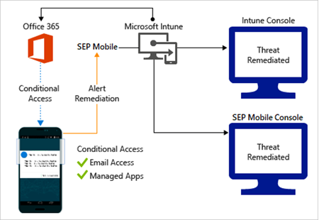
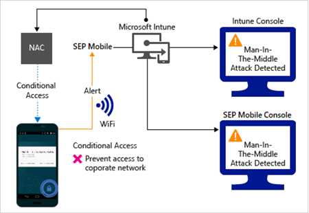
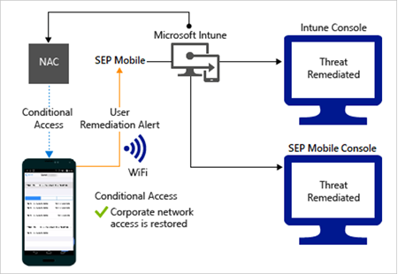

---
# required metadata

title: Use Symantec Endpoint Protection Mobile connector with Microsoft Intune
titleSuffix: Microsoft Intune
description: Learn about integrating Intune with Symantec Endpoint Protection Mobile to control mobile device access to your corporate resources.
keywords:
author: brenduns
ms.author: brenduns
manager: dougeby
ms.date: 03/09/2020
ms.topic: how-to
ms.service: microsoft-intune
ms.subservice: protect
ms.localizationpriority: high
ms.technology:
ms.assetid: df4ce3f6-a093-432c-ab86-7a83865e389e

# optional metadata

#ROBOTS:
#audience:
#ms.devlang:
ms.reviewer: aanavath
ms.suite: ems
search.appverid: MET150
#ms.tgt_pltfrm:
ms.custom: intune-azure
ms.collection: M365-identity-device-management
---

# Symantec Endpoint Protection Mobile connector

You can control mobile device access to corporate resources using Conditional Access based on risk assessment conducted by Symantec Endpoint Protection Mobile (SEP Mobile), a mobile threat defense solution that integrates with Microsoft Intune. Risk is assessed based on telemetry collected from devices running SEP Mobile, including:

- Physical defense

- Network defense

- Application defense

- Vulnerabilities defense

You can enable SEP Mobile risk assessment through Intune device compliance policies, and then use Conditional Access policies to allow or block noncompliant device access to corporate resources based on detected threats.

> [!NOTE]
> This Mobile Threat Defense vendor is not supported for unenrolled devices.

## Supported platforms

- **Android 4.1 and later**

- **iOS 8 and later**

## Pre-requisites

- Azure Active Directory Premium

- Microsoft Intune subscription

- Symantec Endpoint Protection Mobile subscription

For more information, check [Symantec website](https://techdocs.broadcom.com/us/en/symantec-security-software/endpoint-security-and-management/endpoint-protection-mobile/1-0/Integrations/integrating-microsoft-intune-with-v131237277-d4221e13845.html).

## How do Intune and SEP Mobile help protect your company resources?

SEP Mobile app for Android or iOS/iPadOS captures file system, network stack, device and application telemetry where available, then sends it to the Symantec cloud service to assess the device's risk for mobile threats.

The Intune device compliance policy includes a rule for SEP Mobile, which is based on the SEP Mobile risk assessment. When this rule is enabled, Intune evaluates device compliance with the policy that you enabled.

If the device is found noncompliant, access to resources like Exchange Online and SharePoint Online are blocked. Users on blocked devices receive guidance from the SEP Mobile app to resolve the issue and regain access to corporate resources.

Intune supports two modes of integration with SEP Mobile:

- **Basic setup** which is a read only mode that allows SEP Mobile visibility for devices in Intune.

- **Full integration** which allows SEP Mobile to report device risk and security incident details to Intune.

## Sample scenarios

Here are some common scenarios:

### Control access based on threats from malicious apps

When malicious apps such as malware are detected on devices, you can block devices until the threat is resolved:

- Connecting to corporate e-mail

- Syncing corporate files with the OneDrive for Work app

- Accessing company apps

*Block when malicious apps are detected:*

*Access granted on remediation:*

### Control access based on threat to network

Detect threats like **Man-in-the-middle** in network, and protect access to Wi-Fi networks based on the device risk.

*Block network access through Wi-Fi:*

*Access granted on remediation:*

### Control access to SharePoint Online based on threat to network

Detect threats like **Man-in-the-middle** in network, and prevent synchronization of corporate files based on the device risk.

*Block SharePoint Online when network threats are detected:*

*Access granted on remediation:*

### Control access on unenrolled devices based on threats from malicious apps

When the Symantec Endpoint Protection Mobile Threat Defense solution considers a device to be infected:

Access is granted on remediation:

## Next steps

Here are the steps you need to complete to integrate Intune with SEP Mobile:

- [Set up SEP Mobile integration with Intune](skycure-mtd-connector-integration.md)

- [Add and assign SEP Mobile apps, Microsoft Authenticator and iOS/iPadOS app configuration policy](mtd-apps-ios-app-configuration-policy-add-assign.md)

- [Create SEP Mobile device compliance policy with Intune](mtd-device-compliance-policy-create.md)

- [Enable SEP Mobile MTD connector in Intune](mtd-connector-enable.md)
