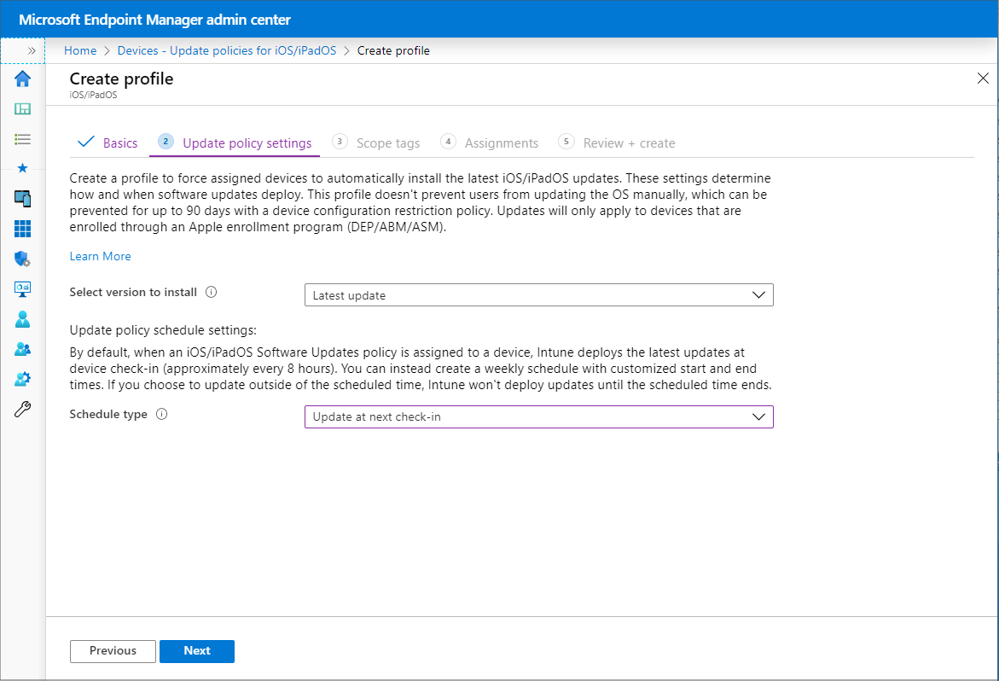
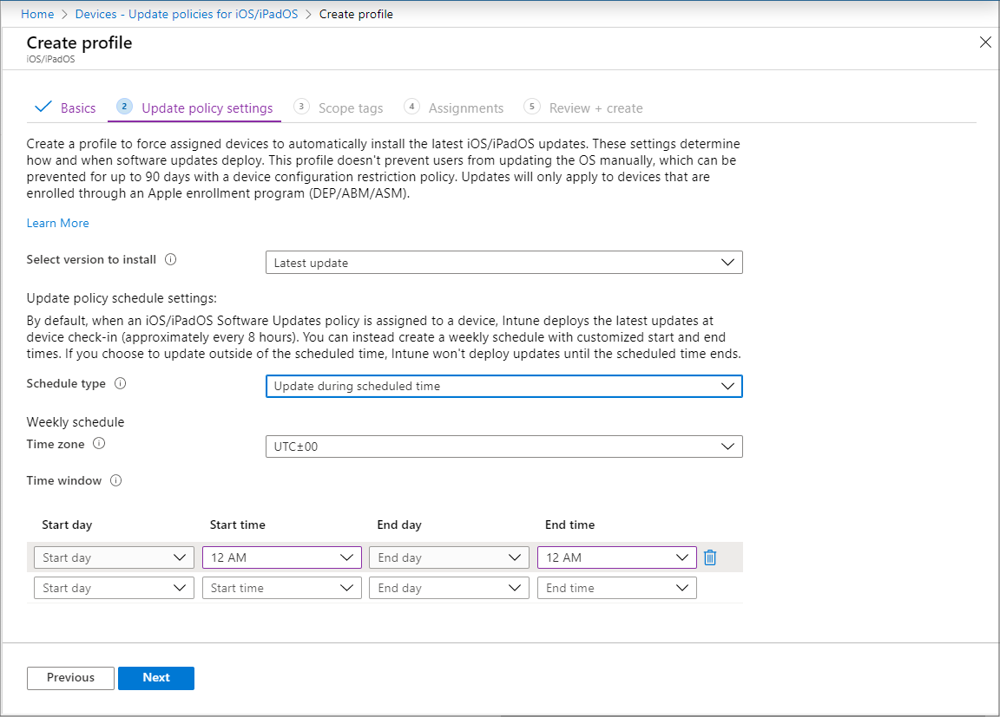

---
# required metadata

title: Configure iOS/iPadOS software update policies in Microsoft Intune - Azure | Microsoft Docs
description: In Microsoft Intune, create or add a configuration policy to restrict when software updates automatically install on iOS/iPadOS devices. You can choose the date and time when updates aren't installed. You can also assign this policy to groups, users, or devices, and check for any installation failures. 
keywords:
author: brenduns 
ms.author: brenduns
manager: dougeby
ms.date: 02/20/2020
ms.topic: conceptual
ms.service: microsoft-intune
ms.subservice: protect
ms.localizationpriority: high
ms.technology:

# optional metadata

#ROBOTS:
#audience:

#ms.reviewer: tisilver
#ms.suite: ems
search.appverid: MET150
#ms.tgt_pltfrm:
#ms.custom:
ms.collection: M365-identity-device-management
---

# Add iOS/iPadOS software update policies in Intune

Software update policies let you force supervised iOS/iPadOS devices to automatically install OS updates. Supervised devices are those that enrolled using either Apple Business Manager or Apple School Manager. When configuring a policy to deploy updates, you can:

- Choose to deploy the *latest update* that's available, or choose to deploy a an older update by the update version number if you don't want to deploy the latest update. If you choose to deploy an older update, you must also set a Device Configuration policy to restrict visibility of software updates.
- Specify a schedule that determines when the update installs. Schedules can be as simple as installing updates the next time that the device checks in, or creating date and time ranges during which updates can install or are blocked from installing.

This feature applies to:

- iOS 10.3 and later (supervised)
- iPadOS 13.0 and later (supervised)

By default, devices check in with Intune about every 8 hours. If an update is available through an update policy, the device downloads the update. The device then installs the update upon next check in within your schedule configuration. Although the update process does not typically involve any user interaction, if the device has a passcode the user must enter it in order to start a software update. Profiles don't prevent users from updating the OS manually. Users can be prevented from updating the OS manually with a Device Configuration policy to restrict visibility of software updates.

> [!NOTE]
> If using [Autonomous Single App Mode (ASAM)](https://docs.microsoft.com/en-us/mem/intune/configuration/device-restrictions-ios#autonomous-single-app-mode-asam), the impact of OS updates should be considered as the resulting behaviour may be undesirable.
Consider testing to assess the impact of OS updates on the app you are running in ASAM. Contact Apple if additional information is required regarding iOS software updates.

## Configure the policy

1. Sign in to the [Microsoft Endpoint Manager admin center](https://go.microsoft.com/fwlink/?linkid=2109431).
2. Select **Devices** > **Update policies for iOS/iPadOS** > **Create profile**.
3. On the **Basics** tab, specify a name for this policy, specify a description (optional), and then select **Next**.

   

4. On the **Update policy settings** tab, configure the following:

   1. **Select version to install**. You can choose from:

      - *Latest update*: This deploys the most recently released update for iOS/iPadOS.
      - Any previous version that is available in the dropdown box. If you select a previous version, you must also deploy a device configuration policy to delay visibility of software updates.

   2. **Schedule type**: Configure the schedule for this policy:

      - *Update at next check-in*: The update installs on the device the next time it checks in with Intune. This is the simplest option and has no additional configurations.
      - *Update during scheduled time*: You configure one or more windows of time during which the update will install upon check-in.
      - *Update outside of scheduled time*: You configure one or more windows of time during which the updates won't install upon check-in.

   3. **Weekly schedule**: If you choose a schedule type other than *update at next check-in*, configure the following options:

      

      - **Time zone**: Choose a time zone.
      - **Time window**: Define one or more blocks of time that restrict when the updates install. The effect of the following options depends on the Schedule type you selected. By using a start day and end day, overnight blocks are supported. Options include:

        - **Start day**: Choose the day on which the schedule window starts.
        - **Start time**: Choose the time day when the schedule window begins. For example, if you select 5 AM and have a Schedule type of *Update during scheduled time*, 5 AM will be the time that updates can begin to install. If you chose a Schedule type of *Update outside of a scheduled time*, 5 AM will be the start of a period of time that updates can't install.
        - **End day**: Choose the day on which the schedule window ends.
        - **End time**: Choose the time of day when the schedule window stops. For example, if you select 1 AM and have a Schedule type of *Update during scheduled time*, 1 AM will be the time that updates can no longer install. If you chose a Schedule type of *Update outside of a scheduled time*, 1 AM will be the start of a period of time that updates can install.

       If you do not configure times to start or end, the configuration results in no restriction and updates can install at any time.  

       > [!NOTE]
       > To delay the visibility of software updates for a specific amount of time on your supervised iOS/iPadOS devices, configure those settings in [Device Restrictions](../configuration/device-restrictions-ios.md#general). Software update policies override any device restrictions. When you set both a software update policy and restriction to delay visibility of software updates, the device forces a software update per the policy. The restriction applies so that users don't see the option to update the device themselves, and the update is pushed as defined by your iOS update policy.

   After configuring *Update policy settings*, select **Next**.

5. On the **Scope tags** tab, select **+ Select scope tags** to open the *Select tags* pane if you want to apply them to the update policy.

   - On the **Select tags** pane, choose one or more tags, and then click **Select** to add them to the policy and return to the *Scope tags* pane.

   When ready, select **Next** to continue to *Assignments*.

6. On the **Assignments** tab, choose **+ Select groups to include** and then assign the update policy to one or more groups. Use **+ Select groups to exclude** to fine-tune the assignment. When ready, select **Next** to continue.

   The devices used by the users targeted by the policy are evaluated for update compliance. This policy also supports userless devices.

7. On the **Review + create** tab, review the settings, and then select **Create** when ready to save your iOS/iPadOS update policy. Your new policy is displayed in the list of update policies for iOS/iPadOS.

For guidance from the Intune support team, see [Delay visibility of software updates in Intune for supervised devices](https://techcommunity.microsoft.com/t5/Intune-Customer-Success/Delaying-visibility-of-software-updates-in-Intune-for-supervised/ba-p/345753).

> [!NOTE]
> Apple MDM doesn't allow you to force a device to install updates by a certain time or date. You can't use Intune software update policies to downgrade the OS version on a device.

## Edit a policy

You can edit an existing policy, including changing the restricted times:

1. Select **Devices** > **Update policies for iOS**. Select the policy you want to edit.

2. While viewing the policies **Properties**, select **Edit** for the policy page you want to modify.

   

3. After introducing a change, select **Review + save** > **Save** to save your edits, and return to the policies *Properties*.

> [!NOTE]
> If the **Start time** and **End time** are both set to 12 AM, Intune does not check for restrictions on when to install updates. This means than any configurations you have for **Select times to prevent update installations** are ignored, and updates can install at any time.

## Monitor device installation failures

<!-- 1352223 -->
**Software updates** > **Installation failures for iOS devices** shows a list of supervised iOS/iPadOS devices targeted by an update policy, attempted an update, and couldn't be updated. For each device, you can view the status on why the device hasn't been automatically updated. Healthy, up-to-date devices aren't shown in the list. "Up-to-date" devices include the latest update that the device itself supports.

## Next steps

[Monitor its status](../configuration/device-profile-monitor.md).
