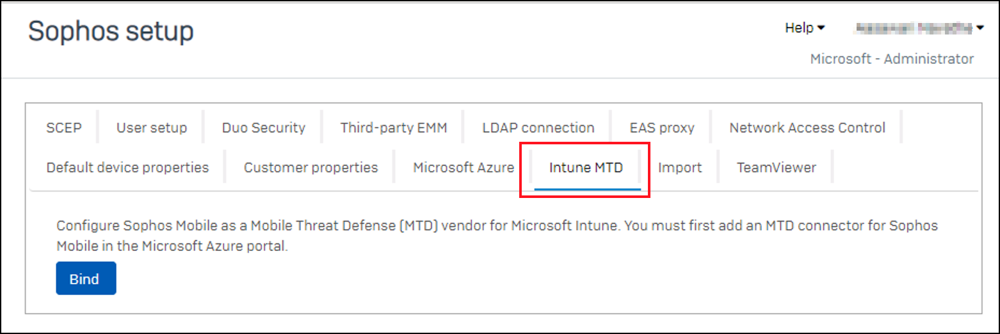
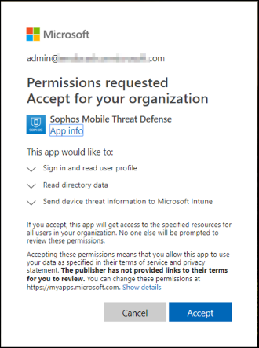
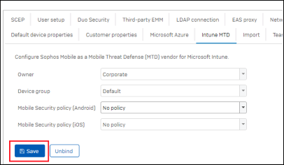

---
# required metadata

title: Set up Sophos Mobile integration with Intune
titleSuffix: Intune on Azure
description: How to set up the Sophos Mobile solution with Microsoft Intune to control mobile device access to your corporate resources.
keywords:
author: brenduns
ms.author: brenduns
manager: dougeby
ms.date: 04/01/2021
ms.topic: how-to
ms.service: microsoft-intune
ms.subservice: protect
ms.localizationpriority: high
ms.technology:
ms.assetid:  

# optional metadata

#ROBOTS:
#audience:

ms.reviewer: aanavath
#ms.suite: ems
search.appverid: MET150
#ms.tgt_pltfrm:
#ms.custom:
ms.collection:
- tier3
- M365-identity-device-management
---

# Integrate Sophos Mobile with Intune  

Complete the following steps to integrate the Sophos Mobile Threat Defense solution with Intune.  

> [!NOTE]
> This Mobile Threat Defense vendor is not supported for unenrolled devices.

## Before you begin  

Before starting the process of integrating Sophos Mobile with Intune, make sure you have the following:  
- Microsoft Intune subscription  
- Azure Active Directory admin credentials to grant the following permissions:  
  - Sign in and read user profile  
  - Access the directory as the signed-in user  
  - Read directory data  
  - Send device information to Intune  
- Admin credentials to access the Sophos Mobile admin console.  

### Sophos Mobile app authorization  
  
The Sophos Mobile app authorization process follows:  
- Allow the Sophos Mobile service to communicate information related to device health state back to Intune.  
- Sophos Mobile syncs with Azure AD Enrollment Group membership to populate its device's database.  
- Allow the Sophos Mobile admin console to use Azure AD Single Sign On (SSO).  
- Allow the Sophos Mobile app to sign in using Azure AD SSO.  

## To set up Sophos Mobile integration  

1. Sign in to the [Microsoft Intune admin center](https://go.microsoft.com/fwlink/?linkid=2109431), go to **Tenant administration** > **Connectors and tokens** > **Mobile Threat Defense** > and select **Add**.  
2. On the **Add Connector** page, use the dropdown and select **Sophos**. And then select **Create**.  
3. Select the link *Open the Sophos admin console*.  
4. Sign in to the [Sophos admin console](https://central.sophos.com/) with your Sophos credentials.  
5. Go to **Mobile** > **Settings** > **Setup** > **Sophos setup**.  
6. On the **Sophos setup** page, select the **Intune MTD** tab.  
    
 
7. Select **Bind**, and then select **Yes**. Sophos connects to Intune and requires you to sign in to your Intune subscription. 
8. In the Microsoft Intune authentication window, enter your Intune credentials and **Accept** the permissions request for *Sophos Mobile Threat Defense*.  
   

9. On the **Sophos setup** page, select **Save** to complete the configuration for Intune:  
     

1. When the message **Successful Integration** appears, integration is complete.  
1. In the Intune admin center, Sophos is now available.  

## Next Steps  
[Configure Sophos client apps](mtd-apps-ios-app-configuration-policy-add-assign.md)
