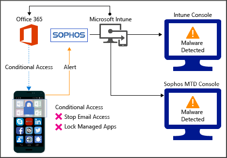
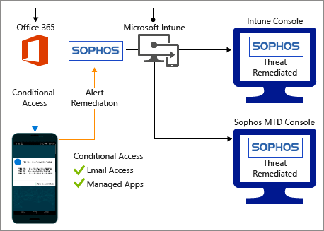
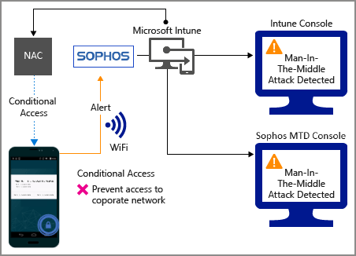
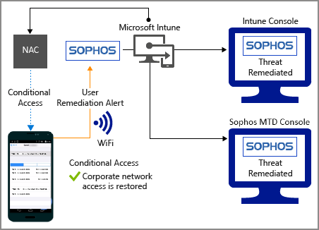
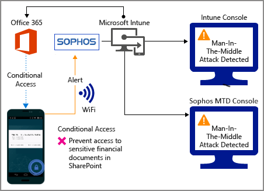
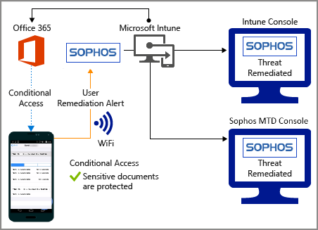
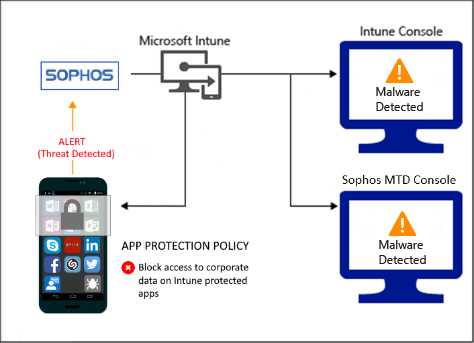
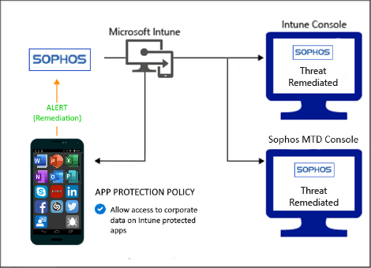

---
# required metadata

title: Use Sophos Mobile with Intune
titleSuffix: Intune on Azure
description: How to use the Sophos Mobile solution with Microsoft Intune to control mobile device access to your corporate resources.
keywords:
author: brenduns
ms.author: brenduns
manager: dougeby
ms.date: 03/09/2020
ms.topic: how-to
ms.service: microsoft-intune
ms.subservice: protect
ms.localizationpriority: high
ms.technology:
ms.assetid:  

# optional metadata

#ROBOTS:
#audience:
#ms.devlang:
ms.reviewer: aanavath
#ms.suite: ems
search.appverid: MET150
#ms.tgt_pltfrm:
#ms.custom:
ms.collection: M365-identity-device-management
---

# Sophos Mobile Threat Defense connector with Intune
You can control mobile device access to corporate resources using Conditional Access based on risk assessment conducted by Sophos Mobile, a Mobile Threat Defense (MTD) solution that integrates with Microsoft Intune. Risk is assessed based on telemetry collected from devices running the Sophos Mobile app.
You can configure Conditional Access policies based on Sophos Mobile risk assessment enabled through Intune device compliance policies, which you can use to allow or block noncompliant devices to access corporate resources based on detected threats.

> [!NOTE]
> This Mobile Threat Defense vendor is not supported for unenrolled devices.

## Supported platforms

- Android 7.0 and later
- iOS 14.0 and later

## Prerequisites

- Azure Active Directory Premium
- Microsoft Intune subscription
- Sophos Mobile Threat Defense subscription

For more information, see the [Sophos website](https://www.sophos.com/products/mobile-control.aspx).

## How do Intune and Sophos Mobile help protect your company resources?

Sophos Mobile app for Android and iOS/iPadOS captures file system, network stack, device, and application telemetry where available, and then sends the telemetry data to the Sophos Mobile cloud service to assess the device's risk for mobile threats.

The Intune device compliance policy includes a rule for Sophos Mobile Threat Defense, which is based on the Sophos Mobile risk assessment. When this rule is enabled, Intune evaluates device compliance with the policy that you enabled. If the device is found noncompliant, users are blocked access to corporate resources like Exchange Online and SharePoint Online. Users also receive guidance from the Sophos Mobile app installed in their devices to resolve the issue and regain access to corporate resources.  

## Sample scenarios

Here are some common scenarios.

### Control access based on threats from malicious apps

When malicious apps such as malware are detected on devices, you can block devices from the following actions until the threat is resolved:

- Connecting to corporate e-mail
- Syncing corporate files with the OneDrive for Work app
- Accessing company apps

*Block when malicious apps are detected*:

  

*Access granted on remediation*:  

### Control access based on threat to network

Detect threats to your network like Man-in-the-middle attacks, and protect access to Wi-Fi networks based on the device risk.  

*Block network access through Wi-Fi*:  

*Access granted on remediation*:   
  

### Control access to SharePoint Online based on threat to network

Detect threats to your network like Man-in-the-middle attacks, and prevent synchronization of corporate files based on the device risk.  

*Block SharePoint Online when network threats are detected*:

  

*Access granted on remediation*:

  

<!-- 
### Control access on unenrolled devices based on threats from malicious apps

When the Sophos Mobile Threat Defense solution considers a device to be infected:

Access is granted on remediation:

-->

## Next steps

- [Integrate Sophos with Intune](sophos-mtd-connector-integration.md)
- [Set up Sophos apps](mtd-apps-ios-app-configuration-policy-add-assign.md)
- [Create Sophos device compliance policy](mtd-device-compliance-policy-create.md)
- [Enable Sophos MTD connector](mtd-connector-enable.md)
