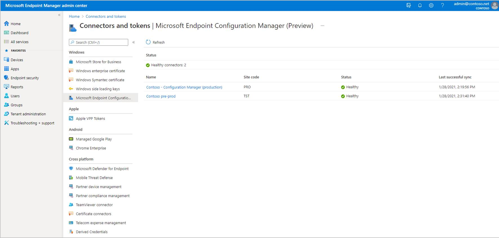
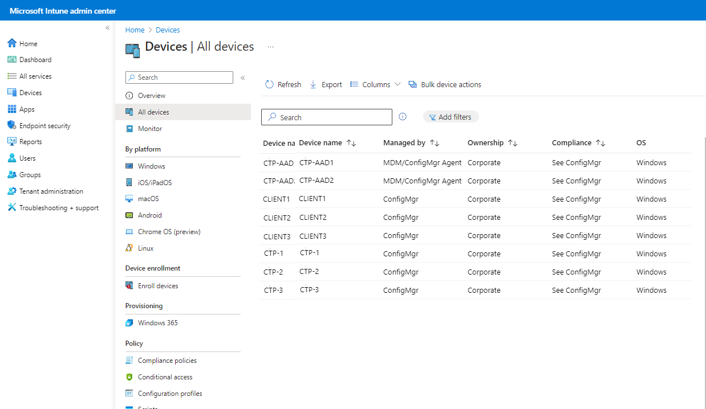
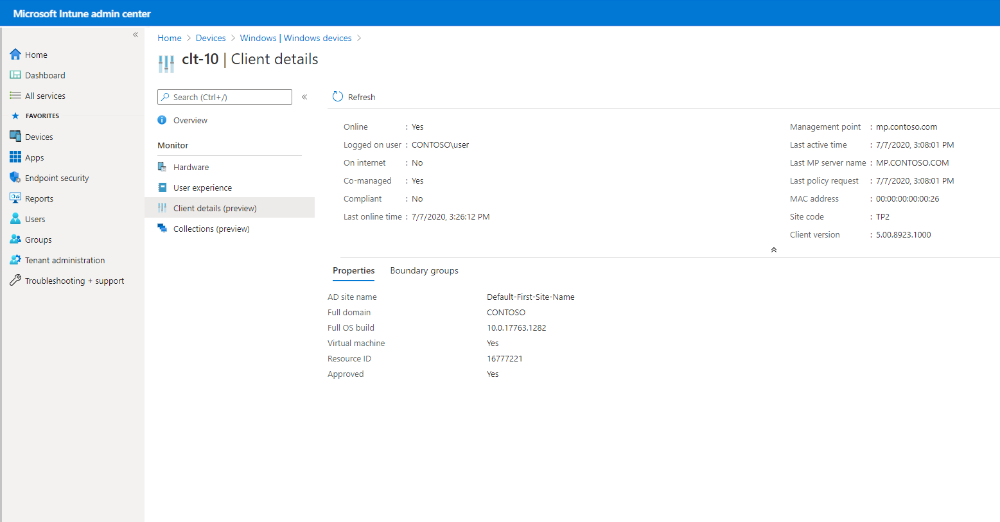
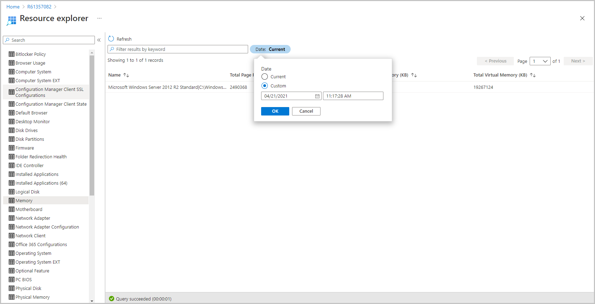
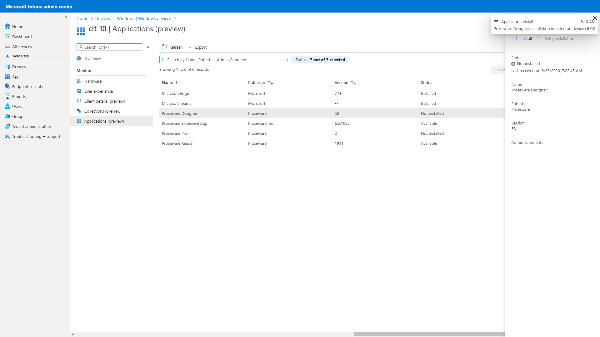
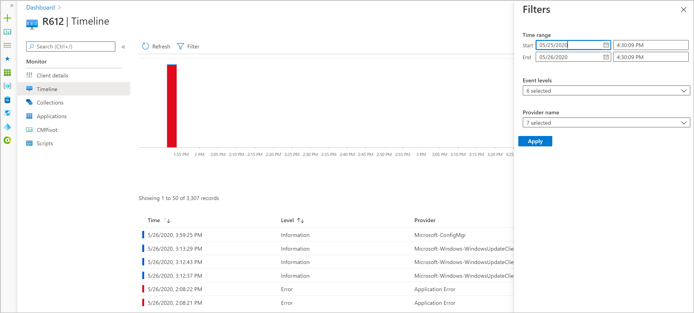

---
# required metadata

title: Use Intune policies with tenant attached Configuration Manager devices | Microsoft Docs
description: Configure tenant attach of Configuration Manager devices to the Microsoft Intune admin center so you can deploy supported policies from Microsoft Intune to those devices. 
keywords:
author: brenduns
ms.author: brenduns
manager: dougeby
ms.date: 03/16/2021
ms.topic: how-to
ms.service: microsoft-intune
ms.subservice: protect
ms.localizationpriority: medium
ms.technology:

# optional metadata
 
#ROBOTS:
#audience:
#ms.devlang:
ms.suite: ems
search.appverid: MET150
#ms.tgt_pltfrm:
ms.custom: intune-azure
ms.collection:
- tier2
- M365-identity-device-management
ms.reviewer: mattsha

---

# Configure tenant attach to support endpoint security policies from Intune

When you use the Configuration Manager tenant attach scenario, you can deploy endpoint security policies from Intune to devices you manage with Configuration Manager. To use this scenario, you must first configure tenant attach for Configuration Manager and enable collections of devices from Configuration Manager for use with Intune. After collections are enabled for use, you use the Microsoft Intune admin center to create and deploy policies.

## Requirements to use Intune policy for tenant attach

To support using Intune endpoint security policies with Configuration Manager devices, your Configuration Manager environment requires the following configurations. [Configuration guidance](#set-up-configuration-manager-to-support-intune-policies) is provided in this article:

### General requirements for tenant attach

- **Configure tenant attach** - With the *tenant attach* scenario, you synchronize devices from Configuration Manager to the Microsoft Intune admin center. You can then use the admin center to deploy supported policies to those collections.

  Tenant attach is often configured with co-management, but you can configure tenant attach on its own.

- **Synchronize Configuration Manager devices and collections** – After you configure tenant attach, you can select the Configuration Manager devices to synchronize with Microsoft Intune admin center. You can also return later to modify the devices you sync.

  After selecting devices to synchronize, you must *enable* collections for use with endpoint security policies from Intune. Supported policies for Configuration Manager devices can only be assigned to collections you've *enabled*.

- **Permissions to Azure AD** - To complete setup of tenant attach, you'll need an account with Global Administrator permissions to your Azure subscription.

- **Tenant for Microsoft Defender for Endpoint** – Your Microsoft Defender for Endpoint tenant must be integrated with your Microsoft Intune tenant (Microsoft Intune Plan 1 subscription).  See [Use Microsoft Defender for Endpoint](advanced-threat-protection.md) in the Intune documentation.

### Configuration Manager version requirements for Intune endpoint security policies

[!INCLUDE [Antivirus policy prerequisites](../includes/tenant-attach-antivirus-prerequisites.md)]

[!INCLUDE [endpoint detection and response policy prerequisites](../includes/tenant-attach-edr-prerequisites.md)]

[!INCLUDE [Firewall policy prerequisites](../includes/tenant-attach-firewall-prerequisites.md)]

## Set up Configuration Manager to support Intune policies

Before you deploy Intune policies to Configuration Manager devices, complete the configurations detailed in the following sections. These configurations onboard your Configuration Manager devices with Microsoft Defender for Endpoint, and enable them to work with the Intune policies.

The following tasks are completed in the Configuration Manager console. If you're not familiar with Configuration Manager, work with a Configuration Manager admin to complete these tasks.

1. [Confirm your Configuration Manager environment](#task-1-confirm-your-configuration-manager-environment)
2. [Configure tenant attach and synchronize devices](#task-2-configure-tenant-attach-and-synchronize-devices)
4. [Select devices to synchronize](#task-3-select-devices-to-synchronize)
5. [Enable collections for endpoint security policies](#task-4-enable-collections-for-endpoint-security-policies)

> [!TIP]
> To learn more about using Microsoft Defender for Endpoint with Configuration Manager, see the following articles in the Configuration Manager content:
>
> - [Onboard Configuration Manager clients to Microsoft Defender for Endpoint via the Microsoft Intune admin center](../../configmgr/core/get-started/2020/technical-preview-2003.md#bkmk_atp)
> - [Microsoft Intune tenant attach: Device sync and device actions](../../configmgr/core/get-started/2020/technical-preview-2002-2.md#bkmk_attach)

### Task 1: Confirm your Configuration Manager environment

Intune policies for Configuration Manager devices require different minimum versions of Configuration Manager, depending on when the policy was first released. Review the [Configuration Manager version requirements for Intune endpoint security policies](#configuration-manager-version-requirements-for-intune-endpoint-security-policies) found earlier in this article to ensure your environment supports the policies you plan to use. A more recent version of Configuration Manager will support policies that require an earlier version.

When a Configuration Manager hotfix is necessary, you can find the hotfix as an in-console update for Configuration Manager. For more information see [Install in-console updates](../../configmgr/core/servers/manage/install-in-console-updates.md) in the Configuration Manager documentation.

After installing necessary updates, return here to continue configuring your environment to support endpoint security policies from the Microsoft Intune admin center.

### Task 2: Configure tenant attach and synchronize devices

With Tenant attach you specify collections of devices from your Configuration Manager deployment to synchronize with the Microsoft Intune admin center. After collections synchronize, use the admin center to view information about those devices and to deploy endpoint security policy from Intune to them.

For more information about the tenant attach scenario, see [Enable tenant attach](../../configmgr/tenant-attach/device-sync-actions.md) in the Configuration Manager content.

#### Enable tenant attach when co-management hasn't been enabled

> [!TIP]
> You use the **Co-management Configuration Wizard** in the Configuration Manager console to enable tenant attach, but you don't need to enable co-management.
>
> If you plan to enable co-management, be familiar with co-management, its prerequisites, and how to manage workloads before you continue. See [What is co-management?](../../configmgr/comanage/overview.md) in the Configuration Manager documentation.

1. In the Configuration Manager admin console, go to **Administration** > **Overview** > **Cloud Services** > **Co-management**.
2. In the ribbon, click **Configure co-management** to open the wizard.
3. On the **Tenant onboarding** page, select **AzurePublicCloud** for your environment. Azure Government cloud isn't supported.
   1. Click **Sign In**. Use your *Global Administrator* account to sign in.

   2. Ensure the option **Upload to Microsoft Intune admin center** is selected on the **Tenant onboarding** page.

   3. Remove the check from **Enable automatic client enrollment for co-management**.

      When this option is selected, the Wizard presents additional pages to complete the setup of co-management. For more information, see [Enable co-management](../../configmgr/comanage/how-to-enable.md) in the Configuration Manager content.

     

4. Click **Next** and then **Yes** to accept the **Create AAD Application** notification. This action provisions a service principal and creates an Azure AD application registration to facilitate the sync of collections to the Microsoft Intune admin center.

5. On the **Configure upload** page, configure which collections of devices you want to sync.
   You can limit your configuration to device collections or use the recommended device upload setting for **All my devices managed by Microsoft Endpoint Configuration Manager**.

   > [!TIP]
   > You can skip selecting collections now, and later use the information in the following task, Task 3,  to configure which collections of devices to synchronize with the Microsoft Intune admin center.

6. Click **Summary** to review your selection, then click **Next**.

7. When the wizard is complete, click **Close**.

   Tenant attach is now configured, and selected devices sync to Microsoft Intune admin center.

#### Enable tenant attach when you already use co-management

1. In the Configuration Manager admin console, go to **Administration** > **Overview** > **Cloud Services** > **Co-management**.

2. Right-click your co-management settings and select **Properties**.

3. In the **Configure upload** tab, select **Upload to Microsoft Intune admin center**. Click **Apply**.

   The default setting for device upload is **All my devices managed by Microsoft Endpoint Configuration Manager**. You can also choose to limit your configuration to one or few device collections.

   

4. Sign in with your *Global Administrator* account when prompted.

5. Click **Yes** to accept the **Create AAD Application** notification. This action provisions a service principal and creates an Azure AD application registration to facilitate the sync.

6. Click **OK** to exit the co-management properties if you're done making changes. Otherwise move to Task 3 to selectively enable device upload to the Microsoft Intune admin center.

   Tenant attach is now configured, and selected devices sync to Microsoft Intune admin center.

### Task 3: Select devices to synchronize

When tenant attach is configured, you can select devices to sync. If you haven't already synchronized devices or need to reconfigure which ones you do sync, you can edit the properties of co-management in the Configuration Manager console to do so.

#### Select devices to upload

1. In the Configuration Manager admin console, go to **Administration** > **Overview** > **Cloud Services** > **Co-management**.

2. Right-click your co-management settings and select **Properties**.

3. In the **Configure upload** tab, select **Upload to Microsoft Intune admin center**. Click **Apply**.

   The default setting for device upload is **All my devices managed by Microsoft Endpoint Configuration Manager**. You can also choose to limit your configuration to one or few device collections.

### Task 4: Enable collections for endpoint security policies

After you configure devices to sync to Microsoft Intune admin center, you must enable collections to work with endpoint security policies. When you enable collections of devices to work with endpoint security policies from Intune, you're making the configured collections available to be targeted with endpoint security policies.

#### Enable collections for use with endpoint security policies

[!INCLUDE [Enable endpoint security policies for a Configuration Manager collection](includes/make-configmgr-collection-available-edr.md)]

## Display the connector status

The Configuration Manager connector provides details about your Configuration Manager implementation. From the Microsoft Intune admin center, you can review details about the Configuration Manager connector, such as the last successful synchronization time and the connection status. 

To display the Configuration Manager connector status:

1. Sign in to [Microsoft Intune admin center](https://go.microsoft.com/fwlink/?linkid=2109431).
2. Select **Tenant administration** > **Connectors and tokens** > **Microsoft Endpoint Configuration Manager**. Select a Configuration Manager hierarchy running version 2006, or later to display additional information about it.
   
   

   > [!NOTE]
   > Some information isn't available if the hierarchy is running Configuration Manager version 2006 or earlier.

Once you confirm your connection to Configuration Manager from Microsoft Intune is **Healthy**, you'll have successfully attached your tenant to Configuration Manager.

## View on-premises device details

You can see Configuration Manager client details including collections, boundary group membership, and client information for a specific device in the Microsoft Intune admin center.

### View client details based on device

Use the following steps to view client details for a specific device:

1. In a browser, navigate to [Microsoft Intune admin center](https://go.microsoft.com/fwlink/?linkid=2109431).
2. Click **Devices** > **All Devices**. 
   You'll see **ConfigMgr** in the **Managed by** column for devices that have been uploaded using tenant attach.

   

3. Select a device that is synced from Configuration Manager via tenant attach.
4. Click **Client details** to see additional details.

   Once an hour, the following fields are updated:
      - Last policy request
      - Last active time
      - Management point

   

5. Click **Collections** to list the client's [collections](/mem/configmgr/core/clients/manage/collections/introduction-to-collections). 
   Collections help you organize resources into manageable units.

   

### View a list of devices based on user

Use the following steps to view a list of devices that belong to a user:

1. In a browser, navigate to [Microsoft Intune admin center](https://go.microsoft.com/fwlink/?linkid=2109431).
2. Click **Troubleshooting + support** > **Troubleshoot** > **Select user**. 
   If you already have a displayed user, you choose **Change user** to select a different user.
3. Search for or click on a listed user. Then, click **Select**.

   The **Devices** table lists the Configuration Manager devices associated with the user. 

For more information about viewing client details and tenant attach, see [Tenant attach: ConfigMgr client details in the admin center](/mem/configmgr/tenant-attach/client-details).

## View on-premises device data

From the Microsoft Intune admin center, you can view hardware inventory for uploaded Configuration Manager devices by using resource explorer.

To view device data from the resource explorer:

1. In a browser, navigate to [Microsoft Intune admin center](https://go.microsoft.com/fwlink/?linkid=2109431).
2. Click **Devices** > **All Devices**.
3. Select a device that is synced from Configuration Manager via tenant attach. 
   You can recognize devices that have been synced via tenant attach because **ConfigMgr** will be listed in the **Managed by** column for the device. Devices can also be listed as **Co-managed** when both Configuration Manager and Intune apply, or as **Intune** when only Intune management applies.
4. Click **Resource explorer** to view hardware inventory.
5. Search for or select a class (a device value) to retrieve information from the client.

   

Resource explorer can display a historical view of the device inventory in the Microsoft Intune admin center. When troubleshooting, having historical inventory data can provide valuable information about changes to the device.

1. From the Microsoft Intune admin center, select **Resource explorer** if you don't have it selected already.
2. Select a class (a device value).
3. Enter a custom date in the date time picker to get historical inventory data.

   

4. Close resource explorer and return to the device information by clicking the `X` icon in the top right of resource explorer.

   

For more information about viewing device data for tenant attach devices, see [Tenant attach: Resource explorer in the admin center](/mem/configmgr/tenant-attach/resource-explorer).

## View on-premises app management

From the Microsoft Intune admin center, you can initiate an application install in real time for a tenant attached device. You can deploy an application to a device or user. Also, you can repair, re-evaluate, reinstall, or uninstall an application.

Use the following steps to install an application to an on-premises device:

1. In a browser, navigate to [Microsoft Intune admin center](https://go.microsoft.com/fwlink/?linkid=2109431).
2. Click **Devices** > **All Devices**.
3. Select a device that is synced from Configuration Manager via tenant attach. 
   As noted before, you can recognize devices that have been synced via tenant attach because **ConfigMgr** will be listed in the **Managed by** column for the device. Devices can also be listed as **Co-managed** when both Configuration Manager and Intune apply, or as **Intune** when only Intune management applies.
4. Click **Applications** to view a list of applicable apps.
5. Select an application that hasn't been installed and click **Install**.

   

For more information about applications and tenant attach, see [Tenant attach: Install an application from the admin center](/mem/configmgr/tenant-attach/applications).

## View on-premises scripts

You can run PowerShell scripts from the cloud against an individual Configuration Manager managed device in real time. You can also allow additional personas, like Helpdesk, to run PowerShell scripts. This gives all the traditional benefits of PowerShell scripts that have already been defined and approved by the Configuration Manager admin to this new environment.

1. In a browser, navigate to [Microsoft Intune admin center](https://go.microsoft.com/fwlink/?linkid=2109431).
2. Click **Devices** > **All Devices**.
3. Select a device that is synced from Configuration Manager via tenant attach. 
   As noted before, you can recognize devices that have been synced via tenant attach because **ConfigMgr** will be listed in the **Managed by** column for the device. Devices can also be listed as **Co-managed** when both Configuration Manager and Intune apply, or as **Intune** when only Intune management applies.
4. Click **Scripts** to view a list of available scripts.

   Scripts that were recently run that directly targeted the device will already be listed. The list includes scripts run from the admin center, SDK, or the Configuration Manager console. Scripts initiated from the Configuration Manager console against collections containing the device won't be shown, unless the scripts were also initiated specifically for the single device.

   

For more information about running scripts on tenant attached devices, see [Tenant attach: Run Scripts from the admin center](/mem/configmgr/tenant-attach/scripts).

## View on-premises device event timeline

When Configuration Manager synchronizes a device to Microsoft Intune through tenant attach, you can see a timeline of events for those devices within Microsoft Intune admin center. This timeline shows past activity on the device that can help you troubleshoot problems.

Once a day Configuration Manager sends the on-premises device events to the Microsoft Intune admin center. Only events collected after the client receives the **Enable Endpoint analytics data collection** policy are visible in the admin center. You can generate test events easily by installing an application or an update from Configuration Manager, or restart the device. Events are kept for 30 days.

> [!NOTE]
> As a [prerequisite](/mem/configmgr/tenant-attach/timeline#prerequisites) to view the timeline from the Microsoft Intune admin center, you must set **Enable Endpoint analytics data collection** to **Yes** in Configuration Manager. For more information about implementing the device timeline, see [Tenant attach: Device timeline in the admin center](/mem/configmgr/tenant-attach/timeline).

To view the device event timeline:

1. In a browser, navigate to [Microsoft Intune admin center](https://go.microsoft.com/fwlink/?linkid=2109431).
2. Click  **Devices** > **All Devices**.
3. Select a device that is synced from Configuration Manager via tenant attach. 
   As noted before, you can recognize devices that have been synced via tenant attach because **ConfigMgr** will be listed in the **Managed by** column for the device. Devices can also be listed as **Co-managed** when both Configuration Manager and Intune apply, or as **Intune** when only Intune management applies.
4. Click **Timeline**. By default, you're shown events from the last 24 hours.
   - Select **Sync** to fetch the recent data generated on client. The device sends events once a day to the admin center by default.
   - Use the **Filter** button to change the **Time range**, **Event levels**, and **Provider name**.
   - If you select an event, you'll see the detailed message for it.
   - Select **Refresh** to reload the page and to see newly collected events.

   

For more information about viewing device events for tenant attached devices, see [Tenant attach: Device timeline in the admin center](/mem/configmgr/tenant-attach/timeline).

## Next steps

- [Configure Endpoint security policies](endpoint-security-policy.md#create-an-endpoint-security-policy) for *Antivirus*, *Firewall*, and *Endpoint detection and response*.

- Learn more about [Microsoft Defender for Endpoint](/windows/security/threat-protection/microsoft-defender-atp/overview-endpoint-detection-response).
