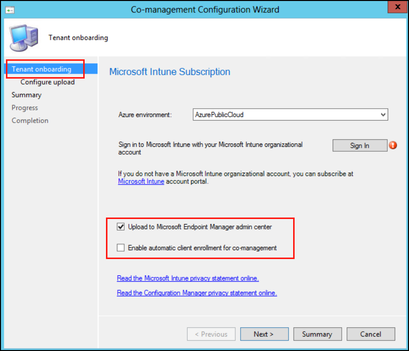
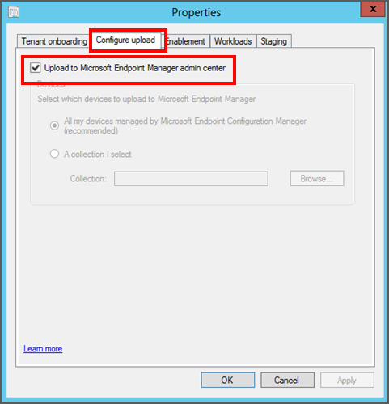
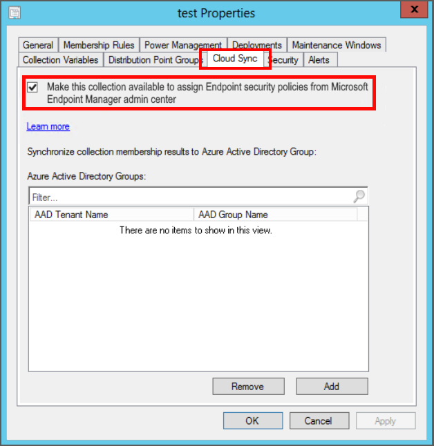

---
# required metadata

title: Use Intune policies with tenant attached Configuration Manager devices | Microsoft Docs
description: Configure tenant attach of Configuration Manager devices to the Microsoft Endpoint Manager admin center so you can deploy supported policies from Microsoft Intune to those devices. 
keywords:
author: brenduns
ms.author: brenduns
manager: dougeby
ms.date: 06/25/2020
ms.topic: how-to
ms.service: microsoft-intune
ms.subservice: protect
ms.localizationpriority: medium
ms.technology:

# optional metadata

#ROBOTS:
#audience:
#ms.devlang:
ms.suite: ems
search.appverid: MET150
#ms.tgt_pltfrm:
ms.custom: intune-azure
ms.collection: M365-identity-device-management
ms.reviewer: mattsha

---

# Configure tenant attach to support endpoint security policies from Intune

When you use the Configuration Manager tenant attach scenario, you can deploy endpoint security policies from Intune to devices you manage with Configuration Manager. To use this scenario, you must first configure tenant attach for Configuration Manager and enable collections of devices from Configuration Manager for use with Intune. After collections are enabled for use, you use the Microsoft Endpoint Manager admin center to create and deploy policies.

The following policy types are supported by Configuration Manager devices that are tenant attached:

- Endpoint security Antivirus policy
- Endpoint security Endpoint detection ad response policy

## Requirements to use Intune policy for tenant attach

To support using Intune endpoint security policies with Configuration Manager devices, your Configuration Manager environment requires the following configurations. [Configuration guidance](#set-up-configuration-manager-to-support-intune-policies) is provided in this article:

### General requirements for tenant attach

- **Configure Tenant attach** - With the *tenant attach* scenario, you synchronize collections of devices from Configuration Manager to the Microsoft Endpoint Manager admin center. You can then use the admin center to deploy supported policies to those collections.

  Tenant attach is often configured with co-management, but you can configure tenant attach on its own.

- **Synchronize Configuration Manager collections** – When you configure tenant attach, you can select the Configuration Manager device collections to synchronize with Microsoft Endpoint Manager admin center. You can also return later to modify the device collections you sync. Supported policies for Configuration Manager devices can only be assigned to collections you’ve synchronized.

  After selecting collections to synchronize, you must enable them for use with endpoint security policies from Intune.

- **Permissions to Azure AD** - To complete setup of tenant attach, you’ll need an account with Global Administrator permissions to your Azure subscription.

### Specific requirements for Intune endpoint security policies

- **Antivirus policy**:

  - **Configuration Manager** - The following environments are supported:

    - **Configuration Manager technical preview 2006 or later** - Support for Intune antivirus policies was added with this technical preview version.

  - **Tenant for Microsoft Defender Advanced Threat Protection** – Your Microsoft Defender ATP tenant must be integrated with your Microsoft Endpoint Manager tenant (Intune subscription).  See [Use Microsoft Defender ATP](advanced-threat-protection.md) in the Intune documentation.

- **Endpoint detection and response policy**:

  - **Configuration Manager** - The following environments are supported:

    - **Configuration Manager technical preview 2005 or later** - Support for Intune Endpoint detection and response policies was added with this technical preview version.

    - **Configuration Manager current branch version 2002 or later** - If you use Configuration Manager with version 2002 you must install the in-console update **Configuration Manager 2002 Hotfix (KB4563473)**. This update enables support in Configuration Manager 2002 for using endpoint security policies.

  - **Tenant for Microsoft Defender Advanced Threat Protection** – Your Microsoft Defender ATP tenant must be integrated with your Microsoft Endpoint Manager tenant (Intune subscription).  See [Use Microsoft Defender ATP](advanced-threat-protection.md) in the Intune documentation.

## Set up Configuration Manager to support Intune policies

Before you deploy Intune policies to Configuration Manager devices, complete the configurations detailed in the following sections. These configurations onboard your Configuration Manager devices with Microsoft Defender ATP, and enable them to work with the Intune policies.

The following tasks are completed in the Configuration Manager console. If you’re not familiar with Configuration Manager, work with a Configuration Manager admin to complete these tasks.

1. [Install the update for Configuration Manager](#task-1-install-the-update-for-configuration-manager)
2. [Enable tenant attach](#task-2-configure-tenant-attach-and-synchronize-collections)  
3. [Select collections to synchronize](#task-3-select-collections-to-synchronize)
4. [Enable collections to support Intune policies](#task-4-enable-collections-for-endpoint-security-policies)

> [!TIP]
> To learn more about using Microsoft Defender ATP with Configuration Manager, see the following articles in the Configuration Manager content:
>
> - [Onboard Configuration Manager clients to Microsoft Defender ATP via the Microsoft Endpoint Manager admin center](../../configmgr/core/get-started/2020/technical-preview-2003.md#bkmk_atp)
> - [Microsoft Endpoint Manager tenant attach: Device sync and device actions](../../configmgr/core/get-started/2020/technical-preview-2002-2.md#bkmk_attach)

### Task 1: Install the update for Configuration Manager

If you use Configuration Manager current branch version 2002, install the following in-console update that adds support for the endpoint security policies you deploy from the Microsoft Endpoint Manager admin center.

**Update details**:

- **Configuration Manager 2002 Hotfix (KB4563473)**

To install this update, follow the guidance from [Install in-console updates](../../configmgr/core/servers/manage/install-in-console-updates.md) in the Configuration Manager documentation.

After installing the update, return here to continue configuring your environment to support endpoint security policies from the Microsoft Endpoint Manager admin center.

### Task 2: Configure tenant attach and synchronize collections

With Tenant attach you specify collections of devices from your Configuration Manager deployment to synchronize with the Microsoft Endpoint Manager admin center. After collections synchronize, use the admin center to view information about those devices and to deploy endpoint security policy from Intune to them.

For more information about the tenant attach scenario, see [Enable tenant attach](../../configmgr/tenant-attach/device-sync-actions.md) in the Configuration Manager content.

#### Enable tenant attach when co-management hasn’t been enabled

> [!TIP]
> You use the **Co-management Configuration Wizard** in the Configuration Manager console to enable tenant attach, but you don’t need to enable co-management.
>
> If you plan to enable co-management, be familiar with co-management, its prerequisites, and how to manage workloads before you continue. See [What is co-management?](../../configmgr/comanage/overview.md) in the Configuration Manager documentation.

1. In the Configuration Manager admin console, go to **Administration** > **Overview** > **Cloud Services** > **Co-management**.
2. In the ribbon, click **Configure co-management** to open the wizard.
3. On the **Tenant onboarding** page, select **AzurePublicCloud** for your environment. Azure Government cloud isn't supported.
   1. Click **Sign In**. Use your *Global Administrator* account to sign in.

   2. Ensure the option **Upload to Microsoft Endpoint Manager admin center** is selected on the **Tenant onboarding** page.

   3. Remove the check from **Enable automatic client enrollment for co-management**.

      When this option is selected, the Wizard presents additional pages to complete the setup of co-management. For more information, see [Enable co-management](../../configmgr/comanage/how-to-enable.md) in the Configuration Manager content.

     

4. Click **Next** and then **Yes** to accept the **Create AAD Application** notification. This action provisions a service principal and creates an Azure AD application registration to facilitate the sync of collections to the Microsoft Endpoint Manager admin center.

5. On the **Configure upload** page, configure which collections you want to sync.
   You can limit your configuration to one or  few device collections or use the recommended device upload setting for **All my devices managed by Microsoft Endpoint Configuration Manager**.

   > [!TIP]
   > You can skip selecting collections now, and later use the information in the following task, Task 3,  to configure which collections synchronize with the Microsoft Endpoint Manager admin center.

6. Click **Summary** to review your selection, then click **Next**.

7. When the wizard is complete, click **Close**.

   Tenant attach is now configured, and selected collections sync to Microsoft Endpoint Manager admin center.

#### Enable tenant attach when you already use co-management

1. In the Configuration Manager admin console, go to **Administration** > **Overview** > **Cloud Services** > **Co-management**.

2. Right-click your co-management settings and select **Properties**.

3. In the **Configure upload** tab, select **Upload to Microsoft Endpoint Manager admin center**. Click **Apply**.

   The default setting for device upload is **All my devices managed by Microsoft Endpoint Configuration Manager**. You can also choose to limit your configuration to one or few device collections.

   

   > [!TIP]
   > You can skip selecting collections now, and later use the information in the following task, Task 3,  to configure which collections synchronize with the Microsoft Endpoint Manager admin center.

4. Sign in with your *Global Administrator* account when prompted.

5. Click **Yes** to accept the **Create AAD Application** notification. This action provisions a service principal and creates an Azure AD application registration to facilitate the sync.

6. Click **OK** to exit the co-management properties once you've done making changes.

   Tenant attach is now configured, and selected collections sync to Microsoft Endpoint Manager admin center.

### Task 3: Select collections to synchronize

When tenant attach is configured, you can select collections to sync. If you haven't already synchronize collections or need to reconfigure which ones you do sync, you can edit the properties of co-management in the Configuration Manager console to do so.

#### Select collections

1. In the Configuration Manager admin console, go to **Administration** > **Overview** > **Cloud Services** > **Co-management**.

2. Right-click your co-management settings and select **Properties**.

3. In the **Configure upload** tab, select **Upload to Microsoft Endpoint Manager admin center**. Click **Apply**.

   The default setting for device upload is **All my devices managed by Microsoft Endpoint Configuration Manager**. You can also choose to limit your configuration to one or few device collections.

### Task 4: Enable collections for endpoint security policies

After you configure collections to sync to Microsoft Endpoint Manager admin center, enable those collections to work with endpoint security policies. When you enable collections of devices to work with endpoint security policies from Intune, you're configuring devices in those collections to onboard with Microsoft Defender ATP.

#### Enable collections for use with endpoint security policies

1. From a Configuration Manager console connected to your top-level site, right-click on a device collection that you synchronize to Microsoft Endpoint Manager admin center and select **Properties**.

2. On the **Cloud Sync** tab, enable the option to **Make this collection available to assign Endpoint security policies from Microsoft Endpoint Manager admin center**.

    You can't select this option if your Configuration Manager hierarchy isn't tenant attached.
  
   

3. Select **OK** to save the configuration.

   Devices in this collection can now onboard with Microsoft Defender ATP, and support use of Intune endpoint security policies.

## Next steps

- [Configure Endpoint security policies](endpoint-security-policy.md#create-an-endpoint-security-policy) for *Antivirus* and *Endpoint detection and response*.

- Learn more about [endpoint detection and response](https://docs.microsoft.com/windows/security/threat-protection/microsoft-defender-atp/overview-endpoint-detection-response) in the Microsoft Defender ATP documentation.
