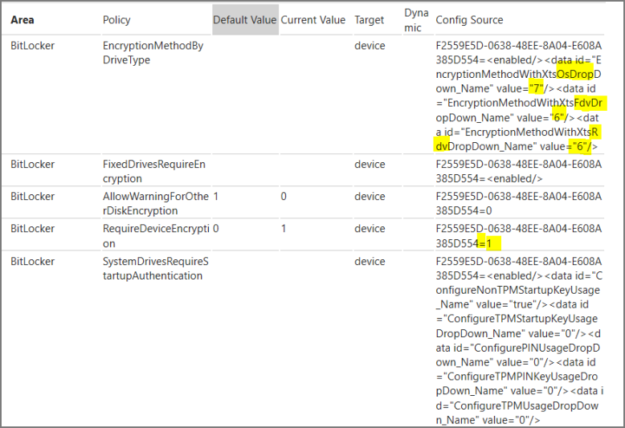
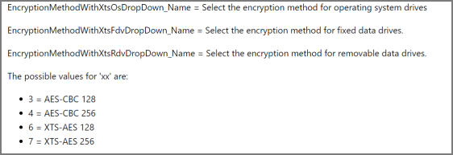
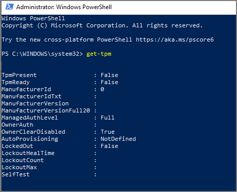

---
# required metadata

title: Troubleshooting tips for BitLocker policies in Microsoft Intune
titleSuffix: Microsoft Intune
description: Describes how to enable BitLocker encryption on a device by using Intune policy and how to verify that your policy successfully deployed to a device. 
author: brenduns
ms.author: brenduns
manager: dougeby
ms.date: 01/29/2020
ms.topic: troubleshooting
ms.service: microsoft-intune
ms.subservice: protect
ms.localizationpriority: medium
ms.technology:
ms.assetid:

# optional metadata

#ROBOTS:

#audience:

#ms.reviewer:  
ms.suite: ems
search.appverid: MET150
#ms.tgt_pltfrm:
ms.custom: intune-azure
ms.collection: M365-identity-device-management
--- 


# Troubleshoot BitLocker policies in Microsoft Intune

This article can help Intune administrators understand how Windows 10 devices configure BitLocker based on Intune policy. This article also provides guidance on how to troubleshoot problems with BitLocker settings on devices you manage with Intune.  

## Understanding BitLocker

BitLocker drive encryption is a service offered by Microsoft Windows operating systems that allows users to encrypt data on their hard drives. BitLocker supports encryption for operating system drives, removable media drives, and fixed data drives. BitLocker also supports use of 256-bit encryption for better protection of sensitive data.  

With Microsoft Intune, you have the following methods to manage BitLocker on Windows 10 devices:

- **Device Configuration policies** - Certain built-in policy options are available in Intune when you create a device configuration profile to manage endpoint protection. To find these options, [create a device profile for endpoint protection](endpoint-protection-configure.md#create-a-device-profile-containing-endpoint-protection-settings), selecting **Windows 10 and later** for the *Platform*, and then selecting the **Windows Encryption** category for *Settings*. 

   You can read about the available options and features here: [Windows Encryption](https://docs.microsoft.com/intune/endpoint-protection-windows-10#windows-encryption).

- **Security baselines** - [Security baselines](security-baselines.md) are known groups of settings and default values that are recommended by the relevant security team to help secure Windows devices. Different baseline sources, like the *MDM Security Baseline* or *Microsoft Defender ATP Baseline* can manage the same settings as well different settings than each other. They can also manage the same settings you manage with device configuration policies. 

In addition to Intune, for hardware that is compliant with Modern Standby and HSTI, when using either of these features, BitLocker Device Encryption is automatically turned on whenever the user joins a device to Azure AD. Azure AD provides a portal where recovery keys are also backed up, so users can retrieve their own recovery key for self-service, if required.

It's also possible that BitLocker settings are managed by other means like Group Policy, or manually set by a device user.

No matter how settings are applied to a device, BitLocker policies make use of the [BitLocker CSP](https://docs.microsoft.com/windows/client-management/mdm/bitlocker-csp) to configure encryption on the device. The BitLocker CSP is built into Windows and when Intune deploys a BitLocker policy to an assigned device, it's the BitLocker CSP on the device that writes the appropriate values to the Windows registry so that settings from the policy can take effect.

If you'd like to learn more about BitLocker, see the following resources:

- [BitLocker](https://docs.microsoft.com/windows/security/information-protection/bitlocker/bitlocker-overview)
- [BitLocker Overview and Requirements FAQ](https://docs.microsoft.com/windows/security/information-protection/bitlocker/bitlocker-overview-and-requirements-faq)

Now that you have a general understanding of what these policies do and how they work, look at how you can verify if the BitLocker settings successfully apply to a Windows client.

## Verify the source of BitLocker settings

When you investigate a BitLocker issue on a Windows 10 device, it's important to first determine whether the issue is Intune-related or Windows-related. After the likely source of failure is known, you can then focus your troubleshooting efforts in the right place, and if necessary get support from the correct team.  

As a first step, determine whether the Intune policy successfully deployed to the target device. In the following example, you have a device configuration policy that deploys the Windows Encryption (BitLocker) settings, as shown:


How do you confirm that the settings have been applied to the targeted device? Following are a few ways to do that.

### Device configuration policy device status  

When you use Device Configuration policy to configure BitLocker, you can check the status of the policy in the Intune portal.

1. Sign in to the [Microsoft Endpoint Manager Admin Center](https://go.microsoft.com/fwlink/?linkid=2109431).

2. Select **Devices** > **Configuration profiles** and then select the profile that contains BitLocker settings.

3. After you select the profile you want to view, select **Device Status**. Devices assigned to the profile are listed, and the *Device status* column indicates if a device successfully deployed the profile.

Remember, there can be a delay between a device receiving a BitLocker policy, and the drive being fully encrypted.  

### Use Control Panel on the client  

On a device that has enabled BitLocker and encrypted a drive, you can view the BitLocker status from a devices Control Panel. On the device, open **Control Panel** > **System and Security** > **BitLocker Drive Encryption**. Confirmation appears as seen in the following image.  


### Use a command prompt  

On a device that has enabled BitLocker and encrypted a drive, launch Command Prompt with admin credentials, and then run `manage-bde -status`. The results should resemble the following example:  


In the example:

- **BitLocker protection** is **On**
- **Percentage Encrypted** is **100%**
- **Encryption Method** is **XTS-AES 256**

You can also check **Key Protectors** by running the following command:

```cmd
Manage-bde -protectors -get c:
```

Or with PowerShell:

```powershell
Confirm-SecureBootUEFI
```

### Review the devices registry key configuration

After BitLocker policy successfully deploys to a device, view the following registry key on the device where you can review the configuration of BitLocker settings:  *HKEY_LOCAL_MACHINE\SOFTWARE\Microsoft\PolicyManager\current\device\BitLocker*. Here's an example:


These values are configured by the BitLocker CSP. Verify that the values of the keys match the settings specified in the source of your Intune Windows Encryption policy. For more information on each of these settings, see [BitLocker CSP](https://docs.microsoft.com/windows/client-management/mdm/bitlocker-csp).

> [!NOTE]
> The Windows Event Viewer will also contain various information related to Bitlocker. There are too many to list here but searching for **Bitlocker API** will provide you with a lot of useful information.

### Check the MDM diagnostics report

On a device that has enabled BitLocker, you can generate and view an MDM diagnostic report from the targeted device to confirm that BitLocker policy is present. If you can see the policy settings in the report, it's another indication that the policy successfully deployed. The *Microsoft Helps* video at the following link explains how to capture an MDM diagnostic report from a Windows device.

> [!VIDEO https://www.youtube.com/embed/WKxlcjV4TNE]

When you analyze the MDM diagnostics report, the contents can seem a little confusing at first. Following is an example that shows how to correlate what's in the report with the settings in a policy:



The output result shows the values that correspond to the values from your BitLocker policy:


MDM diagnostics output results:

```asciidoc
EncryptionMethodWithXtsOsDropDown: 7 (The value 7 refers to the 256 bit encryption)
EncryptionMethodWithXtsFdvDropDown: 6 (The value 6 refers to the 128 bit encryption)
EncryptionMethodWithXtsRdvDropDown: 6 (The value 6 refers to the 128 bit encryption)
```

You can reference the [BitLocker CSP documentation](https://docs.microsoft.com/windows/client-management/mdm/bitlocker-csp) to see what each value means. For this example, a snippet is shared in the following image.



Similarly, you can see all the values and verify them from the BitLocker CSP link.

> [!TIP]
> The primary purpose of the MDM diagnostic report is to assist Microsoft Support when troubleshooting issues. If you open a support case for Intune and the problem involves Windows clients, it's always a good idea to gather this report and include it in your support request.

## Troubleshooting BitLocker Policy

You should now have a good idea how to confirm that the BitLocker policy successfully deployed by Intune, which hands-off the configuration of BitLocker to the BitLocker CSP in WIndows.

**Policy fails to reach the device** - When your Intune policy isn't present in any capacity:

- **Is the device properly enrolled into Microsoft Intune?** If not, you'll need to address that before troubleshooting anything specific to the policy. Help with troubleshooting Windows enrollment issues can be found [here](../enrollment/troubleshoot-windows-enrollment-errors.md).

- **Is there an active network connection on the device?** If the device is in airplane mode or turned off, or if the user has the device in a location with no service, the policy won't be delivered or apply until network connectivity is restored.

- **Did the BitLocker policy deploy to the correct user or device group?** Check that the correct user or device is a member of the groups you target.

**Policy is present but not all settings configured successfully** - When your Intune policy reaches the device, but not all configurations are set:

- **Does the deployment of the entire policy fail, or is it only certain settings that don't apply?** If you find yourself faced with a scenario where only some policy settings don't apply, check the following considerations:

  1. **Not all BitLocker settings are supported on all Windows versions**.
     Policy comes down to a device as a single unit, so if some settings apply and others don't, you can be confident that the policy itself is received. In this scenario, it's possible that the version of Windows on the device doesn't support the problematic settings. See [BitLocker CSP](https://docs.microsoft.com/windows/client-management/mdm/bitlocker-csp) in the Windows documentation for details on version requirements for each setting.

  2. **BitLocker isn't supported on all hardware**.
     Even if you have the right version of Windows, it's possible that the underlying device hardware doesn't meet the requirements for BitLocker encryption. You can find the [system requirements for BitLocker](https://docs.microsoft.com/windows/security/information-protection/bitlocker/bitlocker-overview#system-requirements) in the Windows documentation, but the main things to check are that the device has a compatible TPM chip (1.2 or later) and a Trusted Computing Group (TCG)-compliant BIOS or UEFI firmware.
     
**Bitlocker Encryption is not performed silently** - You have configured an Endpoint Protection policy with the setting "Warning for other disk encryption" set to block and the encryption wizard still appears:

- **Confirm the Windows version supports silent encryption** This requires a minimum of version 1803. If the user is not an administator on the device than it requires a minimum version of 1809. Additionally 1809 added support for devices that do not support Modern Standby

**Bitlocker encrypted device shows as Not Compliant for Intune Compliance policies** - The issue occurs when BitLocker encryption isn’t finished. Based on factors such as the disk size, number of files, and BitLocker settings, BitLocker encryption may take a long time. After encryption is complete, the device will be shown as Compliant. Devices can also become temporarily non compliant immediately following a recent installation of WIndows Updates.

**Devices are encrypted using 128 bit algorithim when policy specifices 256 bit** -- By default, Windows 10 will encrypt a drive with XTS-AES 128-bit encryption. See this guide for [Setting 256-bit encryption for BitLocker during Autopilot](https://techcommunity.microsoft.com/t5/intune-customer-success/setting-256-bit-encryption-for-bitlocker-during-autopilot-with/ba-p/323791#).


**Example investigation**

- You deploy a BitLocker policy to a Windows 10 device, and the **Encrypt devices** setting shows a status of **Error** in the portal.

- As the name suggests, this setting allows an administrator to require encryption to be turned on by using *BitLocker > Device Encryption*. Using the troubleshooting tips mentioned earlier, you first check the MDM Diagnostics report. The report confirms that the correct policy was deployed on the device:

  

- You also verify success in the registry:

  

- Next, you check the status of TPM using PowerShell and find that TPM isn't available on the device:

  

- Because BitLocker relies on TPM, you could conclude that BitLocker doesn't fail because of a problem with Intune or the policy, but rather because the device itself doesn't have a TPM chip or TPM is disabled in the BIOS.

  As an additional tip, you can confirm the same in the Windows Event Viewer under **Applications and Services log** > **Microsoft** > **Windows** > **BitLocker API**. In the **BitLocker API** event log, you'll find an Event ID 853 that means TPM isn't available:

  

  > [!NOTE]
  > You can also check the TPM status by running **tpm.msc** on the device.

## Summary

When you troubleshoot BitLocker policy issues with Intune and can confirm that policy reaches the intended device, it's safe to assume the problem isn't directly related to Intune. The problem is more likely an issue with the Windows OS or the hardware. In this case, start looking in other areas like the TPM configuration or UEFI and Secure boot).

## Next steps  

The following are more resources that might help when you work with BitLocker:

- [BitLocker product documentation](https://docs.microsoft.com/windows/security/information-protection/bitlocker/bitlocker-overview)
- [BitLocker system requirements](https://docs.microsoft.com/windows/security/information-protection/bitlocker/bitlocker-overview#system-requirements)
- [BitLocker frequently asked questions](https://docs.microsoft.com/windows/security/information-protection/bitlocker/bitlocker-frequently-asked-questions)
- [BitLocker CSP documentation](https://docs.microsoft.com/windows/client-management/mdm/bitlocker-csp)
- [Intune Windows Encryption policy settings](https://docs.microsoft.com/intune/endpoint-protection-windows-10#windows-encryption)
- [Hardware independent automatic BitLocker encryption using AAD/MDM](https://blogs.technet.microsoft.com/home_is_where_i_lay_my_head/2017/06/07/hardware-independent-automatic-bitlocker-encryption-using-aadmdm/)
- [CSP Policy for BitLocker Encryption on Auto-Pilot Devices](https://techcommunity.microsoft.com/t5/Windows-10-security/CSP-policy-for-bitLocker-encryption-on-autopilot-devices/m-p/284537)
- [Walkthrough creating and deploying BitLocker policy with Intune](https://blogs.technet.microsoft.com/cbernier/2017/07/11/windows-10-intune-windows-bitlocker-management-yes/)
