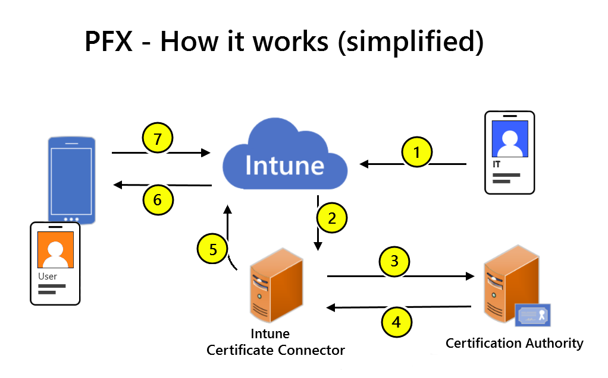
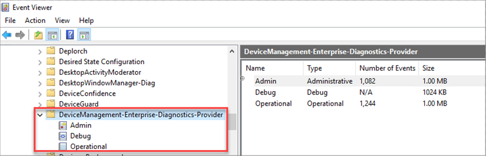
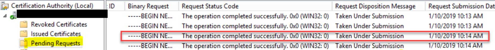
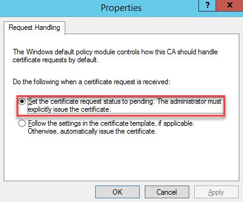
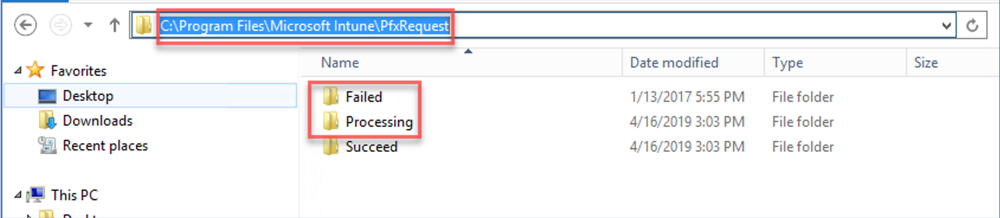
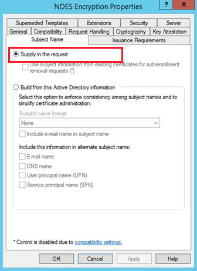

---
# required metadata

title: Troubleshoot use of PKCS certificate profiles to provision certificates with Microsoft Intune | Microsoft Docs
description: Troubleshoot the use of private and public key pair (PKCS) profiles by devices to request certificates for use with Intune.  
keywords:
author: brenduns
ms.author: brenduns
manager: dougeby
ms.date: 05/29/2020
ms.topic: troubleshooting
ms.service: microsoft-intune
ms.subservice: configuration
ms.localizationpriority: high
ms.technology:

# optional metadata

#ROBOTS:
#audience:

ms.reviewer: lacranda
ms.suite: ems
search.appverid: MET150
#ms.tgt_pltfrm:
ms.custom: intune-azure
ms.collection: M365-identity-device-management
---

# Troubleshoot PKCS certificate deployment in Microsoft Intune

The information in this article can help you resolve several common issues when deploying private and public key pair (PKCS) certificates in Microsoft Intune. Before troubleshooting, ensure you’ve completed the following tasks as found in [Configure and use PKCS certificates with Intune](../protect/certficates-pfx-configure.md#export-the-root-certificate-from-the-enterprise-ca):

- Review the [requirements for using PKCS certificate profiles](../intune/protect/certficates-pfx-configure.md#requirements)
- Export the root certificate from the Enterprise Certification Authority (CA)
- Configure certificate templates on the certification authority
- Install and configure the Intune Certificate Connector
- Create and deploy a trusted certificate profile to deploy the root certificate
- Create and deploy a PKCS certificate profile

The most common source of problems for PKCS certificate profiles has been with the configuration of the PKCS certificate profile. Review the profiles configuration and look for typos in server names or fully qualified domain names (FQDNs), and confirm the **Certificate Authority** and **Certificate Authority Name** are correct.

- **Certification Authority**: The internal FQDN of the Certificate Authority computer. For example, server1.domain.local.
- **Certification Authority Name**: The Certificate Authority Name as displayed in the certification authority MMC. Look under **Certification Authority (Local)**

You can use the [certutil command-line program](https://docs.microsoft.com/windows-server/administration/windows-commands/certutil) on the CA to confirm the correct name for the Certification Authority and Certification Authority Name.

## PKCS communication overview

The following graphic provides a basic overview of the PKCS certificate deployment process in Intune.

> [!div class="mx-imgBorder"]
> 

1. An Admin creates a PKCS certificate profile in Intune.
2. The Intune service requests that the on-premises Intune Certificate Connector create a new certificate for the user.
3. The Intune Certificate Connector sends a PFX Blob and Request to your Microsoft Certification Authority.
4. The Certification Authority issues and sends the PFX User Certificate back to the Intune Certificate Connector.
5. The Intune Certificate Connector uploads the encrypted PFX User Certificate to Intune.
6. Intune decrypts the PFX User Certificate and re-encrypts for the device using the Device Management Certificate.  Intune then sends the PFX User Certificate to the Device.
7. The device reports the certificate status to Intune.

## Data and Log files

To identify problems for the communication and certificate provisioning workflow, review log files from both the Server infrastructure, and from devices. Later sections for troubleshooting PKCS certificate profiles refer to log files referenced in this section.

- [Infrastructure and Server logs](#logs-for-on-premises-infrastructure)

Device logs depend on the device platform:

- [iOS and iPadOS](#logs-for-ios-and-ipados-devices)
- [Android](#logs-for-android-devices)
- [Windows](#logs-for-windows-devices)

### Logs for on-premises infrastructure
  
On-premises infrastructure that supports use of PKCS certificate profiles for certificate deployments includes the Microsoft Intune Certificate Connector, NDES that runs on a Windows Server, and the certification authority.

Log files for these roles include Windows Event Viewer, Certificate consoles, and various log files specific to the Intune Certificate Connector, NDES, or other role and operations that are part of the on-premises infrastructure.

- **NDESConnector_date_time.svclog**:

  This log shows communication from the Microsoft Intune Certificate Connector to the Intune cloud service. You can use the [Service Trace Viewer Tool](https://docs.microsoft.com/dotnet/framework/wcf/service-trace-viewer-tool-svctraceviewer-exe) to view this log file.

  Related registry key: *HKLM\SW\Microsoft\MicrosoftIntune\NDESConnector\ConnectionStatus*

  Location: On the server that hosts NDES at *%program_files%\Microsoft intune\ndesconnectorsvc\logs\logs*

- **CertificateRegistrationPoint_date_time.svclog**:

  This log shows the NDES policy module receiving and verifying certificate requests. You can use the [Service Trace Viewer Tool](https://docs.microsoft.com/dotnet/framework/wcf/service-trace-viewer-tool-svctraceviewer-exe) to view this log file.

  Location: On the server that hosts NDES at *%program_files%\Microsoft intune\ndesconnectorsvc\logs\logs*

- **NDESPlugin.log**:

  This log shows the passing of certificate requests to the Certificate Registration Point, and the resulting verification of those requests.

  Location: On the server that hosts NDES at *%program_files%\Microsoft Intune\NDESPolicyModule\logs*

- **Windows Application log**:

  Location: On the server that hosts NDES: Run **eventvwr.msc** to open Windows Event Viewer

### Logs for Android devices

For devices that run Android, use the **Android Company Portal** app log file, **OMADM.log**. Before you collect and review logs, enable ensure [Verbose Logging](../user-help/use-verbose-logging-to-help-your-it-administrator-fix-device-issues-android.md) is enabled, and then reproduce the issue.

To collect the OMADM.logs from a device, see [Upload and email logs using a USB cable](../user-help/send-logs-to-your-it-admin-using-cable-android.md).

You can also [Upload and email logs](../user-help/send-logs-to-your-it-admin-by-email-android.md#upload-and-email-logs-from-microsoft-intune-app) to support.

### Logs for iOS and iPadOS devices

For devices that run iOS/iPadOS, you use debug logs and **Xcode** that runs on a Mac computer:

1. Connect the iOS/iPadOS device to Mac, and then go to **Applications** > **Utilities** to open the Console app. 

2. Under **Action**, select **Include Info Messages** and **Include Debug Messages**.

   

3. Reproduce the problem, and then save the logs to a text file:
   1. Select **Edit** > **Select All** to select all the messages on the current screen, and then select **Edit** > **Copy** to copy the messages to the clipboard.
   2. Open the TextEdit application, paste the copied logs into a new text file, and then save the file.

The Company Portal log for iOS and iPadOS devices doesn't contain information about PKCS certificate profiles.

### Logs for Windows devices

For devices that run Windows, use the Windows Event logs to diagnose enrollment or device management issues for devices that you manage with Intune.

On the device, open **Event Viewer** > **Applications and Services Logs** > **Microsoft** > **Windows** > **DeviceManagement-Enterprise-Diagnostics-Provider**



## Common errors

The following common errors are each addressed in a following section:

- [The RPC server is unavailable 0x800706ba](#the-rpc-server-is-unavailable-0x800706ba)
- [An enrollment policy server cannot be located 0x80094015](#an-enrollment-policy-server-cannot-be-located-0x80094015)
- [The submission is pending](#the-submission-is-pending)
- [The parameter is incorrect 0x80070057](#the-parameter-is-incorrect-0x8007005)
- [The submission failed: Denied by Policy Module](#the-submission-failed:-denied-by-policy-module)
- [Certificate profile stuck as Pending](#certificate-profile-stuck-as-pending)
- [Error “-2146875374 CERTSRV_E_SUBJECT_EMAIL_REQUIRED”](#error-“-2146875374-certsrv_e_subject_email_required”)

### The RPC server is unavailable 0x800706ba

During PFX deployment, the trusted root certificate appears on the device but the PFX certificate doesn't appear on the device. The NDESConnector log file contains the string **The RPC server is unavailable. 0x800706ba**, as seen in the first line of the following example:

```
IssuePfx - COMException: System.Runtime.InteropServices.COMException (0x800706BA): CCertRequest::Submit: The RPC server is unavailable. 0x800706ba (WIN32: 1722 RPC_S_SERVER_UNAVAILABLE)
IssuePfx -Generic Exception: System.ArgumentException: CCertRequest::Submit: The parameter is incorrect. 0x80070057 (WIN32: 87 ERROR_INVALID_PARAMETER)
IssuePfx - COMException: System.Runtime.InteropServices.COMException (0x80094800): The requested certificate template is not supported by this CA. (Exception from HRESULT: 0x80094800)
```

#### Cause 1 - Incorrect configuration of the CA in Intune

This issue can occur when the PKCS certificate profile in Intune specifies the wrong server, or contains spelling errors for the name or FQDN of the CA. The CA is specified in the following properties of the profile:

- Certification authority
- Certification authority name

**Resolution**:

Review the following settings, and fix if they're incorrect:

1. The **Certification authority** property displays the internal FQDN of your CA server.
2. The **Certification authority name** property displays the name of your CA.

#### Cause 2 - CA doesn’t support certificate renewal for requests signed by previous CA certificates

If the CA FQDN and name are correct in the PKCS certificate profile, review the Windows Application log that’s on the certificate authority server. Look for an **Event ID 128** that resembles the following example:

```
Log Name: Application:
Source: Microsoft-Windows-CertificationAuthority
Event ID: 128
Level: Warning
Details:
An Authority Key Identifier was passed as part of the certificate request 2268. This feature has not been enabled. To enable specifying a CA key for certificate signing, run: "certutil -setreg ca\UseDefinedCACertInRequest 1" and then restart the service.
```

When the CA certificate renews, it must sign the Online Certificate Status Protocol (OCSP) Response Signing certificate. Signing enables the OCSP Response Signing certificate to validate other certificates by checking on their revocation status. This signing isn’t enabled by default.

**Resolution**:

Manually force signing of the certificate:

1. On the CA server, open an elevated Command Prompt and run the following command: **certutil -setreg ca\UseDefinedCACertInRequest 1**
2. Restart the Certificate Services service.

After the Certificate Services service restarts, devices can receive certificates.

### An enrollment policy server cannot be located 0x80094015

**An enrollment policy server cannot be located** and **0x80094015**, as seen in the following example:

```
IssuePfx - COMException: System.Runtime.InteropServices.COMException (0x80094015): An enrollment policy server cannot be located. (Exception from HRESULT: 0x80094015)
```

#### Cause - Certificate enrollment policy server name

This issue occurs if the computer that hosts the Intune NDES Connector can't locate a certificate enrollment policy server.

**Resolution**:

Manually configure the name of the certificate enrollment policy server on the computer that hosts the NDES connector. To configure the name, use the [Add-CertificateEnrollmentPolicyServer](https://docs.microsoft.com/powershell/module/pkiclient/add-certificateenrollmentpolicyserver?view=win10-ps) PowerShell cmdlet.

### The submission is pending

After you deploy a PKCS certificate profile to issue certificates to mobile devices, the certificates aren't acquired, and the NDESConnector log contains the string **The submission is pending**, as seen in the following example:

```
IssuePfx - The submission is pending: Taken Under Submission
IssuePfx -Generic Exception: System.InvalidOperationException: IssuePfx - The submission is pending
```

In addition, on the certificate authority server, you can see the PFX request in the **Pending Requests** folder:

> [!div class="mx-imgBorder"]
> 

#### Cause - Incorrect configuration for Request Handling

This issue occurs if the option **Set the request status to pending. The administrator must explicitly issue the certificate** is selected in the certificate authority **Properties** > **Policy Module** > **Properties** dialog box.

> [!div class="mx-imgBorder"]
> 

**Resolution**:

Edit the Policy Module properties to set: **Follow the settings in the certificate template, if applicable. Otherwise, automatically issue the certificate.**

### The parameter is incorrect 0x80070057

With the Intune Certificate Connector installed and configured successfully, devices don't receive PKCS certificates and the NDESConnector log contains the string **The parameter is incorrect. 0x80070057**, as seen in the following example:

```
CCertRequest::Submit: The parameter is incorrect. 0x80070057 (WIN32: 87 ERROR_INVALID_PARAMETER)
```

#### Cause - Configuration of the PKCS profile

This issue occurs if the PKCS profile in Intune is misconfigured. The following are common misconfigurations:

- The profile includes an incorrect name for the CA.
- The Subject Alternative Name (SAN) is configured for email address, but the targeted user doesn't have a valid email address yet. This combination results in a null value for the SAN, which is invalid.

**Resolution**:

Verify the following configurations for the PKCS profile, and then wait for the policy to refresh on the device:

- Configured with the name of the CA
- Assigned to the correct user group
- Users in the group have valid email addresses

For more information, see [Configure and use PKCS certificates with Intune](../protect/certficates-pfx-configure.md).

### The submission failed: Denied by Policy Module

When devices receive the trusted root certificate but don’t receive the PFX certificate and the NDESConnector log contains the string **The submission failed: Denied by Policy Module**, as seen in the following example:

```
IssuePfx - The submission failed: Denied by Policy Module
IssuePfx -Generic Exception: System.InvalidOperationException: IssuePfx - The submission failed
   at Microsoft.Management.Services.NdesConnector.MicrosoftCA.GetCertificate(PfxRequestDataStorage pfxRequestData, String containerName, String& certificate, String& password)
Issuing Pfx certificate for Device ID <Device ID> failed  
```

#### Cause – Computer Account permissions to the certificate template

This issue occurs when the Computer Account of the server that hosts the Intune Certificate Connector doesn't have permissions to the certificate template.

**Resolution**:

1. Sign in to your Enterprise CA with an account that has administrative privileges.
2. Open the **Certification Authority** console, right-click **Certificate Templates, and select Manage**.
3. Find the certificate template and open the **Properties** dialog box of the template.
4. Select the **Security** tab and add the Computer Account for the server where you installed the Microsoft Intune Certificate Connector. Grant that account **Read** and **Enroll** permissions.
5. Select **Apply** > **OK** to save the certificate template, and then close the **Certificate Templates** console.
6. In the **Certification Authority** console, right-click **Certificate Templates** > **New** > **Certificate Template to Issue**.
7. Select the template that you modified, and then click **OK**.

For more information, see [Configure certificate templates on the CA](../protect/certficates-pfx-configure.md#configure-certificate-templates-on-the-ca).

### Certificate profile stuck as Pending

In the Microsoft Endpoint Manager admin center, PKCS certificate profiles fail to deploy with a state of **Pending**. There are no obvious errors in the NDESConnector log file.
Because the cause of this problem isn’t identified clearly in logs, work through the following causes.

#### Cause 1 - Unprocessed request files

Review the request files for errors that indicate why they failed to be processed.

1. On the computer that hosts the NDES connector, use File Explorer to navigate to **%programfiles%\Microsoft Intune\PfxRequest**.
2. Review files in the **Failed** and **Processing** folders, using your favorite text editor.

   > [!div class="mx-imgBorder"]
   > 

3. In these files, look for entries that indicate errors or suggest problems. Using a web-based search, look up the error messages for clues as to why the request failed to process, and for solutions to those issues.

#### Cause 2 - Misconfiguration for the PKCS certificate profile

When you don’t find request files in the **Failed**, **Processing**, or **Succeed** folders, the cause might be that the wrong certificate is associated with the PKCS certificate profile. For example, a subordinate CA is associated with the profile, or the wrong root certificate is used.

**Resolution**:

1. Review your trusted certificate profile to ensure you’ve deployed the root certificate from your Enterprise CA to devices.
2. Review your PKCS certificate profile to ensure it references the correct CA, certificate type, and the trusted certificate profile that deploys the root certificate to devices.

For more information, see [Use certificates for authentication](../intune/protect/certificates-configure.md) in Microsoft Intune.

### Error “-2146875374 CERTSRV_E_SUBJECT_EMAIL_REQUIRED”

PKCS certificates fail to deploy, and the certificate console on the issuing CA displays a message with the string **-2146875374 CERTSRV_E_SUBJECT_EMAIL_REQUIRED**, as seen in the following example:

```
Active Directory Certificate Services denied request abc123 because The Email name is unavailable and cannot be added to the Subject or Subject Alternate name. 0x80094812 (-2146875374 CERTSRV_E_SUBJECT_EMAIL_REQUIRED). The request was for CN=” Common Name”.  Additional information: Denied by Policy Module”.
```

#### Cause - "Supply in the request" is miscongifured

This issue occurs if the **Supply in the request** option isn't enabled on the **Subject Name** tab in the certificate template **Properties** dialog box.

> [!div class="mx-imgBorder"]
> 

**Resolution**:

Edit the template to resolve the configuration issue:

1. Sign in to your Enterprise CA with an account that has administrative privileges.
2. Open the **Certification Authority** console, right-click **Certificate Templates**, and select **Manage**.
3. Open the Properties dialog box of the certificate template.
4. On the **Subject Name** tab, select **Supply in the request**.
5. Select **OK** to save the certificate template, and then close the **Certificate Templates** console.
6. In the **Certification Authority** console, and right-click **Templates** > **New** > **Certificate Template to Issue**.
7. Select the template that you modified, and then select **OK**.

## Next steps

If you still need a solution or you’re looking for more information about Intune, post a question in our [Microsoft Intune forum](https://social.technet.microsoft.com/Forums/home?category=microsoftintune&filter=alltypes&sort=lastpostdesc). Many support engineers, MVPs, and members of our development team frequent the forums, so there’s a good chance that someone can help.

To open a support request with the Microsoft Intune product support team, see [How to get support for Microsoft Intune](../fundamentals/get-support.md).
For more information about PKCS certificate deployment, see the following articles:

- [Configure and use PKCS certificates with Intune](../protect/certficates-pfx-configure.md)
- [Configure a certificate profile for your devices in Microsoft Intune](../protect/certificates-configure.md)
- [Remove SCEP and PKCS certificates in Microsoft Intune](../protect/remove-certificates.md)
