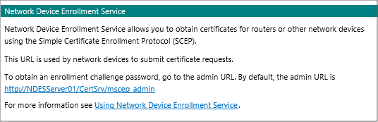
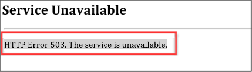
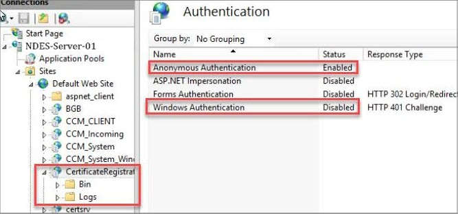
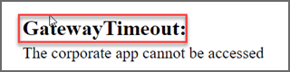
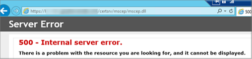
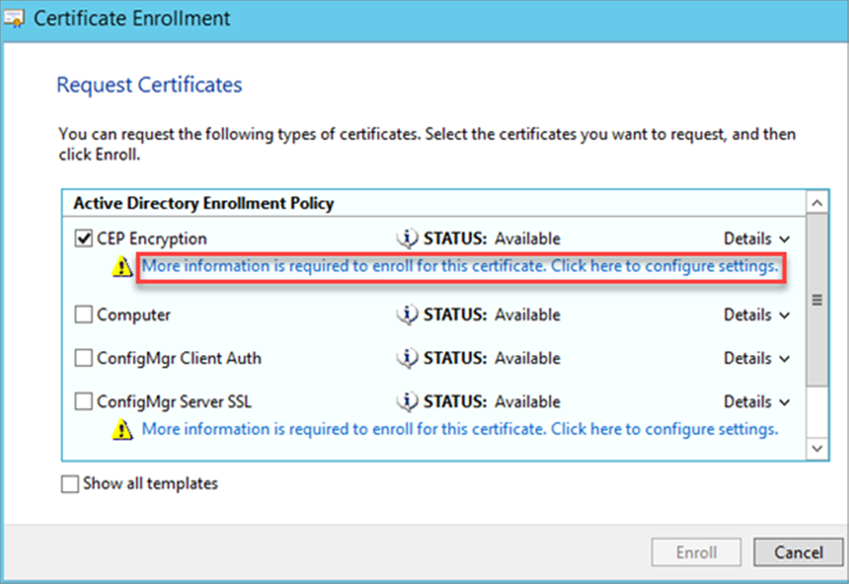
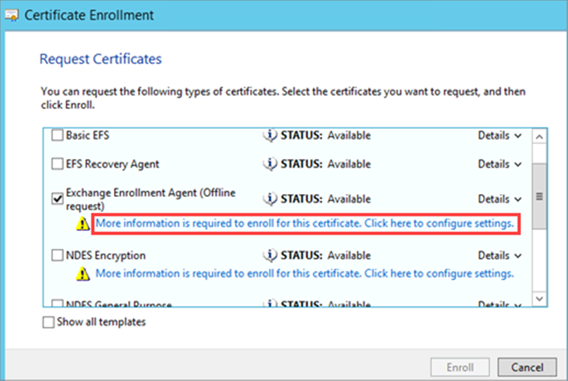
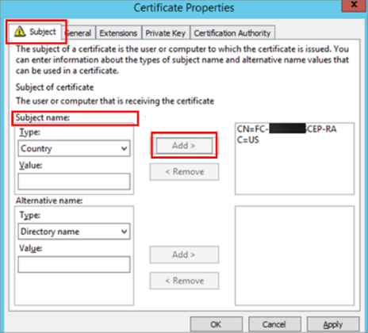
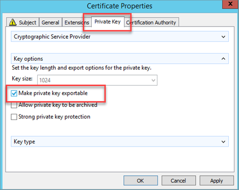

---
# required metadata

title: Troubleshoot managed device to NDES communication in Microsoft Intune | Microsoft Docs
description: Troubleshoot managed device to NDES server communication when using SCEP certificate profiles to deploy certificates with Intune.
keywords:
author: brenduns
ms.author: brenduns
manager: dougeby
ms.date: 01/30/2020
ms.topic: conceptual
ms.service: microsoft-intune
ms.subservice: configuration
ms.localizationpriority: high
ms.technology:

# optional metadata

#ROBOTS:
#audience:

ms.reviewer: lacranda
ms.suite: ems
search.appverid: MET150
#ms.tgt_pltfrm:
ms.custom: intune-azure
ms.collection: M365-identity-device-management
---

# Troubleshoot device to NDES server communication for SCEP certificate profiles in Microsoft Intune

Use the following information to determine if a device that received and processed an Intune Simple Certificate Enrollment Protocol (SCEP) certificate profile can successfully contact Network Device Enrollment Service (NDES) to present a challenge. On the device, a private key is generated and the Certificate Signing Request (CSR) and challenge are passed from the device to the NDES server. To contact the NDES server, the device uses the URI from the SCEP certificate profile.

This article references Step 2 of the [SCEP communication flow overview](troubleshoot-scep-certificate-profiles.md).

## Review IIS logs for a connection from the device

IIS logs include the same type of entries for all platforms.


1. On the NDES server, open the most recent IIS log file found in the following folder:   *%SystemDrive%\inetpub\logs\logfiles\w3svc1*

2. Search the log for entries similar to the following examples. Both examples contain a status **200**, which appears near the end:

   `fe80::f53d:89b8:c3e8:5fec%13 GET /certsrv/mscep/mscep.dll/pkiclient.exe operation=GetCACaps&message=default 80 - fe80::f53d:89b8:c3e8:5fec%13 Mozilla/4.0+(compatible;+Win32;+NDES+client) - 200 0 0 186 0.`

   And

   `fe80::f53d:89b8:c3e8:5fec%13 GET /certsrv/mscep/mscep.dll/pkiclient.exe operation=GetCACert&message=default 80 - fe80::f53d:89b8:c3e8:5fec%13 Mozilla/4.0+(compatible;+Win32;+NDES+client) - 200 0 0 3567 0`

3. When the device contacts IIS, an HTTP GET request for mscep.dll is logged.

   Review the status code near the end of this request:
   - **Status code of 200**: This status indicates the connection with the NDES server is successful.
   - **Status code of 500**: The IIS_IURS group might lack correct permissions. See [Status code 500](#status-code-500), later in this article.
   - If the status code isn't 200 or 500:

     - See [Test the SCEP server URL](#test-the-scep-server-url) later in this article to help validate the configuration.

     - See [The HTTP status code in IIS 7 and later versions](https://support.microsoft.com/help/943891) for information about less common error codes.

   If the connection request isn't logged at all, the contact from the device might be blocked on the network between the device and the NDES server.

## Review device logs for connections to NDES

### Android devices

Review the [devices OMADM log](troubleshoot-scep-certificate-profiles.md#logs-for-android-devices). Look for entries that resemble the following, which are logged when the device connects to NDES:

```
2018-02-27T05:16:08.2500000  VERB  Event  com.microsoft.omadm.platforms.android.certmgr.CertificateEnrollmentManager  18327    10  There are 1 requests
2018-02-27T05:16:08.2500000  VERB  Event  com.microsoft.omadm.platforms.android.certmgr.CertificateEnrollmentManager  18327    10  Trying to enroll certificate request: ModelName=AC_51bad41f-3854-4eb5-a2f2-0f7a94034ee8%2FLogicalName_39907e78_e61b_4730_b9fa_d44a53e4111c;Hash=1677525787
2018-02-27T05:16:09.5530000  VERB  Event  org.jscep.transport.UrlConnectionGetTransport  18327    10  Sending GetCACaps(ca) to https://<server>.msappproxy.net/certsrv/mscep/mscep.dll?operation=GetCACaps&message=ca
2018-02-27T05:16:14.6440000  VERB  Event  org.jscep.transport.UrlConnectionGetTransport  18327    10  Received '200 OK' when sending GetCACaps(ca) to https://<server>.msappproxy.net/certsrv/mscep/mscep.dll?operation=GetCACaps&message=ca
2018-02-27T05:16:21.8220000  VERB  Event  org.jscep.message.PkiMessageEncoder  18327     10 Encoding message: org.jscep.message.PkcsReq@2b06f45f[messageData=org.<server>.pkcs.PKCS10CertificationRequest@699b3cd,messageType=PKCS_REQ,senderNonce=Nonce [D447AE9955E624A56A09D64E2B3AE76E],transId=251E592A777C82996C7CF96F3AAADCF996FC31FF]
2018-02-27T05:16:21.8790000  VERB  Event  org.jscep.message.PkiMessageEncoder  18327     10  Signing pkiMessage using key belonging to [dn=CN=<uesrname>; serial=1]
2018-02-27T05:16:21.9580000  VERB  Event  org.jscep.transaction.EnrollmentTransaction  18327     10  Sending org.<server>.cms.CMSSignedData@ad57775
```

Key entries include the following sample text strings:

- There are 1 requests
- Received '200 OK' when sending GetCACaps(ca) to https://\<server>.msappproxy.net/certsrv/mscep/mscep.dll?operation=GetCACaps&message=ca
- Signing pkiMessage using key belonging to [dn=CN=\<username>; serial=1]


The connection is also logged by IIS in the %SystemDrive%\inetpub\logs\LogFiles\W3SVC1\ folder of the NDES server. The following is an example:

```
fe80::f53d:89b8:c3e8:5fec%13 GET /certsrv/mscep/mscep.dll operation=GetCACert&message=ca 443 - 
fe80::f53d:89b8:c3e8:5fec%13 Dalvik/2.1.0+(Linux;+U;+Android+5.0;+P01M+Build/LRX21V) - 200 0 0 3909 0
fe80::f53d:89b8:c3e8:5fec%13 GET /certsrv/mscep/mscep.dll operation=GetCACaps&message=ca 443 - 
fe80::f53d:89b8:c3e8:5fec%13 Dalvik/2.1.0+(Linux;+U;+Android+5.0;+P01M+Build/LRX21V) - 200 0 0 421 
```

### iOS/iPadOS devices

Review the [devices debug log](troubleshoot-scep-certificate-profiles.md#logs-for-ios-and-ipados-devices). Look for entries that resemble the following, which are logged when the device connects to NDES:

```
debug    18:30:53.691033 -0500    profiled    Performing synchronous URL request: https://<server>-contoso.msappproxy.net/certsrv/mscep/mscep.dll?operation=GetCACert&message=SCEP%20Authority\ 
debug    18:30:54.640644 -0500    profiled    Performing synchronous URL request: https://<server>-contoso.msappproxy.net/certsrv/mscep/mscep.dll?operation=GetCACaps&message=SCEP%20Authority\ 
default    18:30:55.483977 -0500    profiled    Attempting to retrieve issued certificate...\ 
debug    18:30:55.487798 -0500    profiled    Sending CSR via GET.\  
debug    18:30:55.487908 -0500    profiled    Performing synchronous URL request: https://<server>-contoso.msappproxy.net/certsrv/mscep/mscep.dll?operation=PKIOperation&message=MIAGCSqGSIb3DQEHAqCAMIACAQExDzANBglghkgBZQMEAgMFADCABgkqhkiG9w0BBwGggCSABIIZfzCABgkqhkiG9w0BBwOggDCAAgEAMYIBgjCCAX4CAQAwZjBPMRUwEwYKCZImiZPyLGQBGRYFbG9jYWwxHDAaBgoJkiaJk/IsZAEZFgxmb3VydGhjb2ZmZWUxGDAWBgNVBAMTD0ZvdXJ0aENvZmZlZSBDQQITaAAAAAmaneVjEPlcTwAAAAAACTANBgkqhkiG9w0BAQEFAASCAQCqfsOYpuBToerQLkw/tl4tH9E+97TBTjGQN9NCjSgb78fF6edY0pNDU+PH4RB356wv3rfZi5IiNrVu5Od4k6uK4w0582ZM2n8NJFRY7KWSNHsmTIWlo/Vcr4laAtq5rw+CygaYcefptcaamkjdLj07e/Uk4KsetGo7ztPVjSEFwfRIfKv474dLDmPqp0ZwEWRQGZwmPoqFMbX3g85CJT8khPaqFW05yGDTPSX9YpuEE0Bmtht9EwOpOZe6O7sd77IhfFZVmHmwy5mIYN7K6mpx/4Cb5zcNmY3wmTBlKEkDQpZDRf5PpVQ3bmQ3we9XxeK1S4UsAXHVdYGD+bg/bCafMIAGCSqGSIb3DQEHATAUBggqhkiG9w0DBwQI5D5J2lwZS5OggASCF6jSG9iZA/EJ93fEvZYLV0v7GVo3JAsR11O7DlmkIqvkAg5iC6DQvXO1j88T/MS3wV+rqUbEhktr8Xyf4sAAPI4M6HMfVENCJTStJw1PzaGwUJHEasq39793nw4k268UV5XHXvzZoF3Os2OxUHSfHECOj
```

Key entries include the following sample text strings:

- operation=GetCACert
- Attempting to retrieve issued certificate
- Sending CSR via GET
- operation=PKIOperation

### Windows devices

On a Windows device that is making a connection to NDES, you can view the devices Windows Event Viewer and look for indications of a successful connection. Connections are logged as an event ID **36** in the devices *DeviceManagement-Enterprise-Diagnostics-Provide* > **Admin** log.

To open the log:

1. On the device, run **eventvwr.msc** to open Windows Event Viewer.

2. Expand **Applications and Services Logs** > **Microsoft** > **Windows** > **DeviceManagement-Enterprise-Diagnostic-Provider** > **Admin**.

3. Look for Event **36**, which resembles the following example, with the key line of **SCEP: Certificate request generated successfully**:

   ```
   Event ID:      36
   Task Category: None
   Level:         Information
   Keywords:
   User:          <UserSid>
   Computer:      <Computer Name>
   Description:
   SCEP: Certificate request generated successfully. Enhanced Key Usage: (1.3.6.1.5.5.7.3.2), NDES URL: (https://<server>/certsrv/mscep/mscep.dll/pkiclient.exe), Container Name: (), KSP Setting: (0x2), Store Location: (0x1).
   ```

## Troubleshoot common errors

The following sections can help with common connection issues from all device platforms to NDES.

### Status code 500

Connections that resemble the following example, with a status code of 500, indicate the *Impersonate a client after authentication* user right isn't assigned to the IIS_IURS group on the NDES server. The status value of **500** appears at the end:

```
2017-08-08 20:22:16 IP_address GET /certsrv/mscep/mscep.dll operation=GetCACert&message=SCEP%20Authority 443 - 10.5.14.22 profiled/1.0+CFNetwork/811.5.4+Darwin/16.6.0 - 500 0 1346 31
```

**To fix this issue**:

1. On the NDES server, run **secpol.msc** to open the Local Security Policy.

2. Expand **Local Policies**, and then click **User Rights Assignment**.

3. Double-click **Impersonate a client after authentication** in the right pane.

4. Click **Add User or Group…**, enter **IIS_IURS** in the **Enter the object names to select box**, and then click **OK**.

5. Click **OK**.

6. Restart the computer, and then try the connection from the device again.

### Test the SCEP server URL

Use the following steps to test the URL that is specified in the SCEP certificate profile.

1. In Intune, edit your SCEP certificate profile and copy the Server URL. The URL should resemble *https://contoso.com/certsrv/mscep/msecp.dll*.

2. Open a web browser, and then browse to that SCEP server URL. The result should be: **HTTP Error 403.0 – Forbidden**. This result indicates the URL is functioning correctly.

   If you don't receive that error, select the link that resembles the error you see to view issue-specific guidance:
   - [I receive a general Network Device Enrollment Service message](#general-ndes-message)
   - [I receive "HTTP Error 503. The service is unavailable"](#http-error-503)
   - [I receive the "GatewayTimeout" error](#gatewaytimeout)
   - [I receive "HTTP 414 Request-URI Too Long"](#http-414-request-uri-too-long)
   - [I receive "This page can't be displayed"](#this-page-cant-be-displayed)
   - [I receive "500 - Internal server error"](#internal-server-error)

#### General NDES message

When you browse to the SCEP server URL, you receive the following Network Device Enrollment Service message:



- **Cause**: This problem is usually an issue with the Microsoft Intune Connector installation.

  Mscep.dll is an ISAPI extension that intercepts incoming request and displays the HTTP 403 error if it's installed correctly.
  
  **Resolution**: Examine the *SetupMsi.log* file to determine whether Microsoft Intune Connector is successfully installed. In the following example, *Installation completed successfully* and *Installation success or error status: 0* indicate a successful installation:

  ```
  MSI (c) (28:54) [16:13:11:905]: Product: Microsoft Intune Connector -- Installation completed successfully.
  MSI (c) (28:54) [16:13:11:999]: Windows Installer installed the product. Product Name: Microsoft Intune Connector. Product Version: 6.1711.4.0. Product Language: 1033. Manufacturer: Microsoft Corporation. Installation success or error status: 0.
  ```

  If the installation fails, remove the Microsoft Intune Connector and then reinstall it.

#### HTTP Error 503

When you browse to the SCEP server URL, you receive the following error:



This issue is usually because the **SCEP** application pool in IIS isn't started. On the NDES server, open **IIS Manager** and go to **Application Pools**. Locate the **SCEP** application pool and confirm it's started.

If the SCEP application pool isn't started, check the application event log on the server:

1. On the device, run **eventvwr.msc** to open **Event Viewer** and go to **Windows Logs** > **Application**.

2. Look for an event that is similar to the following example, which means that the application pool crashes when a request is received:

   ```
   Log Name:      Application
   Source:        Application Error
   Event ID:      1000
   Task Category: Application Crashing Events
   Level:         Error
   Keywords:      Classic
   Description: Faulting application name: w3wp.exe, version: 8.5.9600.16384, time stamp: 0x5215df96
   Faulting module name: ntdll.dll, version: 6.3.9600.18821, time stamp: 0x59ba86db
   Exception code: 0xc0000005
   ```

**Common causes for an application pool crash**:

- **Cause 1**: There are intermediate CA certificates (not self-signed) in the NDES server's Trusted Root Certification Authorities certificate store.

  **Resolution**: Remove intermediate certificates from the Trusted Root Certification Authorities certificate store, and then restart the NDES server.
  
  To identify all intermediate certificates in the Trusted Root Certification Authorities certificate store, run the following PowerShell cmdlet: `Get-Childitem -Path cert:\LocalMachine\root -Recurse | Where-Object {$_.Issuer -ne $_.Subject}`

  A certificate that has the same **Issued to** and **Issued by** values, is a root certificate. Otherwise, it's an intermediate certificate.

  After removing certificates and restarting the server, run the PowerShell cmdlet again to confirm there are no intermediate certificates. If there are, check whether a Group Policy pushes the intermediate certificates to the NDES server. If so, exclude the NDES server from the Group Policy and remove the intermediate certificates again.

- **Cause 2**: The URLs in the Certificate Revocation List (CRL) are blocked or unreachable for the certificates that are used by the Intune Certificate Connector.

  **Resolution**: Enable additional logging to collect more information:
  1. Open Event Viewer, click **View**, make sure that **Show Analytic and Debug Logs** option is checked.
  2. Go to **Applications and Services Logs** > **Microsoft** > **Windows** > **CAPI2** > **Operational**, right-click **Operational**, then click **Enable Log**.
  3. After CAPI2 logging is enabled, reproduce the problem, and examine the event log to troubleshoot the issue.

- **Cause 3**: IIS permission on **CertificateRegistrationSvc** has **Windows Authentication** enabled.

  **Resolution**: Enable **Anonymous Authentication** and disable **Windows Authentication**, and then restart the NDES server.

  

- **Cause 4**: The NDESPolicy module certificate has expired.

  The CAPI2 log (see Cause 2's resolution) will show errors relating to the certificate referenced by 'HKEY_LOCAL_MACHINE\SOFTWARE\Microsoft\Cryptography\MSCEP\Modules\NDESPolicy\NDESCertThumbprint' being outside of the certificate's validity period.

  **Resolution**: Update the reference with the thumbprint of a valid certificate.
  1. Identify a replacement certificate:
     - Renew the existing certificate
     - Select a different certificate with similar proprties (subject, EKU, key type and length, etc.)
     - Enroll a new certificate
  2. Export the `NDESPolicy` Registry key to back up the current values.
  3. Replace the data of the `NDESCertThumbprint` Registry value with the thumbprint of the new certificate, removing all whitespace and converting the text to lowercase.
  4. Restart the NDES IIS App Pools or execute `iisreset` from an elevated command prompt.

#### GatewayTimeout

When you browse to the SCEP server URL, you receive the following error:



- **Cause**: The **Microsoft AAD Application Proxy Connector** service isn't started.

  **Resolution**:  Run **services.msc**, and then make sure that the **Microsoft AAD Application Proxy Connector** service is running and **Startup Type** is set to **Automatic**.

#### HTTP 414 Request-URI Too Long

When you browse to the SCEP server URL, you receive the following error: `HTTP 414 Request-URI Too Long`

- **Cause**: IIS request filtering isn't configured to support the long URLs (queries) that the NDES service receives. This support is configured when you [configure the NDES service](certificates-scep-configure.md#configure-the-ndes-service) for use with your infrastructure for SCEP.

- **Resolution**: Configure support for long URLs.

  1. On the NDES server, open IIS manager, select **Default Web Site** > **Request Filtering** > **Edit Feature Setting** to open the **Edit Request Filtering Settings** page.

  2. Configure the following settings:
     - **Maximum URL length (Bytes)** = 65534
     - **Maximum query string (Bytes)** = 65534

  3. Select **OK** to save this configuration and close IIS manager.

  4. Validate this configuration by locating the following registry key to confirm that it has the indicated values:

     HKEY_LOCAL_MACHINE\SYSTEM\CurrentControlSet\Services\HTTP\Parameters

     The following values are set as DWORD entries:
     - Name: **MaxFieldLength**, with a decimal value of **65534**
     - Name: **MaxRequestBytes**, with a decimal value of **65534**

  5. Restart the NDES server.

#### This page can't be displayed

You have Azure AD Application Proxy configured. When you browse to the SCEP server URL, you receive the following error:

`This page can't be displayed`

- **Cause**: This issue occurs when the SCEP external URL is incorrect in the Application Proxy configuration. An example of this URL is https://contoso.com/certsrv/mscep/mscep.dll.

  **Resolution**: Use the default domain of *yourtenant.msappproxy.net* for the SCEP external URL in the Application Proxy configuration.

#### <a name="internal-server-error"></a>500 - Internal server error

When you browse to the SCEP server URL, you receive the following error:



- **Cause 1**: The NDES service account is locked or its password is expired.

  **Resolution**: Unlock the account or reset the password.

- **Cause 2**: The MSCEP-RA certificates are expired.

  **Resolution**: If the MSCEP-RA certificates are expired, reinstall the NDES role or request new CEP Encryption and Exchange Enrollment Agent (Offline request) certificates.

  To request new certificates, follow these steps:

  1. On the Certificate Authority (CA) or issuing CA, open the Certificate Templates MMC. Make sure that the logged in user and the NDES server have **Read** and **Enroll** permissions to the CEP Encryption and Exchange Enrollment Agent (Offline request) certificate templates.

  2. Check the expired certificates on the NDES server, copy the **Subject** information from the certificate.

  3. Open the Certificates MMC for **Computer account**.

  4. Expand **Personal**, right-click **Certificates**, then select **All Tasks** > **Request New Certificate**.

  5. On the **Request Certificate** page, select **CEP Encryption**, then click **More information is required to enroll for this certificate. Click here to configure settings**.

     

  6. In **Certificate Properties**, click the **Subject** tab, fill the **Subject name** with the information that you collected during step 2, click **Add**, then click **OK**.

  7. Complete the certificate enrollment.

  8. Open the Certificates MMC for **My user account**.

     When you enroll for the Exchange Enrollment Agent (Offline request) certificate, it must be done in the user context. Because the **Subject Type** of this certificate template is set to **User**.

  9. Expand **Personal**, right-click **Certificates**, then select **All Tasks** > **Request New Certificate**.

  10. On the **Request Certificate** page, select **Exchange Enrollment Agent (Offline request)**, then click **More information is required to enroll for this certificate. Click here to configure settings**.

      

  11. In **Certificate Properties**, click the **Subject** tab, fill the **Subject name** with the information that you collected during step 2, click **Add**.

      

      Select the **Private Key** tab, select **Make private key exportable**, then click **OK**.

      

  12. Complete the certificate enrollment.

  13. Export the Exchange Enrollment Agent (Offline request) certificate from the current user certificate store. In the Certificate Export Wizard, select **Yes, export the private key**.

  14. Import the certificate to the local machine certificate store.

  15. In the Certificates MMC, do the following action for each of the new certificates:

      Right-click the certificate, click **All Tasks** > **Manage Private Keys**, add **Read** permission to the NDES service account.

  16. Run the **iisreset** command to restart IIS.

## Next steps

If the device successfully reaches the NDES server to present the certificate request, the next step is to review the [Intune Certificate Connectors policy module](troubleshoot-scep-certificate-ndes-policy-module.md).
