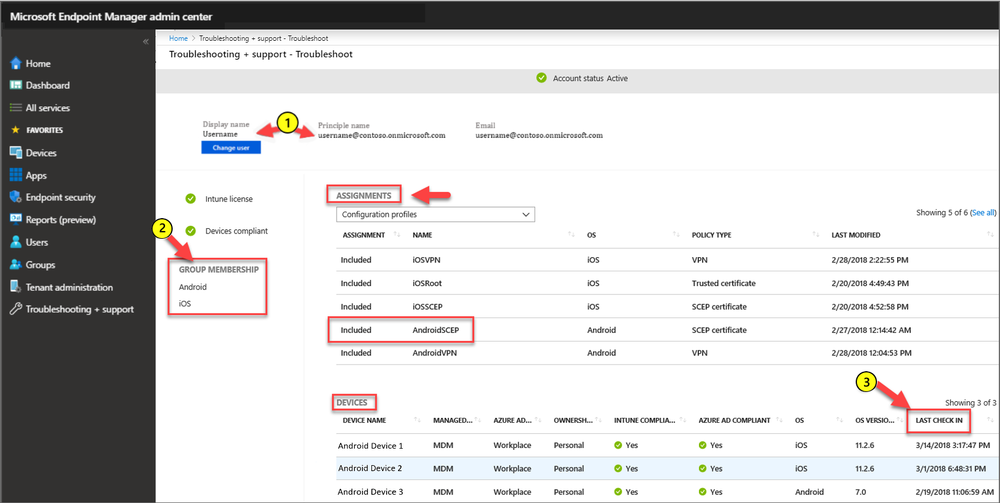
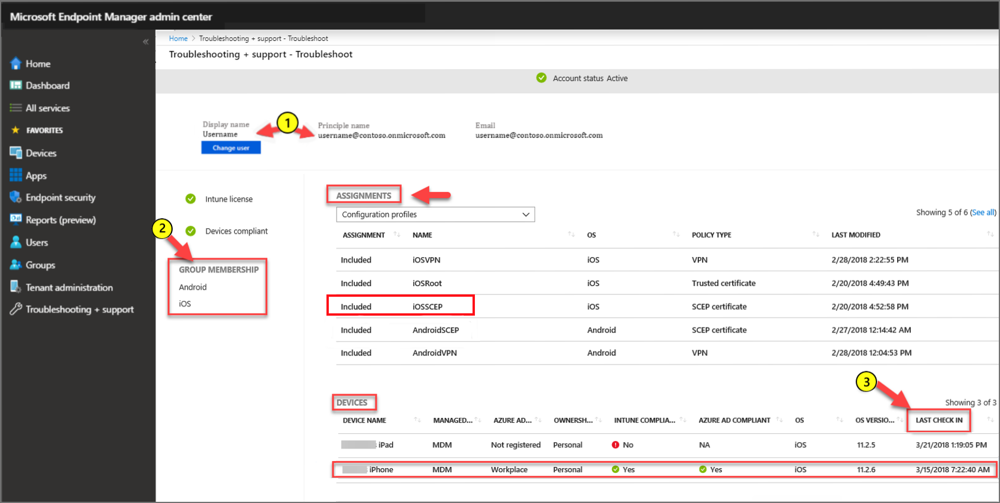
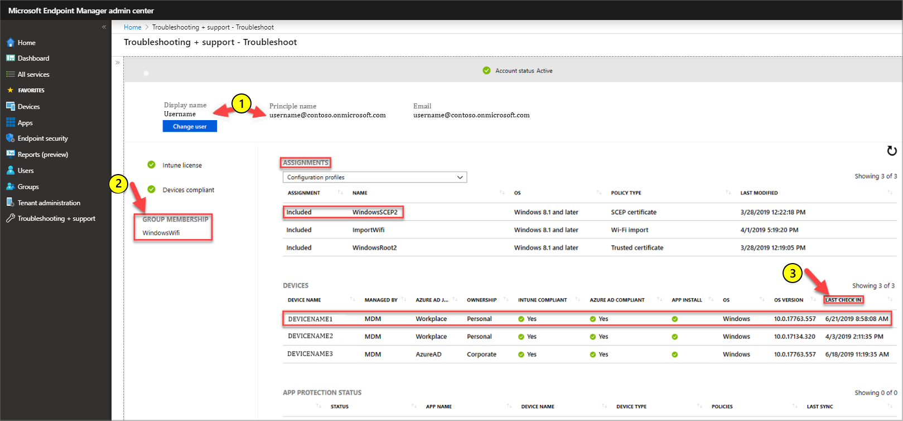

---
# required metadata

title: Troubleshoot deployment of SCEP certificate profiles to devices with Microsoft Intune | Microsoft Docs
description: Troubleshoot sending a SCEP certificate profile to a device with Intune.
keywords:
author: brenduns
ms.author: brenduns
manager: dougeby
ms.date: 01/30/2020
ms.topic: troubleshooting
ms.service: microsoft-intune
ms.subservice: configuration
ms.localizationpriority: high
ms.technology:

# optional metadata

#ROBOTS:
#audience:

ms.reviewer: lacranda
ms.suite: ems
search.appverid: MET150
#ms.tgt_pltfrm:
ms.custom: intune-azure
ms.collection: M365-identity-device-management
---

# Troubleshoot deployment of a SCEP certificate profile to devices in Microsoft Intune

Use the following information to help you troubleshoot deployment of Simple Certificate Enrollment Protocol (SCEP) certificate profiles with Intune.

This article references Step 1 of the [SCEP communication flow overview](troubleshoot-scep-certificate-profiles.md).


## Android

SCEP certificate profiles for Android come down to the device as a SyncML and are logged in the [OMADM log](troubleshoot-scep-certificate-profiles.md#logs-for-android-devices).

### Validate that the Android device was sent the policy

To validate a profile was sent to the device you expect, in the [Microsoft Endpoint Manager admin center](https://go.microsoft.com/fwlink/?linkid=2109431) go to **Troubleshooting + Support** > **Troubleshoot**.  On the *Troubleshoot* window, set **Assignments** to **Configuration profiles** and then validate the following configurations:

1. Specify a User that should receive the SCEP certificate profile.

2. Review the users Group Membership to ensure they are in the security group you used with the SCEP certificate profile.

3. Review when the device last checked in with Intune.



### Validate the policy reached the Android device

Review the [devices OMADM log](troubleshoot-scep-certificate-profiles.md#logs-for-android-devices). Look for entries that resemble the following, which are logged when the device gets the profile from Intune:

```
Time    VERB    Event     com.microsoft.omadm.syncml.SyncmlSession     9595        9    <?xml version="1.0" encoding="utf-8"?><SyncML xmlns="SYNCML:SYNCML1.2"><SyncHdr><VerDTD>1.2</VerDTD><VerProto>DM/1.2</VerProto><SessionID>1</SessionID><MsgID>6</MsgID><Target><LocURI>urn:uuid:UUID</LocURI></Target><Source><LocURI>https://a.manage.microsoft.com/devicegatewayproxy/AndroidHandler.ashx</LocURI></Source><Meta><MaxMsgSize xmlns="syncml:metinf">524288</MaxMsgSize></Meta></SyncHdr><SyncBody><Status><CmdID>1</CmdID><MsgRef>6</MsgRef><CmdRef>0</CmdRef><Cmd>SyncHdr</Cmd><Data>200</Data></Status><Replace><CmdID>2</CmdID><Item><Target><LocURI>./Vendor/MSFT/Scheduler/IntervalDurationSeconds</LocURI></Target><Meta><Format xmlns="syncml:metinf">int</Format><Type xmlns="syncml:metinf">text/plain</Type></Meta><Data>28800</Data></Item></Replace><Replace><CmdID>3</CmdID><Item><Target><LocURI>./Vendor/MSFT/EnterpriseAppManagement/EnterpriseIDs</LocURI></Target><Data>contoso.onmicrosoft.com</Data></Item></Replace><Exec><CmdID>4</CmdID><Item><Target><LocURI>./Vendor/MSFT/EnterpriseAppManagement/EnterpriseApps/ClearNotifications</LocURI></Target></Item></Exec><Add><CmdID>5</CmdID><Item><Target><LocURI>./Vendor/MSFT/CertificateStore/Root/{GUID}/EncodedCertificate</LocURI></Target><Data>Data</Data></Item></Add><Add><CmdID>6</CmdID><Item><Target><LocURI>./Vendor/MSFT/CertificateStore/Enroll/ModelName=AC_51…%2FLogicalName_39907…%3BHash=-1518303401/Install</LocURI></Target><Meta><Format xmlns="syncml:metinf">xml</Format><Type xmlns="syncml:metinf">text/plain</Type></Meta><Data>&lt;CertificateRequest&gt;&lt;ConfigurationParametersDocument&gt;&amp;lt;ConfigurationParameters xmlns="http://schemas.microsoft.com/SystemCenterConfigurationManager/2012/03/07/CertificateEnrollment/ConfigurationParameters"&amp;gt;&amp;lt;ExpirationThreshold&amp;gt;20&amp;lt;/ExpirationThreshold&amp;gt;&amp;lt;RetryCount&amp;gt;3&amp;lt;/RetryCount&amp;gt;&amp;lt;RetryDelay&amp;gt;1&amp;lt;/RetryDelay&amp;gt;&amp;lt;TemplateName /&amp;gt;&amp;lt;SubjectNameFormat&amp;gt;{ID}&amp;lt;/SubjectNameFormat&amp;gt;&amp;lt;SubjectAlternativeNameFormat&amp;gt;{ID}&amp;lt;/SubjectAlternativeNameFormat&amp;gt;&amp;lt;KeyStorageProviderSetting&amp;gt;0&amp;lt;/KeyStorageProviderSetting&amp;gt;&amp;lt;KeyUsage&amp;gt;32&amp;lt;/KeyUsage&amp;gt;&amp;lt;KeyLength&amp;gt;2048&amp;lt;/KeyLength&amp;gt;&amp;lt;HashAlgorithms&amp;gt;&amp;lt;HashAlgorithm&amp;gt;SHA-1&amp;lt;/HashAlgorithm&amp;gt;&amp;lt;HashAlgorithm&amp;gt;SHA-2&amp;lt;/HashAlgorithm&amp;gt;&amp;lt;/HashAlgorithms&amp;gt;&amp;lt;NDESUrls&amp;gt;&amp;lt;NDESUrl&amp;gt;https://breezeappproxy-contoso.msappproxy.net/certsrv/mscep/mscep.dll&amp;lt;/NDESUrl&amp;gt;&amp;lt;/NDESUrls&amp;gt;&amp;lt;CAThumbprint&amp;gt;{GUID}&amp;lt;/CAThumbprint&amp;gt;&amp;lt;ValidityPeriod&amp;gt;2&amp;lt;/ValidityPeriod&amp;gt;&amp;lt;ValidityPeriodUnit&amp;gt;Years&amp;lt;/ValidityPeriodUnit&amp;gt;&amp;lt;EKUMapping&amp;gt;&amp;lt;EKUMap&amp;gt;&amp;lt;EKUName&amp;gt;Client Authentication&amp;lt;/EKUName&amp;gt;&amp;lt;EKUOID&amp;gt;1.3.6.1.5.5.7.3.2&amp;lt;/EKUOID&amp;gt;&amp;lt;/EKUMap&amp;gt;&amp;lt;/EKUMapping&amp;gt;&amp;lt;/ConfigurationParameters&amp;gt;&lt;/ConfigurationParametersDocument&gt;&lt;RequestParameters&gt;&lt;CertificateRequestToken&gt;PENlcnRFbn... Hash: 1,010,143,298&lt;/CertificateRequestToken&gt;&lt;SubjectName&gt;CN=name&lt;/SubjectName&gt;&lt;Issuers&gt;CN=FourthCoffee CA; DC=fourthcoffee; DC=local&lt;/Issuers&gt;&lt;SubjectAlternativeName&gt;&lt;SANs&gt;&lt;SAN NameFormat="ID" AltNameType="2" OID="{OID}"&gt;&lt;/SAN&gt;&lt;SAN NameFormat="ID" AltNameType="11" OID="{OID}"&gt;john@contoso.onmicrosoft.com&lt;/SAN&gt;&lt;/SANs&gt;&lt;/SubjectAlternativeName&gt;&lt;NDESUrl&gt;https://breezeappproxy-contoso.msappproxy.net/certsrv/mscep/mscep.dll&lt;/NDESUrl&gt;&lt;/RequestParameters&gt;&lt;/CertificateRequest&gt;</Data></Item></Add><Get><CmdID>7</CmdID><Item><Target><LocURI>./Vendor/MSFT/CertificateStore/SCEP</LocURI></Target></Item></Get><Add><CmdID>8</CmdID><Item><Target><LocURI>./Vendor/MSFT/GCM</LocURI></Target><Data>Data</Data></Item></Add><Replace><CmdID>9</CmdID><Item><Target><LocURI>./Vendor/MSFT/GCM</LocURI></Target><Data>Data</Data></Item></Replace><Get><CmdID>10</CmdID><Item><Target><LocURI>./Vendor/MSFT/NodeCache/SCConfigMgr</LocURI></Target></Item></Get><Get><CmdID>11</CmdID><Item><Target><LocURI>./Vendor/MSFT/NodeCache/SCConfigMgr/CacheVersion</LocURI></Target></Item></Get><Get><CmdID>12</CmdID><Item><Target><LocURI>./Vendor/MSFT/NodeCache/SCConfigMgr/ChangedNodes</LocURI></Target></Item></Get><Get><CmdID>13</CmdID><Item><Target><LocURI>./DevDetail/Ext/Microsoft/LocalTime</LocURI></Target></Item></Get><Get><CmdID>14</CmdID><Item><Target><LocURI>./Vendor/MSFT/DeviceLock/DevicePolicyManager/IsActivePasswordSufficient</LocURI></Target></Item></Get><Get><CmdID>15</CmdID><Item><Target><LocURI>./Vendor/MSFT/WorkProfileLock/DevicePolicyManager/IsActivePasswordSufficient</LocURI></Target></Item></Get><Final /></SyncBody></SyncML>
```

Examples of key entries:

- `ModelName=AC_51bad41f-3854-4eb5-a2f2-0f7a94034ee8%2FLogicalName_39907e78_e61b_4730_b9fa_d44a53e4111c%3BHash=-1518303401`
- `NDESUrls&amp;gt;&amp;lt;NDESUrl&amp;gt;https://<server>-contoso.msappproxy.net/certsrv/mscep/mscep.dll&amp;lt;/NDESUrl&amp;gt;&amp;lt;/NDESUrls`

## iOS/iPadOS

### Validate that the iOS/iPadOS device was sent the policy

To validate a profile was sent to the device you expect, in the [Microsoft Endpoint Manager admin center](https://go.microsoft.com/fwlink/?linkid=2109431) go to **Troubleshooting + Support** > **Troubleshoot**.  On the *Troubleshoot* window, set **Assignments** to **Configuration profiles** and then validate the following configurations:

1. Specify a User that should receive the SCEP certificate profile.

2. Review the users Group Membership to ensure they are in the security group you used with the SCEP certificate profile.

3. Review when the device last checked in with Intune.



### Validate the policy reached the iOS or iPadOS device

Review the [devices debug log](troubleshoot-scep-certificate-profiles.md#logs-for-ios-and-ipados-devices). Look for entries that resemble the following, which are logged when the device gets the profile from Intune:

```
debug    18:30:54.638009 -0500    profiled    Adding dependent ModelName=AC_51bad41f.../LogicalName_1892fe4c...;Hash=-912418295 to parent 636572740000000000000012 in domain PayloadDependencyDomainCertificate to system\
```

Examples of key entries:

- `ModelName=AC_51bad41f.../LogicalName_1892fe4c...;Hash=-912418295`
- `PayloadDependencyDomainCertificate`

## Windows

### Validate that the Windows device was sent the policy

To validate the profile was sent to the device you expect, in the [Microsoft Endpoint Manager admin center](https://go.microsoft.com/fwlink/?linkid=2109431)[Microsoft Endpoint Manager admin center](https://go.microsoft.com/fwlink/?linkid=2109431) go to **Troubleshooting + Support** > **Troubleshoot**.  On the *Troubleshoot* window, set **Assignments** to **Configuration profiles** and then validate the following configurations:

1. Specify a User that should receive the SCEP certificate profile.

2. Review the users Group Membership to ensure they are in the security group you used with the SCEP certificate profile.

3. Review when the device last checked in with Intune.



### Validate the policy reached the Windows device

The arrival of the policy for the profile is logged in a Windows device's *DeviceManagement-Enterprise-Diagnostics-Provider* > **Admin** log, with an event ID **306**. 

To open the log:

1. On the device, run **eventvwr.msc** to open Windows Event Viewer.

2. Expand **Applications and Services Logs** > **Microsoft** > **Windows** > **DeviceManagement-Enterprise-Diagnostic-Provider** > **Admin**.

3. Look for Event **306**, which resembles the following example:

   ```
   Event ID:      306
   Task Category: None
   Level:         Information
   User:          SYSTEM
   Computer:      <Computer Name>
   Description:
   SCEP: CspExecute for UniqueId : (ModelName_<ModelName>_LogicalName_<LogicalName>_Hash_<Hash>) InstallUserSid : (<UserSid>) InstallLocation : (user) NodePath : (clientinstall)  KeyProtection: (0x2) Result : (Unknown Win32 Error code: 0x2ab0003).
   ```

   The error code **0x2ab0003** translates to **DM_S_ACCEPTED_FOR_PROCESSING**.

   A non-successful error code might provide indication of the underlying problem.

## Next steps

If the profile reaches the device, the next step is to review the [device to NDES server communication](troubleshoot-scep-certificate-device-to-ndes.md).
