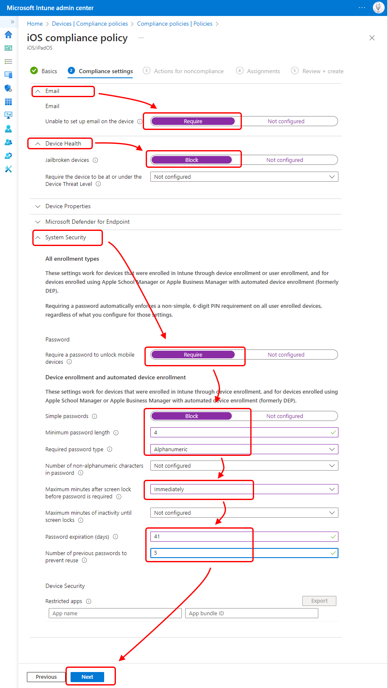
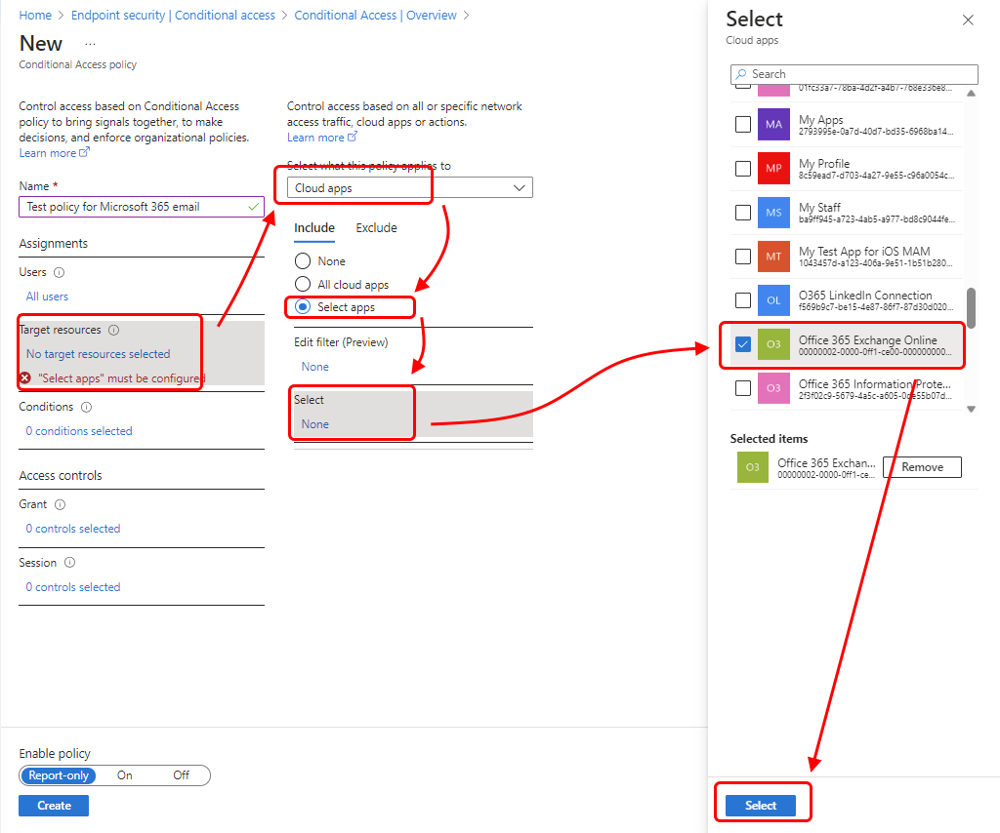
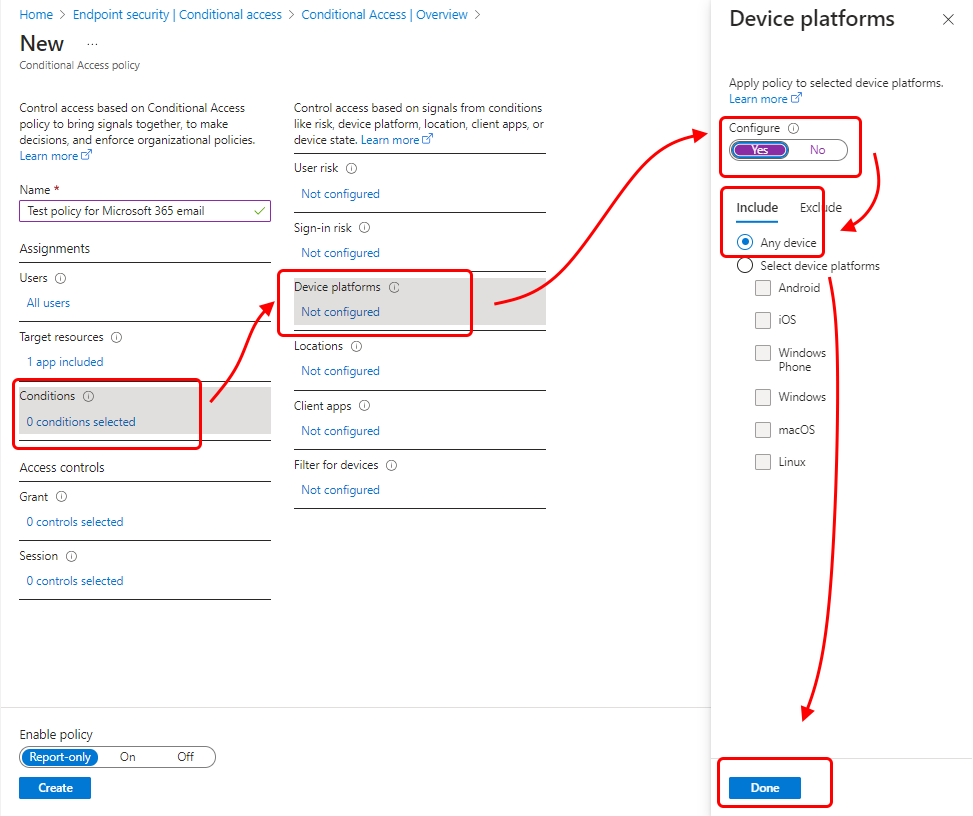
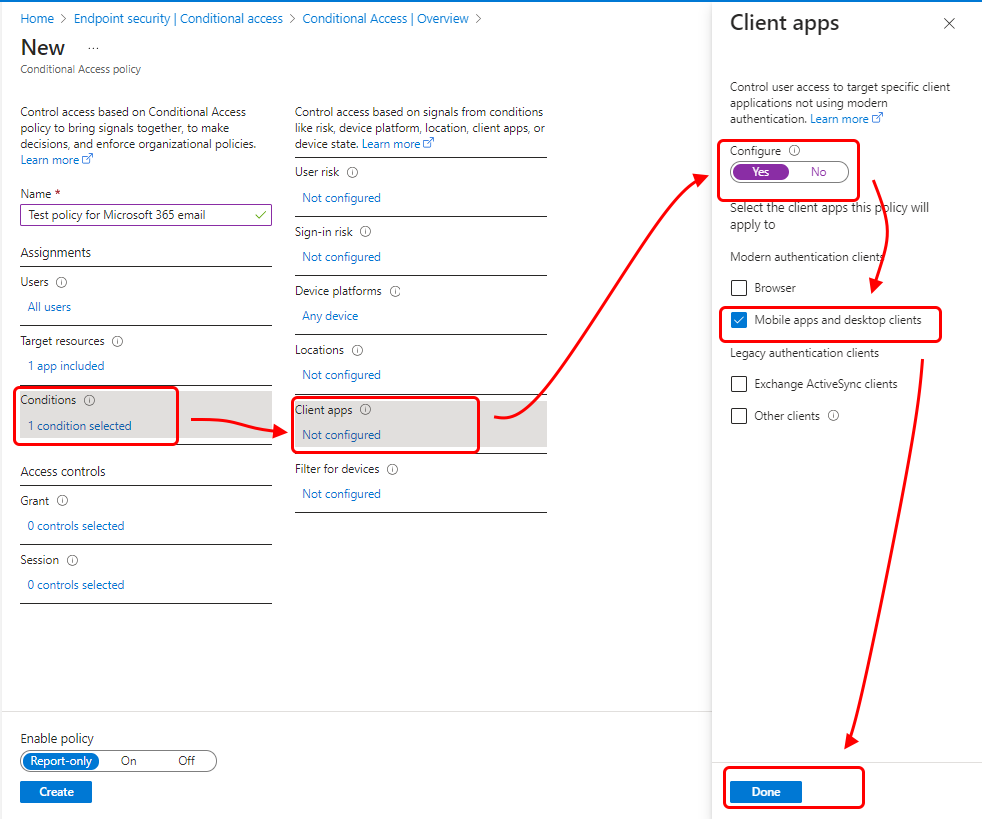
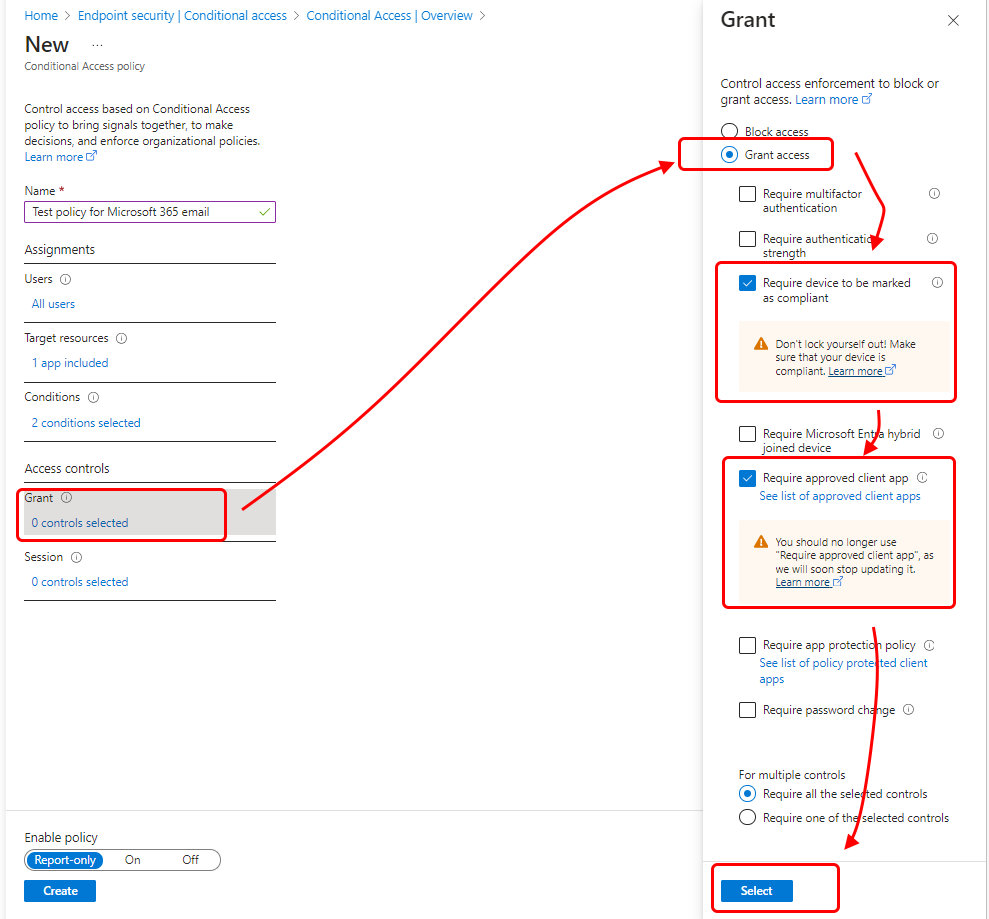

---
# required metadata

title: Tutorial - Protect Exchange Online email on managed devices
titleSuffix: Microsoft Intune
description: Learn to secure Exchange Online with iOS Intune compliance policies and Azure AD Conditional Access to require managed devices and the Outlook app.
keywords:
author: brenduns
ms.author: brenduns
manager: dougeby
ms.date: 04/01/2021
ms.topic: tutorial
ms.service: microsoft-intune
ms.subservice: protect
ms.localizationpriority: high
ms.technology:
ms.assetid: 

# optional metadata

#ROBOTS:
#audience:

ms.reviewer: demerson
ms.suite: ems
search.appverid: MET150
#ms.tgt_pltfrm:
ms.custom: intune-azure
ms.collection:
- tier2
- M365-identity-device-management
---

# Tutorial: Protect Exchange Online email on managed devices

Learn about using device compliance policies with Conditional Access to make sure that iOS devices can access Exchange Online email only if they're managed by Intune and using an approved email app.

In this tutorial, you'll learn how to:

> [!div class="checklist"]
> * Create an Intune iOS device compliance policy to set the conditions that a device must meet to be considered compliant.
> * Create an Azure Active Directory (Azure AD) Conditional Access policy that requires iOS devices to enroll in Intune, comply with Intune policies, and use the approved Outlook mobile app to access Exchange Online email.

If you don't have an Intune subscription, [sign up for a free trial account](../fundamentals/free-trial-sign-up.md).

## Prerequisites

You'll need a test tenant with the following subscriptions for this tutorial:

- Azure Active Directory Premium ([free trial](https://azure.microsoft.com/free/?WT.mc_id=A261C142F))

- Microsoft 365 Apps for business subscription that includes Exchange ([free trial](https://go.microsoft.com/fwlink/p/?LinkID=510938))

Before you begin, create a test device profile for iOS devices by following the steps in [Quickstart: Create an email device profile for iOS/iPadOS](../configuration/quickstart-email-profile.md).

## Sign in to Intune

Sign in to the [Microsoft Intune admin center](https://go.microsoft.com/fwlink/?linkid=2109431) as a [Global administrator](../fundamentals/users-add.md#types-of-administrators) or an Intune [Service administrator](../fundamentals/users-add.md#types-of-administrators). If you have created an Intune Trial subscription, the account you created the subscription with is the Global administrator.

## Create the iOS device compliance policy

Set up an Intune device compliance policy to set the conditions that a device must meet to be considered compliant. For this tutorial, we'll create a device compliance policy for iOS devices. Compliance policies are platform-specific, so you need a separate compliance policy for each device platform you want to evaluate.

1. In Intune, select **Devices** > **Compliance policies** > **Create policy**.

2. For **Name**, enter **iOS compliance policy test**.

3. For **Description**, enter **iOS compliance policy test**.

4. For **Platform**, select **iOS/iPadOS**.

5. Select **Settings** > **Email**.

   1. Next to **Require mobile devices to have a managed email profile**, select **Require**.

   2. Select **OK**.

   

6. Select **Device Health**. Next to **Jailbroken devices**, select **Block**, and then select **OK**.

7. Select **System Security** and enter **Password** settings. For this tutorial, select the following recommended settings:

   - For **Require a password to unlock mobile devices**, select **Require**.

   - For **Simple passwords**, select **Block**.

   - For **Minimum password length**, enter **4**.

     > [!TIP]
     > Default values that are grayed out and italicized are only recommendations. You must replace values that are recommendations to configure a setting.

   - For **Required password type**, choose **Alphanumeric**.

   - For **Maximum minutes after screen lock before password is required**, choose **Immediately**.

   - For **Password expiration (days)**, enter **41**.

   - For **Number of previous passwords to prevent reuse**, enter **5**.
 
   

8. Select **OK**, and then select **OK** again.

9. Select **Create**.

## Create the Conditional Access policy

Now we'll create a Conditional Access policy that requires all device platforms to enroll in Intune and comply with our Intune compliance policy before they can access Exchange Online. We'll also require the Outlook app for email access. Conditional Access policies are configurable in either the Azure AD portal or the Microsoft Intune admin center. Since we're already in the admin center, we'll create the policy here.

1. In Microsoft Intune admin center, select **Endpoint security** > **Conditional Access** > **New policy**.

2. For **Name**, enter **Test policy for Microsoft 365 email**.

3. Under **Assignments**, select **Users and groups**. On the **Include** tab, select **All users**, and then select **Done**.

4. Under **Assignments**, select **Cloud apps or actions**. Because we want to protect Microsoft 365 Exchange Online email, we'll select it by following these steps:

   1. On the **Include** tab, choose **Select apps**.

   2. Choose **Select**. 

   3. In the applications list, select **Office 365 Exchange Online**, and then choose **Select**. 

   4. Select **Done**.
  
   

5. Under **Assignments**, select **Conditions** > **Device platforms**.

   1. Under **Configure**, select **Yes**.

   2. On the **Include** tab, select **Any device**, and then select **Done**. 

   3. Select **Done** again.

   

6. Under **Assignments**, select **Conditions** > **Client apps**.

   1. Under **Configure**, select **Yes**.

   2. For this tutorial, select **Mobile apps and desktop clients** and **Modern authentication clients** (which refers to apps like Outlook for iOS and Outlook for Android). Clear all other check boxes.

   3. Select **Done**, and then select **Done** again.

   

7. Under **Access controls**, select **Grant**.

   1. On the **Grant** pane, select **Grant access**.

   2. Select **Require device to be marked as compliant**.

   3. Select **Require approved client app**.

   4. Under **For multiple controls**, select **Require all the selected controls**. This setting ensures that both requirements you selected are enforced when a device tries to access email.

   5. Choose **Select**.

   

8. Under **Enable policy**, select **On**.

   

9. Select **Create**.

## Try it out

With the policies you've created, any iOS device that attempts to sign in to Microsoft 365 email will need to enroll in Intune and use the Outlook mobile app for iOS/iPadOS. To test this scenario on an iOS device, try signing in to Exchange Online using credentials for a user in your test tenant. You'll be prompted to enroll the device and install the Outlook mobile app.

1. To test on an iPhone, go to **Settings** > **Passwords & Accounts** > **Add Account** > **Exchange**.

2. Enter the email address for a user in your test tenant, and then press **Next**.

3. Press **Sign In**.

4. Enter the test user's password, and press **Sign in**.

5. A message appears that says your device must be managed to access the resource, along with an option to enroll.

## Clean up resources

When the test policies are no longer needed, you can remove them.
1. Sign in to the [Microsoft Intune admin center](https://go.microsoft.com/fwlink/?linkid=2109431) as a Global Administrator or an Intune Service Administrator.

2. Select **Devices** > **Compliance policies**.

3. In the **Policy Name** list, select the context menu (**...**) for your test policy, and then select **Delete**. Select **OK** to confirm.

4. Select **Endpoint security** > **Conditional access**.

5. In the **Policy Name** list, select the context menu (**...**) for your test policy, and then select **Delete**. Select **Yes** to confirm.

## Next steps

In this tutorial, you created policies that require iOS devices to enroll in Intune and use the Outlook app to access Exchange Online email. To learn about using Intune with Conditional Access to protect other apps and services, including Exchange ActiveSync clients for Microsoft 365 Exchange Online, see [Set up Conditional Access](conditional-access.md).
