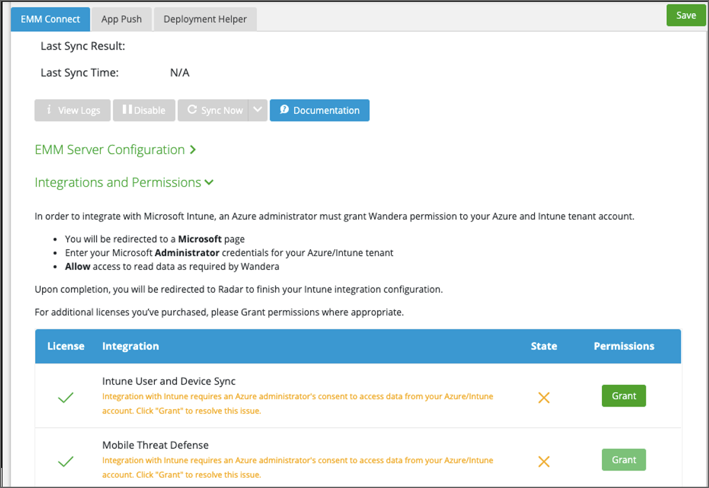
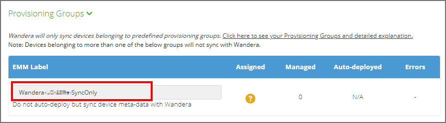
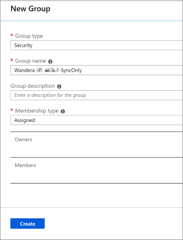

---
# required metadata

title: Set up Wandera Mobile Threat Protection integration with Intune
titleSuffix: Intune on Azure
description: How to set up the Wandera Mobile Threat Protection solution with Microsoft Intune to control mobile device access to your corporate resources.
keywords:
author: brenduns
ms.author: brenduns
manager: dougeby
ms.date: 12/18/2019
ms.topic: conceptual
ms.service: microsoft-intune
ms.subservice: protect
ms.localizationpriority: high
ms.technology:
ms.assetid:  

# optional metadata

#ROBOTS:
#audience:

#ms.reviewer: davidra
#ms.suite: ems
search.appverid: MET150
#ms.tgt_pltfrm:
#ms.custom:
ms.collection: M365-identity-device-management
---

# Integrate Wandera Mobile Threat Protection with Intune  

Complete the following steps to integrate the Wandera Mobile Threat Defense solution with Intune.  

> [!NOTE]
> This Mobile Threat Defense vendor is not supported for unenrolled devices.

## Before you begin  

Before you start the process to integrate Wandera with Intune, make sure you have the following prerequisites in place:
- Microsoft Intune subscription  
- Azure Active Directory admin credentials to grant the following permissions:  
  - Sign in and read user profile  
  - Access the directory as the signed-in user  
  - Read directory data  
  - Send device information to Intune  

- Wandera subscription:
  - One or more Wandera accounts that are licensed for EMM Connect  
  - An account with Super administrator privileges in Wandera  
 
### Wandera Mobile Threat Defense app authorization  

The Wandera Mobile Threat Defense app authorization process:  
- Allow the Wandera Mobile Threat Defense service to communicate information related to device health state back to Intune.  
- Wandera syncs with Azure AD Enrollment Group membership to populate its device's database.  
- Allow the Wandera RADAR admin portal to use Azure AD Single Sign On (SSO).  
- Allow the Wandera Mobile Threat Defense app to sign in using Azure AD SSO.  

## Set up Wandera Mobile Threat Defense integration  
Setup of *EMM Connect* for Wandera requires a one-time configuration process that you complete in both the Intune and Wandera consoles. The configuration process takes about 15 minutes. You can complete the configuration without coordination with your Wandera technical account or support representative.  

### Enable support for Wandera in Intune

1. Sign in to the [Microsoft Endpoint Manager admin center](https://go.microsoft.com/fwlink/?linkid=2109431).
2. Select **Tenant administration** > **Connectors and tokens** > **Mobile Threat Defense** > **Add**.
3. On the **Add Connector** page, use the dropdown and select **Wandera**. And then select **Create**.  
4. On the Mobile Threat Defense pane, select the **Wandera** MTD Connector from the list of connectors to open the *Edit connector* pane. Select **Open the Wandera admin console** to open [RADAR](https://radar.wandera.com/login), the Wandera admin console, and sign in. 
5. In the Wandera console, go to **Settings** > **EMM Integration**, and select the **EMM Connect** tab. Use the *EMM Vendor* drop-down and select *Microsoft Intune*.

   

6. Select **Grant permissions** to open a connection to the Intune portal. Sign in using your Intune admin credentials, select the checkbox and then **Accept** the permissions request.  

    

7. Wandera completes the connection and returns you to the RADAR admin console. Repeat the process to **Grant** access for additional configurations, as needed.  

    

8. While in the RADAR console, copy the name of the **SyncOnly** group that appears below **EMM Label**. You'll use this name to configure a group in Intune for synchronization with Wandera.

    

9. Return to the [Intune](https://go.microsoft.com/fwlink/?linkid=2090973) console, and edit the Wandera MTD Connector. Set the available toggles to **On**, and the **Save** the configuration.  

    

Intune and Wandera are now connected.  

## Configure the Wandera applications and synchronization group  
To deploy Wandera, you will add the Wandera mobile apps for the platforms you use (iOS and Android) to Intune, and assign them to a specific group for synchronization; the *SyncOnly* group. 

The following sections and procedures will guide you through this process.

For more information about this process from Wandera, sign in to Wandera [RADAR](https://radar.wandera.com/login). Go to **Settings** > **EMM Integration**, select the **App Push** tab, and then select **Microsoft Intune**. The App Push tab updates with instructions that are specific to Intune.  

### Add the Wandera apps  
Create client apps in Intune to deploy the Wandera app to Android and iOS/iPadOS devices. See [Add MTD apps](mtd-apps-ios-app-configuration-policy-add-assign.md) for the procedures and custom details specific to the Wandera apps.  

After you create the apps, return here to create the synchronization group and assign the apps.

### Create the synchronization group and assign the apps

1. Get the name of the **SyncOnly** group that appears below **EMM Label** from within the Wandera RADAR console. You might have saved this name during step 7 while [enabling support for Wandera in Intune](#enable-support-for-wandera-in-intune). Use this name as the name of the group in Intune for Wandera synchronization.  

2. In the Endpoint Manager admin center, go to **Groups** and select **New group**. Specify the following to configure the synchronization group for use by Wandera:
   - **Group type**: **Security**
   - **Group name**: Specify the **SyncOnly** name you retrieved from the Wandera RADAR admin console.

   

3. Select **Members** and assign groups that include the Android and iOS/iPadOS devices you want to use with Wandera.

4. Select **Create** to save the group.

For more information, see [Deploy apps](../apps/apps-deploy.md)

### Assign the Wandera apps to the synchronization group  
Repeat the following procedure for the Wandera app you created for iOS/iPadOS and for Android.

1. Sign in to the [Microsoft Endpoint Manager admin center](https://go.microsoft.com/fwlink/?linkid=2109431).
2. Select **Apps** > **All apps** and select the Wandera app.
3. Select **Assignments** and then **Add group**.  
4. On the *Add group* pane, for *Assignment type* select **Required**.
5. Select **Included groups**, and then **Select groups to include**. Specify the group you created for Wandera synchronization, and then click **Select** > **OK** > **OK**. Select **Save** to complete the group assignment. 

## Next Steps  
Now that you have configured the Integration, you can start configuring policies, set up advanced conditional access, and view reports in the Wandera admin console. To learn more about managing and configuring Wandera, see the [Support Center Getting Started Guide](https://radar.wandera.com/?return_to=https://wandera.force.com/Customer/s/getting-started) in the Wandera documentation. 
