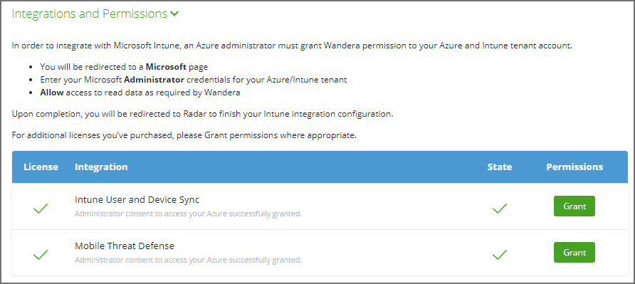
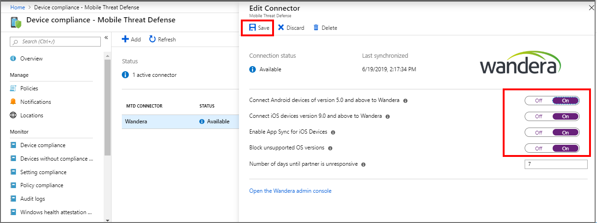

---
# required metadata

title: Set up Wandera Mobile Threat Protection integration with Intune
titleSuffix: Intune on Azure
description: How to set up the Wandera Mobile Threat Protection solution with Microsoft Intune to control mobile device access to your corporate resources.
keywords:
author: brenduns
ms.author: brenduns
manager: dougeby
ms.date: 07/20/2020
ms.topic: how-to
ms.service: microsoft-intune
ms.subservice: protect
ms.localizationpriority: high
ms.technology:
ms.assetid:  

# optional metadata

#ROBOTS:
#audience:

ms.reviewer: aanavath
#ms.suite: ems
search.appverid: MET150
#ms.tgt_pltfrm:
#ms.custom:
ms.collection:
- tier3
- M365-identity-device-management
---

# Integrate Wandera Mobile Threat Protection with Intune  

Complete the following steps to integrate the Wandera Mobile Threat Defense solution with Intune.  

## Before you begin  

Before you start the process to integrate Wandera with Intune, make sure you have the following prerequisites in place:

- Intune subscription
- Azure Active Directory administrator credentials and assigned role that is able to grant the following permissions:

    - Sign in and read user profile
    - Access the directory as the signed-in user
    - Read directory data
    - Send device risk information to Intune
 
- A valid Wandera subscription
    - An administrator account with super admin privileges

## Integration overview

Enabling Mobile Threat Defense integration between Wandera and Intune entails:

- Enabling Wandera’s UEM Connect service to synchronize information with Azure and Intune. This includes user and device Life Cycle Management (LCM) metadata, along with Mobile Threat Defense (MTD) device threat level.
- Create Activation Profiles in Wandera to define device enrollment behavior.
- Deploy Wandera over-the-air to managed iOS and Android devices.
- Configure Wandera for end user self-service using MAM on iOS and Android devices.

## Set up Wandera Mobile Threat Defense integration

Setting up integration between Wandera and Intune does not require any support from Wandera staff and can be easily accomplished in a matter of minutes.

### Enable support for Wandera in Intune

1. Sign in to the [Microsoft Endpoint Manager admin center](https://go.microsoft.com/fwlink/?linkid=2109431).
2. Select **Tenant administration** > **Connectors and tokens** > **Mobile Threat Defense** > **Add**.
3. On the **Add Connector** page, use the dropdown and select **Wandera**. And then select **Create**.  
4. On the Mobile Threat Defense pane, select the **Wandera** MTD Connector from the list of connectors to open the **Edit connector** pane. Select **Open the Wandera admin console** to open [RADAR](https://radar.wandera.com/login), the Wandera admin console, and sign in. 
5. In the Wandera RADAR console, go to **Integrations > UEM Integration**, and select the **UEM Connect** tab. Use the EMM Vendor drop-down and select **Microsoft Intune**.
6. You will be presented with a screen similar to the below, indicating the permission grants required to complete the integration:

    

7. Next to Intune User and Device Sync, click the Grant button to start the process to provide consent for Wandera to perform Life Cycle Management (LCM) functions with Azure and Intune.
8. When prompted, select or enter your Azure admin credentials. Review the requested permissions, then select the checkbox to Consent on behalf of your organization. Finally, click Accept to authorize the LCM integration.

   

9. You will be automatically returned back to the RADAR admin console.  If the authorization was successful, you will see a green tick mark next to the Grant button.
10. Repeat the consent process for the remaining listed integrations by clicking on their corresponding Grant buttons until you have green tick marks next to each.

11.	Return to the Intune console, and resume editing the Wandera MTD Connector. Set all of the available toggles to On, and then Save the configuration.

    

Intune and Wandera are now connected.

## Create Activation Profiles in Wandera

Intune-based deployments are facilitated using Wandera Activation Profiles defined in RADAR.  Each Activation Profile defines specific configuration options like authentication requirements, service capabilities, and initial group membership.

After creating an Activation Profile in Wandera, you “assign” it to users and devices in Intune.  While an Activation Profile is universal across device platforms and management strategies, the steps below define how to configure Intune based upon these differences.

The steps from here assume you have created an Activation Profile in Wandera that you would like to deploy via Intune to your target devices. Please see the [Activation Profiles Guide](https://radar.wandera.com/?return_to=https://wandera.force.com/Customer/s/article/Enrollment-Links) for more details on creating and using Wandera Activation Profiles.

> [!NOTE]
> When creating Activation Profiles for deployment via Intune, be sure to set Associated User to the Authenticated by Identity Provider > Azure Active Directory option for maximum security, cross-platform compatibility, and a streamlined end user experience.

## Deploying Wandera Over-the-Air to MDM-Managed Devices

For iOS and Android devices that are managed by Intune, Wandera can be deployed over-the-air for rapid push-based activations. Be sure you have already created the Activation Profile(s) you need before proceeding with this section. Deploying Wandera to managed devices involves:
- Adding Wandera configuration profiles to Intune and assigning to target devices.
- Adding the Wandera app and respective app configurations to Intune and assigning to target devices.

### Configure and deploy iOS Configuration Profiles 

In this section, you will download **required** iOS device configuration files and then deliver them over-the-air via MDM to your Intune managed devices.

1. In **RADAR**, navigate to the Activation Profile you want to deploy (Devices > Activations), then click the **Deployment Strategies tab > Managed Devices > Microsoft Endpoint Manager**.
2. Expand the **Apple iOS Supervised** or **Apple iOS Unsupervised** sections based upon your device fleet configuration.
3. Download the provided configuration profile(s) and prepare to upload them in a following step.
4. Open **Microsoft Intune admin console** and navigate to **Devices > iOS/iPadOS > Configuration profiles**.  Click **Create profile**.
5. In the panel that appears, choose **iOS/iPadOS** under **Platform**, then **Custom** under Profile. Then click **Create**.
6. In the **Name** field, provide a descriptive title for the configuration, ideally matching what you named the Activation Profile in RADAR. This will help ease cross referencing in the future. Alternatively, provide the Activation Profile code if desired. We recommend indicating if the configuration is for Supervised or Unsupervised devices by suffixing the name as such.
7. Optionally provide a **Description** providing more details for other administrators about the purpose/use of the configuration. Click **Next**.
8. Click **Select a file** and locate the downloaded configuration profile that corresponds to the appropriate Activation Profile downloaded in step 3. Take care to select the appropriate Supervised or Unsupervised profile if you downloaded both. Click **Next**.
   <!-- image placeholder - ending future availability -->
9.	Define **Scope tags** as required by your Intune RBAC practices.  Click **Next**.
10.	**Assign** the configuration profile to groups of users or devices that should have Wandera installed.  We recommend starting with a test group then expanding after validating activations work correctly. Click **Next**.
11.	Review the configuration for correctness editing as needed, the click **Create** to create and deploy the configuration profile.

> [!NOTE]
> Wandera offers an enhanced deployment profile for supervised iOS devices. If you have a mixed fleet of supervised and unsupervised devices, repeat the above steps for the other profile type as needed. These same steps need to be followed for any future Activation Profiles that are to be deployed via Intune. Please contact Wandera support if you have a mixed fleet of supervised and unsupervised iOS devices and need assistance with supervised mode-based policy assignments. 

## Deploying Wandera to unenrolled devices with MAM managed applications
For unenrolled devices with MAM managed applications, Wandera utilizes an integrated authentication-based onboarding experience to activate and protect company data within MAM managed apps. 

The following sections describe how to configure Wandera and Intune to enable end users to seamlessly activate Wandera before being able to access company data. 

### Configure Azure Device Provisioning in a Wandera Activation Profile
Activation Profiles to be used with MAM must have Associated User set to the Authenticated by Identity Provider > Azure Active Directory option.
1. In the **Wandera RADAR** portal, select an existing, or create a new, Activation Profile that unenrolled devices with MAM managed applications will use during enrollment in Devices > Activations. 
2. Click the **Deployment Strategies tab then Unmanaged Devices** then scroll to the **Azure Device Provisioning** section.
3. Enter your **Azure AD Tenant ID** into the appropriate text field. If you don’t have your tenant ID on hand, click the **Get my Tenant ID** link to open Azure AD in a new tab where you can easily copy this value to your clipboard.
4. (Optional) Specify **Group ID(s)** to limit user activations to specific groups.
   - If one or more **Group IDs** are defined, a user activating MAM must be a member of at least one of the specified groups to activate using this Activation Profile.
   - You can set up multiple Activation Profiles configured with the same Azure Tenant ID but with different Group IDs. This allows you to enroll devices into Wandera based upon Azure group membership, enabling differentiated capabilities by group at activation time.
   - You may configure a single “default” Activation Profile that doesn’t specify any Group IDs.  This group will serve as a catch-all for all activations in which the authenticated user isn’t a member of a group with an association to another Activation Profile.
5. Click **Save** in the upper-right corner of the page.

## Next Steps
- With your Wandera Activation Profiles loaded in RADAR, create client apps in Intune to deploy the Wandera app to Android and iOS/iPadOS devices. The Wandera app config provides essential functionality to complement the pushed Device configuration profile(s) and is recommended for all deployments. See [Add MTD apps](mtd-apps-ios-app-configuration-policy-add-assign.md) for the procedures and custom details specific to the Wandera apps. 
- Now that you have Wandera integrated with Endpoint Manager, you can now tune your configuration, view reports, and deploy more broadly across your fleet of mobile devices. For detailed configuration guides, see the [Support Center Getting Started Guide](https://radar.wandera.com/?return_to=https://wandera.force.com/Customer/s/getting-started) in the Wandera documentation.
