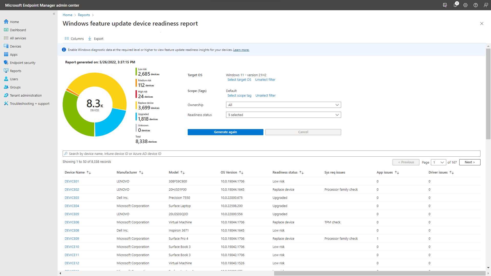
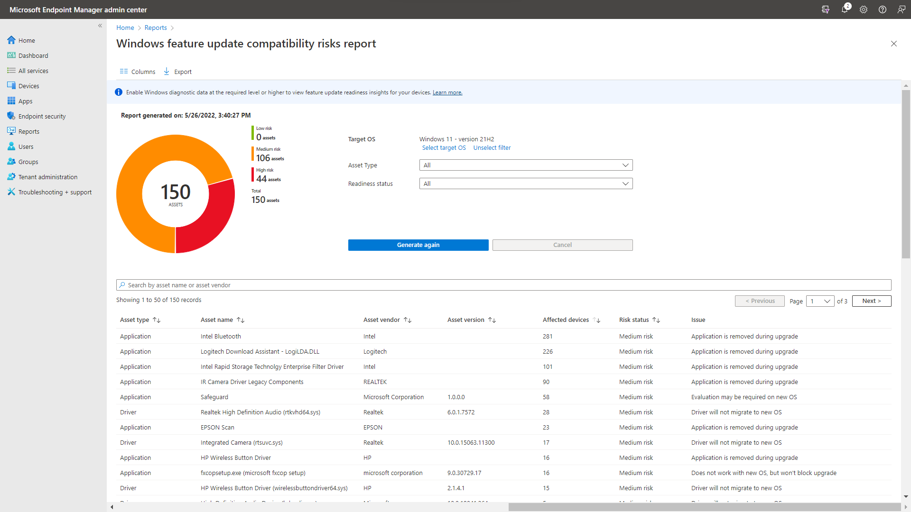

---
# required metadata

title: Use Windows compatibility reports for Windows 10 and Windows 11 updates in Intune
description: Use the app and driver compatibility reports for Windows 10 and Windows 11 devices before you deploy Intune policies for feature updates or update rings.
keywords:
author: brenduns
ms.author: brenduns
manager: dougeby
ms.date: 07/05/2022
ms.topic: how-to
ms.service: microsoft-intune
ms.subservice: protect
ms.localizationpriority: high

# optional metadata

#ROBOTS:
#audience:

ms.reviewer: zadvor
ms.suite: ems
search.appverid: MET150
#ms.tgt_pltfrm:
#ms.custom:
ms.collection: 
  - M365-identity-device-management
  - highpri
  - highseo
---

# App and driver compatibility reports for Windows updates

*This feature is in preview.*

With Intune, you can deploy updates to Windows 10/11 devices by using policies for [Update rings for Windows 10 and later](../protect/windows-10-update-rings.md) and [Feature updates for Windows 10 and later](../protect/windows-10-feature-updates.md). To help prepare for update deployments, Intune offers integrated reports to help you understand compatibility risks that might impact your devices during or after an update:

- **Windows feature update device readiness report (Preview)** - This report provides per-device information about compatibility risks that are associated with an upgrade or update to a chosen version of Windows.

- **Windows feature update compatibility risks report (Preview)** - This report provides a summary view of the top compatibility risks across your organization for a chosen version of Windows. You can use this report to understand which compatibility risks impact the greatest number of devices in your organization.

To use these reports, you must first ensure that prerequisites are met and that devices are properly configured for data collection.

## Prerequisites

### Licensing

The Windows feature update device readiness and Windows feature update compatibility risks reports require users of enrolled devices to have one of the following licenses:

- Windows 10/11 Enterprise E3 or E5 (included in Microsoft 365 F3, E3, or E5)
- Windows 10/11 Education A3 or A5 (included in Microsoft 365 A3 or A5)
- Windows 10/11 Virtual Desktop Access (VDA) per user

### Devices

To be eligible for the Windows feature update device readiness and Windows feature update compatibility risks reports, devices must:

- Run a supported version of Windows 10 or later with the latest cumulative update
- Be Azure AD joined or hybrid Azure AD joined
- Be managed by Intune (including co-managed devices) or a supported version of the Configuration Manager client with [tenant attach enabled](../../configmgr/tenant-attach/device-sync-actions.md)
- Have [Windows diagnostic data enabled](/windows/privacy/configure-windows-diagnostic-data-in-your-organization) at the [Required level](/windows/privacy/configure-windows-diagnostic-data-in-your-organization#diagnostic-data-settings) or higher

Additionally, you must [enable Windows diagnostic data processor configuration](/windows/privacy/configure-windows-diagnostic-data-in-your-organization#enable-windows-diagnostic-data-processor-configuration).

> [!NOTE]  
> If your devices are currently enrolled in Desktop Analytics, then the Windows diagnostic data and processor configuration requirements are already met.

### Users

To view these reports, users must be assigned an Intune role with the **Managed devices** > **View reports** permission. This permission is included in the following built-in roles:

- Endpoint Security Manager
- Read Only Operator
- Help Desk Operator

In addition, to use the **Windows feature update device readiness report (preview)**, users must also have the **Roles** > **Read** permission. This permission is included in the following built-in roles:

- Endpoint Security Manager
- Read Only Operator
- Help Desk Operator
- Intune Role Administrator

## Use the Windows feature update device readiness report

The **Windows feature update device readiness report (preview)**  provides a device-level view of compatibility risks associated with an upgrade or update to a chosen version of Windows.

> [!IMPORTANT]  
> The insights in this report are specific to the target version of Windows you select when generating the report. To ensure accuracy of insights, confirm that your selected OS version matches the version of Windows you intend to deploy.

To use this report:

1. Sign in to the [Microsoft Endpoint Manager admin center](https://go.microsoft.com/fwlink/?linkid=2109431).
2. In the admin center, go to **Reports** > **Windows updates** > select the **Reports** tab > select **Windows Feature Update Device Readiness Report (Preview)**.
3. Configure settings:
   - Click on **Select Target OS** and choose the version of Windows you plan to deploy.
   - Click on **Select Scope (Tags)** and choose which devices should be in scope for this report.
   - Optionally select **Ownership** and **Readiness status** to refine the report.
   - Click **Generate report**. This process can take several minutes. You'll be notified when report generation is complete.

> [!IMPORTANT]
> The data in this report is made available on-demand only. You must configure the Target OS and Scope (Tags) settings, and then click **Generate report** for data to appear in the report.

>[!NOTE]  
> When you generate a report, the data in the report is cached on a per-user basis. Other Intune users in your organization will not be able to see the report you have generated. If you'd like to regenerate the report with different settings or to pull the latest data, follow the steps above and click **Generate again**.

The following columns are available in this report:

- **Device name** - The name of the device.
- **Manufacturer** - The manufacturer of the device.
- **Model** - The model of the device.
- **OS Version** - The current version of Windows installed on the device. For more information on how to interpret OS version data, see [Windows 11 release information](/windows/release-health/windows11-release-information) or [Windows 10 release information](/windows/release-health/release-information)
- **Readiness status** - A summary of the readiness state of the device.
- **Sys req issues** - A summary of any system requirements associated with the target OS version that this device doesn't meet.
- **App issues** - The number of applications installed on this device with a known compatibility risk associated with the target OS version.
- **Driver issues** - The number of drivers installed on this device with a known compatibility risk associated with the target OS version.

The following applies to **Readiness status**:

- **Low risk** - There are no known compatibility risks associated with the device.
- **Medium risk** - There are only minor, or non-blocking, compatibility risks associated with this device, such as applications that will be automatically removed during upgrade.
- **High risk** - There are multiple or blocking compatibility risks associated with this device, such as applications that will block an upgrade.
- **Replace device** - The device isn't capable of upgrading to the target OS version.
- **Upgraded** - The device is already running a version of Windows equal to or greater than the target OS version.
- **Unknown** - A readiness status couldn't be determined. Ensure that the device is properly configured to send Windows diagnostic data.

For more information about the compatibility risks that impact a specific device, select the device name to open the details flyout. The tabs on the details flyout include:

- **Overview** - A summary of device properties that can be used to identify the device, and an overview of the compatibility risks impacting the device.
- **Applications** - A table of applications with compatibility risks that are installed on the device.
- **Drivers** - A table of drivers with compatibility risks that are installed on the device.
- **Other** - A table of compatibility risks that might impact this device, but aren't associated with applications or drivers. Compatibility risks associated with device configurations and settings, such as some [Safeguard holds](/windows/deployment/update/safeguard-holds), fall into this category.

## Use the Windows feature update compatibility risks report

The **Windows feature update compatibility risks report (preview)**  provides a summary view of the compatibility risks across your organization associated with an upgrade or update to a chosen version of Windows.

> [!IMPORTANT]  
> The insights in this report are specific to the target version of Windows you select when generating the report. To ensure accuracy of insights, confirm that your selected OS version matches the version of Windows you intend to deploy.

To use this report:

1. Sign in to the [Microsoft Endpoint Manager admin center](https://go.microsoft.com/fwlink/?linkid=2109431).
2. In the admin center, go to **Reports** > **Windows updates** > select the **Reports** tab > select **Windows Feature Update Compatibility Risks Report (Preview)**.
3. Configure settings:

   - Click on **Select Target OS** and choose the version of Windows you plan to deploy.
   - Optionally select **Asset type** and **Risk status** to refine the report.
   - Click **Generate report**. This process can take several minutes. You'll be notified when report generation is complete.

> [!NOTE]
> When you generate a report, the data in the report is cached on a per-user basis. Other Intune users in your organization will not be able to see the report you have generated. If you'd like to regenerate the report with different settings or to pull the latest data, follow the steps above and click **Generate again**.

The following columns are available in this report:

- **Asset type** - The type of asset that has a compatibility risk. Options include Application, Driver, and Other.
- **Asset name** - The name of the asset with a compatibility risk, such as the application name.
- **Asset vendor** - The name of the vendor who publishes the asset with a compatibility risk.
- **Asset version** - The version of the asset with a compatibility risk.
- **Affected devices** - The number of enrolled devices that might be impacted by this compatibility risk.
- **Risk status** - A summary of the severity of the compatibility risk. Most compatibility risks are either **Medium risk** if they might block the upgrade.
- **Issue** - A description of the compatibility risk that has been identified.

For more information about a specific compatibility risk, including which devices are potentially impacted, select the number in the **Affected devices** column to open the details flyout. The tabs on the details flyout include:

- **Overview** - A summary of the compatibility risk, including asset details and the compatibility assessment. When available, the **Guidance** section provides recommended actions to mitigate the compatibility risk.
- **Affected devices** - A table of the devices that may be impacted by this compatibility risk.

## About reporting data latency

The data source for these reports is [Windows diagnostic data](/windows/privacy/configure-windows-diagnostic-data-in-your-organization). Data typically uploads from enrolled devices once per day and is then processed in batches before being made available in Intune. The maximum end-to-end latency is approximately 52 hours.

## Known issues

### Exported csv files display numerical values

When report data is exported to a .csv file, the exported data doesn't use the friendly names you're used to seeing in the online reports. Use the information below to map the data in the exported file into the meaning of the value:

#### Windows feature update device readiness report (preview)

**Ownership**:

| Ownership .csv value |Report value |
|----------------------|-------------|
| 0                    | Unknown     |
| 1                    | Corporate   |
| 2                    | Personal    |

**Readiness status**:

| Readiness status .csv value | Report value |
|-----------------------------|--------------|
| 0                    | Low risk            |
| 1                    | Medium risk         |
| 2                    | High risk           |
| 3                    | Replace device      |
| 4                    | Upgraded            |
| 5                    | Unknown             |

**Sys req issues** (Some report values map to multiple .csv values):

| Sys req issues .csv value | Report value        |
|---------------------------|---------------------|
| 1, 8, 10                  | Processor family    |
| 2                         | RAM                 |
| 3                         | BIOS                |
| 4                         | Basic display driver|
| 5                         | TPM                 |
| 6, 12                     | System drive size   |
| 7                         | Secure boot         |
| 9                         | Network             |
| 11, 13                    | Driver block        |
| 14                        | S mode              |
| 15                        | Storage             |

> [!NOTE]  
> When exported, the **sys req issues** column is represented as a comma-separated list of all values that apply to the device. For example, a value of "1, 2" means the device does not meet the processor family or the RAM requirement for the target OS version selected.

#### Windows feature update compatibility risks report (preview)

**Asset Type**:

| Asset Type .csv value | Report value |
|-----------------------|--------------|
| 0                     | Device       |
| 1                     | Application  |
| 2                     | Driver       |
| 3                     | Other        |

**Risk status** (This column is called *Readiness status* in the .csv export):

| Readiness status .csv value | Risk status report value |
|-----------------------------|-------------|
| 0                           | Low risk    |
| 1                           | Medium risk |
| 2                           | High risk   |

**Issue** (*Asset Type* is required to properly map exported Issue values):

| Asset Type | Issue .csv value | Issue | Guidance |
|------------|------------------|-------|----------|
| Application, Other | 1 | Doesn't work with new OS, but won't block upgrade. | Application won't work on new OS. No action is required for upgrade to proceed.   |
| Application, Other | 2 | Evaluate application on new OS. | Application may have issues on new OS. No action is required for upgrade to proceed.   |
| Application, Other | 3 | Reinstall application after upgrading. | No action is required for upgrade to proceed. Application will work on new OS, but must be reinstalled.   |
| Application, Other | 4 | Disk encryption blocking upgrade. | Disable disk encryption before upgrading. You can re-enable it after.   |
| Application, Other | 5 | Blocking upgrade. | Remove application before upgrading. Application may work on new OS.   |
| Application, Other | 6 | Blocking upgrade, update application to newest version. | Update application before upgrading. Compatible version is available.   |
| Application, Other | 7 | locking upgrade, but can be reinstalled after upgrading. | Remove application before upgrading. Application will work on new OS, but must be reinstalled.   |
| Application, Other | 8 | Application is removed during upgrade. | Application is removed during upgrade due to compatibility issues. No action is required for the upgrade to proceed, but be sure to test the application on the new OS, and check with the developer for a compatible version if needed.   |
| Application, Other | 9 | Evaluation may be required on new OS. | Windows may upgrade, but applications or drivers can have issues.   |
| Driver | 1 | Driver won't migrate to new OS. | Check with vendor for compatible driver.   |
| Driver | 2 | Driver won't migrate to new OS. | Driver is replaced with a new version (either inbox or via Windows Update). No action is required for upgrade to proceed.   |
| Driver | 3 | Blocking upgrade. | Can't upgrade.   |

> [!NOTE]  
> **Guidance** information is not included in the .csv export file. The mapping table above includes **Guidance** data for each **Issue** type.

## Next step

- Configure [Update rings for Windows 10 and later](../protect/windows-10-update-rings.md)
- Configure [Feature updates for Windows 10 and later](../protect/windows-10-feature-updates.md)
