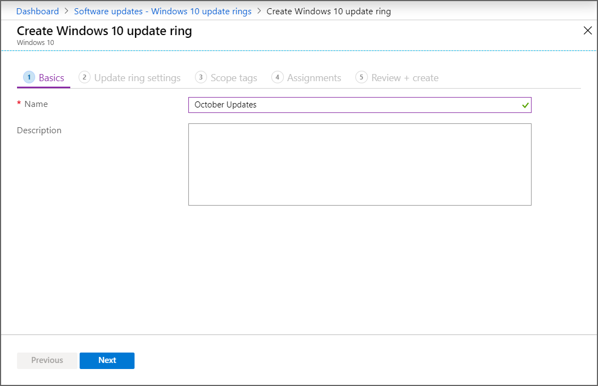
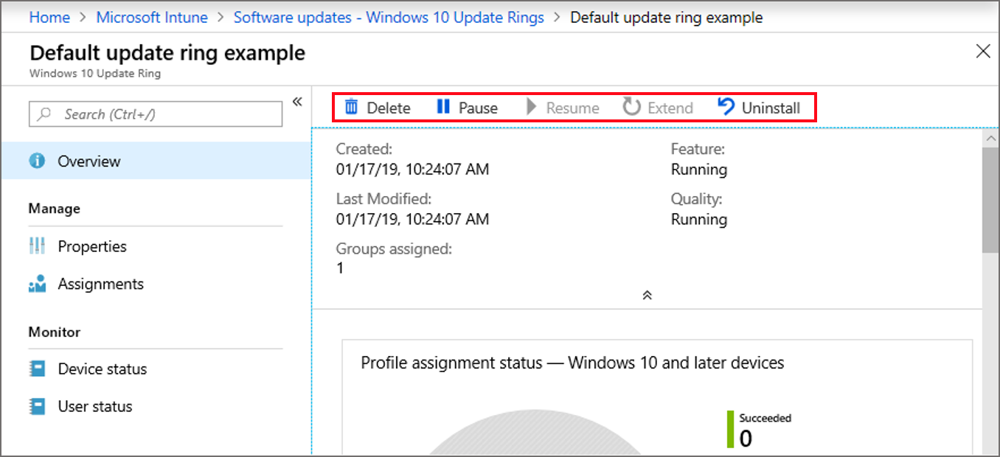

---
# required metadata

title: Configure Windows Update for Business in Microsoft Intune - Azure | Microsoft Docs
description: Manage Windows 10 Software Updates by using update rings and feature updates policy. You can review compliance, and  pause update installation with Windows Update for Business settings using Microsoft Intune.
keywords:
author: brenduns
ms.author: brenduns
manager: dougeby
ms.date: 01/29/2020
ms.topic: conceptual
ms.service: microsoft-intune
ms.subservice: protect
ms.localizationpriority: high
ms.technology:

# optional metadata

#ROBOTS:
#audience:
#ms.devlang:
ms.reviewer: mghadial
ms.suite: ems
search.appverid: MET150
#ms.tgt_pltfrm:
#ms.custom:
ms.collection: M365-identity-device-management
---

# Manage Windows 10 software updates in Intune

Use Intune to manage the install of Windows 10 software updates from Windows Update for Business.

By using Windows Update for Business, you simplify the update management experience. You don’t need to approve individual updates for groups of devices. You can manage risk in your environments by configuring an update rollout strategy. Intune provides the ability to [configure update settings](windows-update-settings.md) on devices and gives you the ability to defer update installation. You can also prevent devices from installing features from new Windows versions to help keep them stable, while allowing those devices to continue installing updates for quality and security.

Intune stores only the update policy assignments, not the updates themselves. Devices access Windows Update directly for the updates.

Intune provides the following policy types to manage updates:

- **Windows 10 update ring**: This policy is a collection of settings that configures when Windows 10 updates get installed.

- **Windows 10 feature updates (public preview)**: This policy brings devices to the Windows version you specify and freezes the feature set on those devices until you choose to update them to a later Windows version.  While the feature version remains static, devices can continue to install quality and security updates that are available for their feature version.

You assign policies for Windows 10 update rings and Windows 10 feature updates to groups of devices. You can use both policy types in the same Intune environment to manage software updates for your Windows 10 devices and to create an update strategy that mirrors your business needs.

For more information, see [Manage updates using Windows Update for Business](https://technet.microsoft.com/itpro/windows/manage/waas-manage-updates-wufb).

## Prerequisites

The following prerequisites must be met to use Windows updates for Windows 10 devices in Intune.

- Windows 10 PCs must run the following Windows 10 versions:
  - **Windows 10 update rings**: version 1607 or later
  - **Windows 10 feature updates**: version 1703 or later

- Windows Update supports the following Windows 10 editions:
  - Windows 10
  - Windows 10 Team - for Surface Hub devices (doesn't support *Windows 10 feature updates*)
  - Windows Holographic for Business

    Windows Holographic for Business supports a subset of settings for Windows updates, including:
    - **Automatic update behavior**
    - **Microsoft product updates**
    - **Servicing channel**: Supports **Semi-annual channel** and **Semi-annual channel (Targeted)** options. For more information, see [Manage Windows Holographic](../fundamentals/windows-holographic-for-business.md).

  > [!NOTE]
  > **Unsupported versions and editions**:
  > - Windows 10 Mobile  
  > - Windows 10 Enterprise LTSC. Windows Update for Business (WUfB) does not currently support *Long Term Service Channel* releases. Plan to use alternative patching methods, like WSUS or Configuration Manager.

- On Windows devices, **Feedback & diagnostics** > **Diagnostic and usage data** must be set to **Basic**, **Enhanced**, or **Full**.

  You can configure the *Diagnostic and usage data* setting for Windows 10 devices manually or use an Intune device restriction profile for Windows 10 and later. If you use a device restriction profile, set the [device restriction setting](../configuration/device-restrictions-windows-10.md#reporting-and-telemetry) of **Share usage data** to at least **Basic**. This setting is found under the  **Reporting and Telemetry** category when you configure a device restriction policy for Windows 10 or later.

  For more information about device profiles, see [configure device restriction settings](../configuration/device-restrictions-configure.md).

## Windows 10 update rings

Create update rings that specify how and when Windows as a Service updates your Windows 10 devices with Feature and Quality updates. With Windows 10, new Feature Updates and Quality Updates include the contents of all previous updates. As long as you've installed the latest update, you know your Windows 10 devices are up to date. Unlike with previous versions of Windows, you now must install the entire update instead of part of an update.

Windows 10 update rings support [scope tags](../fundamentals/scope-tags.md). You can use scope tags with update rings to help you filter and manage sets of configurations that you use.

### Create and assign update rings

1. Sign in to the [Microsoft Endpoint Manager Admin Center]( https://go.microsoft.com/fwlink/?linkid=2109431).

2. Select **Devices** > **Windows** > **Windows 10 Update Rings** > **Create**.

3. Under *Basics*, specify a name, a description (optional), and then select **Next**.
  
  
4. Under **Update ring settings**, configure settings for your business needs. For information about the available settings, see Windows update settings. After configuring *Update and User experience* settings, select **Next**.

5. Under **Scope tags**, select **+ Select scope tags** to open the *Select tags* pane if you want to apply them to the update ring. Choose one or more tags, and then click **Select** to add them to the update ring and return to the *Scope tag*s page.

   When ready, select **Next** to continue to *Assignments*.

6. Under **Assignments**, choose **+ Select groups to include** and then assign the update ring to one or more groups. Use **+ Select groups to exclude** to fine-tune the assignment. Select **Next** to continue.

7. Under **Review + create**, review the settings, and then select **Create** when ready to save your Windows 10 update ring. Your new update ring is displayed in the list of update rings.

### Manage your Windows 10 Update rings

In the portal, navigate to **Devices** > **Windows** > **Windows 10 Update Rings** and select the policy that you want to manage.  The policy opens to its **Overview** page.

From this page, you can view the rings assignment status and select the following actions from the top of the Overview pane to manage the update ring:

- [Delete](#delete)
- [Pause](#pause)
- [Resume](#resume)
- [Extend](#extend)
- [Uninstall](#uninstall)

#### Delete

Select **Delete** to stop enforcing the settings of the selected Windows 10 update ring. Deleting a ring removes its configuration from Intune so that Intune no longer applies and enforces those settings.

Deleting a ring from Intune doesn't modify the settings on devices that were assigned the update ring.  Instead, the device keeps its current settings. Devices don't maintain a historical record of what settings they held previously. Devices can also receive settings from additional update rings that remain active.

##### To delete a ring

1. While viewing the overview page for an Update Ring, select **Delete**.
2. Select **OK**.

#### Pause

Select **Pause** to prevent assigned devices from receiving Feature Updates or Quality Updates for up to 35 days from the time you pause the ring. After the maximum days have passed, pause functionality automatically expires and the device scans Windows Updates for applicable updates. Following this scan, you can pause the updates again.
If you resume a paused update ring, and then pause that ring again, the pause period resets to 35 days.

##### To pause a ring

1. While viewing the overview page for an Update Ring, select **Pause**.
2. Select either **Feature** or **Quality** to pause that type of update, and then select **OK**.
3. After pausing one update type, you can select Pause again to pause the other update type.

When an update type is paused, the Overview pane for that ring displays how many days remain before that update type resumes.

> [!IMPORTANT]
> After you issue a pause command, devices receive this command the next time they check into the service. It's possible that before they check in, they might install a scheduled update. Additionally, if a targeted device is turned off when you issue the pause command, when you turn it on, it might download and install scheduled updates before it checks in with Intune.

#### Resume

While an update ring is paused, you can select **Resume** to restore Feature and Quality updates for that ring to active operation. After you resume an update ring, you can pause that ring again.

##### To resume a ring

1. While viewing the overview page for a paused Update Ring, select **Resume**.
2. Select from the available options to resume either **Feature** or **Quality** updates, and then select **OK**.
3. After resuming one update type, you can select Resume again to resume the other update type.

#### Extend  

While an update ring is paused, you can select **Extend** to reset the pause period for both Feature and Quality updates for that update ring to 35 days.

##### To Extend the pause period for a ring

1. While viewing the overview page for a paused Update Ring, select **Extend**.
2. Select from the available options to resume either **Feature** or **Quality** updates, and then select **OK**.
3. After extending the pause for one update type, you can select Extend again to extend the other update type.

#### Uninstall  

An Intune administrator can use **Uninstall** to uninstall (roll back) the latest *feature* update or the latest *quality* update for an active or paused update ring. After uninstalling one type, you can then uninstall the other type. Intune doesn't support or manage the ability of users to uninstall updates.  

> [!IMPORTANT]
> When you use the *Uninstall* option, Intune passes the uninstall request to devices immediately.
>
> - Windows devices start removal of updates as soon as they receive the change in Intune policy. Update removal isn't limited to maintenance schedules, even when they're configured as part of the update ring.
> - If the update removal requires a device restart, the device  restarts without offering device users an option to delay.

For Uninstall to be successful:

- A device must run the Windows 10 April 2018 update (version 1803) or later.

A device must have installed the latest update. Because updates are cumulative, devices that install the latest update will have the most recent feature and quality update. An example of when you might use this option is to roll back the last update should you discover a breaking issue on your Windows 10 machines.

Consider the following when you use Uninstall:

- Uninstalling a feature or quality update is only available for the servicing channel the device is on.

- Using uninstall for Feature or Quality updates triggers a policy to restore the previous update on your Windows 10 machines.

- On a Windows 10 device, after a quality update is successfully rolled back, device users continue to see the update listed in **Windows settings** > **Updates** > **Update History**.

- For Feature updates specifically, the time you can uninstall the update is limited from 2-60 days. This period is configured by the update rings Update setting **Set feature update uninstall period (2 – 60 days)**. You can't roll back a feature update that's been installed on a device after the update has been installed for longer than the configured uninstall period.

  For example, consider an update ring with a feature update uninstall period of 20 days. After 25 days you decide to roll back the latest feature update and use the Uninstall option.  Devices that installed the feature update over 20 days ago can't uninstall it as they've removed the necessary bits as part of their maintenance. However, devices that only installed the feature update up to 19 days ago can uninstall the update if they successfully check in to receive the uninstall command before exceeding the 20-day uninstall period.

For more information about Windows Update policies, see [Update CSP](https://docs.microsoft.com/windows/client-management/mdm/update-csp) in the Windows client management documentation.

##### To uninstall the latest Windows 10 update

1. While viewing the overview page for a paused Update Ring, select **Uninstall**.
2. Select from the available options to uninstall either **Feature** or **Quality** updates, and then select **OK**.
3. After triggering the uninstall for one update type, you can select Uninstall again to uninstall the remaining update type.

## Windows 10 feature updates

*This feature is in public preview.*

With *Windows 10 feature updates*, you select the Windows feature version that you want devices to remain at, like Windows 10 version 1803 or version 1809. You can set a feature level of 1803 or later.

When a device receives a Windows 10 feature updates policy:

- The device will update to the version of Windows specified in the policy. A device that already runs a later version of Windows remains at its current version. By freezing the version, the devices feature set remains stable for the duration of the policy.

- While the installed version of Windows remains set, devices can still receive and install quality and security updates for their Windows version for the duration of support for that version, which helps you to keep devices current and secure.

- Unlike using *Pause* with an update ring, which expires after 35 days, the Windows 10 feature updates policy remains in effect. Devices won’t install a new Windows version until you modify or remove the Windows 10 feature updates policy. If you edit the policy to specify a newer version, devices can then install the features from that Windows version.

### Prerequisites for Windows 10 feature updates

The following prerequisites must be met to use Windows 10 feature updates in Intune.

- Devices must be enrolled in Intune MDM and Azure AD joined or Azure AD registered.
- To use the Feature Updates policy with Intune, devices must have telemetry turned on, with a minimum setting of [*Basic*](../configuration/device-restrictions-windows-10.md#reporting-and-telemetry). Telemetry is configured under *Reporting and Telemetry* as part of a [Device Restriction policy](../configuration/device-restrictions-configure.md).
  
  Devices that receive Feature Updates policy and that have telemetry set to *Not configured*, which means it’s off, might install a later version of Windows than defined in the Feature Update policy. The prerequisite to require telemetry is under review as this feature moves towards general availability.

### Limitations for Windows 10 feature updates

- When you deploy a *Windows 10 feature update* policy to a device that also receives a *Windows 10 update ring* policy, review the update ring for the following configurations:
  - The **Feature update deferral period (days)** must be set to **0**.
  - Feature updates for the update ring must be *running*. They must not be paused.

- Windows 10 feature update policies cannot be applied during the Autopilot out of box experience (OOBE) and will only apply at the first Windows Update scan after a device has finished provisioning (which is typically a day).

### Create and assign Windows 10 feature updates

1. Sign in to the [Microsoft Endpoint Manager Admin Center](https://go.microsoft.com/fwlink/?linkid=2109431).

2. Select **Devices** > **Windows** > **Windows 10 Feature updates** > **Create**.

3. Under **Basics**, specify a name, a description (optional), and for **Feature update to deploy**, select the version of Windows with the feature set you want, and then select **Next**.

4. Under **Assignments**, choose **+ Select groups to include** and then assign the feature update deployment to one or more groups. Select **Next** to continue.

5. Under **Review + create**, review the settings and select **Create** when ready to save the Windows 10 feature updates policy.  

### Manage Windows 10 feature updates

In the admin center, go to **Devices** > **Windows** > **Windows 10 Feature updates** and select the policy that you want to manage. The policy opens to its **Overview** pane.

From this pane, you can:

- Select **Delete** to delete the policy from Intune and remove it from devices.
- Select **Properties** to modify the deployment.  On the *Properties* pane, select **Edit** to open the *Deployment settings or Assignments*, where you can then modify the deployment.
- Select **End user update status** to view information about the policy.

## Validation and reporting for Windows 10 updates

For both Windows 10 update rings and Windows 10 feature updates, use [Intune compliance reports for updates](../windows-update-compliance-reports.md) to monitor update status of devices. This solution uses [Update Compliance](https://docs.microsoft.com/windows/deployment/update/update-compliance-monitor) with your Azure subscription.

## Next steps

[Windows update settings supported by Intune](../windows-update-settings.md)

[Troubleshooting Windows 10 update rings](https://techcommunity.microsoft.com/t5/Intune-Customer-Success/Support-Tip-Troubleshooting-Windows-10-Update-Ring-Policies/ba-p/714046)