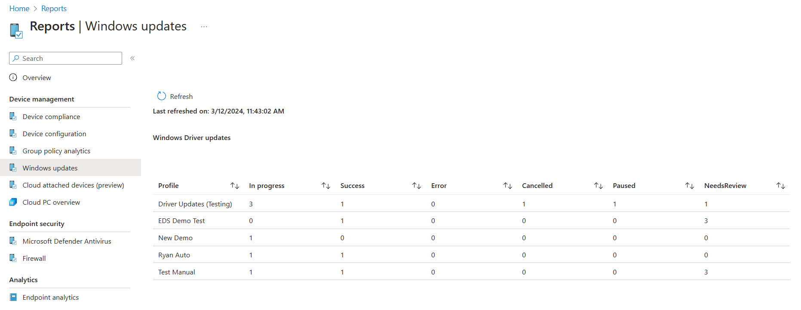
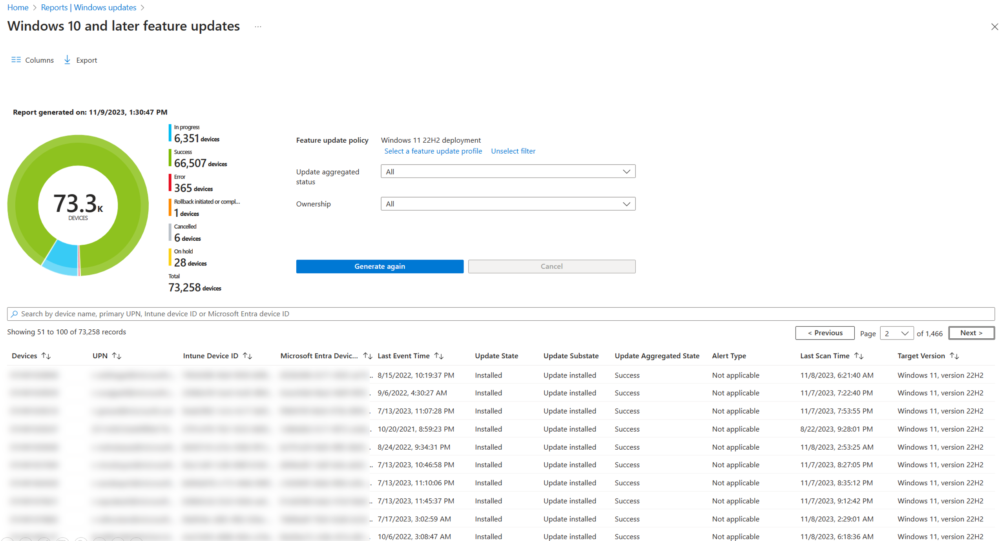
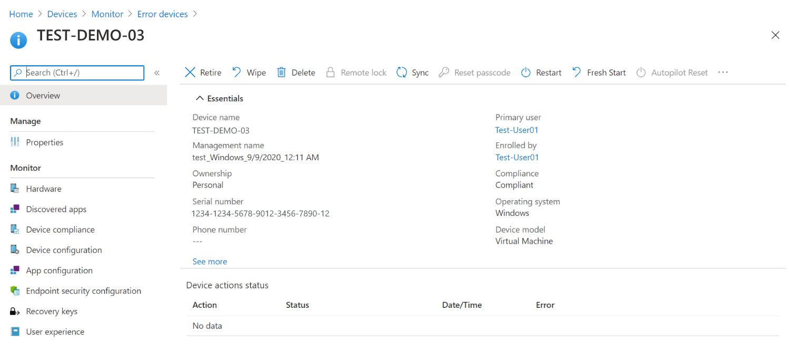

---
# required metadata

title: Use Windows Update for Business reports for Windows Updates in Microsoft Intune
titleSuffix: Microsoft Intune
description: Use Windows Update for Business reports to view data for Windows Updates you deploy with Intune.
keywords:
author: brenduns
ms.author: brenduns
manager: dougeby
ms.date: 12/09/2022
ms.topic: how-to
ms.service: microsoft-intune
ms.subservice: protect
ms.localizationpriority: high

# optional metadata

#ROBOTS:
#audience:

ms.reviewer: zadvor
ms.suite: ems
search.appverid: MET150
#ms.tgt_pltfrm:
#ms.custom:
ms.collection:
- tier1
- M365-identity-device-management
- highpri
- highseo
---

# Intune reports for updates

With Intune, you can deploy updates to Windows 10/11 devices by using policies for [Update rings for Windows 10 and later](../protect/windows-10-update-rings.md)  and [Feature updates for Windows 10 and later](../protect/windows-10-feature-updates.md). To help you monitor and troubleshoot update deployments, Intune supports the following reporting options:

- **Reports in Intune**:
  - **Windows 10 update rings** – Use a [built-in report](#reports-for-update-rings-for-windows-10-and-later-policy) that's ready by default when you deploy update rings to your devices.
  - **Windows 10 feature updates** – Use [two built-in reports](#reports-for-windows-10-and-later-feature-updates-policy) that work together to gain a deep picture of update status and issues. These reports require you to configure data collection from devices before the reports can display data about feature updates.

- **Windows Update for Business reports**:

  [Use Windows Update for Business reports with Intune](#use-windows-update-for-business-reports) to monitor Windows update rollouts. Windows Update for Business reports is a free service built on Azure Monitor and Log Analytics.

For more information, see [Monitor Windows Updates with Windows Update for Business reports](/windows/deployment/update/wufb-reports-overview) in the Windows documentation.

## Reports for Update rings for Windows 10 and later policy

Intune offers integrated report views for the Windows update ring policies you deploy. These views display details about the update ring deployment and status:

1. Sign in to [Microsoft Intune admin center](https://go.microsoft.com/fwlink/?linkid=2109431).

2. Select **Devices** > **Monitor**. Then under **Software updates** select **Per update ring deployment state** and choose the deployment ring to review. 
   <!--  Recent update has muddled the locatio of the following 
   In the **Monitor** section, choose from the following reports to view more detailed information about the update ring:
   - **Device status** – View the device configuration status. See [Update deviceConfigurationDeviceStatus](/graph/api/intune-deviceconfig-deviceconfigurationdevicestatus-update?view=graph-rest-1.0&preserve-view=true).
   - **User status** – View the user name, status, and last report date. See [List deviceConfigurationUserStatuses](/graph/api/intune-deviceconfig-deviceconfigurationuserstatus-list?view=graph-rest-1.0&preserve-view=true).
   - **End-user update status** – View the Windows device update state. See [windowsUpdateState](/graph/api/resources/intune-shared-windowsupdatestate?view=graph-rest-beta&preserve-view=true).
    --> 
## Reports for Windows 10 and later feature updates policy

Intune offers integrated reports to view detailed Windows update deployment status for devices using Feature updates for Windows 10 and later policies. To use reports for this feature, you must first configure prerequisites and policies that support data collection from devices.

The data in the Intune reports for Feature updates for Windows 10 and later policy is used only for these reports and doesn't surface in other Intune reports.

- [Windows 10 feature updates (Organizational)](#use-the-windows-10-feature-updates-organizational-report)  - This report provides an overall view of compliance for devices on a per-policy basis.
- [Feature update failures report (Operational)](#use-the-feature-update-failures-operational-report) – This report provides details on Alerts – errors, warnings, information, and recommendations – on a per-policy basis to help troubleshoot and optimize your devices.

Before you can use the feature updates policy reports, you must configure prerequisites for the report.

### Prerequisites  

- **Data collection**:  Before a device can send the reporting data that's used in the Windows 10 feature updates report for Intune, you must [Configure data collection](#configure-data-collection):

  - Service-based data is collected for all feature update versions and doesn't require you to configure data collection. 
  - Client-based data is collected from devices only after data collection is configured.
  
  Service and client-based data is described in [Use the Windows 10 feature updates (Organizational) report](#use-the-windows-10-feature-updates-organizational-report) later in this article.

- **Devices**: Devices must:

  - Meet the [prerequisites for Windows 10 and later feature updates policy](../protect/Windows-10-feature-updates.md#prerequisites) as documented in **Feature updates for Windows 10 and later policy in Intune**.
  - Be Azure Active Directory Joined, or Hybrid Azure Active Directory Joined to support submitting of data for  reporting.
  - Run Windows 10 1903 or later, or Windows 11. Although Windows 10 and later feature updates policy supports earlier versions of Windows, earlier versions don't support reporting of the data that Intune uses for the feature updates reports.

### Configure data collection

The data that powers Intune's Windows feature updates reports isn't collected by the typical device sync with Intune, but through the *[Windows health monitoring](../configuration/windows-health-monitoring.md)* device configuration policy, which uses the Windows 10/11 and Windows Server Connected User Experiences and Telemetry component (DiagTrack) to collect the data from Intune-managed devices. To enable use of this data in the reports, you must configure devices to send Windows Updates data.

#### Enable data collection

To Configure this setting for your devices, [Create a profile](../configuration/device-profile-create.md#create-the-profile) with  the following information: 

  - **Platform**: Select **Windows 10 and later**
  
  - **Profile**: Select **Windows health monitoring**
  
  - **Name**: Enter a descriptive name for the profile, like **Intune data collection policy**
   
  - **Description**: Enter a description for the profile. This setting is optional, but recommended.
    
  - In **Configuration Settings**:
   
       - **Health Monitoring**: Select *Enable* to collect event information from supported Windows 10/11 devices
    
       - **Scope**: Select *Windows Updates*.

  - Use the [Scope tags](../configuration/device-profile-create.md#scope-tags) and [Applicability rules](../configuration/device-profile-create.md#applicability-rules) to filter the profile to specific IT groups or devices in a group that meet a specific criteria.  Only Windows 10 version 1903 and later and Windows 11 are supported for these reports.

    > [!div class="mx-imgBorder"]
    > 

When you complete the creation of the Windows health monitoring profile, the profile deploys to the assigned groups, and configuration of data collection is complete.

It can take up to 24 hours after setting up Windows health monitoring with Windows updates before the policy is applied.  

> [!TIP]
> If you use [Endpoint Analytics](../../analytics/overview.md), you can modify the existing configuration profile. The same policy is used to collect data for Endpoint Analytics.

### About reporting data latency

The data for these reports is generated at different times, which depend on the type of data:

- **Service-based data from Windows Update** – This data typically arrives in less than an hour after an event happens in the service. Events include Alerts for a device that can't register with Windows Update (which is viewable in the *Feature update failures report*), to status updates about when Windows Update began offering an update to clients. This data is available without configuring data collection.

- **Client-based data from Intune devices that are configured to send data to Intune** – This data is processed in batches and refreshes every eight hours, but is only available after you configure data collection. The data contains information like when a client doesn't have enough disk space to install an update. This data is also used in the Windows 10 feature updates organizational report to show the various installation steps a device moves through when installing feature updates.

### Use the Windows 10 feature updates (Organizational) report

The **Windows 10 feature updates** report provides an overview of compliance for devices you target with a [Windows feature updates](../protect/windows-10-feature-updates.md) policy.

> [!IMPORTANT]
> Before this report can show data, you must [configure data collection](#configure-data-collection) for the Windows feature updates reports.

This report provides you update installation status that's based on the update state from device and device-specific update details. The data in this report is timely, calls out the device name and state, and other update-related details. This report also supports filtering, searching, paging, and sorting.

To use the report:

1. Sign in to the [Microsoft Intune admin center](https://go.microsoft.com/fwlink/?linkid=2109431).

2. To view a summary report across all Windows 10 and later feature updates policies:

   - In the admin center, go to **Reports** > **Windows updates**. The default view displays the **Summary** tab:
     > [!div class="mx-imgBorder"]
     > 

3. To open the **Windows 10 feature updates** report and view device details for a specific feature updates profile:

   - In the admin center, go to **Reports** > **Windows updates** > select the **Reports** tab > select **Windows Feature Update Report**.

   - Click on **Select a feature update profile**, select a profile, and then **Generate report**.

   - Select **Update status** and **Ownership** to refine the report.
     > [!div class="mx-imgBorder"]
     > 
  
   The following list identifies the columns that are available in the view:
   - **Devices** – The name of the device.
   - **UPN** – Intune user identifier (email).
   - **Intune Device ID** – Intune device identifier.
   - **AAD Device ID** – Azure Active Directory identifier for device.
   - **Last Event Time** – The last time there was new data, or something happened for the device and update.
   - **Update State** – The state of the update for the device. Initial state data is from the service-side, which is the status of the update in the system before it begins to install on the device. When client-side data is available, client-side data is shown, replacing the server-side data.
   - **Update Substate** – A low-level detailed version of the Update State.
   - **Update Aggregated Status** – A high-level summary of the Update State, like *In progress* or *Error*.
   - **Alert Type** – When applicable, Alert Type displays the most recent alert message.
   - **Alert Details** – *This column isn't in use.*
   - **Last Scan Time** – The last time this device ran a scan for Windows Update.

   The following information applies to **Update State** and **Update Substate**:

   - **Service-side data**:
     - **Pending**:
       - **Validation** – The update can't be offered to the device because of a validation issue with the device and Windows Update.
       - **Scheduled** – The update isn't ready to be offered to the device but it's scheduled to be offered.
     - **On hold**:
       - **Admin paused** – The update is on hold because the Deployment being paused by an explicit Administrator action.
       - **ServicePaused** – The update is on hold because of an automatic action by Windows Update.
     - **Canceled**:
       - **Admin Cancelled** – The update offer was canceled by explicit Administrator action.
       - **Service Cancelled** – The update was canceled by Windows Update for one of the following reasons:  
           - The *end of service* for the selected content was reached and it’s no longer offered by Windows Update. For example, the device might have been added to a deployment after the content’s availability expired, or the content reached its end of service date before it could install on the device.
           - The deployment content has been superseded for the device. This can happen when the device is targeted by another deployment that deploys newer content. For example, one deployment targets the Windows 10 device to install version 2004 and a second deployment targets that same device with version 21H1. In this event, 2004 is superseded by the 21H1 deployment and Windows Update cancels the 2004 deployment to the device.
       - **Removed from Deployment** – The update offer was canceled because it was removed from the Deployment by explicit Administrator action.
     - **Offering**:
       - **OfferReady** – The update is currently being offered to the device by Windows Update.

   - **Client-side data**:
     - **On Hold**:
       - **Deferred** – Windows Update for Business (WUfB) policies are causing the device to defer the update being offered.
     - **Offering**:
       - **Offer Received** – The device scanned against Windows Update (WU) and identifies that the update is applicable but hasn't begun to download it.
     - **Installing**:
       - **Download Start** – The download process has begun.
       - **Download Complete** – The download process has completed.
       - **Install Start** – The pre-restart install process has started.
       - **Install Complete** – The pre-restart install process has finished. If the update doesn't require a restart, the update process ends here.
       - **Restart Required** – A restart is required to finish update.
       - **Restart Initiated** – The device has gone into restart.
       - **Restart Complete** – The device has come back from restart.
     - **Installed**:
       - **Update Installed** – The update successfully installed.
     - **Uninstalling**:
       - **Uninstall** – The device is actively uninstalling the update.
       - **Rollback** – A rollback has been initiated to a previous update because of a serious issue during installation.
       - **Update Uninstalled** – The update successfully uninstalled.
       - **Rollback complete** – A rollback has completed.
     - **Cancelled**:
       - **User Cancelled** – A user canceled the update.
       - **Device Cancelled** – The device canceled the update for a user. This action is usually because the update no longer applies.

   - **Other**:
     - **Needs attention**: The device has some issue and needs attention.

### Use the Feature update failures (Operational) report

The **Feature update failures** operational report provides details for devices that you target with a [Windows 10 and later feature updates](../protect/windows-10-feature-updates.md) policy, and that have attempted to install an update. Devices in this report might have an Alert that prevents the device from completing installation of the update.

> [!IMPORTANT]  
> Before this report can show data, you must [configure data collection](#configure-data-collection) for the Windows feature updates reports.

This report provides insights to update installation status, including the number of devices with errors. It also supports drilling in for more details to help you troubleshoot issues with the installation. This report supports filtering, searching, paging, and sorting.

To use the report:

1. Sign in to the [Microsoft Intune admin center](https://go.microsoft.com/fwlink/?linkid=2109431).

2. Select **Devices** > **Monitor**, and then below *Software updates* select **Feature update failures**.

   - The initial view displays a per-profile summary of how many devices have alerts for each of your profiles with the version of Windows that the profile targets:

     > [!div class="mx-imgBorder"]
     > 

   - Selecting a profile opens a dedicated view that contains all active Alerts for that profile.

   - While viewing the active alerts for the profile:

     - Select an *Alert Message* to open a pane that displays more details for that alert:
       > [!div class="mx-imgBorder"]
       > 

     - Select the device name to open the Device page:
       > [!div class="mx-imgBorder"]
       > 

The following list identifies Alert Messages, and suggested remediation actions:

|Alert Message |Description  |Recommendation |
|----|----|----|
| **CancelledByUser** | User canceled the update. | Retry the installation. |
| **DamagedMedia**  | The update file or the hard drive is damaged. | Run **Chkdsk /F** on the device with administrator privileges, then retry the update. |
| **DeploymentConflict** | Device is in more than one deployment of the same update type. Only the first deployment assigned is effective. | Remove the device from any deployments that shouldn't apply. |
| **DeviceRegistrationInvalidAzureADDeviceId**|The device isn't able to register or authenticate properly with Windows Update  because of an invalid Azure AD Device ID. | Check that the device is joined to the Azure Active Directory tenant making the request. |
| **DeviceRegistrationInvalidGlobalDeviceId** | The device isn't able to register or authenticate properly with Windows Update  because of an invalid Global Device ID. | The Microsoft Account Sign-In Assistant (MSA) Service might be disabled, preventing Global Device ID assignment. Check that the MSA Service is running or able to run on the device. |
| **DeviceRegistrationIssue** | The device isn't able to register or authenticate properly with Windows Update. | Check that the device registration information is correct and the device can connect. |
| **DeviceRegistrationNoTrustType** | The device isn't able to register or authenticate properly with Windows Update because it can't establish Trust. | Check that the device is joined in Azure Active Directory using your account. If the issue persists, the device might need to be unenrolled from Intune first. |
| **DiskFull**  | The installation couldn't complete because the Windows partition is full. | Free up disk space on the Windows partition. Retry the installation. |
| **DownloadCancelled** | Windows Update couldn't download the update because the update server stopped the connection. | Make sure your network is working and retry the download. If it still fails, check your WSUS server or contact support. |
| **DownloadConnectionIssue**| Windows Update couldn't connect to the update server and the update couldn't download. | Make sure your network is working and retry the download. If it still fails, contact support. |
| **DownloadCredentialsIssue**| Windows Update couldn't download the file because the Background Intelligent Transfer Service (BITS) couldn't connect to the internet. A proxy server or firewall on your network might require credentials. | Retry the download. If it fails again, review your network configuration to make sure that this computer can access the internet. If you need help, contact support. |
| **DownloadIssue**  | There was an issue downloading the update. | Retry the installation. |
| **DownloadIssueServiceDisabled** | There was a problem with the Background Intelligent Transfer Service (BITS). The BITS service or a service it depends on might be disabled. | In the Services administration tool, make sure that the Background Intelligent Transfer Service is enabled. If the service isn't running, try starting it manually. If it won't start, check the event log for errors. |
| **DownloadTimeout** | A timeout occurred while Windows tried to contact the update service or the server containing the update's payload. | Retry the download. If it does not succeed, make sure that the update service and payload servers are running normally and that there are no network connectivity issues. |
| **EndOfService**  | Device is on a version of Windows that has passed its end of service date. | Update device to a version that is currently supported. |
| **EndOfServiceApproaching**| Device is on a version of Windows that is approaching its end of service date. | Update the device to a version that has a longer remaining servicing timeline. |
| **FailureResponseThreshold**| The failure response threshold setting was met for a deployment to which the device belongs. | Consider pausing the deployment and assessing for issues. |
| **FailureResponseThresholdPause** | A deployment to which the device belongs was paused because of its failure response threshold being met. | Review devices that encountered issues. |
| **FileNotFound**  | The downloaded update files cannot be found. The Disk Cleanup utility or a non-Microsoft software cleaning tool might have removed the files during cleanup. | Download the update again, and then retry the installation. |
| **Incompatible**  | The system doesn't meet the minimum requirements to install the update. | Review the *ScanResult.xml* file for **Block Type=Hard**. |
| **IncompatibleArchitecture**| This update is for a different CPU architecture. | Make sure the target operating system architecture matches the host operating system architecture. |
| **IncompatibleServicingChannel** | Device is in a servicing channel that is incompatible with a deployment to which the device belongs. | Configure the device's servicing channel to a retail (Generally Available) update channel. |
| **InstallAccessDenied** | Installer doesn't have permission to access or replace a file. The installer might have tried to replace a file that an antivirus, antimalware, or a backup program is currently scanning. | Retry the installation. |
| **InstallCancelled** | The installation was canceled. | Retry the installation. |
| **InstallFileLocked** | Installer couldn't access a file that is already in use. The installer might have tried to replace a file that an antivirus, antimalware, or backup program is currently scanning. | Check the files under the *%SystemDrive%\$Windows.~bt* directory. Retry the installation. |
| **InstallIssue**  | There was an issue installing the update. | Run **dism /online /cleanup-image /restorehealth** on the device with administrator privileges, then retry the update. If the commands fail, a reinstall of Windows might be required. |
| **InstallIssueRedirection**| A known folder that doesn't support redirection to another drive might have been redirected to another drive. | Report this issue to Microsoft if this error is encountered more than a once. |
| **InstallMissingInfo** | Windows Update doesn't have information it needs about the update to finish the installation. | Another update might have replaced the one you're trying to install. Check the update, and then try reinstalling it. |
| **InstallOutOfMemory** | The installation couldn't complete because Windows ran out of memory. | Restart Windows, then try the installation again. If it still fails, allocate more memory to the virtual machine, or increase the size of the virtual memory pagefiles. |
| **InstallSetupError** | Windows Setup encountered an error while installing. | Check that the BIOS and drivers are up to date. Retry the download. |
| **InstallSystemError** | A system  occurred while installing. | Check that the BIOS and drivers are up to date. Retry the download. |
| **PolicyConflict**  | There are client policies (MDM, GP) that conflict with Windows Update  settings. | Check that the client policies configured on the device don't conflict with deployment settings. |
| **PolicyConflictDeferral** | The Deferral Policy configured on the device is preventing the update from installing. | Check that the client policies configured on the device don't conflict with deployment settings. |
| **PolicyConflictPause** | Updates are paused on the device, preventing the update from installing. | Check that the client policies configured on the device don't conflict with deployment settings. |
| **PostRestartIssue** | Windows Update couldn't determine the results of installing the update. The error is usually false and the update probably succeeded. | If the update you're trying to install isn't available, no action is required. If the update is still available, retry the installation. |
| **RollbackInitiated** | A rollback was started on this device, indicating a catastrophic issue occurred during the Windows Setup install process. | Run the [Setup Diagnostics Tool](/windows/deployment/upgrade/setupdiag) on the Device. Don't retry the installation until the impact is understood. |
| **SafeguardHold**  | Update can't install because of a known [Safeguard Hold](/windows/deployment/update/update-compliance-feature-update-status#safeguard-holds).  | View the *Deployment Error Code* column of the report to see the ID of the safeguard hold. Open the Windows release health dashboard at [https://aka.ms/WindowsReleaseHealth](/windows/release-health/) to view information about the active holds, including known issues with the update. |
| **UnexpectedShutdown** | The installation was stopped because a Windows shutdown or restart was in progress. | Ensure the device remains on during Windows installation. |
| **VersionMismatch** | Device is on a version of Windows that was not intended by Windows Update. | Confirm whether the device is on the intended version. |
| **WindowsRepairRequired** | The current version of Windows needs to be repaired before it can be updated. | Run the Startup Repair Tool on this device. |
| **WUBusy**   | Windows Update can't do this task because it's busy. | Restart Windows. Retry the installation. |
| **WUComponentMissing** | Windows Update might be missing a component or the update file might be damaged. | Run **dism /online /cleanup-image /restorehealth** on the device with administrator privileges, and then retry the update. If the commands fail, a reinstall of Windows might be required. |
| **WUDamaged**  | Windows Update or the update file might be damaged. | Run **dism /online /cleanup-image /restorehealth** on the device with administrator privileges, and then retry the update. If the commands fail, a reinstall of Windows might be required. |
| **WUDecryptionIssue** | Windows Update couldn't decrypt the encrypted update file because it couldn't find the proper key. | Retry the installation. |
| **WUDiskError**  | Windows Update encountered an error while reading or writing to the system drive. | Run the Windows Update Troubleshooter on the device. Retry the installation. |
| **WUIssue**  | Windows Update couldn't understand the metadata provided by the update service. This error usually indicates a problem with the update. | Contact support. |

## Use Windows Update for Business reports

You can monitor Windows update rollouts by using [Windows Update for Business reports](/windows/deployment/update/wufb-reports-overview). Windows Update for Business reports is offered through the Azure portal and is included as part of Windows 10/11 licenses listed in the [prerequisites](/windows/deployment/update/wufb-reports-prerequisites). Azure Log Analytics ingestion and retention charges are not incurred on your Azure subscription for Windows Update for Business reports data.

To use this solution, you'll:

- Use an Intune device configuration profile to deploy the [settings](/windows/deployment/update/wufb-reports-configuration-intune) to your Windows 10/11 devices.

- Optionally, deploy a configuration script as a Win32 app to those same devices to validate their configuration for Windows Update for Business reports.

- Use Windows Update for Business reports to [Monitor Windows updates](/windows/deployment/update/wufb-reports-workbook).

For guidance on this solution, see [Configuring Microsoft Intune devices for Windows Update For Business reports](/windows/deployment/update/wufb-reports-configuration-intune) in the Windows Update For Business reports documentation.

## Next steps

[Manage software updates in Intune](windows-update-for-business-configure.md)