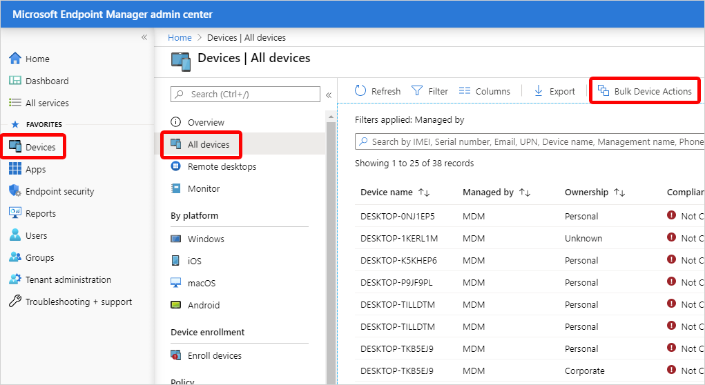

---
# required metadata

title: Use bulk device actions in Microsoft Intune device.
titleSuffix:
description: Use bulk remote device actions.
keywords:
author: Smritib17
ms.author: smbhardwaj
manager: dougeby
ms.date: 03/23/2022
ms.topic: how-to
ms.service: microsoft-intune
ms.subservice: remote-actions
ms.localizationpriority: high
ms.technology:
ms.assetid: 

# optional metadata

#ROBOTS:
#audience:

ms.reviewer:  jlynn 
ms.suite: ems
search.appverid: MET150
#ms.tgt_pltfrm:
ms.custom: intune-azure
ms.collection: M365-identity-device-management
---

# Use bulk device actions

You can use bulk device actions for the following remote actions:

- [Autopilot reset](/windows/deployment/windows-autopilot/windows-autopilot-reset#reset-devices-with-remote-windows-autopilot-reset)
- [Collect diagnostics](collect-diagnostics.md)
- [Custom notifications](custom-notifications.md#send-a-custom-notification-to-a-single-device)
- [Delete](devices-wipe.md#delete-devices-from-the-intune-portal)
- [Rename](device-rename.md)
- [Restart](device-restart.md)
- [Retire](devices-wipe.md#retire)
- [Sync](device-sync.md)
- [Wipe](devices-wipe.md#wipe)
- [Update cellular data plan](update-cellular-data-plan.md)

Most actions support up to 100 devices. For specific details of each remote action, like options or platform support, see the help page for each.

## Use a bulk device action

1. Sign in to the [Microsoft Endpoint Manager admin center](https://go.microsoft.com/fwlink/?linkid=2109431).
2. Choose **Devices** > **All devices** > **Bulk Device Actions**.

3. On the **Bulk device action** page, select an **OS** and **Device action**. Some device actions have additional options or fields to populate. Choose **Next**.
4. On the **Devices** page, select up to maximum number of devices that the action supports > **Next**.
5. On the **Review + create** page, select **Create**.

## Next steps

[Device management overview.](device-management.md)
