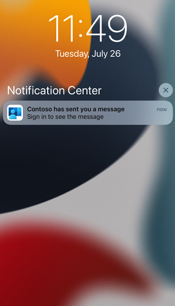
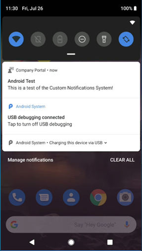
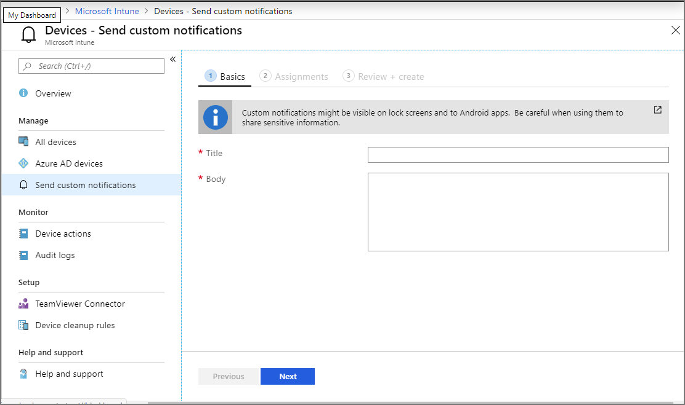
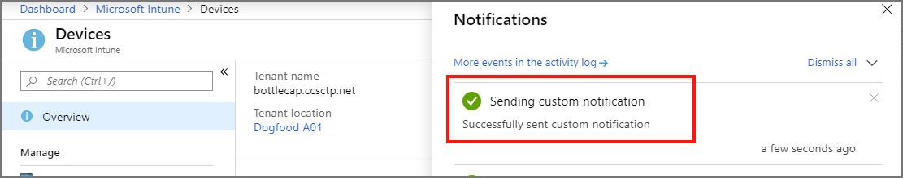

# Send custom notifications in Intune

Use Microsoft Intune to send custom notifications to the users of managed iOS/iPadOS and Android devices. These messages appear as standard push notifications from the Company Portal app and from the Microsoft Intune app on a user's device, just as notifications from other applications on the device appear. Intune custom notifications aren't supported by macOS and Windows devices.

Custom notification messages include a short title and a message body of 500 characters or fewer. These messages can be customized for any general communication purpose.

### What the notification looks like on an iOS/iPadOS device

If you have the Company Portal app open on an iOS/iPadOS device, and the device is locked, then the  notification resembles the following screenshot:

> [!div class="mx-imgBorder"]
> 

### What the notification looks like on an Android device

If you have the Company Portal app open on an Android device, the notification resembles the following screenshot:

> [!div class="mx-imgBorder"]
> 

## Common scenarios for sending custom notifications  

- Notify all employees of a change in schedule, such as building closures because of inclement weather.
- Send a notification to the user of a single device to communicate an urgent request, such as restarting the device to complete installation of an update.

## Considerations for using custom notifications

**Device configuration**

- Devices must have the Company Portal app or the Microsoft Intune app installed before users can receive custom notifications. They must also have configured permissions to allow the Company Portal app or the Microsoft Intune app to send push notifications. If needed, the Company Portal app and the Microsoft Intune app can prompt users to permit notifications.
- On Android, Google Play Services is a required dependency.
- The device must be MDM enrolled.

**Permissions**:

- To send notifications to groups, your account must have the following RBAC permission in Intune: *Organization* > **Update**.
- To send notifications to a device, your account must have the following RBAC permission in Intune: *Remote tasks* > **Send custom notifications**.

**Creating notifications**:

- To create a message, use an account that is assigned an Intune role that includes the correct permission as described in the preceding *Permissions* section. To assign permissions to a user, see [Role assignments](../fundamentals/role-based-access-control.md#role-assignments).
- Custom notifications are limited to 50-character titles and 500-character messages.  
- Intune doesn't save text from previously sent custom notifications. To resend a message, you must recreate that message.  
- You can only send up to 25 messages to groups per hour. This restriction is at the tenant level. This limitation doesn't apply when sending notifications to individuals.
- When sending messages to individual devices, you can only send up to 10 messages per hour to the same device.
- You can send notifications to users in groups. When sending notifications to groups, each notification can directly target up to 25 groups. Nested groups don't count against this total. When sending a notification to a group, messages target only the users in the group and are sent to each iOS/iPadOS or Android device that the user has registered. Devices in the group will be ignored when targeting the notification.
- You can send notifications to a single device. Instead of using groups, you select a device and then use a remote [device action](device-management.md#available-device-actions) to send the custom notification.

**Delivery**:

- Intune sends messages to the users' Company Portal app or the Microsoft Intune app, which then creates the push notification. Users don't need to be signed into the app for the notification to be pushed on the device, but the device must have been enrolled by the targeted user.
- Intune, the Company Portal app, and the Microsoft Intune app, can't guarantee delivery of a custom notification. Custom notifications might show up after several hours of delay, if at all, so they shouldn't be used for urgent messages.
- Custom notification messages from Intune appear on devices as standard push notifications. If the Company Portal app is open on an iOS/iPadOS device when it receives the notification, the notification displays in the app instead of as a system push notification. The user will need to go to the Notifications tab and pull-to-refresh to see the notification.  
- Custom notifications can be visible on lock screens on both iOS/iPadOS and Android devices depending on device settings.  
- On Android devices, other apps might have access to the data in your custom notifications. Don't use them for sensitive communications.  
- Users of a device that was recently unenrolled, or users that were removed from a group, might still receive a custom notification that is later sent to that group.  Likewise, if you add a user to a group after a custom notification was sent to the group, it's possible for the newly added use to receive that previously sent notification message.  

## Send a custom notification to groups

1. Sign in to the [Microsoft Endpoint Manager admin center](https://go.microsoft.com/fwlink/?linkid=2109431) with an account that has permissions to create and send notifications, and go to **Tenant administration** > **Custom notifications**.  

2. On the Basics tab, specify the following, and then select **Next** to continue.  
   - **Title** – Specify a title for this notification. Titles are limited to 50 characters.  
   - **Body** – Specify the message. Messages are limited to 500 characters.

     

3. On the **Assignments** tab, select the groups to which you'd like to send this custom notification, and then select Next to continue. Sending a notification to a group will target only the users of that group; the notification will go to all iOS/iPadOS and Android devices enrolled by that user.

4. On the **Review + Create** tab, review the information and when ready to send the notification, select **Create**.  

Intune processes messages that you create immediately. The only confirmation that the message was sent is the Intune notification that confirms that the custom notification was sent.  

  

Intune doesn't track the custom notifications you send, and devices don't log the receipt outside of the device's notification center. The notification can be contained in a temporary diagnostic log if a user requests support within the Company Portal or Intune app.

## Send a custom notification to a single device

1. Sign in to the [Microsoft Endpoint Manager admin center](https://go.microsoft.com/fwlink/?linkid=2109431) with an account that has permissions to create and send notifications, and then go to **Devices** > **All devices**.

2. Double-click the name of the managed device to which you want to send a notification, to open that devices *Overview* page.

3. On the devices **Overview** page, select the **Send Custom Notification** device action to open the *Send Custom Notification* pane. If this option isn't available, select the **...** (ellipses) option from the upper right side of the page and then select **Send Custom Notification**.

4. On the **Send Custom Notification** pane, specify the following message details:  

   - **Title** – Specify a title for this notification. Titles are limited to 50 characters.  
   - **Body** – Specify the message. Messages are limited to 500 characters.  

5. Select **Send** to send the custom notification to the device. Unlike notifications you send to groups, you don't configure an assignment or review the message before sending it.  

Intune processes the message immediately. The only confirmation that the message was sent is the Intune notification you'll receive in the console, which displays the text of the message you sent.  

## Receive a custom notification

On a device, users see custom notification messages that are sent by Intune as a standard push notification from the Company Portal app or the Microsoft Intune app. These notifications are similar to the push notifications users receive from other apps on the device.  

On iOS/iPadOS devices, if the Company Portal app is open when the notification is received, the notification displays in the app instead of being a push notification. The user will need to go to the Notifications tab and pull-to-refresh to see the notification.  

The notification remains until the user dismisses it.  

> [!NOTE]
> For Android devices, users must update to recent versions of the Android Company Portal (version 5.0.5291.0, released in October 2021) or Android Intune app (version 2021.09.04, released in September 2021) to receive custom notifications. If users do not update prior to Intune's November (2111) service release and they are sent a custom notification, they will instead receive a notification telling them to update their app to view the notification. Once they update their app, they will see the message sent by your organization in the Notifications section in the app.

## Next steps

[Manage devices](device-management.md)
