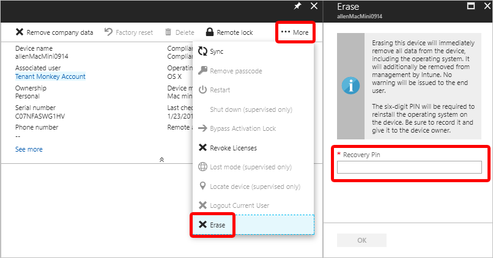

---
# required metadata

title: Erase a macOS device
titleSuffix: Microsoft Intune
description: Learn how to erase all data, including the operating system, from a macOS device.
keywords:
author: Smritib17
ms.author: smbhardwaj
manager: dougeby
ms.date: 02/27/2020
ms.topic: how-to
ms.service: microsoft-intune
ms.subservice: remote-actions
ms.localizationpriority: high
ms.technology:
ms.assetid: ab396092-907a-44b7-a157-aabee62176a9

# optional metadata

#ROBOTS:
#audience:

ms.reviewer: coferro
ms.suite: ems
search.appverid: MET150
#ms.tgt_pltfrm:
ms.custom: intune-azure
ms.collection: M365-identity-device-management
---

# Erase all data from a macOS device

[!INCLUDE [azure_portal](../includes/azure_portal.md)]

You can erase all data from a macOS device, including the operating system. The device will also be removed from Intune management. No warning will be given to the end user.

## Before you start
 - For devices running macOS 12.0.1 and later, review the requirements for erasing devices available on the [Apple Support site](https://support.apple.com/en-ph/guide/deployment/dep0a819891e/web). 

 - For devices running a version of macOS below 12.0.1, macOS will need to be reinstalled. Steps covering how to reinstall macOS are available on the [Apple Support site](https://support.apple.com/en-us/HT204904).

## How to use Erase
1. In the [Microsoft Endpoint Manager admin center](https://go.microsoft.com/fwlink/?linkid=2109431), choose **Devices** > **All devices** > choose the device you want to erase.
2. Select the ellipsis on the remote device action bar to show additional actions. Select **Erase** then provide a 6-digit number for the **Recovery PIN**. The six-digit PIN is required to reinstall the operating system on the device if the device is not equipped with T2 security chip enabled (i.e. the model year of the device is 2018 and earlier, or the device is running macOS 10.14 or earlier). Be sure to make a note of this PIN and give it to the device owner as it won't be visible after the erase action completes.

3. Select **Erase** to erase the device.
