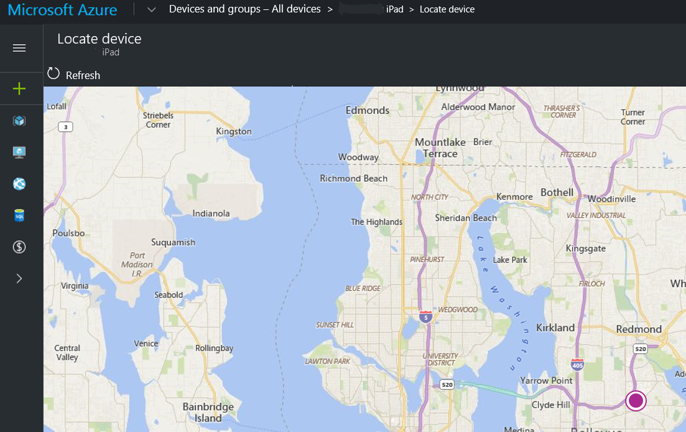

---
# required metadata

title: Find lost devices with Microsoft Intune
description: Locate lost or stolen devices by using the locate device feature in Microsoft Intune. Get details on security and privacy information when using the locate device action.
keywords:
author: Smritib17
ms.author: smbhardwaj
manager: dougeby
ms.date: 4/12/2022 
ms.topic: how-to
ms.service: microsoft-intune
ms.subservice: remote-actions
ms.localizationpriority: high

# optional metadata

#ROBOTS:
#audience:

ms.reviewer: shsivaku
ms.suite: ems
search.appverid: MET150
#ms.tgt_pltfrm:
ms.custom: intune-azure
ms.collection:
- tier1
- M365-identity-device-management
- highpri
---

# Locate lost or stolen devices with Intune

For supported device platforms, you can use a remote device action from within the Microsoft Intune admin center to locate a device should it be lost or stolen.

In addition to identifying the location a lost or stolen device on a map, some platforms support additional capabilities to help you find them, including:

- Use a *lost device sound alert* on a phone to help a user locate the device should it be behind a chair or otherwise out-of-sight.
- Report on the time and location of a devices *last known location*, which can help when the device is off-line, or can’t be reached to verify where it is at. *(Android Enterprise dedicated devices only)*

You need to enable Windows location services in Windows Out of Box Experience (OOBE) or by using the [Privacy > LetAppsAccessLocation](/windows/client-management/mdm/policy-csp-privacy#privacy-letappsaccesslocation) policy to be able to locate the device.

## Supported platforms

**Locate device** - The following platforms support this capability:

- **Android Enterprise** – This is applicable to dedicated devices, fully-managed, and corporate-owned work profile devices. Requires the device to run *Google Play Services* version **20.06.16** or later and have Location services turned on.  
- **iOS/iPadOS 9.3 and later** - Requires the device to be in supervised mode, and be in [lost mode](device-lost-mode.md).
- **Windows 10**:
  - Version 20H2 (10.0.19042.789) or later
  - Version 2004 (10.0.19041.789) or later
  - Version 1909 (10.0.18363.1350) or later
  - Version 1809 (10.0.17763.1728) or later
- **Windows 11**

**Lost device sound alert** – The following platforms support this capability:

- **iOS/iPadOS 9.3 and later** - Requires the device to be in supervised mode, and be in [lost mode](device-lost-mode.md)
- **Android Enterprise dedicated devices** - Requires the Intune app running 2202.01 or later 
- **Android Enterprise corporate-owned work profile devices** - Requires the Intune app running 2202.01 or later
- **Android Enterprise corporate-owned fully managed devices** - Requires the Intune app running 2202.01 or later

**Unsupported** - Device location capabilities aren't supported for the following platforms:

- Android device administrator
- Android Enterprise:
  - Corporate-owned work profile
  - Personally-owned work profile
  - Fully managed
- macOS
- Windows Holographic for Business
- Windows Phone

## Locate a lost or stolen device

1. Sign in to the [Microsoft Intune admin center](https://go.microsoft.com/fwlink/?linkid=2109431).
2. Select **Devices**, and then select **All devices**.
3. From the list of devices you manage, select a supported device, and choose **...**. Then choose the **Locate device** remote action.
4. After the device is located, its location is shown in **Locate device**.  

   - You can select the location pin on the map to view a location address and coordinates.

   - Android Enterprise dedicated devices that aren't currently on-line can display their [last known location](#last-known-location) when the device last checked in within seven days.

   

Android use of **Locate device** is controlled by **Device Restrictions** in **Device Configuration**. 
There are two separate toggles, one for dedicated and one for fully managed and corporate owned work profile devices.

For fully managed and corporate owned work profile, **Locate device** is set to **Not configured** as the default and it blocks the feature. To allow this feature, use device restrictions within Device Configuration and configure the toggle for **Locate device** to Allow.

For dedicated devices, **Locate device** is set to **Not configured** as the default, which allows the feature. To turn this feature off, use device restrictions within **Device Configuration** and configure the toggle for **Locate device** to **Block**. When **Locate device** is allowed, users will receive a one-time notification, "Intune can access your location", indicating that Intune has the ability to use location permissions on the device.

### Last known location

When you use the *Locate device* action for an Android Enterprise dedicated device that is off-line and unable to respond with its current location, Intune attempts to display its last known location. This capability uses data submitted by the device when it checks in with Intune.

Intune collects information about the last known location of a device every eight hours or when the device checks in with Intune. Intune keeps this information for up to seven days. The last known location of a device that hasn’t checked in with Intune for more than seven days can't be displayed.

**About initialization of last known location**:

To support the *last know location* capability for Android dedicated devices, each device receives an initial default entry for **Locate device** which shows a status of **Complete**. This status appears under *Device actions status* when you view the devices Overview page. This default status is a result of the capability being initialized by Intune and doesn’t indicate that a locate device action has run.

The date and time of this default status varies:

- Devices enrolled before this capability becomes available will reflect the day this capability was enabled for your tenant.
- Devices you enroll after this capability is available, reflect the time of device enrollment.

Later, this default status updates to reflect the actual date and time that an admin runs the Locate device action for that device.

## Activate lost device sound alert

For supported device platforms, you can remotely trigger the device to play an alert sound so the user can find it. The sound plays until the user disables the sound on the device or the device is removed from lost mode.

To start a lost device sound alert:

1. Sign in to the [Microsoft Intune admin center](https://go.microsoft.com/fwlink/?linkid=2109431).
2. Select **Devices**, and then select **All devices**.
3. Select the device you want to activate.
4. On the devices *Overview* pane:
   - For **iOS/iPadOS**: select **Play Lost mode sound (supervise only)**. The sound plays on an iOS/iPadOS device until the device is removed from lost mode.

   - For **Android Enterprise dedicated devices**, **Android Enterprise corporate-owned work profile devices**, and **Android Enterprise corporate-owned fully managed devices** : select **Play Lost device sound**. The sound plays on an Android Enterprise dedicated device for the set duration or if notifications are enabled, until a user on the device turns it off. 
   
   -  For **Android Enterprise dedicated devices**:
      - devices running on operating systems below version 10, a full screen activity with a **Stop Sound** button pops up. 
      - devices running on operating systems version 10 or higher, if notifications are enabled, a notification with a **Stop Sound** button shows up.
      - To configure system notifications for devices in kiosk mode, see [Android Enterprise device settings to allow or restrict features using Intune](../configuration/device-restrictions-android-for-work.md).
     
   - For **Android Enterprise corporate-owned work profile devices**, and **Android Enterprise corporate-owned fully managed devices** :
     - To configure system notifications for devices, see [Android Enterprise device settings to allow or restrict features using Intune](../configuration/device-restrictions-android-for-work.md).

## Security and privacy information for lost mode and locate device actions

- No device location information is sent to Intune until you turn on this action.
- When you use the locate device action, the latitude and longitude coordinates of the device can be retrieved by using the Graph API.
- The data is stored for 24 hours, then removed. You can't manually remove the location data.
- The data for last known locations is stored for up to seven days, and then removed.
- Location data is encrypted, both while stored and while being transmitted.
- For iOS/iPadOS devices, when you configure lost mode, you can customize a message that appears on the lock screen. In this message, to help the person that finds the device, be sure to include specific details to return the lost device.
- For fully-managed and corporate-owned work profile scenarios, end users will receive a notification when the administrator uses this feature, if notifications have been enabled.

## Next steps

To view the status of a device after enabling an action, open *Devices*, select the device, and on the *Overview* pane view *Device actions status*.
