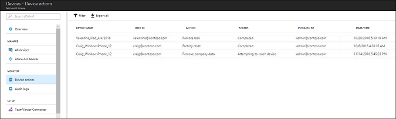

---
# required metadata

title: Manage devices with Microsoft Intune - Azure | Microsoft Docs
description: Review the devices you manage with Microsoft Intune, including exporting a devices list into csv format, view your Azure Active Directory-joined devices, review a change log of actions on the device, use TeamViewer Connector to allow IT admins remotely troubleshoot Android devices, and view all the actions you can run on your devices.
keywords:
author: ErikjeMS
ms.author: erikje
manager: dougeby
ms.date: 11/14/2018
ms.topic: conceptual
ms.service: microsoft-intune
ms.subservice: remote-actions
ms.localizationpriority: high
ms.technology:
ms.assetid: d2412418-d91a-4767-a3d6-bc88bb29caa2

# optional metadata

#ROBOTS:
#audience:
#ms.devlang:
#ms.reviewer: dougeby
ms.suite: ems
search.appverid: MET150
#ms.tgt_pltfrm:
ms.custom: intune-azure; get-started
ms.collection: M365-identity-device-management
---

# What is Microsoft Intune device management?

[!INCLUDE [azure_portal](../includes/azure_portal.md)]

As an IT admin, you must ensure that managed devices are providing the resources that your users need to do their work, while protecting that data from risk.

The **Devices** workload gives you insights into the devices you manage, and lets you perform remote tasks on those devices.

## Get to your devices

1. Sign in to the [Microsoft Endpoint Manager Admin Center](https://go.microsoft.com/fwlink/?linkid=2109431).
3. Select **Devices**. This view shows detailed information about the individual devices, and what you can do with them, including:

   - **Overview** shows a visual snapshot of the enrolled devices, and also shows how many devices are using the different platforms, including Android, iOS/iPadOS, and more.
   - **All devices** shows a list of the enrolled devices you manage.

     Use the **Export** feature to create a .csv list of all the devices, in increments of 10,000 (Internet Explorer) or 30,000 (Microsoft Edge, Chrome).

     Select any device to [view additional details about that device](device-inventory.md), including hardware details, installed apps, its compliance policy status, and more.

   - **Azure AD devices** shows a list of the devices registered or joined with Azure Active Directory (Azure AD). Learn more about [Azure AD device management](https://docs.microsoft.com/azure/active-directory/device-management-introduction).
   - **Device actions** includes a history of the remote actions ran on different devices, including the action, its status, who initiated the action, and the time.

     

   - **Audit logs** is a record of activities that generate a change in Intune. [Audit logs](../fundamentals/monitor-audit-logs.md) provides more details.
   - **TeamViewer Connector** is a service that allows users of Intune-managed Android devices to get remote assistance from their IT administrator. Learn more about [TeamViewer](teamviewer-support.md).
   - **Help and Support** provides a shortcut on troubleshooting tips, requesting support, or checking the status of Intune.

## Available device actions
The actions available depend on the device platform, and the configuration of the device.

- [View device inventory](device-inventory.md)
- Run the remote device actions:
  - [Retire](devices-wipe.md#retire)
  - [Wipe](devices-wipe.md#wipe)
  - [Remote lock](device-remote-lock.md)
  - [Reset passcode](device-passcode-reset.md)
  - [Disable Activation Lock](device-activation-lock-bypass.md) (iOS only)
  - [Fresh Start](device-fresh-start.md) (Windows only)
  - [Lost mode](device-lost-mode.md) (iOS only)
  - [Locate device](device-locate.md) (iOS only)
  - [Restart](device-restart.md) (Windows only)
  - [Windows 10 PIN reset](device-windows-pin-reset.md)
  - [Remote control for Android](teamviewer-support.md)
  - [Synchronize device](device-sync.md)
  - [Rename device](device-rename.md)
  - [Send custom notification](custom-notifications.md#send-a-custom-notification-to-a-single-device) (Android, iOS/iPadOS)
  - [BitLocker key rotation](../protect/encrypt-devices.md#rotate-bitlocker-recovery-keys) (Windows only)

## Next steps

- In **All devices**, select a device to view more details about that specific device.
- Choose **Device actions** to see the status of actions taken on devices you manage.
