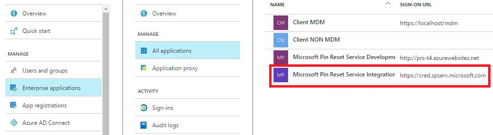

---
# required metadata

title: Reset passcode on Windows devices with Microsoft Intune - Azure | Microsoft Docs
description: To reset the passcode on Windows devices, install the Microsoft Pin Reset Service and Microsoft Pin Reset Client, create a device policy using your Azure Active Directory Directory ID, and then reset the passcode in the Azure portal using Microsoft Intune.
keywords:
author: ErikjeMS
ms.author: erikje
manager: dougeby
ms.date: 03/07/2018
ms.topic: conceptual
ms.service: microsoft-intune
ms.subservice: remote-actions
ms.localizationpriority: high
ms.technology:
ms.assetid: 5027d012-d6c2-4971-a9ac-217f91d67d87

# optional metadata

#ROBOTS:
#audience:

#ms.reviewer: ilwu
ms.suite: ems
search.appverid: MET150
#ms.tgt_pltfrm:
ms.custom: intune-azure
ms.collection: M365-identity-device-management
---

# Reset the passcode on Windows devices using Intune

You can reset the passcode for Windows devices. The reset passcode feature uses the Microsoft Pin Reset Service to generate a new passcode for devices that run Windows 10 Mobile. 

## Supported platforms

- Windows 10 Mobile running Creators Update and later (Azure AD joined).

The following platforms are **not** supported:
- Windows
- iOS
- macOS
- Android

## Authorize the PIN reset services

To reset the passcode on Windows devices, onboard the PIN reset service to your Intune tenant.

1. Go to [Microsoft PIN Reset Service production](https://login.windows.net/common/oauth2/authorize?response_type=code&client_id=b8456c59-1230-44c7-a4a2-99b085333e84&resource=https%3A%2F%2Fgraph.windows.net&redirect_uri=https%3A%2F%2Fcred.microsoft.com&state=e9191523-6c2f-4f1d-a4f9-c36f26f89df0&prompt=admin_consent), and sign in using the tenant administrator account.
2. **Accept** consent for the PIN reset service to access your account: 
  
3. Go to [Microsoft PIN Reset Client production](https://login.windows.net/common/oauth2/authorize?response_type=code&client_id=9115dd05-fad5-4f9c-acc7-305d08b1b04e&resource=https%3A%2F%2Fcred.microsoft.com%2F&redirect_uri=ms-appx-web%3A%2F%2FMicrosoft.AAD.BrokerPlugin%2F9115dd05-fad5-4f9c-acc7-305d08b1b04e&state=6765f8c5-f4a7-4029-b667-46a6776ad611&prompt=admin_consent), and sign in using the tenant administrator account. **Accept** consent for the PIN reset client to access your account.
4. In the [Azure portal](https://portal.azure.com), confirm that the PIN reset services are listed in Enterprise applications (All applications):
  

> [!NOTE]
> After you Accept the PIN reset requests, you may get a `Page not found` message, or it may appear as if nothing happens. This behavior is normal. Be sure to confirm that the two PIN Reset applications are listed for your tenant.

## Configure Windows devices to use PIN reset

To configure the PIN reset on the Windows devices you manage, use an [Intune Windows 10 custom device policy](../configuration/custom-settings-windows-10.md). Configure the policy using the following Windows policy configuration service provider (CSP):

**Use the device policy** - `./Device/Vendor/MSFT/PassportForWork/*tenant ID*/Policies/EnablePinRecovery`

Replace *tenant ID* with your Azure AD Directory ID, which is listed in the **Properties** of Azure Active Directory in the [Azure portal](https://portal.azure.com).

Set the value for this CSP to **True**.

> [!TIP]
> After you create the policy, you assign (or deploy) it to a group. The policy can be assigned to user groups or a device groups. If you assign it to a users group, then the group may include users who have other devices, such as iOS/iPadOS. Technically, the policy doesn't apply, but these devices are still included in the status details.

## Reset the passcode

1. Sign in to the [Microsoft Endpoint Manager Admin Center](https://go.microsoft.com/fwlink/?linkid=2109431). 
2. Select **Devices**, and then select **All devices**.
3. Select the device you want to reset the passcode. In the device properties, select **Reset passcode**.
4. Select **Yes** to confirm. The passcode is generated, and is displayed in the portal for the next seven days.

## Next step

If the passcode reset fails, a link is provided in the portal that provides more details.
