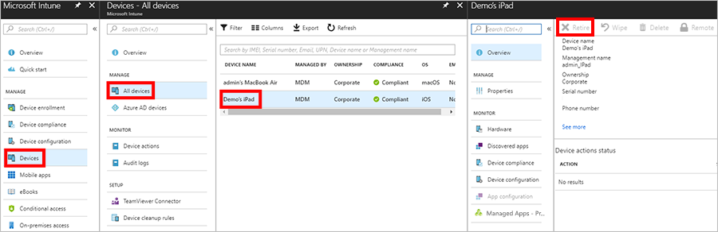

---
# required metadata

title: Retire or wipe devices using Microsoft Intune - Azure | Microsoft Docs
description: Retire or wipe a device on an Android, Android work profile, iOS/iPadOS, macOS, or Windows device using Microsoft Intune. Also delete a device from Azure Active Directory.
keywords:
author: ErikjeMS
ms.author: erikje
manager: dougeby
ms.date: 2/27/2020
ms.topic: conceptual
ms.service: microsoft-intune
ms.subservice: remote-actions
ms.localizationpriority: high
ms.technology:
ms.assetid: 4fdb787e-084f-4507-9c63-c96b13bfcdf9

# optional metadata

#ROBOTS:
#audience:

#ms.reviewer:
ms.suite: ems
search.appverid: MET150
#ms.tgt_pltfrm:
ms.custom: intune-azure
ms.collection: M365-identity-device-management
---

# Remove devices by using wipe, retire, or manually unenrolling the device

[!INCLUDE [azure_portal](../includes/azure_portal.md)]

By using the **Retire** or **Wipe** actions, you can remove devices from Intune that are no longer needed, being repurposed, or missing. Users can also issue a remote command from the Intune Company Portal to devices that are enrolled in Intune.

> [!NOTE]
> Before you remove a user from Azure Active Directory (Azure AD), use the **Wipe** or **Retire** actions for all devices that are associated with that user. If you remove users that have managed devices from Azure AD, Intune can no longer wipe or retire those devices.

## Wipe

The **Wipe** action restores a device to its factory default settings. The user data is kept if you choose the **Retain enrollment state and user account** checkbox. Otherwise, all data, apps, and settings will be removed.

|Wipe action|**Retain enrollment state and user account**|Removed from Intune management|Description|
|:-------------:|:------------:|:------------:|------------|
|**Wipe**| Not checked | Yes | Wipes all user accounts, data, MDM policies, and settings. Resets the operating system to its default state and settings.|
|**Wipe**| Checked | No | Wipes all MDM Policies. Keeps user accounts and data. Resets user settings back to default. Resets the operating system to its default state and settings.|

> [!NOTE]
> The Wipe action is not available for iOS/iPadOS devices enrolled with User Enrollment.

The **Retain enrollment state and user account** option is only available for Windows 10 version 1709 or later.

MDM policies will be reapplied the next time the device connects to Intune.

A wipe is useful for resetting a device before you give the device to a new user, or when the device has been lost or stolen. Be careful about selecting **Wipe**. Data on the device cannot be recovered.

### Wiping a device

1. Sign in to the [Microsoft Endpoint Manager admin center](https://go.microsoft.com/fwlink/?linkid=2109431).
3. Select **Devices** > **All devices**.
4. Select the name of the device that you want to wipe.
5. In the pane that shows the device name, select **Wipe**.
6. For Windows 10 version 1709 or later, you also have the **Wipe device, but keep enrollment state and associated user account** option. 
    
    |Retained during a wipe |Not retained|
    | -------------|------------|
    |User accounts associated with the device|User files|
    |Machine state \(domain join, Azure AD-joined)| User-installed apps \(store and Win32 apps)|
    |Mobile device management (MDM) enrollment|Non-default device settings|
    |OEM-installed apps \(store and Win32 apps)||
    |User profile||
    |User data outside of the user profile||
    |User autologon|| 
    
7. The **Wipe device, and continue to wipe even if device loses power.** option makes sure that the wipe action can't be circumvented by turning off the device. This option will keep trying to reset the device until successful. In some configurations this action may leave the device [unable to reboot](troubleshoot-device-actions.md#wipe-action).        
8. To confirm the wipe, select **Yes**.

If the device is on and connected, the **Wipe** action propagates across all device types in less than 15 minutes.

## Retire

The **Retire** action removes managed app data (where applicable), settings, and email profiles that were assigned by using Intune. The device is removed from Intune management. This happens the next time the device checks in and receives the remote **Retire** action. The device still shows up in Intune until the device checks in. If you want to remove stale devices immediately, use the [Delete action](devices-wipe.md#delete-devices-from-the-intune-portal) instead.

**Retire** leaves the user's personal data on the device.  

The following tables describe what data is removed, and the effect of the **Retire** action on data that remains on the device after company data is removed.

### iOS

|Data type|iOS|
|-------------|-------|
|Company apps and associated data installed by Intune|**Apps installed using Company Portal:** For apps that are pinned to the management profile, all app data and the apps are removed. These apps include apps originally installed from App Store and later managed as company apps unless the app is configured to not be uninstalled on device removal.    **Microsoft apps that use mobile app management and were installed from App Store:** For apps that are not managed by the Company Portal, company app data that's protected by Mobile Application Management (MAM) encryption within the app local storage is removed. Data that's protected by MAM encryption outside the app remains encrypted and unusable, but isn't removed. Personal app data and the apps are not removed.|
|Settings|Configurations that were set by Intune policy are no longer enforced. Users can change the settings.|
|Wi-Fi and VPN profile settings|Removed.|
|Certificate profile settings|Certificates are removed and revoked.|
|Management agent|The management profile is removed.|
|Email|Email profiles that are provisioned through Intune are removed. Cached email on the device is deleted.|
|Azure AD unjoin|The Azure AD record is removed.|

### Android device administrator

|Data type|Android|Android Samsung Knox Standard|
|-------------|-----------|------------------------|
|Web links|Removed.|Removed.|
|Unmanaged Google Play apps|Apps and data remain installed.    Company app data that's protected by Mobile Application Management (MAM) encryption within the app local storage is removed. Data that's protected by MAM encryption outside the app remains encrypted and unusable, but isn't removed. |Apps and data remain installed.    Company app data that's protected by Mobile Application Management (MAM) encryption within the app local storage is removed. Data that's protected by MAM encryption outside the app remains encrypted and unusable, but isn't removed.|
|Unmanaged line-of-business apps|Apps and data remain installed.|Apps are uninstalled and data that's local to the app is removed. No data that's outside the app (for example, on an SD card) is removed.|
|Managed Google Play apps|App data is removed. The app isn't removed. Data that's protected by Mobile Application Management (MAM) encryption outside the app (for example, an SD card) remains encrypted and unusable, but isn't removed.|App data is removed. The app isn't removed. Data that's protected by MAM encryption outside the app (for example, an SD card) remains encrypted, but isn't removed.|
|Managed line-of-business apps|App data is removed. The app isn't removed. Data that's protected by MAM encryption outside the app (for example, an SD card) remains encrypted and unusable, but isn't removed.|App data is removed. The app isn't removed. Data that's protected by MAM encryption outside the app (for example, an SD card) remains encrypted and unusable, but isn't removed.|
|Settings|Configurations that were set by Intune policy are no longer enforced. Users can change the settings.|Configurations that were set by Intune policy are no longer enforced. Users can change the settings.|
|Wi-Fi and VPN profile settings|Removed.|Removed.|
|Certificate profile settings|Certificates are revoked but not removed.|Certificates are removed and revoked.|
|Management agent|Device Administrator privilege is revoked.|Device Administrator privilege is revoked.|
|Email|N/A (Email profiles aren't supported by Android devices)|Email profiles that are provisioned through Intune are removed. Cached email on the device is deleted.|
|Azure AD unjoin|The Azure AD record is removed.|The Azure AD record is removed.|

### Android Enterprise devices with a work profile

Removing company data from an Android work profile device removes all data, apps, and settings in the work profile on that device. The device is retired from management with Intune. Wipe is not supported for Android work profiles.

### Android Enterprise dedicated devices

You can only wipe kiosk devices. You can't retire Android kiosk devices.

### macOS

|Data type|macOS|
|-------------|-------|
|Settings|Configurations that were set by Intune policy are no longer enforced. Users can change the settings.|
|Wi-Fi and VPN profile settings|Removed.|
|Certificate profile settings|Certificates that were deployed through MDM are removed and revoked.|
|Management agent|The management profile is removed.|
|Outlook|If Conditional Access is enabled, the device doesn't receive new mail.|
|Azure AD unjoin|The Azure AD record is removed.|

### Windows

|Data type|Windows 8.1 (MDM) and Windows RT 8.1|Windows RT|Windows Phone 8.1 and Windows Phone 8|Windows 10|
|-------------|----------------------------------------------------------------|--------------|-----------------------------------------|--------|
|Company apps and associated data installed by Intune|Keys are revoked for files that are protected by EFS. The user can't open the files.|Company apps aren't removed.|Apps originally installed through the Company Portal are uninstalled. Company app data is removed.|Apps are uninstalled. Sideloading keys are removed. For Windows 10 version 1703 (Creators Update) and later, Microsoft 365 Apps aren't removed. Intune management extension installed Win32 apps will not be uninstalled on unenrolled devices. Admins can leverage assignment exclusion to not offer Win32 apps to BYOD Devices.|
|Settings|Configurations that were set by Intune policy are no longer enforced. Users can change the settings.|Configurations that were set by Intune policy are no longer enforced. Users can change the settings.|Configurations that were set by Intune policy are no longer enforced. Users can change the settings.|Configurations that were set by Intune policy are no longer enforced. Users can change the settings.|
|Wi-Fi and VPN profile settings|Removed.|Removed.|Not supported.|Removed.|
|Certificate profile settings|Certificates are removed and revoked.|Certificates are removed and revoked.|Not supported.|Certificates are removed and revoked.|
|Email|Removes email that's EFS-enabled. This includes emails and attachments in the Mail app for Windows.|Not supported.|Email profiles that are provisioned through Intune are removed. Cached email on the device is deleted.|Removes email that's EFS-enabled. This includes emails and attachments in the Mail app for Windows. Removes mail accounts that were provisioned by Intune.|
|Azure AD unjoin|No.|No.|The Azure AD record is removed.|The Azure AD record is removed.|

> [!NOTE]
> For Windows 10 devices that join Azure AD during initial Setup (OOBE), the retire command will remove all Azure AD accounts from the device. Follow the steps at [Start your PC in Safe mode](https://support.microsoft.com/en-us/help/12376/windows-10-start-your-pc-in-safe-mode) to login as a local admin and regain access to the user's local data. 

### Retire

1. Sign in to the [Microsoft Endpoint Manager admin center](https://go.microsoft.com/fwlink/?linkid=2109431).
2. In the **Devices** pane, select **All devices**.
3. Select the name of the device that you want to retire.
4. In the pane that shows the device name, select **Retire**. To confirm, select **Yes**.

If the device is on and connected, the **Retire** action propagates across all device types in less than 15 minutes.

## Delete devices from the Intune portal

If you want to remove devices from the Intune portal, you can delete them from the specific device pane. The next time the device checks in, any company data on it will be removed.

1. Sign in to the [Microsoft Endpoint Manager admin center](https://go.microsoft.com/fwlink/?linkid=2109431).
2. Choose **Devices** > **All devices** > choose the devices you want to delete > **Delete**.

### Automatically delete devices with cleanup rules
You can configure Intune to automatically delete devices that appear to be inactive, stale, or unresponsive. These cleanup rules continuously monitor your device inventory so that your device records stay current. Devices deleted in this way are removed from Intune management.
1. Sign in to the [Microsoft Endpoint Manager admin center](https://go.microsoft.com/fwlink/?linkid=2109431).
2. Choose **Devices** > **Device cleanup rules** > **Yes**.
3. In the **Delete devices that haven't checked in for this many days** box, enter a number between 30 and 270.
4. Choose **Save**.

## Delete devices from the Azure Active Directory portal

You might need to delete devices from Azure AD due to communication issues or missing devices. You can use the **Delete** action to remove device records from the Azure portal for devices that you know are unreachable and unlikely to communicate with Azure again. The **Delete** action doesn't remove a device from management.

1. Sign in to [Azure Active Directory in the Azure portal](https://aka.ms/accessaad) by using your admin credentials. You can also sign in to the [Microsoft 365 admin center](https://admin.microsoft.com). From the menu, select **Admin centers** > **Azure AD**.
2. Create an Azure subscription if you don't have one. This shouldn't require a credit card or payment if you have a paid account (select the **Register your free Azure Active Directory** subscription link).
3. Select **Azure Active Directory**, and then select your organization.
4. Select the **Users** tab.
5. Select the user that's associated with the device that you want to delete.
6. Select **Devices**.
7. Remove devices as appropriate. For example, you might remove devices that are no longer in use, or devices that have inaccurate definitions.

## Retire an Apple DEP device from Intune

If you want to completely remove an Apple DEP device from management by Intune, follow these steps:

1. Sign in to the [Microsoft Endpoint Manager admin center](https://go.microsoft.com/fwlink/?linkid=2109431).
2. Choose **Devices** > **All devices** > choose the device > **Retire**.

3. Visit [business.apple.com](http://business.apple.com) and search for the device by its serial number.
4. In the **Assigned to** menu, choose **Unassigned**.

5. Choose **Reassign**.

    

## Device states
For a description of device states, see the [managementStates collection](../developer/intune-data-warehouse-collections.md#managementstates).

## Fresh Start

Applicable for Windows 10 devices. Read more about [Fresh Start](device-fresh-start.md).

## Next steps

If you want to reenroll a deleted device, see [Enrollment options](../enrollment/enrollment-options.md).

