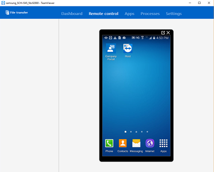

---
# required metadata

title: Remotely administer devices in Microsoft Intune - Azure | Microsoft Docs
description: View the required roles to use TeamViewer, how to install the TeamViewer connector, and step-by-step guidance to remotely administer devices using Microsoft Intune in the Azure portal
keywords:
author: ErikjeMS
ms.author: erikje
manager: dougeby
ms.date: 02/05/2019
ms.topic: conceptual
ms.service: microsoft-intune
ms.subservice: remote-actions
ms.localizationpriority: high
ms.technology:
ms.assetid: 72cdd888-efca-46e6-b2e7-fb9696bb2fba

# optional metadata

#ROBOTS:
#audience:
#ms.devlang:
ms.suite: ems
search.appverid: MET150
#ms.tgt_pltfrm:
ms.custom: intune-azure
ms.collection: M365-identity-device-management
---

# Use TeamViewer to remotely administer Intune devices

Devices managed by Intune can be administered remotely using [TeamViewer](https://www.teamviewer.com). TeamViewer is a third party program that you purchase separately. This topic shows you how to configure TeamViewer within Intune, and to remotely administer a device. 

## Prerequisites

- Use a supported device. Intune-managed Android Device Admin, Android Work Profile, Windows, iOS/iPadOS, and macOS devices support remote administration. TeamViewer may not support Windows Holographic (HoloLens), Windows Team (Surface Hub), or Windows 10 S. For supportability, see [TeamViewer](https://www.teamviewer.com) for any updates.

> [!NOTE]
> Android Dedicated and Fully Managed are not supported.

- The Intune administrator within the Azure portal must have following [Intune roles](../intune/fundamentals/role-based-access-control.md):  

  - **Update Remote Assistance**: Allows administrators to modify the TeamViewer connector settings
  - **Request Remote Assistance**: Allows administrators to start a new remote assistance session for any user. Users with this role are not limited by any Intune role within a scope. Also, user or device groups assigned an Intune role within a scope can also request remote assistance. 

- A [TeamViewer](https://www.teamviewer.com) account with the sign-in credentials. Only some TeamViewer licenses may support integration with Intune. For specific TeamViewer needs, see [TeamViewer Integration Partner: Microsoft Intune](https://www.teamviewer.com/integrations/microsoft-intune/).

By using TeamViewer, you're allowing the TeamViewer for Intune Connector to create TeamViewer sessions, read Active Directory data, and save the TeamViewer account access token.

## Configure the TeamViewer connector

To provide remote assistance to devices, configure the Intune TeamViewer connector using the following steps:

1. Sign in to the [Microsoft Endpoint Manager Admin Center](https://go.microsoft.com/fwlink/?linkid=2109431).
2. Select **Tenant administration** > **Connectors and tokens** > **TeamViewer Connector**.
3. Select **Connect**, and then accept the license agreement.
4. Select **Log in to TeamViewer to authorize**.
5. A web page opens to the TeamViewer site. Enter your TeamViewer license credentials, and then **Sign In**.

## Remotely administer a device

After the connector is configured, you're ready to remotely administer a device. Use the following steps: 

1. In the the [Microsoft Endpoint Manager Admin Center](https://go.microsoft.com/fwlink/?linkid=2109431).
2. Select **Devices**, and then select **All devices**.
3. From the list, select the device that you want to remotely administer > **...** > **New Remote Assistance Session**.
4. After Intune connects to the TeamViewer service, you'll see some information about the device. **Connect** to start the remote session.

When you start a remote session, users see a notification flag on the Company Portal app icon on their device. A notification also appears when the app opens. Users can then accept the remote assistance request.

> [!NOTE]
> Windows devices that are enrolled using "userless" methods, such as DEM and WCD, don't show the TeamViewer notification in the Company Portal app. In these scenarios, it's recommended to use the TeamViewer portal to generate the session.

In TeamViewer, you can complete a range of actions on the device, including taking control of the device. For full details of what you can do, see the [TeamViewer guidance](https://www.teamviewer.com/support/documents/).

When finished, close the TeamViewer window.
