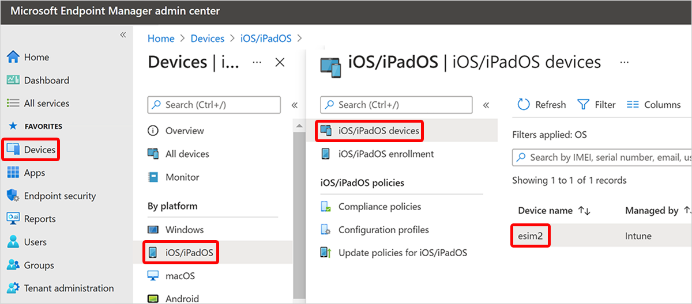

---
# required metadata

title: Update cellular data plan for iOS/iPadOS devices with Microsoft Intune
description: Learn how to update the cellular data plan for iOS/iPadOS devices that support eSIM.
keywords:
author: Smritib17
ms.author: smbhardwaj
manager: dougeby
ms.date: 06/29/2021
ms.topic: how-to
ms.service: microsoft-intune
ms.subservice: remote-actions
ms.localizationpriority: high
ms.technology:
ms.assetid: 126a7489-fe3e-43fd-a681-defb2fe0bb66

# optional metadata

#ROBOTS:
#audience:

#ms.reviewer: rashok
ms.suite: ems
search.appverid: MET150
#ms.tgt_pltfrm:
ms.custom: intune-azure
ms.collection: M365-identity-device-management
---

# Update cellular data plan (public preview)

The **Update cellular data plan** remote action lets you remotely activate eSIM cellular plan on iOS/iPadOS devices that support it.

## Supported platforms

- iOS 14 and later
- iPadOS 13.0 or later

For more information about devices that support eSIM, see the Apple support article [Using Dual SIM with an eSIM](https://support.apple.com/HT209044).

## Remotely update the cellular data plan

1. Sign in to the [Microsoft Endpoint Manager admin center](https://go.microsoft.com/fwlink/?linkid=2109431), select **Devices** > **iOS/iPadOS** > select a device.
    
2. Select **...** > **Update cellular data plan (preview)**.
    
3. Enter the activation server URL for your mobile carrier and select **Update cellular plan**.

When the command is successfully applied and the data plan is activated:

- Cellular data starts working.
- The active cellular data plan is listed in the cellular section of the **Settings** app on the device.

## Next steps

To see the status of the **Update cellular data plan** device action, check the **Overview** page for the device.
