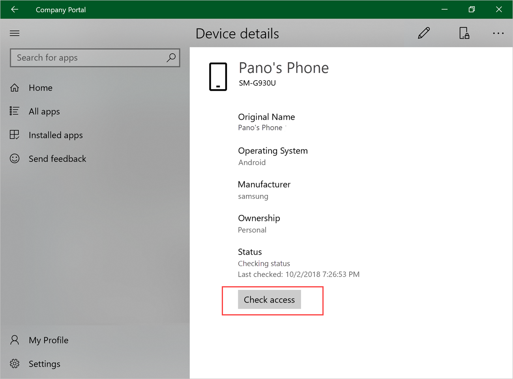
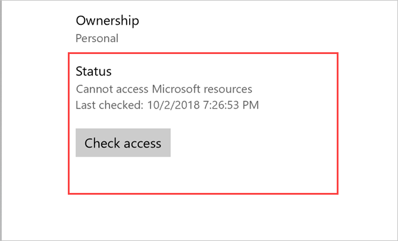
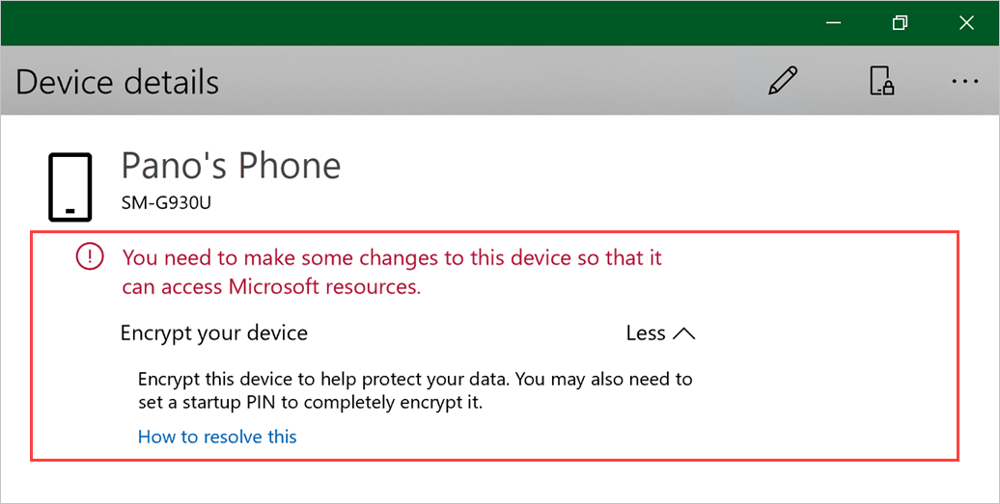
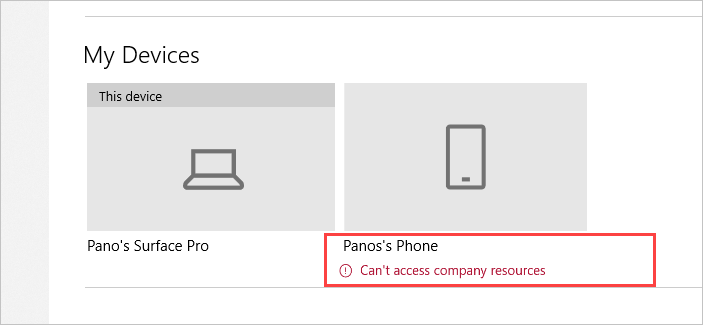
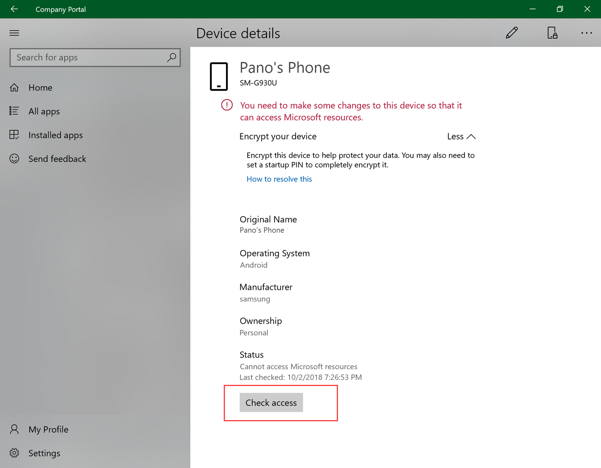

---
# required metadata

title: Check device access | Microsoft Docs
description: Check device access to find out if your device meets requirements, and is able to access work or school resources.
keywords:
author: lenewsad
ms.author: lanewsad
manager: dougeby
ms.date: 10/11/2022
ms.topic: end-user-help
ms.service: microsoft-intune
ms.subservice: end-user
ms.technology:
ms.assetid: 
searchScope:
 - User help

# optional metadata

ROBOTS:  
#audience:

ms.reviewer: 
ms.suite: ems
#ms.tgt_pltfrm:
ms.custom: intune-enduser
ms.collection:
- tier2
---

# Check access from Company Portal app for Windows

Verify that your device has access to work or school resources. 

Organizations enforce requirements&ndash;such as encryption and password limits&ndash; to make sure only secure, trusted devices access their data. Managed devices must meet and maintain these requirements to access the organization's resources.

The **Check access** action evaluates your device's settings and its access status. The **Device details** page lists the settings you need to adjust to regain access. 

Complete the steps in this article to check access from the Company Portal app for Windows.  

## Check access from Device details page  
1. Open the Company Portal app for Windows and go to **My Devices**.  

      
2. Select a device.  
3. On the **Device details** page, select **Check access**. The app syncs your device with your organization's current requirements and checks to make sure your device matches them. This check can take a few minutes.  

     

4. Look at the status update. It will show that your device **Can access your organization's resources**, **Cannot access your organization's resources**, or **Can access company resources, but action required**.
     
   
5. If your device can't access resources or can access resources but action is required, go to the alert at the top of the page. Click **More** to expand its details. Click **Less** to collapse them.

    > [!IMPORTANT]
    > When you can still access resources, but an action is required, you will need to take the required remediation actions by the specified date, or you'll lose access to resources.

      

6. When applicable, the message shows additional help links and remediation actions. Select one or more of these options to start troubleshooting right away. The resolve, sync, and contact actions&ndash;described below&ndash;are only visible when using Company Portal on the affected device.  

     * **How to resolve this** opens a relevant help article, if available.  
     * **Resolve** redirects you to the setting on your device.  
     * **Sync** evaluates your device to make sure it matches your organization's requirements.  
     * **Contact IT** redirects you to your IT team's contact information.   
 
6. After you've updated the settings, click **Check access** to confirm your device's status.  

      

## Check access from device context menu  
1. Open the Company Portal app for Windows and go to **My Devices**.  

      

2. Right-click or press and hold a device to open its [context menu](/windows/uwp/design/controls-and-patterns/menus).  

      
3. Select **Check access**. The app syncs your device with your organization's current requirements and checks to make sure your device matches. This check can take a few minutes.  
 
4. A message appears under the device to let you know that the device **Can access company resources** or **Can't access company resources**. 

     

5. If your device can't access resources, select the device.  
6. On the **Device details** page, go the alert at the top of the page. Click **More** to expand its details. Click **Less** to collapse them.  

      

6. When applicable, the message shows additional help links and remediation actions. Select one or more of these options to start troubleshooting right away. The resolve, sync, and contact actions&ndash;described below&ndash;are only visible when using Company Portal on the affected device.  

     * **How to resolve this** opens a relevant help article, if available.  
     * **Resolve** redirects you to the setting on your device.  
     * **Sync** evaluates your device to make sure it matches your organization's requirements.  
     * **Contact IT** redirects you to your IT team's contact information.    

7. After you've updated the settings, click **Check access** at the bottom of the page.  

     

Need more help? Find your company support's contact information on the [Company Portal website](https://go.microsoft.com/fwlink/?linkid=2010980).
