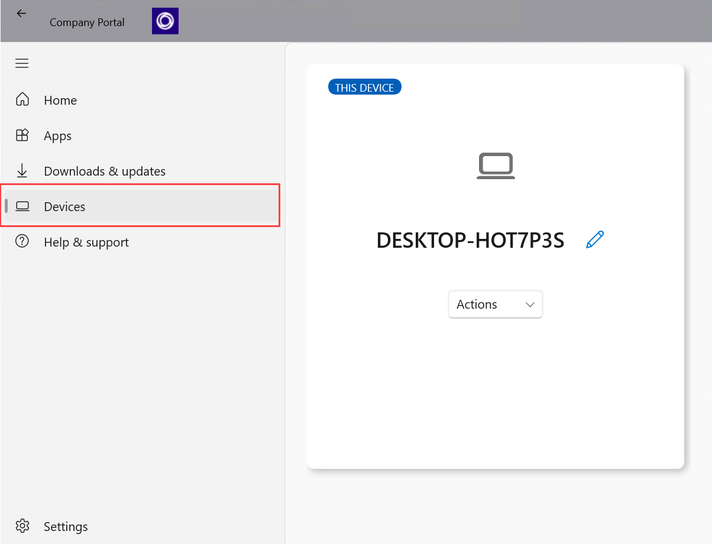
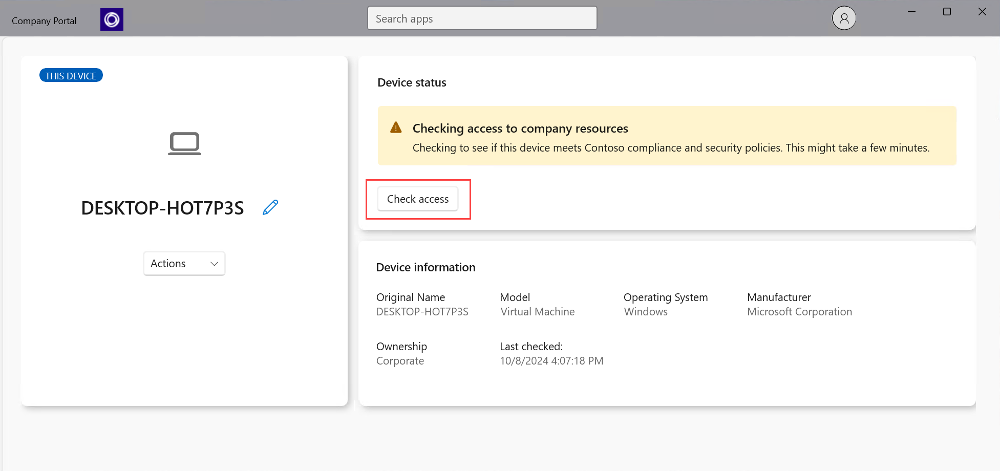

---
# required metadata

title: Check device access in Company Portal for Windows | Microsoft Docs
description: Check device access to find out if your device meets requirements, and is able to access work or school resources. 
keywords:
author: lenewsad
ms.author: lanewsad
manager: dougeby
ms.date: 10/16/2024
ms.topic: end-user-help
ms.service: microsoft-intune
ms.subservice: end-user
ms.assetid: 
searchScope:
 - User help

# optional metadata

ROBOTS:  
#audience:

ms.reviewer: 
ms.suite: ems
#ms.tgt_pltfrm:
ms.custom: intune-enduser
ms.collection:
- tier2
---

# Check access from Company Portal app for Windows

Verify that your device has access to work or school resources. The *check access* action in Company Portal evaluates your device's settings and its access status.  

Organizations enforce requirements, such as encryption and password limits, to make sure only secure, trusted devices access their internal resources. Your device must meet and maintain these requirements to gain access. Complete the steps in this article to check access from the Company Portal app for Windows. 

> [!NOTE]
> If you don't have the Company Portal app installed, you can still [use the Company Portal website to check access](check-status-company-portal-website.md).

## Check access   

1. Open the Company Portal app for Windows and go to **Devices**.  

   > [!div class="mx-imgBorder"]
   >  

2. Select a device.  

3. Under **Device status**, select **Check access**. 

   > [!div class="mx-imgBorder"]
   >  

    The app syncs your device with your organization's current requirements and checks to make sure your device matches them. This check can take a few minutes.  

4. Look at the status update. 
   - **Can access company resources**: No other action needed.      
   - **Cannot access company resources**: Take the required remediation actions to regain access to company resources.  After you update flagged settings, select **Check access** to recheck access.     
   - **Can access company resources, but action required**: Take the required remediation actions by the specified date or lose access to company resources.  After you update flagged settings, select **Check access** to recheck access.   
   
5. When applicable, the status message shows Microsoft Learn help links and remediation actions. Select one or more of these options to start troubleshooting right away. The resolve, check access, and contact actions in the following list are only visible when you're using Company Portal on the affected device.  

     * **How to resolve this** opens a relevant help article, if available.  
     * **Resolve** redirects you to the setting on your device.  
     * **Check access** evaluates your device again to make sure it matches your organization's requirements.  
     * **Contact IT** redirects you to your IT team's contact information.   

Need more help? Find your company support's contact information on the [Company Portal website](https://go.microsoft.com/fwlink/?linkid=2010980).
