---
# required metadata

title: Enroll an Android device with Microsoft Intune app and DISA Purebred  
description: Learn how to enroll an Android device and set up derived credential authentication with DISA Purebred.  
keywords:
author: lenewsad
ms.author: lanewsad
manager: dougeby
ms.date: 01/19/2022  
ms.topic: end-user-help
ms.prod:
ms.service: microsoft-intune
ms.subservice: end-user
ms.technology:
ms.assetid: 
searchScope:
 - User help

# optional metadata

ROBOTS:  
#audience:
#ms.devlang:
ms.reviewer: jeyang
ms.suite: ems
#ms.tgt_pltfrm:
ms.custom: intune-enduser
ms.collection: M365-identity-device-management
---

# Set up Android device with the Microsoft Intune app and DISA Purebred

Enroll your device with the Microsoft Intune app to gain secure, mobile access to your work email, files, and apps. After your device is enrolled, it becomes *managed*, which means your organization can assign policies and apps to the device through a mobile device management (MDM) provider, such as Microsoft Intune.  

During enrollment, you'll also install a derived credential on your device. Your organization might require you to use the derived credential as an authentication method when accessing resources, or for signing and encrypting emails.

You likely need to set up a derived credential if you use a smart card to:

* Sign in to school or work apps, Wi-Fi, and virtual private networks (VPN)
* Sign and encrypt school or work emails using S/MIME certificates

In this article, you will:

* Enroll a mobile Android device with the Intune app
* Set up your smart card by installing a derived credential from your organization's derived credential provider, [DISA Purebred](https://public.cyber.mil/pki-pke/purebred/)

## What are derived credentials?

A derived credential is a certificate that's derived from your smart card credentials and installed on your device. It grants you remote access to work resources, while preventing unauthorized users from accessing sensitive information.

Derived credentials are used to:

* Authenticate students and employees who sign in to school or work apps, Wi-Fi, and VPN
* Sign and encrypt school or work emails with S/MIME certificates

Derived credentials are an implementation of the National Institute of Standards and Technology (NIST) guidelines for Derived Personal Identity Verification (PIV) credentials as part of Special Publication (SP) 800-157.

## Prerequisites

To complete enrollment, you must have:

* Your school or work-provided smart card
* Access to a computer or kiosk where you can sign in with your smart card
* A new or factory-reset device running Android 8.0 or later 
* The Microsoft Intune app installed on your device
* The Purebred app installed on your device (App should automatically install shortly after device setup. If it doesn't, contact your IT support person.)

You'll also need to contact a Purebred agent or representative during setup.

## Enroll device  

1. Turn on your new or factory-reset device.  
2. On the **Welcome** screen, select your language. If you've been instructed to enroll with a QR code or NFC, follow the step below that matches the method.  
     * NFC: Tap your NFC-supported device against a programmer device to connect to your organization's network. Follow the onscreen prompts. When you reach the screen for Chrome's Terms of Service, continue to step 5.  

     * QR code: Complete the steps in [QR code enrollment](#qr-code-enrollment).  

     If you've been instructed to use another method, continue to step 3.    

3. Connect to Wi-Fi and tap **NEXT**. Follow the step that matches your enrollment method. 

    * Token: When you get to the Google sign-in screen, complete the steps in [Token enrollment](#token-enrollment).  
    * Google Zero Touch: After you connect to Wi-Fi, your device will be recognized by your organization. Continue to step 4 and follow the onscreen prompts until setup is complete.    
 
       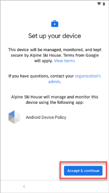   
   
4. Review Google's terms. Then tap **ACCEPT & CONTINUE**.  

      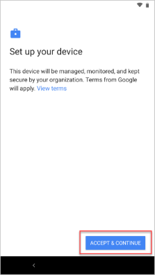   

5. Review Chrome's Terms of Service. Then tap **ACCEPT & CONTINUE**.  

   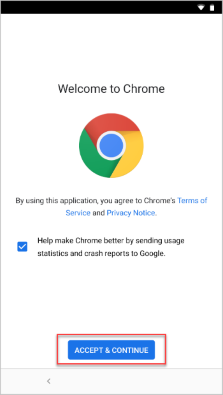   

6. On the sign-in screen, tap **Sign-in options** and then **Sign in from another device**. 

7. Write down the onscreen code.  

8. Switch to your smart card-enabled device and go to the web address that's shown on your screen. 

9. Enter the code you previously wrote down.

   > [!div class="mx-imgBorder"]
   > 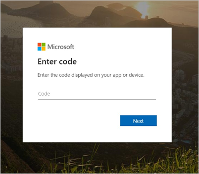

10. Insert your smart card to sign in. 

11. On the sign-in screen, select your work or school account. Then switch back to your mobile device. 

12. Depending on your organization's requirements, you might be prompted to update settings, such as screen lock or encryption. If you see these prompts, tap **SET** and follow the onscreen instructions.  

       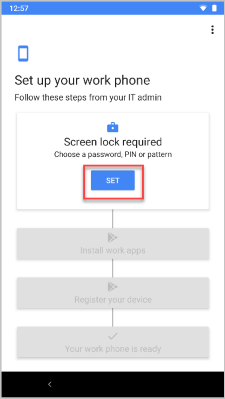   

13. To install work apps on your device, tap **INSTALL**. After installation is complete, tap **NEXT**.  

       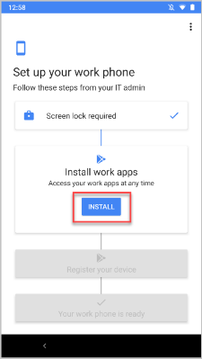   

14. Tap **START** to open the Microsoft Intune app. 

    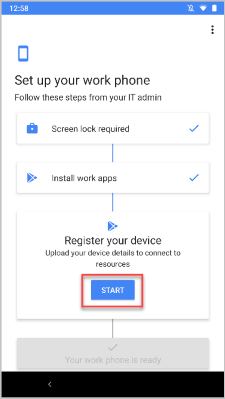   

15. Return to the Intune app on your mobile device and follow the onscreen instructions until enrollment is done. 

    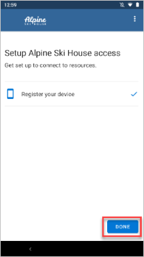   

16. Continue to the [set up your smart card](enroll-android-device-disa-purebred.md#set-up-smart-card) section in this article to finish setting up your device.  

### QR code enrollment  
In this section, you'll scan your company-provided QR code.  When you're done, we'll redirect you back to the device enrollment steps.     
  
1. On the **Welcome** screen, tap the screen five times to start QR code setup.  

   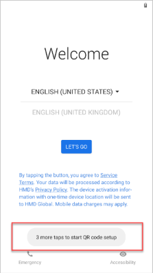  

2. Follow any onscreen instructions to connect to Wi-Fi.  
3. If your device doesn't have a QR code scanner, the setup screens will show the progress as a scanner is installed. Wait for installation to complete.  
4. When prompted, scan the enrollment profile QR code that your organization gave you.  
5. Return to [Enroll device](#enroll-device), step 4 to continue setup.  

### Token enrollment  
In this section, you'll enter your company-provided token. When you're done, we'll redirect you back to the device enrollment steps.  

1. On the Google sign-in screen, in the **Email or phone** box, type **afw#setup**. Tap **Next**. 

   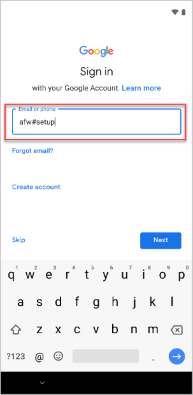   

2. Choose **Install** for the **Android Device Policy** app. Continue through the installation. Depending on your device, you might need to review and accept additional terms.    

3. On the **Enroll this device** screen, select **Next**.  

4. Select **Enter code**.  

5. On the **Scan or enter code** screen, type in the code that your organization gave you.  Then click **Next**.  

   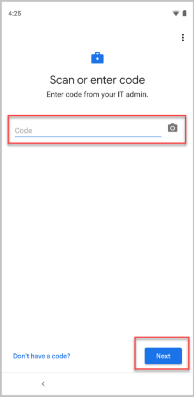  

6. Return to [Enroll device](#enroll-device), step 4 to continue setup.

## Set up smart card  

> [!NOTE]
> The Purebred app is required to complete these steps and will automatically install on your device after enrollment. If you still don't have the app after waiting a short while, contact your IT support person.  

1. After enrollment is complete, the Intune app will notify you to set up your smart card. Tap the notification. If you don't get a notification, check your email.

   > [!div class="mx-imgBorder"]
   > 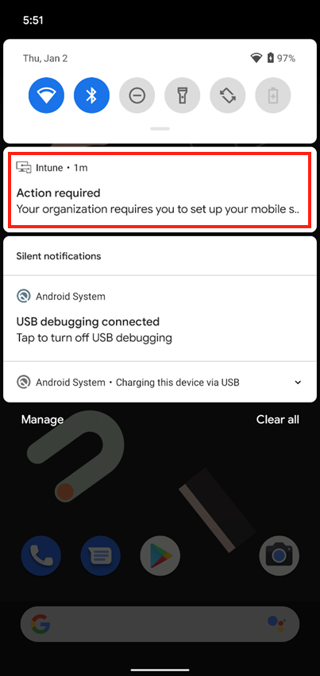

2. On the **Set up smart card** screen:

   1. Tap the link to your organization's setup instructions and review them. If your organization doesn't provide additional instructions, you'll be sent to this article.

   2. Tap **BEGIN**.   

   > [!div class="mx-imgBorder"]
   > 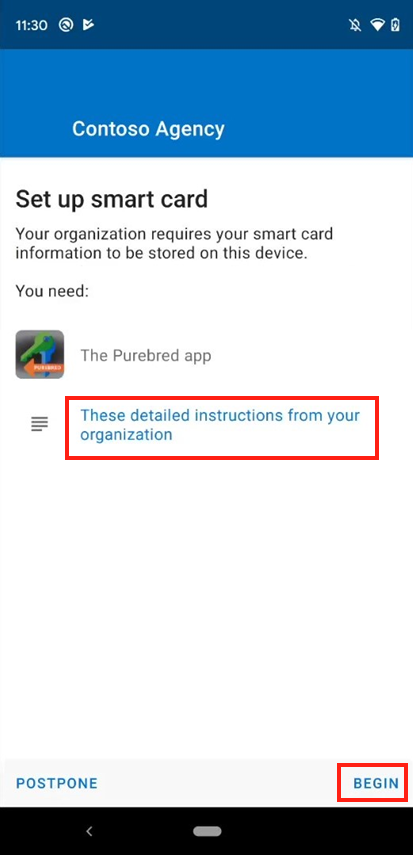

3. On the **Get certificates** screen, tap **LAUNCH PUREBRED** to open the Purebred app. (The app should have been installed automatically on your device. If you don't have it, contact your support person.)  

   > [!div class="mx-imgBorder"]
   > 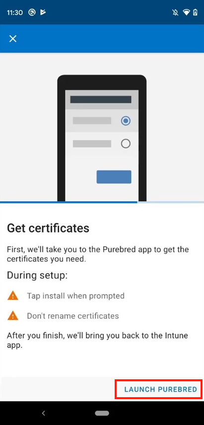  

4. The Purebred app might need additional permissions from you in order to run properly. Tap **Allow** or **Allow all the time** when prompted. For more information about why these permissions are required, speak with your support person or Purebred agent.  

5. Once you're in the Purebred app, work with your organization's Purebred agent to download and install the certificates you need to access work or school resources.

    > [!IMPORTANT]
    > During this process, tap **OK** or **Install** when prompted. Don't change the names of any certificate authorities (CAs) or certificates that you're prompted to install.    

6. After installation is complete, you'll receive a notification that your certificates are ready. Tap the notification to return to the Intune app.

    > [!div class="mx-imgBorder"]
    > 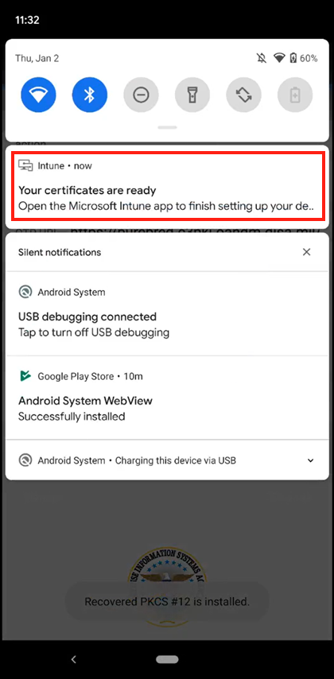

7. From the **Allow access to certificates** screen, you'll give the Intune app permission to access the derived credential you got from DISA Purebred. This step ensures that your organization can verify your identity whenever you access protected work or school resources.  

    1. Tap **NEXT**.

       > [!div class="mx-imgBorder"]
       > 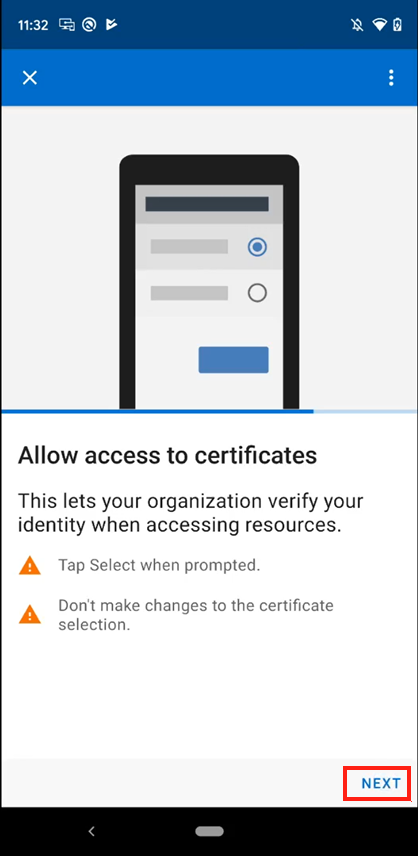

    2. When you're prompted to **Choose certificate**, don't change the selection. The correct certificate is already selected, so just tap **Select** or **OK**.  

       > [!div class="mx-imgBorder"]
       > 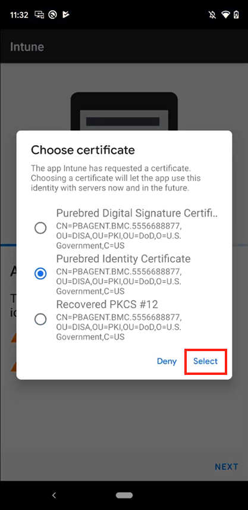

    3. Your derived credential is made up of multiple certificates, so you might see the **Choose certificate** prompt multiple times. Repeat the previous step until no more prompts appear.  

8. Once all of the certificates are processed, wait for the Intune app to finish setting up your device. You'll know setup is complete when you see the **You're all set!** screen.  

    > [!div class="mx-imgBorder"]
    > 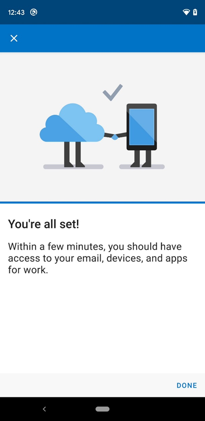

## Next steps

After enrollment is complete, you'll have access to work resources, such as email, Wi-Fi, and any apps that your organization makes available. For more information about how to get, search for, install, and uninstall apps in the Intune app see:

* [Use managed apps on your device](use-managed-apps-on-your-device-android.md)  
* [Manage apps from the Company Portal website](manage-apps-cpweb.md)  

Still need help? Contact your company support. For contact information, check the [Company Portal website](https://go.microsoft.com/fwlink/?linkid=2010980).
