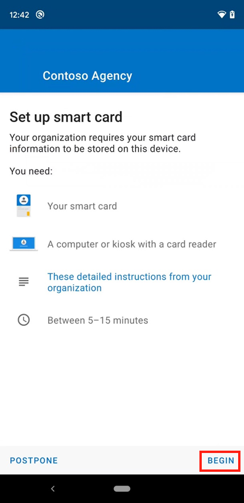
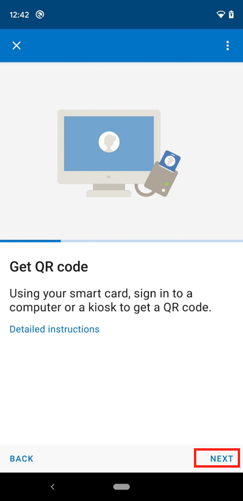
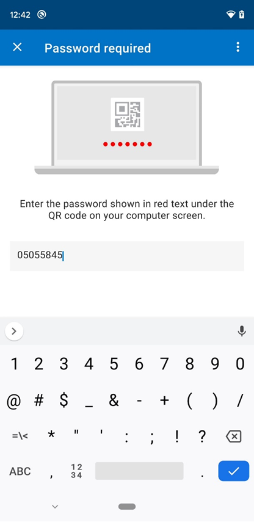
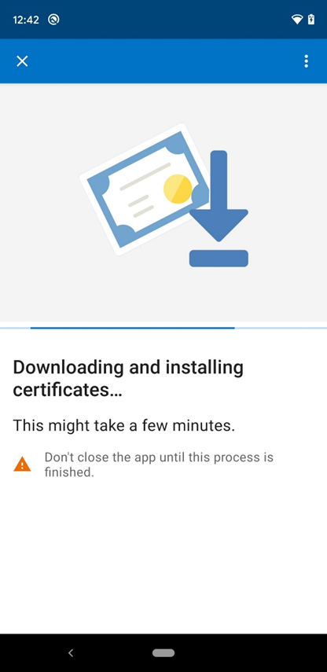
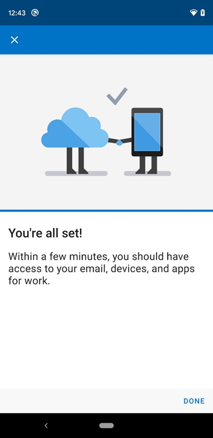

---
# required metadata

title: Enroll Android device with the Microsoft Intune app and Entrust  
description: Enroll an Android device and set up derived credential authentication with Entrust.
keywords:
author: lenewsad
ms.author: lanewsad
manager: dougeby
ms.date: 01/19/2022 
ms.topic: end-user-help
ms.service: microsoft-intune
ms.subservice: end-user
ms.assetid: 
searchScope:
 - User help

# optional metadata

ROBOTS:  
#audience:
#ms.devlang:
ms.reviewer: jieyan
ms.suite: ems
#ms.tgt_pltfrm:
ms.custom: intune-enduser
ms.collection:
- tier1
- M365-identity-device-management
---

# Set up Android device with Company Portal and Entrust

Enroll your device with the Microsoft Intune app to gain secure, mobile access to your work or school mail, files, and apps. After your device is enrolled, it becomes *managed*, meaning your organization can assign policies and apps to the device through a mobile device management (MDM) provider, such as Microsoft Intune.  

During enrollment, you also install a derived credential on your device. Your organization might require you to use the derived credential as an authentication method when accessing resources, or for signing and encrypting emails.

You likely need to set up a derived credential if you use a smart card to:

* Sign in to school or work apps, Wi-Fi, and virtual private networks (VPN)
* Sign and encrypt school or work emails using S/MIME certificates

In this article, you will:

* Enroll a mobile Android device with the Intune app
* Set up your smart card by installing a derived credential from your organization's derived credential provider, [Entrust](https://www.entrust.com/)

## What are derived credentials?

A derived credential is a certificate derived from your smart card credentials and installed on your device. It grants you remote access to work resources, while preventing unauthorized users from accessing sensitive information.

Derived credentials are used to:

* Authenticate students and employees who sign in to school or work apps, Wi-Fi, and VPN
* Sign and encrypt school or work emails with S/MIME certificates

Derived credentials are an implementation of the National Institute of Standards and Technology (NIST) guidelines for Derived Personal Identity Verification (PIV) credentials as part of Special Publication (SP) 800-157.

## Prerequisites

 To complete enrollment, you must have:

* Your school or work-provided smart card
* Access to a computer or kiosk where you can sign in with your smart card
* A new or factory-reset device running Android 8.0 or later
* The Microsoft Intune app installed on your device

## Enroll device  

1. Turn on your new or factory-reset device.  
2. On the **Welcome** screen, select your language. If your organizations instructed you to enroll with a QR code or NFC, follow the step that matches the method.  
     * NFC: Tap your NFC-supported device against a programmer device to connect to your organization's network. Follow the onscreen prompts. When you reach the screen for Chrome's Terms of Service, continue to step 5.  

     * QR code: Complete the steps in [QR code enrollment](#qr-code-enrollment).  

     If your organization instructed you to use another method, continue to step 3.    

3. Connect to Wi-Fi and tap **NEXT**. Follow the step that matches your enrollment method. 

    * Token: When you get to the Google sign-in screen, complete the steps in [Token enrollment](#token-enrollment).  
    * Google Zero Touch: After you connect to Wi-Fi, your device is recognized by your organization. Continue to step 4 and follow the onscreen prompts until setup is complete.
      
4. Review Google's terms. Then tap **ACCEPT & CONTINUE**.  

5. Review Chrome's Terms of Service. Then tap **ACCEPT & CONTINUE**.  

6. On the sign-in screen, tap **Sign-in options** and then **Sign in from another device**. 

7. Write down the onscreen code.  

8. Switch to your smart card-enabled device and go to the web address shown on your screen. 

9. Enter the code you previously wrote down.  

10. Insert your smart card to sign in.  

11. On the sign-in screen, select your work or school account. Then switch back to your mobile device. 

12. Depending on your organization's requirements, you might be prompted to update settings, such as screen lock or encryption. If you see these prompts, tap **SET** and follow the onscreen instructions.   

13. To install work apps on your device, tap **INSTALL**. After installation is complete, tap **NEXT**. 

14. Tap **START** to open the Microsoft Intune app. 

15. Return to the Intune app on your mobile device and follow the onscreen instructions until enrollment is done.  

16. Continue to the [set up your smart card](enroll-android-device-entrust-datacard.md#set-up-smart-card) section in this article to finish setting up your device.  

### QR code enrollment  
In this section, you scan your company-provided QR code. When you're done, we'll redirect you back to the device enrollment steps.     
  
1. On the **Welcome** screen, tap the screen five times to start QR code setup.  
2. Follow any onscreen instructions to connect to Wi-Fi.  
3. If your device doesn't have a QR code scanner, the setup screens will show the progress as a scanner is installed. Wait for installation to complete.  
4. When prompted, scan the enrollment profile QR code that your organization gave you.  
5. Return to [Enroll device](#enroll-device), step 4 to continue setup.  

### Token enrollment  
In this section, you enter your company-provided token. When you're done, we'll redirect you back to the device enrollment steps.  

1. On the Google sign-in screen, in the **Email or phone** box, type **afw#setup**. Then tap **Next**.  

2. Choose **Install** for the **Android Device Policy** app. Continue through the installation. Depending on your device, you might need to review and accept other terms.    

3. On the **Enroll this device** screen, tap **Next**.  

4. Tap **Enter code**.  

5. On the **Scan or enter code** screen, enter the code that your organization gave you. Then tap **Next**.  

6. Return to [Enroll device](#enroll-device), step 4 to continue setup.  

## Set up smart card  

1. After enrollment is complete, the Intune app prompts you to set up your smart card via notification. Tap the notification. If you don't get a notification, check your email.

   > [!div class="mx-imgBorder"]
   > 

2. On the **Set up smart card** screen:

   1. Tap the link to your organization's instructions. If your organization doesn't provide more instruction, you are sent to this article.

   2. Tap **BEGIN**. 

   > [!div class="mx-imgBorder"]
   > 

3. Switch to your smart card-enabled device and open IdentityGuard.

4. Find the smart credential sign-in area and select the sign-in button.

5. When you're prompted to select a certificate, pick your smart card credentials. Then select **OK**.

6. Enter your smart card PIN.

7. Choose from the list of actions. Select the one that lets you enroll for a derived mobile smart credential. The link or button might say **I'd like to enroll for a derived mobile smart card credential.**

8. Select the option that says you successfully downloaded and installed the smart credential-enabled application. Then continue to the next screen.

9. Enter information about your derived smart card credential:

    1. For the identity name, enter any name, such as *Entrust Derived Cred*.  
    2. In the dropdown menu, select **Entrust IdentityGuard Mobile Smart Credential**.

    3. Continue to the next screen. The screen shows a QR code with a numerical password under it.  

10. Return to your Android device. On the Intune app > **Get QR code** screen, tap **NEXT**.

    > [!div class="mx-imgBorder"]
    > 

11. If you're prompted to allow the Intune app to use your camera, tap **Allow**.

12. Scan the image of the QR code shown on your smart card-enabled device.

13. On the **Password required** screen, enter the password that appears under the QR code.

    > [!div class="mx-imgBorder"]
    >   

14. The Intune app starts downloading and installing the certificates needed to access work or school resources. Depending on your internet connection, this process could take some time. Don't close the app during this time.

    > [!div class="mx-imgBorder"]
    >   

15. Once all of the certificates are processed, wait for the Intune app to finish setting up your device. Setup is complete when you see the **You're all set!** screen.

    > [!div class="mx-imgBorder"]
    > 

## Next steps

After enrollment is complete, you have access to work resources, such as email, Wi-Fi, and any apps that your organization makes available. For more information about how to get, search for, install, and uninstall apps in the Intune app see:

* [Use managed apps on your device](use-managed-apps-on-your-device-android.md)  
* [Manage apps from the Company Portal website](manage-apps-cpweb.md)  

Still need help? Contact your company support. For contact information, check the [Company Portal website](https://go.microsoft.com/fwlink/?linkid=2010980).
