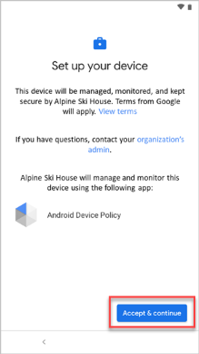
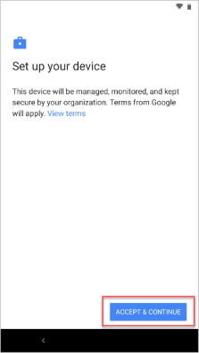
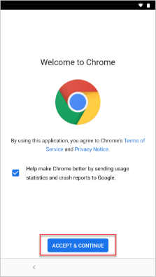
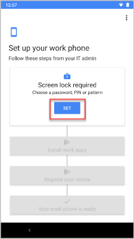
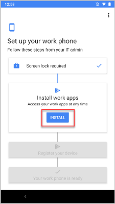
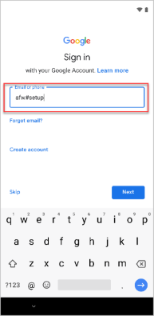

---
# required metadata

title: Enroll corporate device with Microsoft Intune app| Microsoft Docs
description: Describes how to enroll a corporate Android device in Intune
keywords:
author: lenewsad
ms.author: lanewsad
manager: dougeby
ms.date: 01/19/2022
ms.topic: end-user-help
ms.prod:
ms.service: microsoft-intune
ms.subservice: end-user
ms.technology:
ms.assetid: 0ed3a002-7533-4001-ae24-e10b64b66620
searchScope:
 - User help

# optional metadata

ROBOTS:  
#audience:

ms.reviewer: esmich
ms.suite: ems
#ms.tgt_pltfrm:
ms.custom: intune-enduser
ms.collection:
- tier1
---

# Enroll your corporate device with the Microsoft Intune app

Enroll your corporate-owned Android device to get secure access to work email, apps, and other data that your organization makes available. The Microsoft Intune app supports corporate-owned devices running Android 8.0 and later. It will be automatically installed on new and factory-reset devices during enrollment. 

There are four ways to enroll. Your organization should let you know which option to use.
 
* Near Field Communication (NFC)  
* Token  
* QR Code   
* Google Zero Touch  

## Enroll device 
Complete these steps to set up and enroll your device.  

> [!NOTE]
> The Android version or device manufacturer might require you to complete additional steps that aren't covered in this procedure. The colors and text you see in the screenshots might also appear different on your device.  

1. Turn on your new or factory-reset device.  
2. On the **Welcome** screen, select your language.   If you've been instructed to enroll with a QR code or NFC, follow the step below that matches the method.  
     * NFC: Tap your NFC-supported device against a programmer device to connect to your organization's network. Follow the onscreen prompts. When you reach the screen for Chrome's Terms of Service, continue to step 5.  

     * QR code: Complete the steps in [QR code enrollment](#qr-code-enrollment).  

     If you've been instructed to use another method, continue to step 3.    

3. Connect to Wi-Fi and tap **NEXT**. Follow the step that matches your enrollment method. 

    * Token: When you get to the Google sign-in screen, complete the steps in [Token enrollment](#token-enrollment).  
    * Google Zero Touch: After you connect to Wi-Fi, your device will be recognized by your organization. Continue to step 4 and follow the onscreen prompts until setup is complete.    
 
          
   
4. Review Google's terms. Then tap **ACCEPT & CONTINUE**.  

         

6. Review Chrome's Terms of Service. Then tap **ACCEPT & CONTINUE**.  

      

7. On the sign in screens, sign in with your work or school account.   

    a. Enter your email and tap **Next**.      
    b. Enter your password and tap **Sign in**.  

8. Depending on your organization's requirements, you might be prompted to update settings, such as screen lock or encryption. If you see these prompts, tap **SET** and follow the onscreen instructions.  

      

9. To install work apps on your device, tap **INSTALL**. After installation is complete, tap **NEXT**.  

      

10. Tap **START** to open the Microsoft Intune app and register your device. 

       

11. Tap **SIGN IN** and then tap **NEXT** to begin registration. When you see the message that registration is complete, tap **DONE**.  

       

10. When you see the message that your device is ready, tap **DONE**.  

       

If you have trouble accessing your organization's resources, you might need to update additional settings on your device. Sign in to the Microsoft Intune app to check for required updates.   

## QR code enrollment  
In this section, you'll scan your company-provided QR code.  When you're done, we'll redirect you back to the device enrollment steps.     
  
1. On the **Welcome** screen, tap the screen five times to start QR code setup.  

     

2. Follow any onscreen instructions to connect to Wi-Fi.  
3. If your device doesn't have a QR code scanner, the setup screens will show the progress as a scanner is installed. Wait for installation to complete.  
4. When prompted, scan the enrollment profile QR code that your organization gave you.  
5. Return to [Enroll device](#enroll-device), step 4 to continue setup.  

## Token enrollment  
In this section, you'll enter your company-provided token. When you're done, we'll redirect you back to the device enrollment steps.  

1. On the Google sign-in screen, in the **Email or phone** box, type **afw#setup**. Tap **Next**. 

      

2. Choose **Install** for the **Android Device Policy** app. Continue through the installation. Depending on your device, you might need to review and accept additional terms.    

3. On the **Enroll this device** screen, select **Next**.  

4. Select **Enter code**.  

5. On the **Scan or enter code** screen, type in the code that your organization gave you.  Then click **Next**.  

     

6. Return to [Enroll device](#enroll-device), step 4 to continue setup.  

## Next steps   
Still need help? Contact your company support (check the [Company Portal website](https://go.microsoft.com/fwlink/?linkid=2010980) for contact information), or write the <a href="mailto:wintunedroidfbk@microsoft.com?subject=I'm having trouble with enrolling my Android device&body=Describe the issue you're experiencing here.">Microsoft Android team</a>.  
