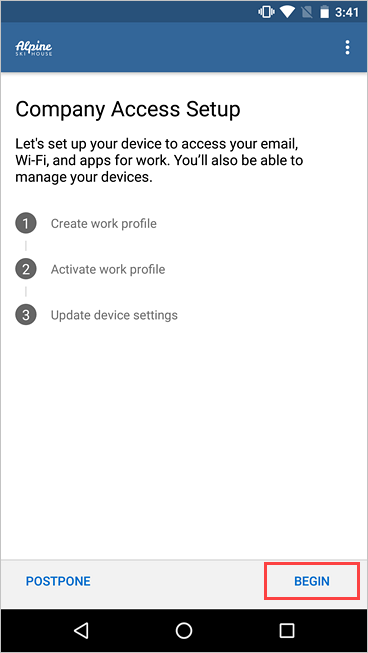
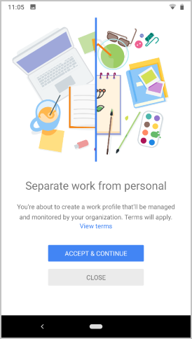
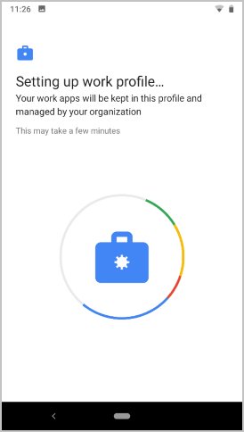
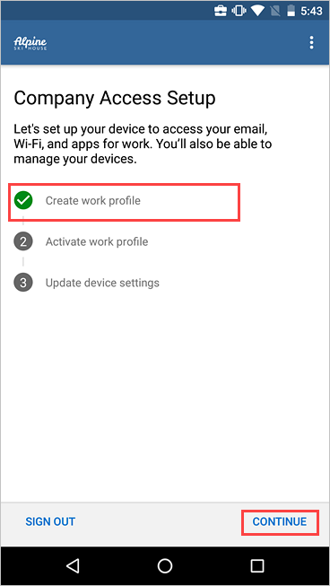
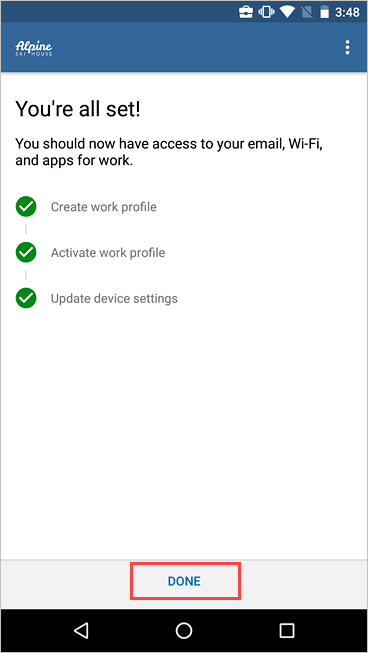
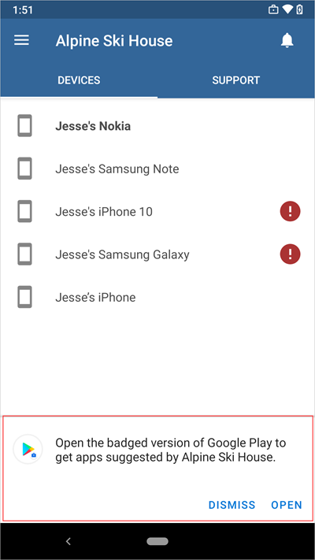
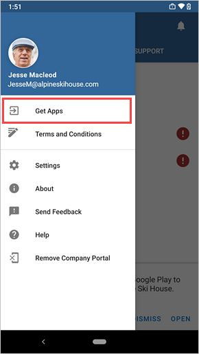

---
# required metadata

title: Enroll device and create Android work profile - Microsoft Intune | Microsoft Docs
description: How create a work profile and enroll device with Intune Company Portal.
keywords:
author: lenewsad
ms.author: lanewsad
manager: dougeby
ms.date: 03/19/2021  
ms.topic: end-user-help
ms.prod:
ms.service: microsoft-intune
ms.subservice: end-user
ms.technology:
ms.assetid: 33ffff16-0280-43bf-87b3-74ddf4439bfa
searchScope:
 - User help

# optional metadata

ROBOTS:  
#audience:

ms.reviewer: arnab
ms.suite: ems
#ms.tgt_pltfrm:
ms.custom: intune-enduser
ms.collection:
- tier2
---

# Enroll device with Android work profile

Enroll your personal Android device to get access to work or school email, apps, and other data. During enrollment, you'll set up an Android work profile, which separates the personal data on your device from your work data. If this type of setup is something you're required to do, your organization will let you know through their preferred communication channel or Intune Company Portal app. 

After your profile is set up, your organization will manage the work-side of it, which consists of only the work files and work data. Your IT administrator can configure and enforce certain device-level settings on your device, such as requiring you to set a device PIN. They can't see any data in the apps on the personal side of your device.  
 
> [!VIDEO https://www.youtube.com/embed/9Dl8HsGk4tI]

Find out more about [what happens when you create a work profile](what-happens-when-you-create-a-work-profile-android.md).

## Create work profile and enroll device

> [!NOTE]
> To create a work profile on your device, you must be using the primary user account on your device. Creating a work profile on a secondary user account is not supported. 

1. Open the Company Portal app and sign in with your work or school account. If you haven't installed the free app, install it from [Google Play](https://play.google.com/store/apps/details?id=com.microsoft.windowsintune.companyportal).  

2. On the **Company Access Setup** screen, tap **BEGIN**.  

      

3. Review what your organization can and can't see. Then tap **CONTINUE**. 

      

4. Review Google's terms for creating a work profile. Then tap **ACCEPT & CONTINUE**. The appearance of this screen will vary based on your device's Android version. 

      

5. Wait while your work profile is set up.  

      

6. On devices running certain Android versions, you'll see another informational screen about the type of apps you need. Wait to be redirected and signed in to the Company Portal app.  

    When you get to the **Company Access Setup** screen, check that your work profile is created. Then tap **CONTINUE**.  

      

8. Check that your work profile is active. Then tap **CONTINUE**. 

      

9. Your organization might require you to update your device settings. Tap **RESOLVE** to adjust a setting. When you're done updating settings, tap **CONTINUE**.    

     

10. When setup is complete, tap **DONE**.  

      

10. When prompted to view your organization's suggested apps in Google Play, select **OPEN**. 

     

    If you're not ready to install apps, you can always access them later by going directly to the badged version of the Google Play app. You can also select **Get Apps** from the Company Portal menu.  

     

## Android Enterprise availability 

Work profile setup is supported in [countries and regions where Android Enterprise is available](https://support.google.com/work/android/answer/6270910) (opens Google Support website). Company Portal can't set up a work profile on your device if you're outside these areas. If Android Enterprise isn't available in your country or region, ask your support person for other ways to access work resources.  

## Update Google Play services  

If the version of Google Play services on your device is outdated, you may be unable to enroll your device. [Open Google Play services](https://play.google.com/store/apps/details?id=com.google.android.gms)(opens Google Play) to check for and install available updates. For more information about how to update Android apps, see [Update your Android apps](https://support.google.com/googleplay/answer/113412)(opens Google Play Help). 

## Next steps  

Now that your device is enrolled, you can install school or work apps on your device. Go to the managed Google Play store to find and install these apps. 

Still need help? Contact your company support. For contact information, check the [Company Portal website](https://go.microsoft.com/fwlink/?linkid=2010980).
