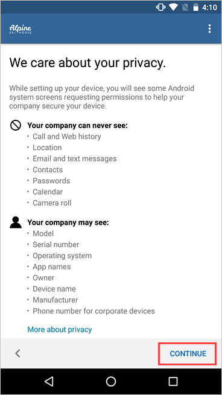

---
# required metadata

title: Enroll device and create Android work profile - Microsoft Intune | Microsoft Docs
description: How create a work profile and enroll device with Intune Company Portal.
keywords:
author: lenewsad
ms.author: lanewsad
manager: dougeby
ms.date: 11/13/2024  
ms.topic: end-user-help
ms.service: microsoft-intune
ms.subservice: end-user
ms.assetid: 33ffff16-0280-43bf-87b3-74ddf4439bfa
searchScope:
 - User help

# optional metadata

ROBOTS:  
#audience:

ms.reviewer: 
ms.suite: ems
#ms.tgt_pltfrm:
ms.custom: intune-enduser
ms.collection:
- tier1
---

# Enroll device with Android work profile  

Enroll your personal Android device to get access to work emails, apps, Wi-Fi, and other resources. During enrollment, you will:  

1. Create a work profile.  
2. Activate the work profile.  
3. Update device settings.  

This article describes how to enroll your device using the Intune Company Portal app. For more information about the work profile and its features, see [Introduction to Android work profile](what-happens-when-you-create-a-work-profile-android.md).   
 
> [!VIDEO https://www.youtube.com/embed/9Dl8HsGk4tI]

## Before you begin    

[Install the Intune Company Portal app from Google Play](https://play.google.com/store/apps/details?id=com.microsoft.windowsintune.companyportal). The Company Portal app is used to enroll and manage your device, install work apps, and get IT support.  

## Enroll device  
Make sure you're signed in to the primary user account on your device. Work profile enrollment is not supported on secondary user accounts.  

1. Open the Intune Company Portal app and sign in with your work or school account.   

2. On the **Company Access Setup** screen, review the tasks required to enroll your device. Then tap **BEGIN**.  

      

3. On the privacy information screen, review the list of items that your organization can and can't see on your device. Then tap **CONTINUE**. 

      

4. Review the Google terms for creating a work profile. Accept the terms to continue. The appearance of this screen varies based on OS version.  

   > [!div class="mx-imgBorder"]
   >   

5. Review the Samsung Knox privacy policy. Select **Agree** to continue. This screen only appears if you're using a Samsung device.  

   > [!div class="mx-imgBorder"]
   >  
    
6. Wait a few minutes while your work profile is set up. Then select **Next**.      

   > [!div class="mx-imgBorder"]
   >   

7. On the **Company Access Setup** screen, confirm that the profile has been created. Then tap **CONTINUE** to proceed to the next enrollment task.    

   > [!div class="mx-imgBorder"]
   >   

8. Wait while the app registers your device. When prompted to, sign in with your work account.  
9. On the **Company Access Setup** screen, confirm that the work profile is active. Then tap **CONTINUE** to proceed to the next enrollment task.  

   > [!div class="mx-imgBorder"]
   >   

10. In the Company Portal app, review the list of settings your organization requires.  Update the settings on your device if necessary. Tap **RESOLVE** to open the setting on your device. After you're done updating settings, tap **CONFIRM DEVICE SETTINGS**.   

   > [!div class="mx-imgBorder"]
   >   

11. When setup and enrollment are complete, you are sent back to the setup list, where you should see a green checkmark next to each enrollment task. Tap **DONE**.       

      

12. Optionally, when prompted to view suggested work apps in Google Play Store, tap **OPEN**. If you're not ready to install apps, you can do it later by going to the Play Store app in your work profile.    

     

    You can also access available apps from the Company Portal menu > **Get Apps**.  

      

## Android Enterprise availability 

Work profiles are supported in [countries and regions where Android Enterprise is available](https://support.google.com/work/android/answer/6270910) (opens Google Support website). Company Portal can't set up a work profile on your device if you're outside these areas. If Android Enterprise isn't available in your country or region, ask your support person for other ways to access work resources.  

## Update Google Play services  

If the version of Google Play services on your device is outdated, you may be unable to enroll your device. [Open Google Play services](https://play.google.com/store/apps/details?id=com.google.android.gms) on your device to check for available updates. For more information about how to update Android apps, see [Update your Android apps](https://support.google.com/googleplay/answer/113412)(opens Google Support website).  

## Next steps  
Install the apps you need for work or school. Switch to your work profile to see all available apps, and search for more apps in the work version of Google Play Store. 

Need more help? Go to **Support** in the Company Portal app to find your organization's IT contact information. You can also sign in to the [Company Portal website](https://go.microsoft.com/fwlink/?linkid=2010980) with your work or school account, and go to **Helpdesk**.
