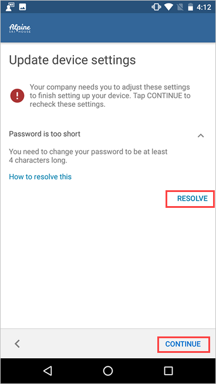

---
# required metadata

title: Enroll device and create Android work profile - Microsoft Intune | Microsoft Docs
description: How create a work profile and enroll device with Intune Company Portal.
keywords:
author: lenewsad
ms.author: lanewsad
manager: dougeby
ms.date: 03/19/2021  
ms.topic: end-user-help
ms.prod:
ms.service: microsoft-intune
ms.subservice: end-user
ms.technology:
ms.assetid: 33ffff16-0280-43bf-87b3-74ddf4439bfa
searchScope:
 - User help

# optional metadata

ROBOTS:  
#audience:

ms.reviewer: 
ms.suite: ems
#ms.tgt_pltfrm:
ms.custom: intune-enduser
ms.collection:
- tier1
---

# Enroll device with Android work profile

Enroll your personal Android device to get access to work or school email, apps, and other data. During enrollment, you'll set up an Android work profile, which separates the personal data on your device from your work data. If this type of setup is something you're required to do, your organization will let you know through their preferred communication channel or Intune Company Portal app. 

After your profile is set up, your organization manages the work-side of it, which consists of work files and work data. Your IT administrator can configure and enforce certain device-level settings on your device, such as requiring you to set a device PIN. They can't see any data in the apps on the personal side of your device.  
 
> [!VIDEO https://www.youtube.com/embed/9Dl8HsGk4tI] 

## Create work profile and enroll device  
To create a work profile on your device, you must be using the primary user account on your device. Creating a work profile on a secondary user account is not supported. 

1. Open the Company Portal app and sign in with your work or school account. If you haven't installed the free app, install it from [Google Play](https://play.google.com/store/apps/details?id=com.microsoft.windowsintune.companyportal).  

2. Review the steps for setting up access. Then tap **BEGIN**.  

      

3. Review privacy information, including what your organization can and can't see on your device. Then tap **CONTINUE**. 

      

4. Read Google's terms for creating a work profile. Accept the terms to continue. The appearance of this screen varies based on OS version.  

      

5. Wait while your work profile is set up. Select **Next** to return to the Company Portal app.      

      

7. On the **Company Access Setup** screen, confirm your work profile was created. Then tap **CONTINUE**.  

      

8. Wait for your device to finish registering and setting up the profile.   
8. On the **Company Access Setup** screen, confirm your work profile is active. Then tap **CONTINUE**. 

      

9. Update your device settings to meet your organization's security requirements. Tap **RESOLVE** to open the setting on your device. When you're done updating settings, tap **CONFIRM DEVICE SETTINGS**.    

     

10. When setup is complete, tap **DONE**.  

      

10. When prompted to view your organization's suggested apps in Google Play, select **OPEN**. 

     

    If you're not ready to install apps, you can always access them later by going directly to the badged version of the Google Play app. You can also select **Get Apps** from the Company Portal menu.  

     

## Android Enterprise availability 

Work profile setup is supported in [countries and regions where Android Enterprise is available](https://support.google.com/work/android/answer/6270910) (opens Google Support website). Company Portal can't set up a work profile on your device if you're outside these areas. If Android Enterprise isn't available in your country or region, ask your support person for other ways to access work resources.  

## Update Google Play services  

If the version of Google Play services on your device is outdated, you may be unable to enroll your device. [Open Google Play services](https://play.google.com/store/apps/details?id=com.google.android.gms)(opens Google Play) to check for and install available updates. For more information about how to update Android apps, see [Update your Android apps](https://support.google.com/googleplay/answer/113412)(opens Google Play Help). 

## Next steps  
Install the apps you need for work or school. Switch to your work profile to see all available apps, and search for more apps in the work version of the Google Play store. For more information about how to access your work profile and use profile features, see [Introduction to Android work profile](what-happens-when-you-create-a-work-profile-android.md).  

Need additional help? Contact your IT support person. For contact information, sign in to the [Company Portal website](https://go.microsoft.com/fwlink/?linkid=2010980) with your work or school account, and then go to **Helpdesk**.  
