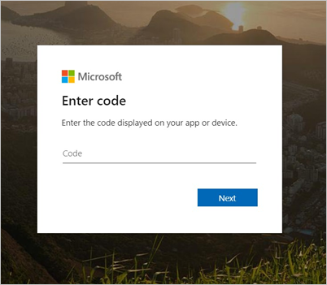
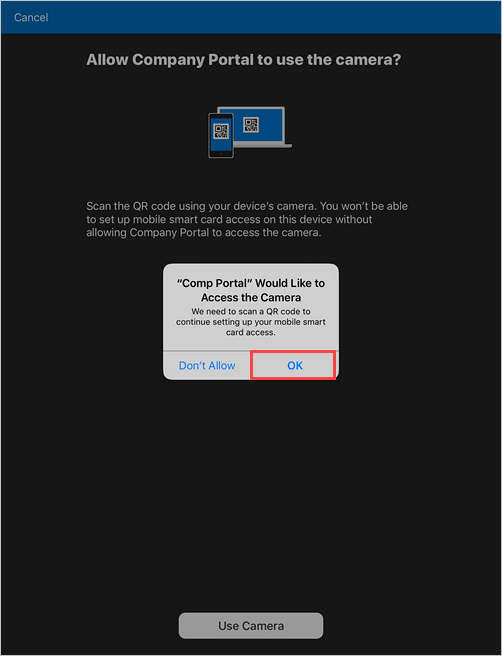

---
# required metadata

title: Enroll iOS or iPadOS device with Intune Company Portal and Entrust  
description: Enroll an iOS or iPadOS device and set up derived credential authentication with Entrust.
keywords:
author: lenewsad
ms.author: lanewsad
manager: dougeby
ms.date: 07/08/2020
ms.topic: end-user-help
ms.prod:
ms.service: microsoft-intune
ms.subservice: end-user
ms.technology:
ms.assetid: 
searchScope:
 - User help

# optional metadata

ROBOTS:  
#audience:

ms.reviewer: tisilver
ms.suite: ems
#ms.tgt_pltfrm:
ms.custom: intune-enduser
ms.collection:
- tier2
---

# Set up iOS or iPadOS device with Company Portal and Entrust

Enroll your device with the Intune Company Portal app to gain secure, mobile access to your organization's email, files, and apps. After your device is enrolled, it becomes *managed*. Your organization can assign policies and apps to the device through a mobile device management (MDM) provider, such as Intune.  

During enrollment, you'll also install a derived credential on your device. Your organization might require you to use the derived credential as an authentication method when accessing resources, or for signing and encrypting emails. 

You likely need to set up a derived credential if you use a smart card to:  

* Sign in to school or work apps, Wi-Fi, and virtual private networks (VPN)
* Sign and encrypt school or work emails using S/MIME certificates  

In this article, you will:  

   * Enroll a mobile iOS or iPadOS device with Intune Company Portal.  
   * Get a derived credential from your organization's derived credential provider, [Entrust](https://www.entrust.com/).  

### What are derived credentials?  
A derived credential is a certificate that's derived from your smart card credentials and installed on your device. It grants you remote access to work resources, while preventing unauthorized users from accessing sensitive information.  

Derived credentials are used to: 
* Authenticate students and employees who sign in to school or work apps, Wi-Fi, and VPN
* Sign and encrypt school or work emails with S/MIME certificates

Derived credentials are an implementation of the National Institute of Standards and Technology (NIST) guidelines for Derived Personal Identity Verification (PIV) credentials as part of Special Publication (SP) 800-157.  

## Prerequisites

 To complete enrollment, you must have:

* Your school or work-provided smart card
* Access to a computer or kiosk where you can sign in with your smart card
* Your mobile device
* The Intune Company Portal app for iOS and iPadOS installed on your device  

## Enroll device  
1. Open the Company Portal app for iOS/iPadOS on your mobile device and select the option to sign in from another device.  

2. Write down the onscreen code.  

       

3. Switch to your smart card-enabled device and go to https://microsoft.com/devicelogin. 
4. Enter the code you previously wrote down.  

       

5. Insert your smart card to sign in.   
6. Return to the Company Portal app on your mobile device and follow the onscreen instructions to enroll your device.  
7. After enrollment is complete, Company Portal will notify you to set up your smart card. Tap the notification. If you don't get a notification, check your email.   

      

8. On the **Setup mobile smart card access** screen:   
    a. Tap the link to your organization's setup instructions. If your organization doesn't provide additional instructions, you'll be sent to this article.  
    b. Tap **Begin**.  

    

9. Switch to your smart card-enabled device and open IdentityGuard. 
10. Find the smart credential sign-in area and select the sign-in button.  
11. When you're prompted to select a certificate, pick your smart card credentials. Then select **OK**. 
12. Enter your smart card PIN.  
13. You'll be asked to choose from a list of actions. Select the one that lets you enroll for a derived mobile smart credential. The link or button might say **I'd like to enroll for a derived mobile smart card credential.**  
14. Select that you've successfully downloaded and installed the smart credential-enabled application. Then continue to the next screen.   
15. Enter information about your derived smart card credential.  
    a. For the identity name, enter any name, such as *Entrust Derived Cred*.  
    b. In the dropdown menu, select **Entrust IdentityGudard Mobile Smart Credential**.  
    c. Continue to the next screen. You'll see a QR code with a numerical password under it.  

16. Return to your mobile device. On the Company Portal > **Get QR code** screen, tap **Continue**. 

      
17. Tap **Use Camera** > **OK**.  

      
18. Scan the image of the QR code that's on your smart card-enabled device.  
19. Enter the numerical password that appears under the QR code.  

       

20. Wait for Company Portal to finish setting up your device.  

## Next steps  
After enrollment is complete, you'll have access to work resources, such as email, Wi-Fi, and any apps that your organization makes available. For more information about how to get, search for, install, and uninstall apps in the Company Portal see:

* [Manage apps from the Company Portal website](manage-apps-cpweb.md)  
* [Use managed apps on your device](use-managed-apps-on-your-device-ios.md)  

Still need help? Contact your company support. For contact information, check the [Company Portal website](https://go.microsoft.com/fwlink/?linkid=2010980).  
