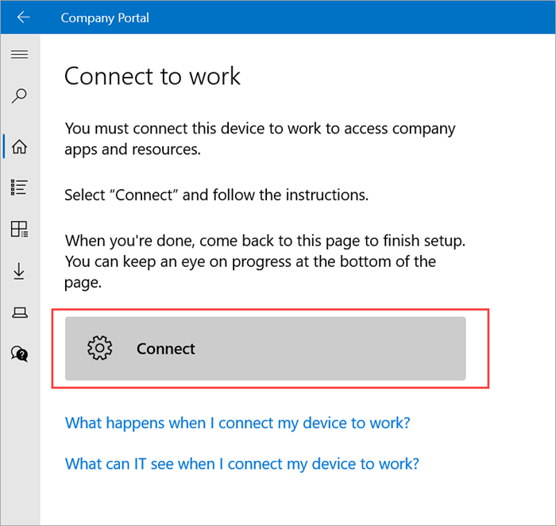
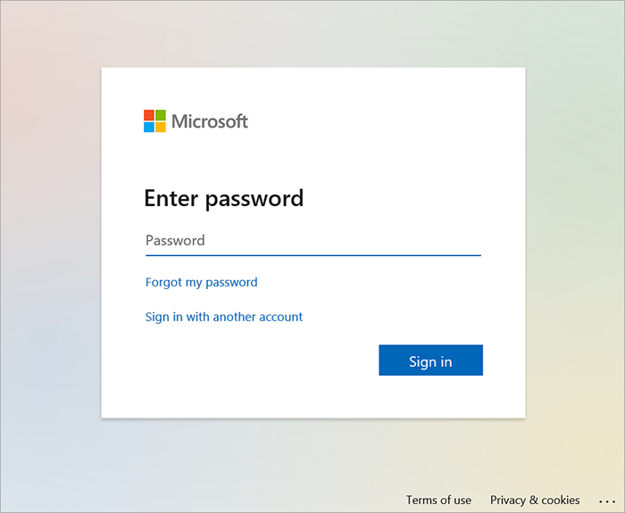
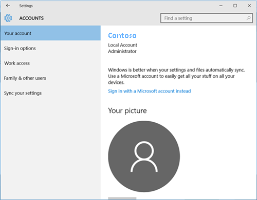

---
# required metadata

title: Enroll Windows 10/11 devices in Intune | Microsoft Docs
description: Set up your Windows 10/11 device in Intune Company Portal to get remote access to work or school.  
keywords:
author: lenewsad
ms.author: lanewsad
manager: dougeby
ms.date: 10/04/2021
ms.topic: end-user-help
ms.prod:
ms.service: microsoft-intune
ms.subservice: end-user
ms.technology:
ms.assetid: 812e82df-76df-402b-bfe9-29302838f40e
searchScope:
 - User help

# optional metadata

ROBOTS:  
#audience:

ms.reviewer: amanh
ms.suite: ems
#ms.tgt_pltfrm:
ms.custom: intune-enduser
ms.collection: 
---

# Enroll Windows 10/11 devices in Intune    

**Applies to**  
- Windows 10  
- Windows 11  

Enroll your Windows 10/11 device in Intune to get mobile access to work or school apps, email, and Wi-Fi. 

To identify the version of Windows running on your device, see [Which version of Windows operating system am I running?](https://go.microsoft.com/fwlink/?linkid=2166188).  
 
> [!VIDEO https://www.youtube.com/embed/TKQxEckBHiE?rel=0]  

## Get Company Portal
You can enroll Windows 10/11 devices through the Intune Company Portal website or app. Devices running Windows 7 or 8.1 must enroll through the Company Portal website. To access Company Portal: 

* Install the app from the [Microsoft Store](https://go.microsoft.com/fwlink/?linkid=2141417).    
* [Sign on to the Company Portal website](https://go.microsoft.com/fwlink/?linkid=2010980) with your work or school credentials.  

## Enroll Windows 10, version 1607 and later device 
Use Intune Company Portal to enroll devices running on Windows 10, version 1607 and later, and Windows 11.   

1. Open Company Portal and sign in with your work or school account.  

2. On the **Set up your device** screen, select **Next**. 

      

3. On the **Connect to work** screen, select **Connect**.  

      

4. When prompted to, sign in with your work or school account again. If you're using the Company Portal website, the prompt may open in a new window. 

      

5. On the **Setting up your device** screen, select **Go**.  

6. After setup is complete, return to the **Connect to work** screen and select **Next** > **Done** to exit setup.  

      

## Sync device to fix connection problems  

After enrolling, if you have trouble accessing work or school things, try syncing your device. For more information about syncing, see [Sync your Windows device manually](sync-your-device-manually-windows.md).     

## Enroll Windows 10, version 1511 and earlier device  
Enroll devices running Windows 10, version 1511 and earlier. Company Portal doesn't support these versions, so setup is done in the Settings app.  

1. Go to **Start** and open the **Settings** app. 

3. Select **Accounts** > **Your account**.  

      

5. Select **Add a work or school account**.  

      

6. Sign in with your work or school credentials.  

      

## Troubleshooting 
For a non-exhaustive list of error messages and resolutions, see [Troubleshoot Windows 10/11 device access](troubleshoot-your-windows-10-device-windows.md).  

## Support for IT administrators    

If you're an IT administrator and run into problems while enrolling devices, see [Troubleshooting Windows device enrollment problems in Microsoft Intune](https://support.microsoft.com/help/4469913). This article lists common errors, their causes, and steps to resolve them. 

## Next steps  
If you need more help setting up your device or using Company Portal, contact your support person. Sign in to the [Company Portal website](https://go.microsoft.com/fwlink/?linkid=2010980) for your organization's contact information.   

 

