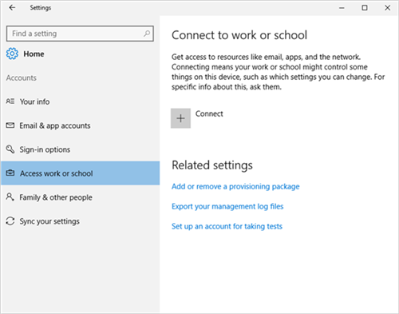
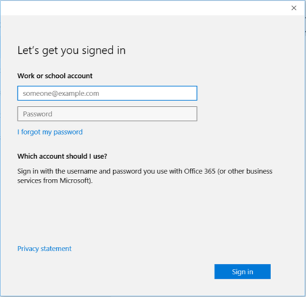

---
# required metadata

title: Enroll Windows 10 device in Intune Company Portal | Microsoft Docs
description: Steps to enroll Windows 10 devices in Intune Company Portal
keywords:
author: lenewsad
ms.author: lanewsad
manager: dougeby
ms.date: 05/21/2019
ms.topic: article
ms.prod:
ms.service: microsoft-intune
ms.subservice: end-user
ms.technology:
ms.assetid: 812e82df-76df-402b-bfe9-29302838f40e
searchScope:
 - User help

# optional metadata

ROBOTS:  
#audience:

ms.reviewer: jieyang
ms.suite: ems
#ms.tgt_pltfrm:
ms.custom: intune-enduser
ms.collection: 
---

# Enroll Windows 10 devices with Intune Company Portal

Use Intune Company Portal to enroll your Windows 10 device under your organization's management. This article describes how to enroll devices with Windows 10 version 1607 and later, and Windows 10 version 1511 and earlier. Before you begin, make sure you [verify the version on your device](windows-enrollment-company-portal.md#find-windows-10-version-number) so that you can follow the correct steps.  

Windows 10 is supported across various device types including desktop, phone, and tablet. The enrollment steps are the same on whichever device you're using. However, your screen may look a little different from the images shown in this article.  
 
> [!VIDEO https://www.youtube.com/embed/TKQxEckBHiE?rel=0]

## Enroll Windows 10 version 1607 and later device 
These steps describe how to enroll a device that runs on Windows 10, version 1607 and later.  

1. Go to **Start**. If you are on a Windows 10 Mobile device, continue to the  **All Apps** list.

2. Open the **Settings** app. If the app isn't readily available in your apps list, go to the search bar and type "settings."

3. Select **Accounts** > **Access work or school** > **Connect**.  

      

4. To get to your organization's Intune sign-in page, enter your work or school email address. Then select **Next**.  

     

5. Sign in to Intune with your work or school account.  

      

    You'll eventually see a message that your company or school is registering your device.

6. If your organization requires you to set up a PIN for Windows Hello, you'll be prompted to enter a verification code. Enter the code and continue through the on-screen steps to create a PIN.  

7. On the **You're all set!** screen, select **Done**. Your device is now enrolled.  

8. To double-check your connection, go back to **Settings** > **Accounts** > **Access work or school**.  Your account should now be listed.  

      

Still can't access your work or school email, files, or other data? Learn how to [troubleshoot account problems](troubleshoot-your-windows-10-device-windows.md#troubleshooting-steps-to-follow-if-you-see-access-work-or-school).  

## Enroll Windows 10 version 1511 and earlier device  
These steps describe how to enroll a device that runs on Windows 10, version 1511 and earlier.  

1. Go to **Start**. If you are on a Windows 10 Mobile device, continue to the  **All Apps** list.

2. Open the **Settings** app. If the app isn't readily available in your apps list, go to the search bar and type "settings."

3. Select **Accounts** > **Your account**.  

      

5. Select **Add a work or school account**.  

      

6. Sign in with your work or school credentials.  

      

Still can't access your work or school email, files, or other data? Learn how to [troubleshoot account-related problems](troubleshoot-your-windows-10-device-windows.md#troubleshooting-steps-to-follow-if-you-see-your-account) during enrollment.  

## IT administrator support   

If you're an IT administrator and run in to problems while enrolling devices, see [Troubleshooting Windows device enrollment problems in Microsoft Intune](https://support.microsoft.com/help/4469913). This article lists common errors, their causes, and steps to resolve them. 

## Next steps  
If you need help with Company Portal or enrollment, contact your organization's IT support team. You'll find their contact information on the [Company Portal website](https://go.microsoft.com/fwlink/?linkid=2010980). Sign in to the site with your work or school account.  

 

