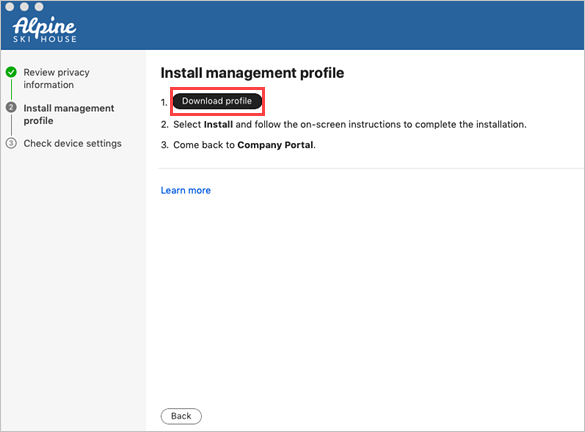
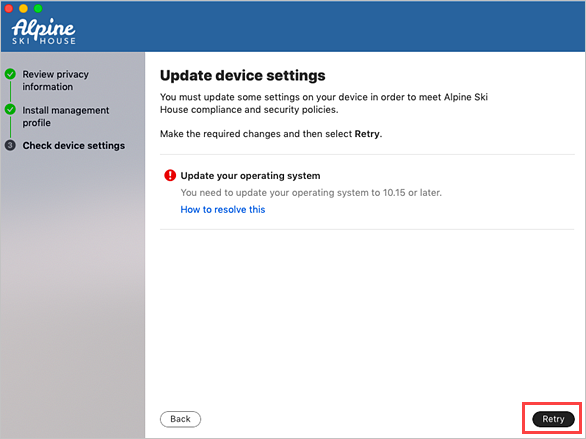

---
# required metadata

title: Enroll your Mac with Intune Company Portal | Microsoft Docs
description: Enroll your personal Mac for work using the Company Portal app.  
keywords: Mac OS X, macOS, OS X
author: lenewsad
ms.author: lanewsad
manager: dougeby
ms.date: 11/20/2023
ms.topic: end-user-help
ms.service: microsoft-intune
ms.subservice: end-user
ms.assetid: 3bb659cc-9b57-4d19-8631-2c26749fa71c
searchScope:
 - User help

# optional metadata

ROBOTS:  
#audience:

ms.reviewer: 
ms.suite: ems
#ms.tgt_pltfrm:
ms.custom: intune-enduser
ms.collection:
- tier1
---

# Enroll your macOS device using the Company Portal app  

Set up secure, remote access to work emails, files, and apps on your personal Mac. This article describes how to install the Company Portal app, enroll your Mac for work, and get troubleshooting help.      

## What to expect from the Company Portal app

During initial setup, the Company Portal app requires you to sign in and authenticate with your work account. Company Portal then informs you of any device settings you need to change to meet your organization's requirements. For example, your organization could require you to make your device PIN longer, or require you to update your operating system. After you enroll your device, Company Portal helps you maintain the secure work access. The app notifies you of new policies and requirements and gives you the chance to adjust your settings so that you can continue to work uninterrupted. 

For more information about the Company Portal app for macOS, see [What happens when I install the Company Portal app and enroll my device?](what-happens-if-you-install-the-Company-Portal-app-and-enroll-your-device-in-intune-macos.md)     

## Before you begin  
Your device must be running macOS 11 or later.   

> [!NOTE]
> During installation and enrollment, you might be prompted to allow Company Portal to use confidential information that's stored in your keychain. These prompts are part of Apple security. When you get the prompt, type in your login keychain password and select **Always Allow**. If you press **Enter** or **Return** on your keyboard, the prompt will select **Allow**, which means you may continue to receive prompts.  

## Install Company Portal app  
1. Go to [Enroll My Mac](https://go.microsoft.com/fwlink/?linkid=853070).  
2. Wait while the Company Portal installer .pkg file downloads. Open the installer when it's ready.
3. On the **Introduction** page, select **Continue**.  
4. On the **License** page, read through the Microsoft Application License Terms. Select **Continue**.  
5. Select **Agree** to agree to the terms of the software license agreement.  
6. On the **Installation Type** page, select **Install**.  
7. Enter your device password or registered fingerprint. Then select **Install Software**. 
9. Wait for Company Portal to finish installing. 
11. Open the Company Portal app.

> [!IMPORTANT]
> Microsoft AutoUpdate might open after enrollment and update your Microsoft software. After all updates are installed, open the Company Portal app. For the best setup experience, install the latest versions of Microsoft AutoUpdate and Company Portal.  

## Enroll your Mac  
1. Sign in to the Company Portal app with your work or school account.  
2. On the **Set up access** page, select **Begin**.
3. Review the privacy information. Then select **Continue**.  
4. On the **Install management profile** page, select **Download profile**.  

      
5. Your macOS system settings open in a new window. The management profile you just downloaded is shown.  
    1. Select the profile to open it.  
    1. Select **Install...**  
    1. When asked to confirm installation, select **Install**.   
    1. Enter your device password to allow the profile to enroll your device. Then select **Enroll**.  
6. Wait while the management profile installs and then enrolls your device. 
7. Return to the Company Portal app and verify that there's a green checkmark next to **Install management profile**.  
8. Your organization may require you to update your device settings. On the **Checking device settings** page, review the list of settings you need to change. Select **How to resolve this** to view related help documentation in a web browser.   
9. After you make all changes, select **Retry**. Wait while Company Portal rechecks your device settings.  

      
10. When setup is complete, select **Done**. Your device is ready to use for work. You can go to **Devices** in the Company Portal app to view and manage your enrolled Mac.    

## Troubleshooting and feedback   

Contact your IT support person to troubleshoot problems with enrollment or the Company Portal app. If necessary, you can share your app logs with your support person via the Company Portal app.   
1. In the Company Portal app, open the **Help** menu.
2. Select **Send diagnostic report**. Wait while Company Portal app logs are sent to Microsoft support and Intune Company Portal developers. This information is used to assist with troubleshooting should your support person need more help.
3. Copy your incident ID for future reference.    
4. Select **Email Logs** to report the problem to your support person. Type in what you experienced in the body of the email. To find your support person's email address, go to the Company Portal app and select **Support**.
 
To share your feedback and suggestions with Intune Company Portal app developers, go to **Help** > **Send Feedback**.  

## Updating the Company Portal app

Updating the Company Portal app is done the same way as any other Office app, through Microsoft AutoUpdate for macOS. For more information, see [Update Office for Mac automatically](https://support.office.com/article/Check-for-Office-for-Mac-updates-automatically-bfd1e497-c24d-4754-92ab-910a4074d7c1).  
