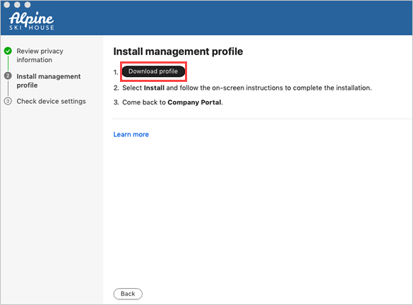
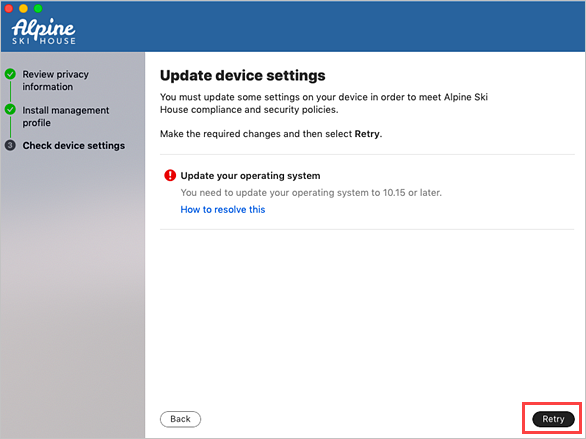

---
# required metadata

title: Enroll your Mac with Intune Company Portal | Microsoft Docs
description: Learn how to enroll your Mac in Intune with the Company Portal app.
keywords: Mac OS X, macOS, OS X
author: lenewsad
ms.author: lanewsad
manager: dougeby
ms.date: 07/05/2023
ms.topic: end-user-help
ms.prod:
ms.service: microsoft-intune
ms.subservice: end-user
ms.technology:
ms.assetid: 3bb659cc-9b57-4d19-8631-2c26749fa71c
searchScope:
 - User help

# optional metadata

ROBOTS:  
#audience:

ms.reviewer: 
ms.suite: ems
#ms.tgt_pltfrm:
ms.custom: intune-enduser
ms.collection:
- tier1
---

# Enroll your macOS device using the Company Portal app  

Gain secure, remote access to work emails, files, and apps on your personal Mac. This article describes how to install the Company Portal app, enroll your Mac for work, and get troubleshooting help.      

## What to expect from the Company Portal app

During initial setup, the Company Portal app requires you to sign in and authenticate yourself with your organization. Company Portal then informs you of any device settings you need to configure to meet your organization's requirements. For example, organizations often set minimum or maximum character password requirements that you'll be required to meet.    

After you enroll your device, Company Portal will always make sure that your device is protected according to your organization's requirements. For example, if you install an app from a source that's not trusted, Company Portal will alert you and might restrict access to your organization's resources. App protection policies like this one are common. To regain access, you'll likely need to uninstall the app. 

If after enrollment your organization enforces a new security requirement, such as multi-factor authentication, Company Portal will notify you. You'll have the chance to adjust your settings so that you can continue to work from your device.  

To learn more about enrollment, see [What happens when I install the Company Portal app and enroll my device?](what-happens-if-you-install-the-Company-Portal-app-and-enroll-your-device-in-intune-macos.md).  

## Before you begin  
Your device must be running macOS 11 or later.   

> [!NOTE]
> Throughout this process, you might be prompted to allow Company Portal to use confidential information that's stored in your keychain. These prompts are part of Apple security. When you get the prompt, type in your login keychain password and select **Always Allow**. If you press **Enter** or **Return** on your keyboard, the prompt will instead select **Allow**, which may result in additional prompts.  

## Install Company Portal app  
1. Go to [Enroll My Mac](https://go.microsoft.com/fwlink/?linkid=853070).  
2. The Company Portal installer .pkg file downloads. Open the installer.
3. On the **Introduction** page, select **Continue**.
4. On the **License** page, read through the Mirosoft Application License Terms. Select **Continue**.
5. Select **Agree** to agree to the terms of the software license agreement.
6. On the **Installation Type** page, select **Install**. 
7. Enter your device password or registered biometrics. Then select **Install Software**. 
9. Wait for Company Portal to finish installing. On some devices, Microsoft AutoUpdate opens after installation finishes, and updates your existing Microsoft software. Wait for the updates to finish.
11. Open the Company Portal app.  
  > [!IMPORTANT]
  > For the best setup experience, install the latest versions of Microsoft AutoUpdate and Company Portal.

## Enroll your Mac  
1. Sign in to the Company Portal app with your work or school account.  
2. On the **Set up access** page, select **Begin**.
3. Review the privacy information. Then select **Continue**.  
4. On the **Install management profile** page, select **Download profile**.  

      
5. Your macOS system settings open in a new window. The management profile you just downloaded is shown.  
    a. Select the profile to open it.  
    b. Select **Install...**  
    c. When asked to confirm installation, select **Install**.   
    d. Enter your device password to allow the profile to enroll your device. Then select **Enroll**.  
6. Wait while the management profile installs and then enrolls your device. The message **This Mac is supervised and managed by** appears with your profiles when installation is done.   
7. Return to the Company Portal app and verify that there's a green checkmark next to **Install management profile**.  
8. Your organization may require you to update your device settings. On the **Checking device settings** page, review the list of settings you need to change. Select **How to resolve this** to view related help documentation in a web browser.   
9. After you make all changes, select **Retry**. Wait while Company Portal checks your device settings again.     
      
10. When setup is complete, select **Done**. Go to **Devices** in the Company Portal app to view and manage your enrolled Mac.    

## Troubleshooting and feedback   

Contact your IT support person to troubleshoot problems with enrollment or the Company Portal app. If neccessary, you can share your app logs with your support person via the Company Portal app.   
1. In the Company Portal app, open the **Help** menu.
2. Select **Send diagnostic report**. Your Company Portal app logs are sent to Microsoft support and Intune Company Portal developers to assist with troubleshooting should your IT support person need it. Copy your incident ID for future reference.    
3. Select **Email Logs** to report the problem to your IT support person. Type in what you experienced in the body of the email. To find your support person's email address, go to the Company Portal app and select **Support**.
 
To share your feedback and suggestions with Intune Company Portal app developers, go to **Help** > **Send Feedback**.  

## Updating the Company Portal app

Updating the Company Portal app is done the same way as any other Office app, through Microsoft AutoUpdate for macOS. Find out more about [updating Microsoft apps for macOS](https://support.office.com/article/Check-for-Office-for-Mac-updates-automatically-bfd1e497-c24d-4754-92ab-910a4074d7c1).  

