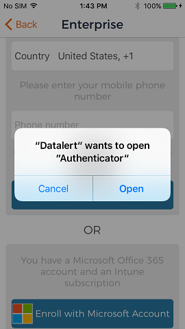

---
# required metadata

title: Set up Datalert app for iOS  
description: Set up the Datalert app and service on an Intune-enrolled iOS or iPad device.  
keywords:
author: lenewsad
ms.author: lanewsad
manager: dougeby
ms.date: 04/19/2017
ms.topic: end-user-help
ms.prod:
ms.service: microsoft-intune
ms.subservice: end-user
ms.technology:
ms.assetid: 6d8c6372-f2ce-4558-8886-1d7c1966699c
searchScope:
 - User help

# optional metadata

ROBOTS:
#audience:

ms.reviewer: sumitp
ms.suite: ems
#ms.tgt_pltfrm:
ms.custom: intune-enduser
ms.collection:
- tier2
---

# Set up Datalert app for iOS and iPad  

Workplaces use telecom expense management software to ensure that data and voice plans are being used within acceptable limits. If your organization monitors telecom usage, you may be required to install the Datalert app on your enrolled device. This article describes how to install and set up Datalert.  

## Install app and sign in    

After enrollment, tap the notification sent to your device to install the [Datalert app](https://play.google.com/store/apps/details?id=fr.memobox.databox) from the App Store. 

If you don't receive a notification, you can still install Datalert from Google Play, but instead of using your work or school account, you must provide your phone number and verify your device using a code. Contact your support person for more information about the code.   

    

Once you've set up your account with Datalert, you can begin monitoring your data usage by day, week, and month in the app. Your organization can monitor your voice and data plan to prevent overages and unexpected roaming costs. 

     

### Set up with work or school account  
Use your Microsoft work or school account to set up Datalert on your device.  

> [!IMPORTANT]
>  [Microsoft Authenticator](/azure/multi-factor-authentication/end-user/microsoft-authenticator-app-how-to) must be installed and active on your phone to enroll this way.  

1. Open the Datalert app and select __Enroll with Microsoft account__.  

2. When prompted to open Authenticator, select __Open__.  

   

3. Sign in with your Microsoft work or school account. 

4. Wait while Datalert setup runs and then tap __Finish__ when complete.  

### Set up with phone number  
Use your phone number to set up Datalert on your device.  

1. Open Datalert and enter the device phone number.  
2. A verification code is sent to the device by SMS. Copy and enter the code into the app and then tap __OK__.  

   

3. Wait while Datalert setup runs and then tap __Finish__ when complete. 

Still need help? Contact your support person. For contact information, check the [Company Portal website](https://go.microsoft.com/fwlink/?linkid=2010980).