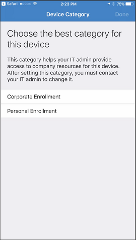

---
# required metadata

title: Enroll your iOS device in telecom expense management with Intune
description: Learn how to enroll an iOS device into telecom expense management.
keywords:
author: lenewsad
ms.author: lanewsad
manager: dougeby
ms.date: 04/19/2017
ms.topic: article
ms.prod:
ms.service: microsoft-intune
ms.subservice: end-user
ms.technology:
ms.assetid: 6d8c6372-f2ce-4558-8886-1d7c1966699c
searchScope:
 - User help

# optional metadata

ROBOTS:
#audience:

ms.reviewer: sumitp
ms.suite: ems
#ms.tgt_pltfrm:
ms.custom: intune-enduser
ms.collection: 
---

# Enroll your iOS device in telecom expense management

Your organization may be using telecom expense management software to ensure that their data and voice plans are being used within acceptable limits. Once you have completed enrolling your device, you will then be prompted select the best category for that device.

  

Select the appropriate option, and you will receive a notification to install the [__Datalert__](https://itunes.apple.com/app/datalert/id771029268?mt=8) app from the App Store. The Datalert app is how your organization can measure data usage. If your organization has configured the Microsoft work or school enrollment option, you will be required to log in with your work or school account. If this hasn't been enabled, you will need to provide information such as your phone number and verify your device using a code to enroll into the Datalert service from the app.

  

## Enroll into Datalert using your Microsoft work or school account

> [!NOTE]
> You need to have the [Microsoft Authenticator](https://docs.microsoft.com/azure/multi-factor-authentication/end-user/microsoft-authenticator-app-how-to) app installed and active on your phone to enroll this way.

1. Select __Enroll with Microsoft account__.

   

2. You'll receive a notification that __"Datalert" wants to open "Authenticator"__. Select __Open__.

   

3. Sign in with your __Microsoft school or work account__. Datalert setup will work for a few moments, then should complete. Tap __Finish__ when it completes.

## Enroll into Datalert using your phone number

1. Provide your device's phone number.

   

2. You will then receive a verification code through an SMS message. Provide the code and tap __OK__.

   

3. Once you've provided the verification code, Datalert setup will complete. Tap __Finish__ and you will be able to monitor your data from the Datalert app.

   

Once you've enrolled, you will begin to see your data usage in the Datalert app.

Still need help? Contact your company support. For contact information, check the [Company Portal website](https://go.microsoft.com/fwlink/?linkid=2010980).
