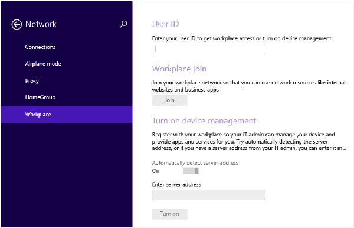
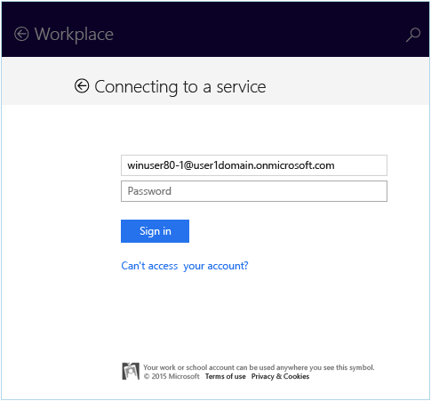
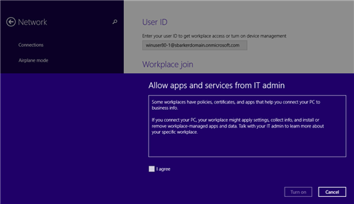
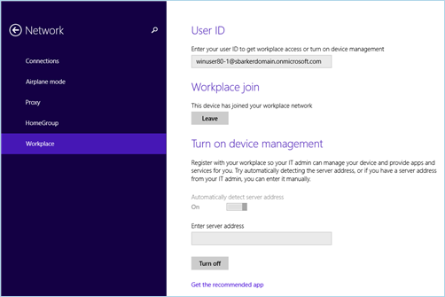

---
# required metadata

title: How to enroll your Windows 8.1 or Windows RT 8.1 device | Microsoft Docs
description: If your company or school uses Microsoft Intune, you can enroll your devices to get access to company email, files, and other resources.
keywords:
author: lenewsad
ms.author: lanewsad
manager: dougeby
ms.date: 01/23/2017
ms.topic: end-user-help
ms.prod:
ms.service: microsoft-intune
ms.subservice: end-user
ms.technology:
ms.assetid: 28984f26-1070-4f7a-877c-669a59375c0c
searchScope:
 - User help

# optional metadata

ROBOTS:  
#audience:

ms.reviewer: priyar
ms.suite: ems
#ms.tgt_pltfrm:
ms.custom: intune-enduser
ms.collection:
- tier3
---

# How to enroll your Windows 8.1 or Windows RT 8.1 device in Intune  

If your company or school uses Microsoft Intune, you can enroll your devices to get access to company email, files, and other resources. When you enroll your devices, your organization can keep corporate data secure. To learn more about enrollment, see [What happens if you install the Company Portal app and enroll your device in Intune?](what-happens-if-you-install-the-company-portal-app-and-enroll-your-device-in-intune-windows.md) and [What your company support can and can't see on your device](what-info-can-your-company-see-when-you-enroll-your-device-in-intune.md).  

To enroll your Windows 8.1 or Windows RT 8.1 device:  

1. On the device, tap **Settings** &gt; **PC Settings** &gt; **Network** &gt; **Workplace**.  

      

2. Enter your work or school email for the User ID, if required, and then tap **Join**. If your user ID is not required, the email address that you entered when you signed in to this device is used.  

3. Enter the password for your work or school email.  

      

4. Under **Turn on device management**, tap **Turn on**.  

      

5. In the **Allow apps and services from company support** dialog box, check the  **I agree** box, and then tap **Turn on**.  

      

    When you have successfully enrolled, you'll see the following screen.  

    

We also recommend that you install the Company Portal app, which lets you easily identify and get the company apps that are relevant to you and your role. Depending on how your company set up Intune, the Company Portal app may have been installed as part of your enrollment process. To check if you have the app, look for **Company Portal** in your apps list. If you don't see the Company Portal in your list of apps, follow these steps to install it.

1. Tap **Start** &gt; **Store**.  

2. Tap **Search**, and then type **company portal**.  

3. In the list of results, tap **Company Portal**.  

4. Tap  either **Install** or **Free**. The option shown depends on how your company set up the app.  

Still need help? Contact your company support. For their contact information, check the [Company Portal website](https://go.microsoft.com/fwlink/?linkid=2010980).  
