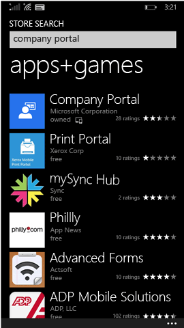

---
# required metadata

title: Enroll your Windows Phone 8.1 device in Intune | Microsoft Docs  
description: Describes how to enroll a Windows Phone 8.1 device in Intune
keywords:
author: lenewsad
ms.author: lanewsad
manager: dougeby
ms.date: 01/03/2017
ms.topic: article
ms.prod:
ms.service: microsoft-intune
ms.subservice: end-user
ms.technology:
ms.assetid: 4a120c3d-d520-4d48-ae4c-3338ca4e7bde
searchScope:
 - User help

# optional metadata

ROBOTS:  
#audience:

ms.reviewer: priyar
ms.suite: ems
#ms.tgt_pltfrm:
ms.custom: intune-enduser
ms.collection: 
---

# Enroll your Windows Phone 8.1 device in Intune  

Enroll your devices to get access to work or school email, files, and other resources. When you enroll your devices, your organization can keep corporate data secure. To learn more about enrollment, see [What happens if you install the Company Portal app and enroll your device in Intune?](what-happens-if-you-install-the-company-portal-app-and-enroll-your-device-in-intune-windows.md) and [What your company support can and can't see on your device](what-info-can-your-company-see-when-you-enroll-your-device-in-intune.md).  

To enroll your device in Intune, follow the set of instructions that match your permissions or current account status.

## Enroll through Company Portal  
Follow these steps if you can install the Company Portal app from the Microsoft Store. 

1. Tap **Start** > **Store**.  

2. Tap **Search**, and then type **company portal**.  

3. In the list of results, tap **Company Portal**.  

      

4. Tap **Company Portal**  &gt; **Install**.  

      

Enroll your device:  

1. On the device, open the **Microsoft Intune Company Portal** app.  

2. Provide your credentials. You may be asked to accept your company's Terms and Conditions, if applicable.  

3. Swipe to **My Devices**.  

4. Select **Tap to enroll or identify this device**.  

      

5. Tap **Enroll this device**.  

      

6. Tap **Add account**.  

      

7. Enter more information as requested, and then tap **sign in** to finish the enrollment. You should now see your workplace account listed on the **Settings** &gt; **Workplace** page.  

      

## Enroll through Settings app  
Follow these steps if you can't access the Microsoft Store from your Windows Phone device, or if you don't have a Microsoft Account.

1. Tap  **Settings** &gt; **workplace**.  

2. Tap **add account**, and then sign in using your work account.  

3. Enter more information as requested, and then tap **sign in** to finish the enrollment.  

4. If prompted to install the company app or Hub, make sure the relevant box is checked, and then tap **done**.  

If your company support has set up the Company Portal to be installed during enrollment, you will see the Company Portal appear in your app list.  

Still need help? Contact your company support. For their contact information, check the [Company Portal website](https://go.microsoft.com/fwlink/?linkid=2010980).
